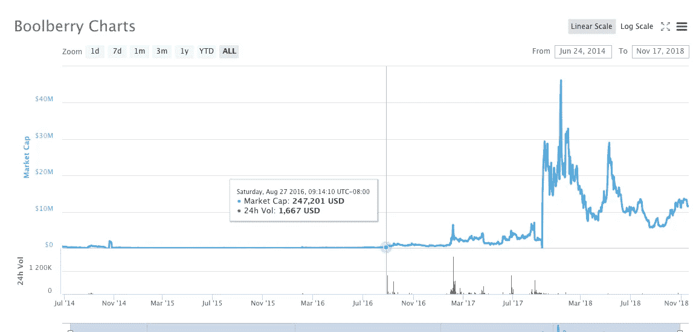

# 事后分析——投资加密货币 Boolberry 的激进分子，结果

> 原文：<https://medium.com/coinmonks/post-mortem-activist-investing-in-the-cryptocurrency-boolberry-results-255ea2eacd81?source=collection_archive---------1----------------------->

2016 年，已经有一个持续了两年多的秘密熊市。在所有指标中，比特币都是最主要的加密货币，其交易价格比上次峰值低 80%，上次峰值出现在 2013 年 11 月。

人们已经对替代币和一切非比特币的东西不再抱有幻想，前提是他们没有对比特币本身不再抱有幻想。

人们已经放弃了，因为没有人感兴趣，似乎也没有新的资金进入这个领域，那么任何替代硬币如何吸引新的买家呢？

听起来熟悉吗？这是一个关于人们可预见的低注意力持续时间和利用这一点的故事，先锋加密货币活动家投资于一种名为 Boolberry 的废弃资产。

# 区块链研发

通过我在 2014 年成立的公司[block chain Development Company LLC](http://www.blockology.org/)，我带头研究隐私技术。提供金融隐私的加密货币在 2014 年刚刚上市。在比特币上，有隐形地址、混淆和各种混合技术正在发布，但它们需要与受人尊敬的比特币开发者合作，而这不是优先事项。其他技术超越了比特币网络上发生的任何事情，并作为自己的数字资产在新网络上发布:替代加密货币，或替代硬币。

输入 Cryptonote，这项技术默认提供隐私，并且已经成为一个加密货币家族的起源。Monero 是一种使用加密技术的不透明区块链。它与几个兄弟姐妹区块链，尤其是布尔贝里，有着共同的祖先。

[布尔贝里](https://coinmarketcap.com/currencies/boolberry/)经历过被遗弃。它的估值从未超过 50 万美元超过一周，到 2016 年，它的估值达到了 5 万美元。

Monero 项目的进步表明这些技术有市场，这些进步是开源的，并且与 Boolberry 兼容。Boolberry 还提供了 Monero 团队不感兴趣的差异，它有一种更先进的方法来保持其区块链较小，并允许人们使用别名地址。Boolberry 团队还在 cryptonote 和加密证明领域进行了开创性的研究，这与 Monero 在该领域所做的努力完全不同。从任何迹象来看，Boolberry 过去和现在都是几个学者的科学项目，已经废弃不用，年久失修。

# 区块链永远不会死。

不管它的废弃和失修，我默默地开始购买 Boolberry，并开采 Boolberry，直到我拥有总供应量的 10%。有时我会以超过上次价格 100%的溢价购买，以满足我的需求。我的平均买入价低了，我知道接下来会发生什么，因为我就是市场。

当时的计划是采取这种激进的立场，掸去资产上的灰尘，擦亮它，然后以更高的价格出售。这正是我所做的，同时忽略了 Boolberry 网络上发生的非常奇怪的事情，以及可能会卷入其中的奇怪的人。

为什么？至少有两个原因

*   赚大钱，抓住机会
*   在一个公共项目中建立影响力，以供将来使用

输入我的别名，1 区块学家。这是一个绿色字段别名，与我自 2011 年以来在加密空间中持有的别名无关。这是一个比特币地址命名模式的游戏，当时比特币地址以数字 1 开头，后面是字母数字组合，例如[1 bitcoineateraddressdontsendf 59 kue](https://www.blockchain.com/btc/address/1BitcoinEaterAddressDontSendf59kuE)。它是比特币地址和“区块学”学科学术的混合体。区块链科学。

你看，在 2016 年之前，有更多的理由不具备比特币/区块链/加密货币领域的任何专业经验。很少有人会在生活中灵活地公开推广加密货币，在简历中加入任何与此相关的内容，或者利用这些信息从社会中获益。任何开创事业的人都会拿自己的事业冒险，而这些人不可能、不会也不应该因为与非法市场的关联而与比特币有任何关联。存在巨大的声誉风险。**任何用时间换取食物和住所的人都不能再这样做了。**在 2016 年，这种情况正在改变，这意味着我需要放弃我的匿名化名，并将它们与我的身份联系起来，这意味着两年后每个人都会谈论*我有多早*。这些目标是成功的。

重要的是，加密社区了解 Boolberry 的长期生存能力是无关紧要的，Boolberry 最初的公告线程从第一个开发者那里得到了一个 cookie cutter“这枚硬币将是用于全球支付的硬币”废话，你可以让一组滚动的加密投资者在 6 个月的时间间隔内相信。我的角色不是让它发生。我的“接管”功效无关紧要。对我证明精英编程和加密技术的任何期望都是不相关的。我的激进立场和蚀刻历史的价值是极其相关的。激进投资者是密码领域的新手，在此之前，这个领域一直由自私自利、沟通能力差的密码专家主导。

我对 Boolberry 的愿景是任何能改善其效用和稀缺性的环境。我有十几种方法可以通过代码做到这一点，我在一份新的白皮书中向社区推荐了其中的几种。

在分析了网络和社区之后，Boolberry 的失修意味着:

*   一个矿池拥有 75%的控制权，如果控制权很低，这个矿池中可能有十几个矿工。*如果我想的话，我可以在亚马逊网络服务上用租来的 GPU 接管网络，但我没有，部分原因是:*
*   新用户不容易加入网络。内置的“种子节点”全部死亡。
*   钱包从未完成，需要从 Monero 的代码库中进行一些更新。
*   检查点很旧，这意味着钱包同步非常慢。
*   **另外 25%的被未知幻影攻击的 hashpower 被用来攻击 1 号矿池**，当 DDOS 攻击成功时，有时会导致链分裂、双重花费和其他拒绝服务。这是怎么回事？假设这是故意的，而不仅仅是电脑上的错误设置，那么是什么动机支持在这种毫无价值的加密货币上这样做呢？

I see you there, on my network.

最后，我为自己添加了更多的检查点，并在一个新的 github 页面中提供给社区。这是伴随着一个新的白皮书，并宣布线程。

第二天，Boolberry 的价值飙升了 300%,这就是我想要的免费广告。

我浏览了旧的 git 提交，并通过电子邮件联系了那些代码贡献的作者。有些人我不得不通过其他方式寻找。人们普遍乐于接受，一些以前在 Boolberry 上工作过的程序员准备再次工作，现在有了一些——任何——方向。

在整个项目中，我的角色很快变成了业务开发和项目管理，而不是实际的编程。对于社区中的一些人来说，他们错误地认为这很重要。

“嘿，我们这个分散的无领导项目的新的无畏的领导者不是那个做编程的人！”

这只是一个例子，说明加密交易者没有交易经验，他们认为重要的东西通常是不相关的。就像 XRP 交易员在心理上投资于 Ripple 公司一样，这与 XRP 市场未来的价值无关。密码交易员抓住机会合理化他们正在进行的所有权和投机，通常是希望模仿他们在另一种加密货币中看到的东西，这种情况也发生在价格上涨的时候。对密码交易者来说，相关性等于因果关系，没有更深层次的理由来解释某个行为如何影响需求或稀缺性。

考虑到这一点，关于实际的编程，我们陷入了困境！我们已经创建了一个更好的版本，但是它只能在 Windows 上可靠地工作。我们停止发布任何东西，直到它在 OSX 和 Linux 上保持稳定。

# 一个新的挑战者出现了

其实是老挑战者。Boolberry 的最初开发者已经消失了，使得网络年久失修，在我的新白皮书发布和代码修改公布后，最初的开发者回来了。

他一点也没帮上忙。

Cryptozoidberg (CZ)是他的化名，他有一群追随者。一群被忽视的孤儿等待着第二次降临，假设这次会有所不同。

我期待着他会回来。我阅读了所有关于 Boolberry 的公开帖子，可以追溯到 2014 年的开始，我知道我将要处理的是什么。退一步说，是个非常骄傲的人。

我没有想到的是，他的一些追随者会容忍他的影响和虐待！

我没有意识到 Boolberry 社区中的其他一些*信徒*也是密码学领域的杰出学者。

他们对我对网络的改变也不感兴趣，他们的怀疑态度确实加剧了社区中无益的裂痕，并阻碍了市场情绪，特别是当 CZ 回来时，他们蜂拥而至。

最奇怪的是，他们最终对我的努力有所帮助——因为他们与佐伊德伯格的想法兼容——他们甚至提议帮助在 Boolberry 中添加新的证明和所有东西。在我看来，事情朝着莫内罗的方向发展了很多。CryptoZoidberg 拒绝了他们，但不仅仅是因为这个，而是因为他们在这个分歧后立即撤回了他们所有的研究。

这是怎么回事？

很明显，合作是不可能的，处理 Boolberry 项目的机会成本正在增加。

2016 年末和 2017 年初，加密牛市再次开始。然而，我的大部分资本和注意力都在处理 Boolberry 项目，因此我可以将它转化为我的目标的成功故事。突然有更多有利可图的加密资产进行交易，而我现在正在处理葡萄牙语的模糊地带(？)学者们颁布了他们的“森派”提交幻想。

我的业务发展变成了让 Boolberry 继续在交易所工作，或者进入新的交易所，有时还设计工作和合作。

这很好，也足够有效。

尽管 Boolberry 社区的情绪因缺乏共识而被扭曲，但通过揭示 Cryptozoidberg 和我有相似的目标，有可能与那个故事合作，不存在有争议的分歧，现在我们有了分布式营销。每个场景对 Boolberry 都有好处，这激励了足够多的人。这些项目应该是分散的，并且有多个团队在工作，但这对于应该理解这一点的密码交易员来说是陌生的。他们开始接受这一点，偶尔一条“鲸鱼”会溢价购买大量的 Boolberry。最出色的激进投资者。

作为 Boolberry 项目的一名自称的管理者，我意识到加密社区不熟悉另一个重要的方面:生存。在一个老管家下台后，让一个对项目有共同兴趣的新人继续项目工作的概念。加密社区完全期望人们永远与他们的宠物项目结婚，没有专业的退出策略或转换为未来的管家。这里有一个普遍的主题，孩子般的放弃，并为此做好准备，就好像项目负责人要代替他们不参与的父亲，他们三十年后为了养老金嫁给了镇上的工厂。具有讽刺意味的是，对于在加密领域运营项目的人来说，情况恰恰相反，因为项目负责人是硅谷的连续创业者和金融中心的交易员。

我在沙滩上划了一条线，如果 Boolberry 失去了一个流动性市场，那么我就不再为它做贡献。

# 贸易优势

尽管人们害怕市场参与者持有大量的 Boolberry 并卖出，我还是能够在流动性非常差的环境中非常有效地交易。**我经常在市场没有注意到的情况下，直接在 Poloniex 和 Bittrex 的订单簿上交易超过 10%的 Boolberry 股票，没有出现滑点。**

在交易过程中，聊天室和留言板会受到监控，以观察人们的情绪是否会发生变化。交易所的交易员和机器人通过他们的订单模式受到监控，看他们是否根据我自己的交易改变行为。

总的来说，耐心。我可以等待订单出现，我的一般分析包括了解未贴出流动性的程度，所以我知道有哪些市场参与者。在加密领域，零售交易员和金融专业人士只需查看历史交易量和当前公布的流动性快照，就能得出存在流动性问题的结论。这是一个不准确的结论，在没有做市商或流动性提供者的非流动性环境中交易是一门艺术。

区块链开发公司正在监控订单簿的深度变化，并创建了不同市场参与者的档案，以准确了解谁在那里，或者新的市场参与者何时到来。

# 结局

最后，Bittrex 将 Boolberry 除名，社区也不想使用 next bucketshop 交易所，因为害怕失去他们的钱。

Cryptozoidberg 最终与我进行了讨论，在这一点上，我非常怀疑他的其他学术弟子正在经历的斯德哥尔摩综合症。他禁止我进入开发者聊天室，我决定是时候这么做了。

我已经清算了头寸，获利颇丰，还捐了一些 Boolberry 给一个门徒的平行努力。

最终，足够多的人受到新的努力的鼓舞，接过了布尔伯里的接力棒。

# 结论

当这个项目开始时，Boolberry 的估值约为 50 万美元，今天 Boolberry 的估值为 1100 万美元，最高时达到 4600 万美元。整个 2017 年更广泛的加密牛市有所帮助，但只是放大了 Boolberry 项目中发展和社区增长的重振努力，无论它们是否有争议。

对激进分子来说，在加密领域投资是一门艺术，任何项目都可以以极低的成本重新启动，而且不需要法律工作，这比在私募股权市场或上市公司投资有很大优势。

尽管缺乏正式手续，开发者和交易者不成熟，情报界的幽灵矿工使用一种模糊的私人加密货币来管理他们的 blackops 财务，并利用他们的权力通过密封的法院命令 DDOS 其他矿工和削弱交易所，但只有一件事很重要:代码就是法律，最长的链条获胜。

通过在 [Twitter](http://twitter.com/1blockologist) 上关注我，参与我在区块链和分布式账本空间的最新项目

> [在您的收件箱中直接获得最佳软件交易](https://coincodecap.com/?utm_source=coinmonks)

