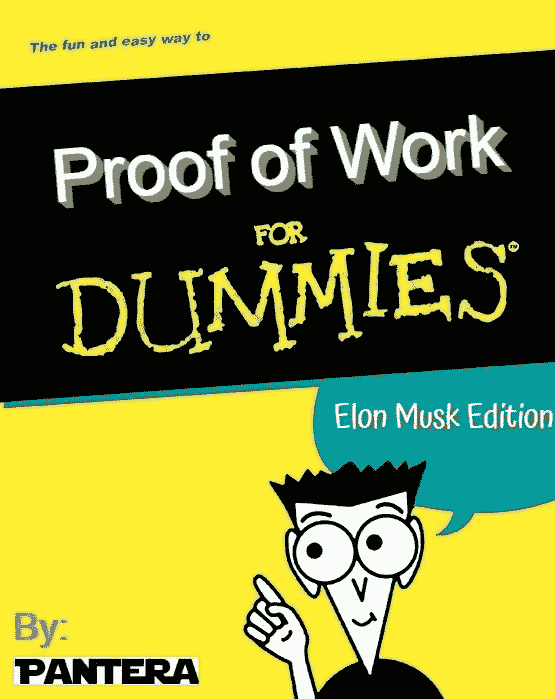

# 假人粉(埃隆马斯克版)

> 原文：<https://medium.com/coinmonks/pow-for-dummies-elon-musk-edition-4ec7df590dea?source=collection_archive---------5----------------------->

从埃隆·马斯克的推特开始，市场经历了一场崩盘。他声称特斯拉不会接受 BTC 的付款，在同一条推文中，他说特斯拉不会出售其 BTC。

他强调了环境问题，再次表达了对加密货币的兴趣，但他也建议每个人改变我们的电力方式，减少能源消耗。