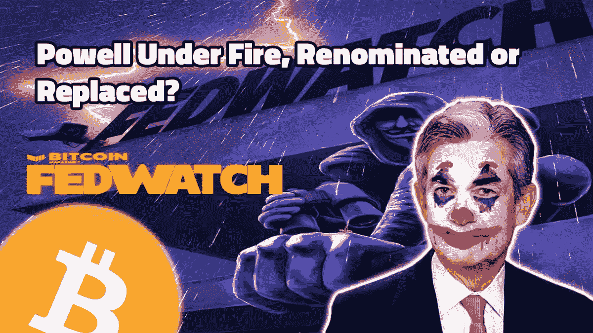
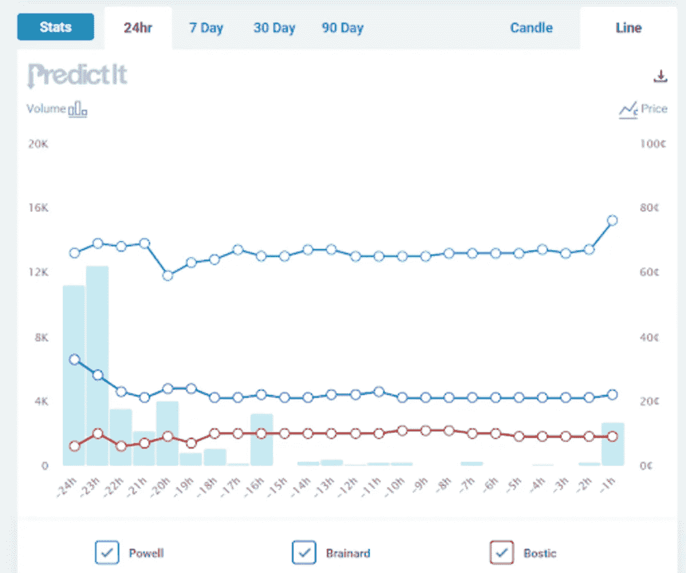
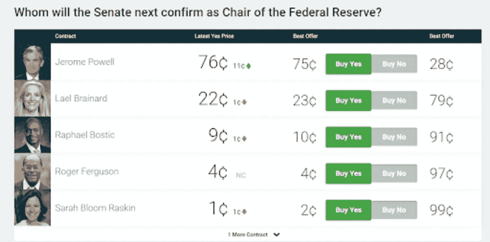
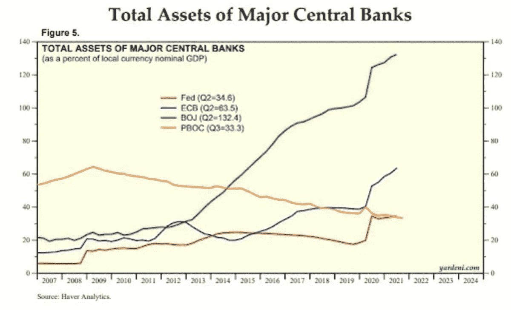
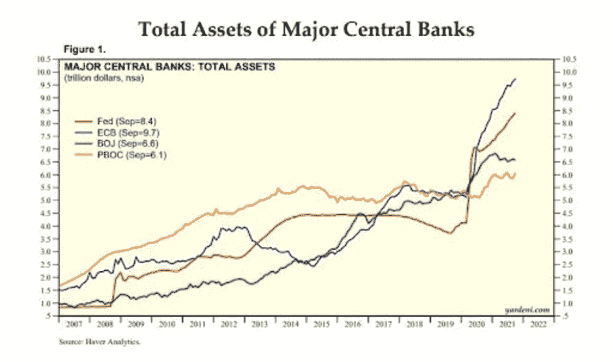

# 鲍威尔连任、央行资产负债表和比特币

> 原文：<https://medium.com/coinmonks/powells-reappointment-central-bank-balance-sheets-and-bitcoin-cb71a36d3386?source=collection_archive---------11----------------------->

[**在 YouTube 上看这一集**](https://youtu.be/ohHupjfB7rI)

**听这一集:**

*   [BitcoinTV](https://bitcointv.com/w/b4U6odasnjn8rNSQxXUyGm)
*   [苹果](https://podcasts.apple.com/us/podcast/powell-under-fire-renominated-or-replaced-fed-67/id1543640492?i=1000539200775)
*   [Spotify](https://open.spotify.com/episode/1JiJYi1fqvYqlRXIfwTsOi?si=8LrQbjfrQaCMOlIUu6EzQw&nd=1)
*   [谷歌](https://podcasts.google.com/feed/aHR0cHM6Ly9mZWR3YXRjaC5saWJzeW4uY29tL3Jzcw==/episode/NWU4ZjVkNzktMDhiMy00ZDRiLThiZjUtNmJhNjc0ZjFhM2Jm)
*   [Libsyn](http://fedwatch.btc.libsynpro.com/powell-under-fire-renominated-or-replaced-fed-67)
*   [阴天](https://overcast.fm/+m2adC1vfM)
*   [隆隆声](https://rumble.com/vnzsuf-powell-under-fire-renominated-or-replaced.html)

在这一集《比特币》杂志的“美联储观察”播客中，我和 Christian Keroles 让听众了解杰罗姆·鲍威尔连任美联储主席、最近有人试图破坏这一连任的泄密事件，以及欧洲中央银行(ECB)和日本银行(BoJ)货币政策现状的新闻。

然后，我们就地缘政治的发展进行了长时间的交谈，因为它们涉及美国、欧洲和向太平洋的转移，并将比特币作为即将到来的伟大游戏的一部分。当然，我们也报道了本周推出的比特币交易所交易基金(BITO)。这是一个有点不同的插曲，有点像*“这就是我们在央行世界中的位置”*的讨论。

# 围绕鲍威尔连任的戏剧性事件

几天前，鲍威尔的个人交易被“泄露”他们展示了几笔大额交易，但没有像内幕交易那样的不愉快。事实上，这是了解他个人信仰的一个有趣的窗口，因为他的个人交易胜于雄辩。

这次泄密事件发生在罗森格伦和卡普兰州长的类似泄密事件之后，他们在相关的争议中被迫辞职。鲍威尔出来闻起来有点像玫瑰。最初，根据网站 PredictIt 的跟踪，他获得连任的几率大幅下降，但在 24 小时内，随着市场有时间消化这一消息，他的几率反弹到比以前更高，跌至 65%左右，然后迅速反弹到 76%。

*Source:* [*PredictIt*](https://www.predictit.org/markets/detail/7398/Whom-will-the-Senate-next-confirm-as-Chair-of-the-Federal-Reserve)

*Source:* [*PredictIt*](https://www.predictit.org/markets/detail/7398/Whom-will-the-Senate-next-confirm-as-Chair-of-the-Federal-Reserve)

看起来鲍威尔将会连任。莱尔·布雷纳德似乎是欧洲金融精英(达沃斯人群)的选择，因为他更温和，对央行数字货币(CBDCs)更友好。我们讨论了美联储主席的职位如何影响欧洲和美国之间迅速演变的地缘政治变化

# 欧洲央行和日本央行更新

欧洲央行正在增加购买 EU-发行的债券，作为其量化宽松(QE)计划的一部分。欧洲央行目前面临 EU-发行资产购买量占其总量 10%的限制。它面临的另一个限制是，欧洲央行只能持有任何一个国家未偿债务的三分之一。通过增加可以购买的 EU-发行债券的数量，欧洲央行将获得“更多的操作空间”

在集权和分权之间的压力下，欧洲央行的这一举措似乎是对欧盟进一步集权和一体化的推动。

欧洲央行的另一个更新是越来越多地使用“暂时”一词来描述其通胀，就像我们几个月前在美国看到的那样。最近一个月，欧洲的整体 CPI 通胀率为 3.2%，远高于 2%的目标。

谈到通货膨胀，日本是一个不同的故事。尽管它是第一个实施 QE(被许多人视为通胀)的央行，也是资产与 GDP 比率最高的央行，但它仍停留在接近零的通胀水平。来自日本的唯一其他重大消息是，它明确表示将气候目标作为其货币政策目标的一部分。或许这是为了转移人们对其明显的失败和无能的注意力？

# 比较中央银行的资产负债表

我们谈了一下下面的图表，这些图表显示，尽管通货膨胀是虚张声势，但数字实际上是倒退的。

正如你所看到的，欧洲央行拥有最高的总资产，并继续比美联储采取更多的扩张性货币政策，但其通胀率明显低于美国。就央行资产占 GDP 的百分比而言，日本遥遥领先，这是因为人们所谓的扩张性货币政策，但他们的通胀率是所有主要经济体中最低的。向后。

*Source:* [*Yardeni Research*](https://www.yardeni.com/pub/peacockfedecbassets.pdf)

*Source:* [*Yardeni Research*](https://www.yardeni.com/pub/peacockfedecbassets.pdf)

# 比特币和病夫欧洲，比特币 ETF 和比特币挖矿

最后，我们广泛讨论了比特币的激励机制，以及它可能如何被地缘政治局势变化中的一方用作推动 CBD 的解药。

在下面的链接部分，我包含了一篇很棒的文章，概述了关于奥库斯联盟的情况，作为对北约和欧洲的反驳。后者已经失去了几乎所有的地缘政治分量。美国和中国是新的权力轴心，不再是美国和俄罗斯。欧洲立即失去了战略重要性，但仍试图通过控制国际秩序的某些方面(比如让布雷纳德担任美联储主席)来参与这场大博弈。

当然，我们不能不谈论比特币交易所交易基金的推出来结束这一集。我们给出了我们对这一点和比特币挖掘的看法和见解，以结束这场表演。

# 链接

*鲍威尔股票交易泄露，显示数百万美元出售因市场暴跌欧洲央行考虑增加购买欧盟复苏基金债务雅德尼月度央行资产负债表图表:没有下欧洲的电梯去地狱:*[*https://tomluongo . me/2021/10/18/There-is-No-get-off-Europe-Elevator-to-Hell/*](https://tomluongo.me/2021/10/18/there-is-no-getting-off-europe-elevator-to-hell/)[*https://www.yardeni.com/pub/peacockfedecbassets.pdf*](https://www.yardeni.com/pub/peacockfedecbassets.pdf)[*https://www . ft . com*](https://www.ft.com/content/b1adae38-4f7e-4400-af34-abcc141da353)

*原载于 2021 年 10 月 20 日 https://bitcoinmagazine.com**T21*[。](https://bitcoinmagazine.com/markets/powells-reappointment-central-bank-balance-sheets-and-bitcoin)

> 加入 Coinmonks [电报频道](https://t.me/coincodecap)和 [Youtube 频道](https://www.youtube.com/c/coinmonks/videos)了解加密交易和投资

## 也阅读

 [## 杠杆代币[多头代币]终极指南

### 杠杆化令牌是具有杠杆化风险敞口的 ERC20 令牌，不考虑保证金、要求、管理…

medium.com](/coinmonks/leveraged-token-3f5257808b22)  [## 最佳加密交易所| 2022 年十大加密货币交易所| CoinCodeCap

### 哪一个是最好的加密交换？在本文中，我们将根据多种加密货币列出 10 大加密货币交易所

coincodecap.com](https://coincodecap.com/crypto-exchange)  [## 2022 年最佳加密交换平台| CoinCodeCap

### 随着时间的推移，我们大多数人将转向 dex 以获得更好的安全性和隐私。因此。在这里，我们将讨论…

coincodecap.com](https://coincodecap.com/best-swap-platforms)  [## 10 大最佳在线赌场|赢得并赢取免费 BTC 2022 | CoinCodeCap

### 接收、支付和赚取加密货币| |有各种各样的最佳在线赌场可供选择，有可能…

coincodecap.com](https://coincodecap.com/best-online-casinos)  [## 2021 年最佳加密借贷平台| 6 大比特币借贷平台

### 获得比特币和其他加密货币的最佳贷款利率

medium.com](/coinmonks/top-5-crypto-lending-platforms-in-2020-that-you-need-to-know-a1b675cec3fa)  [## 2021 年 6 大最佳硬件钱包|顶级加密硬件钱包[更新]

### 最好的加密货币硬件钱包是绝对必要的。我们将在 NGRAVE、Ledger Nano X 和…

medium.com](/coinmonks/the-best-cryptocurrency-hardware-wallets-of-2020-e28b1c124069)  [## 加密交易机器人——19 款最佳免费加密交易机器人

### 2022 年币安、比特币基地、库币和其他密码交易所的最佳密码交易机器人。四进制，位间隙…

medium.com](/coinmonks/crypto-trading-bot-c2ffce8acb2a)  [## 最佳 4 个加密交易信号电报通道

### 这是乏味的找到正确的加密交易信号提供商。因此，在本文中，我们将讨论最好的…

medium.com](/coinmonks/best-crypto-signals-telegram-5785cdbc4b2b)  [## Bitsgap 评论-交易机器人加密信号和套利 2022

### 这篇文章的重点是 Bitsgap 审查，这是一个最终的交易解决方案，并提供交易机器人，信号…

coincodecap.com](https://coincodecap.com/bitsgap-review)