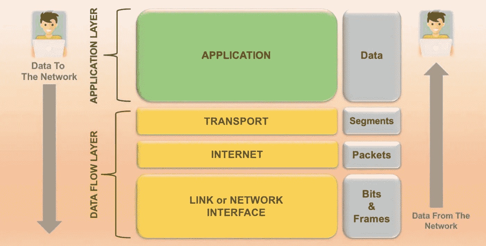
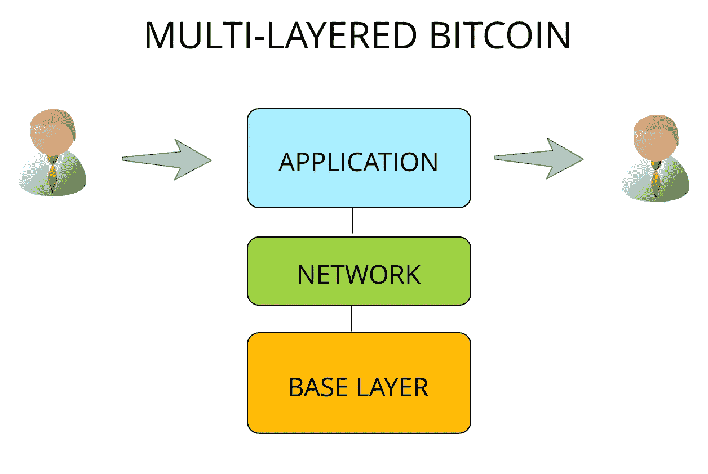
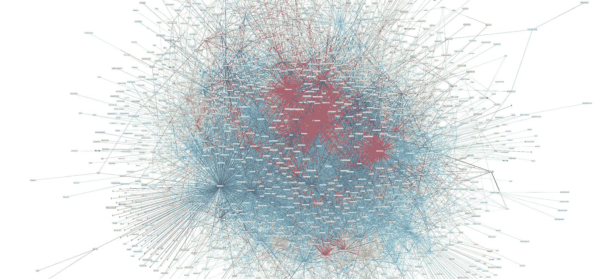
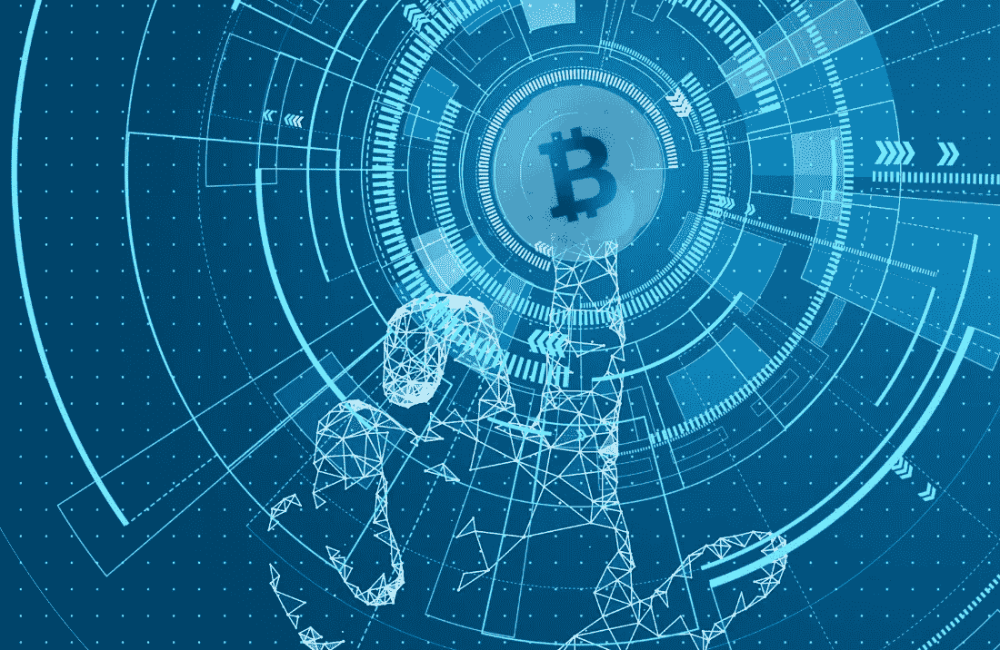
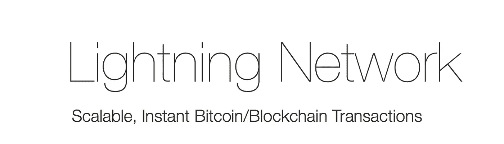

# 以闪电为动力；可编程货币—第 1 部分

> 原文：<https://medium.com/coinmonks/powered-by-lightning-part-1-3b6a514a0670?source=collection_archive---------5----------------------->

## 快速入门闪电网络和它是如何赚钱编程。

第 1 部分—可编程货币

第 2 部分—将 LN 作为个人使用

第 3 部分——将 LN 作为一项业务

第 4 部分—将 LN 用作国家

第五部分—当世界由 LN 驱动

## 互联网的层次

比特币正在成为一种多层价值转移协议，不同的层服务于不同的需求，用于不同的事情。要理解这一点，我们需要看一下互联网模型，这是一个围绕互联网四层的概念模型；应用、运输、互联网和网络。

The Internet Model. Source: Stemjar

**正在使用的四层**

当互联网的用户在彼此之间(你和网站的服务器)发送数据时，数据传输发生在四层之间。首先，在应用层(网站的界面)从发送用户处收集数据，应用层使用底层 API 通过 https(希望如此)将加密的数据包传输到服务器。这些数据包通过互联网的基础设施路由，本质上是通过服务器之间的高速链路传输的信息。对数据进行操作(更新或更改服务器上的状态)，反过来将更新的信息下载给您。

最有可能的是，服务器的数据库会按计划进行备份(比如 iCloud 或任何 Google 的服务)，并且更改后的状态会在其他服务器上复制。

最终的结果是，您直接与另一个互联网用户(服务器)来回传输数据，这在不到几秒钟的时间内完成，只有您和服务器知道这件事。在稍后的某个时间点，更改的数据会跨其他服务器进行备份。总的来说，用户体验达到了我们的预期，最终数据得到了安全的备份。

在我们所知的互联网出现之前，用户会在网络层直接相互连接。简单地“去一个网站”是不可能的。事实上，我们今天所知的互联网主要是由于应用层及其微服务、API 和浏览器端处理。

## 比特币的层次

一个多层的比特币，从概念上看没什么区别。基础层是包含不可变事务图的块链，“第 1 层”。这一层是完全公开的，每个人都可以查看和验证数据库的整个历史。这一层定义并保护了什么是比特币。

比特币核心是网络层的一部分，允许节点八卦，传播区块，互相连接。这一层的信息总是不完整的，每个节点可能存储不同的网络视图，即“内存池”。这一层还包含 Lightning 网络，这是一个节点网络，有助于节点之间的价值单播交易。这就是“第二层”。

第三层将是应用层，其中构建了 API 来与第二层交互，并允许高性能的用户与网络交互。这首先是在 satoshis.place 上观察到的，在它推出后不到一周，有进取心的用户就利用 API 来绘制复杂的图片，如照片和比特币白皮书的副本，甚至对整个广告牌进行状态反转。

MULTI-LAYERED BITCOIN

考虑到这一点，我们可以看到，基础层的链上交易是比特币最麻烦的事情之一，类似于在互联网的网络层发送数据包。除非我们需要将服务器连接在一起以高速传输数据，否则我们不会这么做；例如数据中心、交易台或机构/企业级基础设施。

即使是发送闪电交易本身，对于想要的体验来说，也是深了一层。它比基础层的事务处理更具可伸缩性和可用性，但对于主流应用来说，这并不理想。

我们需要继续构建，让我们自己进入应用层。我们还有很长的路要走(3-5 年)，但好的一面是我们不需要急着去实现它。它实际上只需要允许 80 亿人登机，具有高性能、可扩展性和出色的用户体验。与此同时，基础层和网络层事务对于早期采用者来说非常好。

## 网络层

闪电网络是比特币相对较新的一层，但更有意义的是，它是位于基础层之上、应用层之下的单播网络层。然而，应用层绝对依赖于健壮的网络层。事实上，人们现在才意识到，为了让 LN 尽可能好地工作，它需要引入以前从未想过的与比特币相关的其他方面的技术，如机器学习和人工智能。

**自动驾驶仪**

Lightning Network

在 LN 中，用户选择到达目的地地址的路线。然而，可以有数千种不同的路线选择，并且用户可能在流动性、费用、可靠性和隐私之间具有不同的偏好。每条路由都有不同的不确定性特征，因为它们是由可以随时连接和离开的节点设置的。此外，通过[原子多路径支付(AMP)](https://lists.linuxfoundation.org/pipermail/lightning-dev/2018-February/000993.html) ，单笔支付实际交易的路径数量可能会达到数百或数千条。

这对于客户端处理来说太多了，实际上没有算法可以轻松解决这个问题。相反，先进的最大似然算法将在选择对等点之间的路线方面做得更好，并将允许用户以接近最佳的速度、可靠性、流动性和隐私进行支付；都是通过一个未经许可的分散网络。

事实上，先进的人工智能自动驾驶仪将确保节点和用户之间的连接，以及为每条路线选择的参数，可以对抗网络上的大多数攻击形式。其中一些攻击(如寄生、压迫或审查节点)尚未明确定义或理解。为了使 LN 能够安全运行，它需要首先建立在一个健壮、有弹性和安全的基础上。一旦网络层成熟，我们就可以构建应用层。

## 可编程货币

事实上，我们以前从未真正见过可编程货币。在贝宝和其他支付服务出现之前，网上汇款极其困难。Paypal 的创新并不是为了赚更多的钱，它只是创造了一个网络效应，将大量电子商务用户整合在一个地方，这样它就可以更快地转移资金。Stripe 和 Square 也没有创造出更好的可编程货币，它们只是简化了用户和商家的入驻流程。

我们一直使用的数字货币从未改进过。即使在 2018 年，最低信用卡费用也从未低于 1 美元左右，处理时间也从未少于几秒钟。要突破这些限制，只有让另一个实体获得你的资金才有可能，而这在大规模上永远不可行。

有了多层比特币，百分之一美分的交易可以在接近底层互联网基础设施绝对最高性能极限的情况下处理——这一切都可以在完全不信任的情况下完成，并且永远不会放弃对金钱的控制权。早期测试显示，LN 的单个支付通道每秒处理超过 100 万笔交易。

这些能力将带来新一代的市场、体验和经济。将来可以按每字节、每毫秒、每毫米、每毫升或每克支付费用，这是可行的；这些支付完全是在机器之间进行的。

一些例子可能是:

1.  你的冰箱检测到空的，并为你订购下一餐。
2.  你的手机为更快的互联网连接支付每字节的费用，最高可达你设定的上限。
3.  你的自动驾驶汽车比其他交通工具开得更快，为超车买单。
4.  你的浏览器为在线内容的每秒浏览付费。

## 理解价值的机器

一旦我们的机器开始通过多层价值传输协议(即比特币)进行交互，可以想象它们将被教会意识到价值。这将带来全新一代的效率和效力，以及智能。

随着越来越多的机器执行多余的任务，人类将越来越倾向于让我们忙碌、兴奋和快乐。这可能会围绕娱乐和内容消费展开，尤其是在虚拟和增强现实领域。

与此同时，人工智能将越来越多地服务于内容的创建，从而减少内容创建与人类为该内容分配价值之间的反馈回路。如果一个人工智能正在为人类观众制作视频、音乐、艺术、虚拟体育或游戏，并且它是按每秒或每字节水平支付的；那么创造和消费之间的反馈就会迅速减少，没有比为某样东西付费更简洁、更清晰的反馈了。

这是否会加速我们走向奇点，还有待讨论。然而，这一现实的保证是，多层可编程货币的未来是由所有人拥有，而不是由任何人控制。这比国家支持的奇点要好得多。

## 闪电给你，现在

一个多层的比特币听起来很刺激，但是现在能用什么呢？事实上，这个网络非常年轻，而且还在不断发展。对于比特币的真实面目，人们仍有一种强烈的幼稚感，有一大群用户还没有订阅或理解比特币协议的多层属性。

要点是比特币是一种多层的价值传输协议，就像互联网是一种多层的信息传输协议一样。两者将在一场完美风暴中交汇。

# getoffzero #购买比特币

在下一篇博客中，我们将讨论个人如何使用 LN。在那之前，你应该下载一个闪电钱包:[https://play.google.com/store/apps/details?id = fr . AC inq . eclair . wallet . mainnet 2&HL = en](https://play.google.com/store/apps/details?id=fr.acinq.eclair.wallet.mainnet2&hl=en)

你还应该买一个闪电节点放在家里主持:【https://store.casa/lightning-node/】T2

更多资源:【https://lnroute.com/ 

在推特上关注我:twitter.com/jpthor_

我分享、写作和谈论去中心化的未来。

> [直接在您的收件箱中获得最佳软件交易](https://coincodecap.com/?utm_source=coinmonks)

