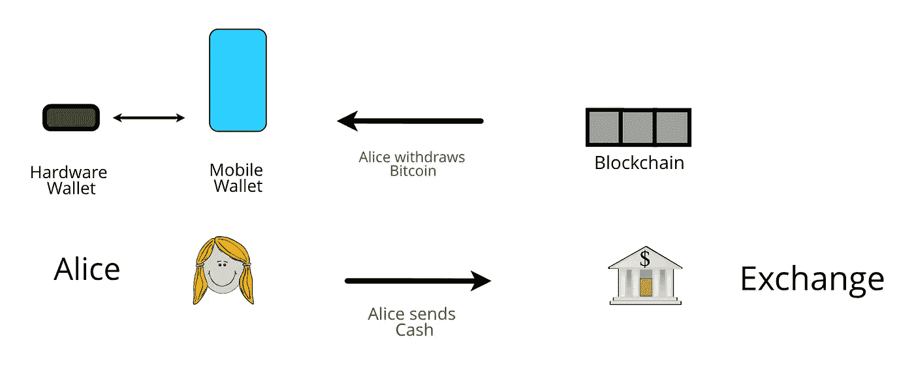
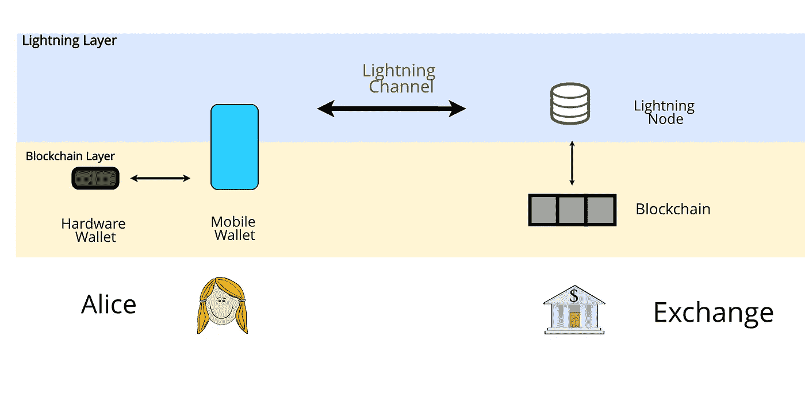
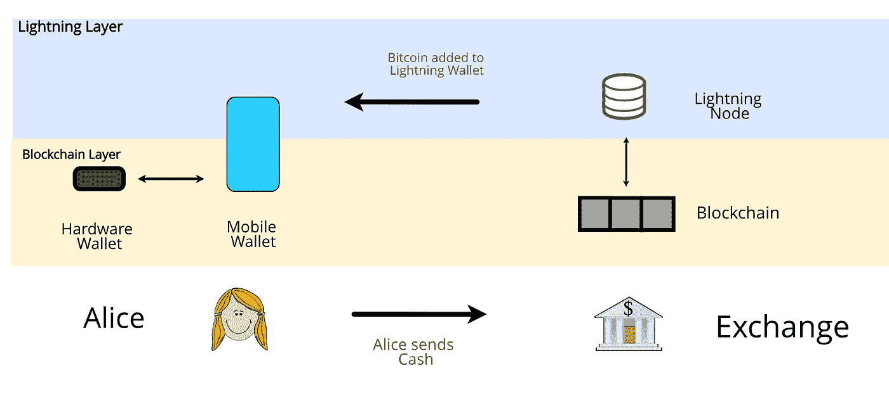
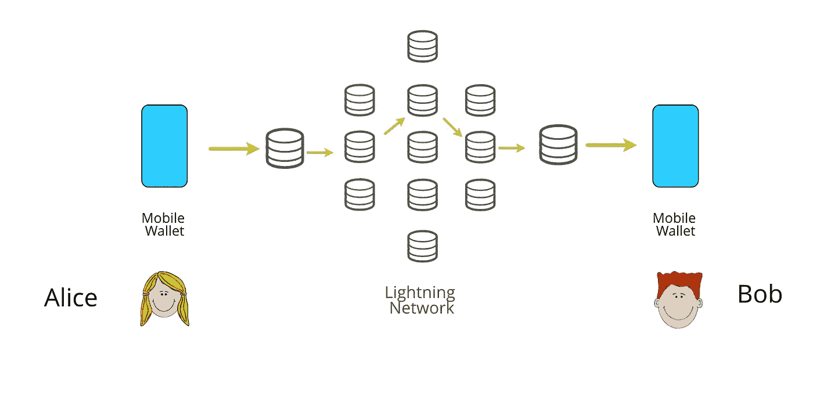
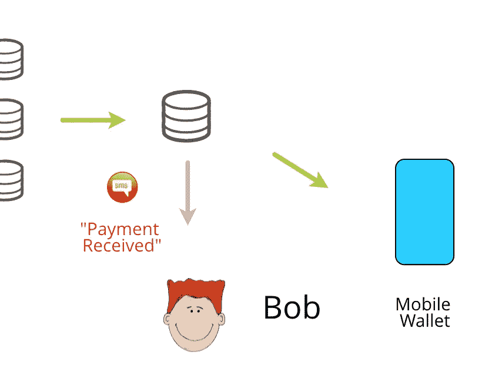
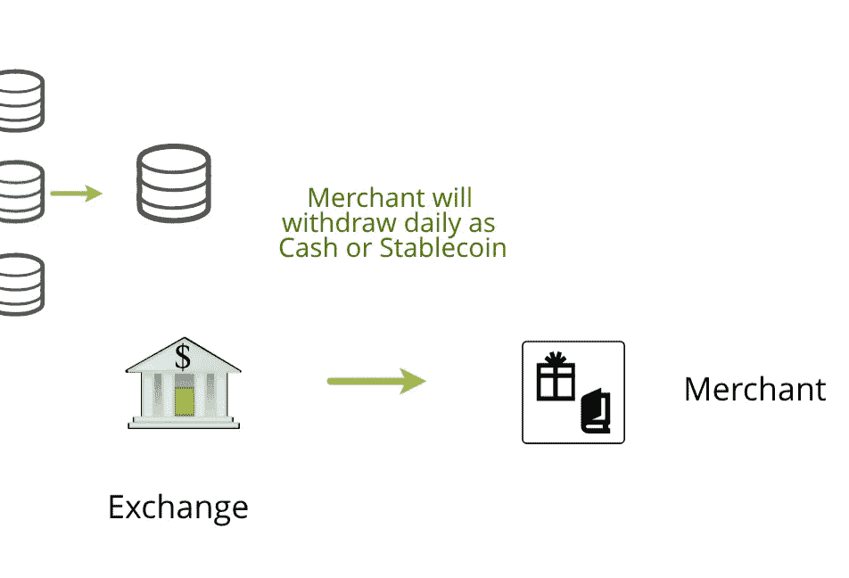
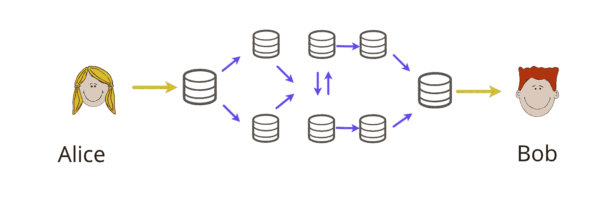
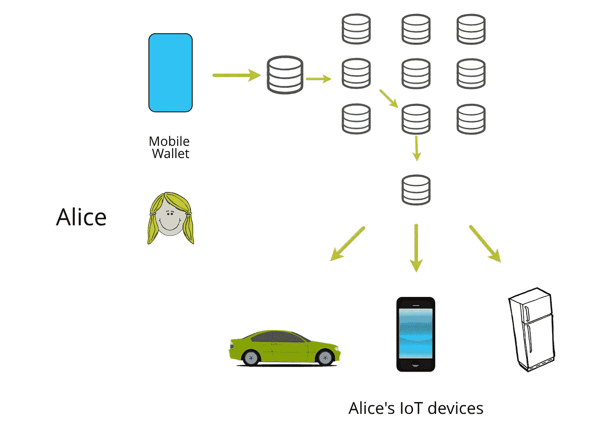

# 闪电供电—第二部分

> 原文：<https://medium.com/coinmonks/powered-by-lightning-part-2-5ef1e76e4288?source=collection_archive---------2----------------------->

## 作为用户使用闪电网络

在本系列的第一部分中，我讨论了闪电网络(LN)如何使货币可编程，并为一个由数字、无政府、无债务货币驱动的世界奠定基础。在这一部分，我将讨论今天和未来的个人将如何使用闪电网络。

**第一部**——[闪电网络——可编程货币](http://Part 1 — Programmable Money Part 2— Using the LN as an individual Part 3— Using the LN as a business Part 4— Using the LN as a country Part 5— When the world is powered by LN)

**第二部分** —作为用户使用雷电网络

**第 3 部分** —将闪电网络作为一项业务

**第 4 部分** —将雷电网络作为一个国家使用

**第五部分** —当世界被比特币驱动

将来，我们可以在以下付款时间使用 LN:

*   付费同行
*   支付商户
*   可编程货币(游戏、流媒体娱乐、服务、物联网等)

我们将看看每个场景，并讨论如何用比特币和闪电网络来实现它。

# 输入比特币

首先，爱丽丝是如何进入比特币的？爱丽丝从某种交易所购买，通过用菲亚特购买，并将她的比特币提取到她的手机和硬件钱包中。用于小额快速购买的移动钱包，通常被称为“热钱包”，用于存储大量比特币以确保安全的硬件钱包，通常被称为“冷钱包”。

以下是典型的流程:

Buying and withdrawing Bitcoin

在闪电供电的未来，爱丽丝也不会有什么不同。从她目前用作热钱包的同一个钱包，她将与她的交换打开一个频道，创建她的第一个闪电频道。

> “打开通道”的语义将很可能在未来的比特币钱包中被丢弃，以避免混淆用户。取而代之的是，用户将拥有一个“闪电钱包”,它将拥有代表用户无缝打开频道的软件(自动驾驶);而且这些通道会和很多不同的节点打通，而不仅仅是一个交换节点。

闪电钱包是从 Alice 的移动设备访问的，但是该移动设备能够在第 1 层和第 2 层保存比特币。未来的手机钱包 app 应该围绕两层，努力拥有非常清晰的用户体验；很可能把闪电钱包当作“日常现金账户”，把区块链钱包当作“储蓄账户”。硬件钱包将成为“定期存款”或“超级基金”。

我们很快就会看到为什么她的手机钱包应该同时有第一层和第二层比特币。只是一张纸条；第一层比特币总是与第二层比特币相同，但第一层比特币可以被视为无负担的，而第二层比特币已经被签入有条件的钱包。与传统金融系统相关，第一层比特币类似于银行账户中的现金，而第二层比特币类似于你的贝宝余额——它是相同的现金，但你和贝宝都有权监督你的贝宝余额。

> 注意:使用比特币，你的资产永远不会在第一层或第二层被查封，不像银行账户和你的 PayPal 余额，它们只是数据库条目，可以随时擦除。

Alice opens a lightning channel with her Exchange.

Alice 现在可以执行以下操作:

*   给她的闪电钱包加比特币，或者提现
*   花掉她闪电钱包里的比特币

## 添加和提取比特币

爱丽丝会想继续充值她的比特币钱包。她可以通过以下方式做到这一点:

1.  给她的交易所寄现金
2.  直接从她的手机区块链钱包中添加比特币
3.  直接从她的硬件钱包中添加比特币

将比特币直接添加到她的闪电钱包中被称为“拼接”，爱丽丝可以从她拥有的任何其他链上钱包中拼接进来。当爱丽丝向交易所发送现金并购买比特币时，交易所将从他们的链上钱包中拼接到她的通道中。

Alice can keep filling her Lightning Wallet by sending cash to her Exchange

对爱丽丝来说，这完全是天衣无缝的。她可以查看她的闪电钱包的余额，并能够从任何她想要的机制添加到它。在引擎盖下，她的钱包正在执行一系列原子链上交易，以便将她的比特币放入她的闪电钱包。

提现比特币简单来说就是上面的动作反过来:

1.  将比特币提取为现金:通过她的交易所提取
2.  将比特币提取到她的第一层钱包:从她的闪电钱包中拼接出来
3.  从她冰冷的钱包中取出比特币:从她的闪电钱包中取出

## 消费比特币

一旦爱丽丝有了一个有余额的闪电钱包，她就可以向闪电网络上的任何人消费。她输入收件人的地址，然后发送付款。她的移动钱包执行以下操作:

*   计算到达 Bob 的最佳路线
*   发送付款并等待收据

在 Alice 用她的本地交换机打开她的信道的情况下，支付将首先通过交换机的节点路由，这是“网关节点”。支付路由中的最后一个节点将是 Bob 的钱包首先连接到的节点，也称为网关节点。这很可能是一个 exchange 节点，因为 exchange 节点处于将新用户高效纳入 Lightning 的最佳位置。桥节点是与其他节点打开通道的节点，流出流动性大于流入。

网关节点在支付流程中执行重要的功能，可以决定 Alice 的支付体验。幸运的是，现在有很多创新正在发生，所以我们会谈到这一点。

> 为了隐私、冗余和可靠性，开放具有不同网关节点的多个通道符合 Alice 和 Bob 的利益。

## 问题

讨论了上述支付流程中的一些直接问题及其解决方案:

1.  鲍勃没有闪电钱包。

> 在这种情况下，爱丽丝的智能移动钱包将检测到鲍勃的地址不是闪电地址，而是将无缝地向鲍勃发送第一层比特币。

2.爱丽丝的闪电钱包没有足够的比特币在第 1 层或第 2 层进行支付。

> 未来的智能手机钱包将能够通知爱丽丝，她需要给她的闪电钱包充值，或者从她的闪电钱包中提款。

3.Bob 没有在线接收他的照明费用

> 如果 Bob 因为不在线而不能收到付款，那么它将失败并路由回 Alice。爱丽丝的钱包然后会要求爱丽丝用第 1 层比特币支付鲍勃，如果鲍勃不在线，可以发送该比特币。

4.Alice 选择的支付途径由于流动性或可靠性而失败

> 爱丽丝的智能钱包将能够使用不同的路线重新尝试支付。

5.Bob 的节点没有足够的比特币路由给 Bob。

> 为了让鲍勃收到 100 美元，那么 100 美元需要在鲍勃的通道的另一边；即与他交换。情况可能并非如此，在这种情况下，爱丽丝将无法向鲍勃付款，尽管鲍勃或爱丽丝都没有过错。解决这个问题的方法是让 Alice 直接与 Bob 建立一个通道。

我们可以看到，主要问题围绕着 Bob 和他的节点。如果 Alice 在付款选择或流动性方面遇到任何问题，她可以在发送付款之前*做出更正。然而，她受到鲍勃的付款限制和他的节点的支配。*

对此的解决方案是鲍勃在他的节点接收付款*，而不是直接到他的钱包。然后，他的节点可以通过电子邮件、短信或推送通知通知他有新的支付，然后他就可以上网，将任何新的支付提取到他的钱包中。*

Bob 可以选择运行他自己的节点，或者他可以在他的启用了 lightning 的交易所开一个账户，让他们的节点为他累积付款。

Bob receives a notification of an incoming payment

## 电子商务和付费商家

虽然上面讨论了一些问题，但向同行支付相当容易，但在向商家支付或进行电子商务支付时，Lightning 发挥了自己的作用。

其主要原因是，商家和电子商务支付解决方案将运行自己的基础设施，不太关心绝对验证每笔支付。取而代之的是，他们将积累每日收入，并循环分批提款。

此外，商家更有可能选择接受传统的法定货币或稳定货币支付，以支付税款、工资和其他业务费用。因此，更有意义的是，他们将在本地交易所拥有一个商业账户，并让交易所处理传入的支付。

A Merchant will likely use Exchange Infrastructure

# **原子多路径支付(AMP)**

我们之前提到过 Alice 的钱包将能够选择到 Bob 的路线，但这只是皮毛。

AMP 是一项革命性的功能，尚未建立在 Lightning 上，因为它只是最近才被构思出来。目前，Lightning 的主要问题是，支付只能通过已经存在流动性的渠道进行，也就是说，10 美元的支付只能通过已经有 10 美元的渠道进行。

AMP 允许付款一次通过许多不同的渠道自动发送，Bob 将收到所有的付款，或者一个也没有。例如，Alice 希望支付 Bob 1000 美元。Alice 可以发送 1000 笔 1 美元的付款，而不是发送一笔可能会失败的 1000 美元付款。每笔付款都经过不同的路线，当 Bob 收到所有付款时，他将获得全部 1000 美元。

当我们认为 Lightning 允许单播支付时，AMP 允许*多播*支付。这对于闪电的以下特征具有突破性的改进:

1.  **可靠性。**每个渠道都极有可能已经有 1 美元，因此支付的整体可靠性将很快达到 100%。
2.  **费用竞争激烈。试图收取高额费用的节点将很快失去对路由的选择，并将失去流量。他们将永远不得不收取极具竞争力的费用来吸引流量。**

An AMP Payment

在这张图中，爱丽丝支付鲍勃 10 美元，分两次支付 5 美元。选择这些路线是为了最大限度地提高可靠性和流动性。我们可以看到，除了网关节点之外，没有一个节点知道完整的支付规模，也不知道谁在向谁支付。因此，网络上的支付越多，重新平衡的速度就越快，整个网络就变得越健康。这都是拜 AMP 所赐。

# 可编程货币

闪电使比特币成为可编程货币。在未来，爱丽丝的所有设备都将有一个照明钱包，使他们能够以编程的方式代表爱丽丝快速支付。她的无人驾驶汽车、手机、冰箱都将有钱包，爱丽丝将能够设定支付方式和金额。比如:

*   打电话支付每月不超过 10 美元的快速上网费用
*   冰箱来支付她每周 200 美元的食品杂货账单，根据她的菜单来定
*   汽车每周的过路费不超过 10 美元

Alice 将能够从她的主钱包中为它们充值，向它们发送流动性。每当他们的钱少了，她就会收到通知，还有他们为她花了多少钱。因为他们只有在爱丽丝允许的情况下才能消费，爱丽丝永远不会因为她不知道的事情而被收费，她将完全控制消费。

爱丽丝将永远不会比她花得更多，这意味着她永远不会增加债务。

The future of Money

# 每个房子里的一个节点

我们可以看到，Lightning 网络的健康和可用性实际上取决于可用的节点和资助通道的数量。此外，运营自己的节点符合 Alice、Bob 和商家的最大利益，因为他们可以在费用、流动性和隐私方面做出更好的选择。

好消息是，运行一个闪电节点将很快成为一件非常琐碎的事情，以至于未来的家庭将把互联网路由器与比特币和闪电节点捆绑在一起。每个家庭的成员只需将他们的移动钱包与他们自己的节点相连，它将像他们目前所做的那样全天候运行。

一些即将投入生产的令人敬畏的节点包括[卡萨节点](https://store.casa/lightning-node/)和[拉斯皮布利兹](https://github.com/rootzoll/raspiblitz)。

确保未来的比特币网络对所有人开放，以便任何人都可以在家里托管一个节点，变得越来越重要。因此，我坚定地站在 Segwit + 1mb 块限制阵营。目前，比特币链有 185GB，在典型设备上同步大约需要一天时间。单片计算机(RPi)可以通过预加载预先验证的链集来快速同步。

我们将在本系列的第 5 部分讨论如何在当前比特币区块链参数*不变*的情况下，可预见地将整个世界纳入比特币和闪电网络，以及当前比特币的设计选择实际上给我们带来的巨大好处。

# 结论

闪电是对我们如何使用和消费比特币的巨大改进，也是我们正在慢慢过渡到无债务、可编程且完全控制支出的货币的更广泛运动的一部分。

然而，我们将如何使用闪电有一些限制，主要围绕付款的接收者。好消息是，这个领域正在发生大量的创新，大多数问题可能会很容易解决。

从这里开始:[https://lnroute.com/mobile-wallets/](https://lnroute.com/mobile-wallets/)

# 承认

非常感谢@ln_master_hub 和 [BTCPay Server](https://medium.com/u/1e9833f98cd8?source=post_page-----5ef1e76e4288--------------------------------) 给了我关于这篇文章和一些技术方面的反馈。

在推特上关注我:twitter.com/jpthor_

我分享、写作和谈论去中心化的未来。

> [直接在您的收件箱中获得最佳软件交易](https://coincodecap.com/?utm_source=coinmonks)

