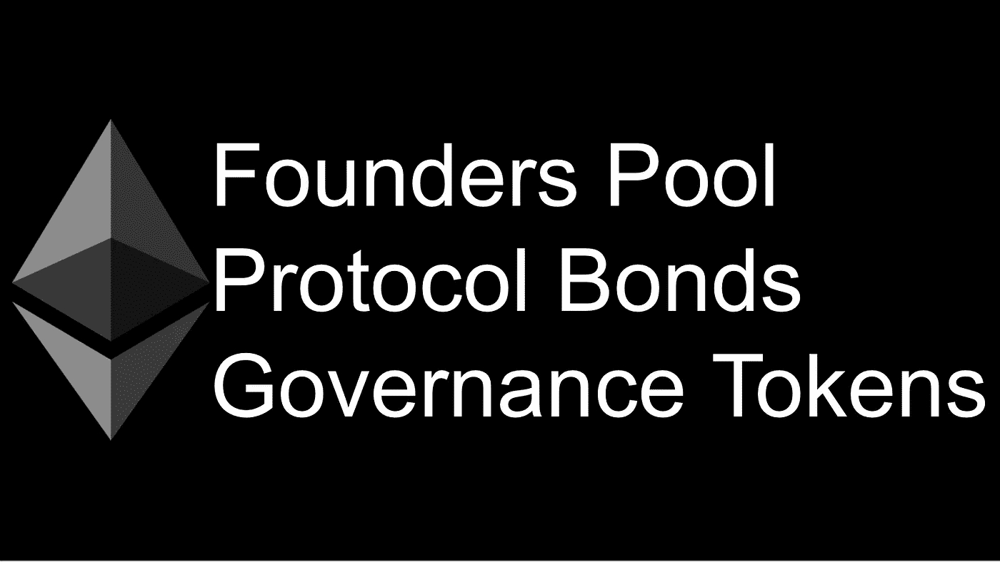

# 以太坊上的实用协议资助

> 原文：<https://medium.com/coinmonks/practical-protocol-funding-on-ethereum-ea944fbde440?source=collection_archive---------1----------------------->

# 概观

分散式协议有许多优点

1.  可组合性(金钱乐高！)
2.  吸引大量流动资金的能力
3.  创始团队的监管隔离

对我来说，看起来到目前为止，在能够启动一个真正分散的协议和为启动团队提供财务增长之间有一个权衡。我认为这方面的主要问题可以归结为在讨论分散式协议时通常没有明确提到的三件事。

1.  建设和启动需要种子资本
2.  创始人对货币升值的渴望
3.  投资者对货币升值的渴望

下面是我对一个新模型的建议，这个模型可以广泛应用于大规模或小规模的协议开发。

# 一些基础工作

## 启动选项

过去启动协议的例子。

**ICO** —如果可能的话，需要大笔资金来确保合规性。对代币增值抱有很大期望。

**传统融资**——投资者对小额融资没有太大的兴趣。大幅加薪意味着高回报预期。

**授予** —很好，但这是一种非常不一致的方法，授予者可能希望对项目有一定的控制权

自筹资金**——很少有创始人能长期这样做**

**如果在前两个选项中出售的资产是治理令牌，那么对其产生价值的期望很大，并且仍然不清楚纯治理令牌是否应该或确实产生长期价值。很明显，短期内不会。我认为治理令牌的主要工作应该是治理，而不是价值累积。**

**还有更复杂的系统，比如 Maker，它使用治理令牌来协调参与者的激励和行动。我认为这对于需要积极参与的协议是有意义的(如制造商调整稳定性费用和 DSR 率)，但对于更简单的协议，其中大多数建议是新集成所需的升级或更改，没有协议试图满足的共享“目标”(如制造 1 DAI = $1)需要二级激励。**

## **定义**

***术语可能会变得模糊不清***

****协议** — Maker 是协议，Compound 是协议，Uniswap 是协议，等等。基本上任何基于[智能合约](https://blog.coincodecap.com/tag/smart-contact/)的系统都可以自主运行，并促进价值存储和传输。在这篇文章中，我将讨论建立在基础链上的协议([以太坊](https://blog.coincodecap.com/tag/ethereum/))。**

****应用**[—uni WAP . io](http://uniswap.io)是应用， [app.compound.finance](http://app.compound.finance) 是应用，达摩是使用复合协议的应用。通常在团队构建的任何协议之上都会启动一个应用程序。通常是先有应用程序的想法，然后建立一个协议来实现应用程序的构建。**

## **工具**

**我不主张改变任何现有的或创建新的组件。这种变化是一个分配和激励调整的问题。如果没有已经尝试过的无数实验(取得了不同程度的成功)，这个提议是不可能实现的。有两个共同的元素，我主张继续使用，但以不同的方式。**

****协议费** **—** 协议(dydx，uniswap v2)交易或资产价值的百分之一。曾经有一段时间，任何协议费用都是不受欢迎的，但现在人们的态度似乎已经转变为重视时间成本和价值(基础设施成本、审计成本等)。)与启动和维护协议相关联(至少直到它准备好移交给分散管理)。**

****治理令牌—** 投票通过提议的协议变更(MKR，COMP)时需要。治理令牌和 DAO 共享确实可以互换使用，但是如果您有大量的持有人/参与者，那么令牌更容易管理。**

# **建议**

***以下是我在新的分散式协议融资方面看到的三个主要问题，以及解决每个问题的具体解决方案。***

## **问题——创始人和投资者的优势**

**对创始人来说，冒险是有益的，伟大的事情就是这样创造出来的。即使没有金钱激励，一些人也会承担建立新协议的风险。现实是，如果有一条类似创业型的上行之路，就像创办一家传统公司一样，建立一个协议，将会有更多的实验。**

## **解决方案—创始人池**

**一个智能合同，它接收协议中内置的一部分费用。协议的创建者是创建者池的唯一所有者。他们可以发行新股从而稀释自己，出售代币，出售+赎回代币，等等。围绕这些决策的控制可以根据需要进行严格或宽松的管理。创始人代币没有特别的投票权，可以由创始人自行决定出售/铸造给投资者。**

**协议费用的大小和流向创始人池的百分比在协议开始时设定，并可以由协议治理管理(从开始或时间/里程碑 X 之后)或永久锁定(尽管如果创始人停止带来价值，这可能会激励分叉)。**

## **问题—种子资金和投资者优势**

**一些创始人能够私下建立一个协议，或者自己掏钱。现实是，大多数人不应该因为需要支付租金而阻止下一个伟大协议的推出。申请资助是一种非常不一致的融资方法，大多数风险投资者只会寻找有巨大上升空间的投资**

## **解决方案—协议债券**

**固定回报工具，回报来源于协议费用。该工具的回报是有上限的。**

*   **固定回报——债券价值的 20%(不管需要多长时间偿还)**
*   **固定 APY — 10% APY，直到收回投资**
*   **动态 APY-DSR+5%，直到收回投资**

**协议债券的购买者也将获得治理令牌。我更喜欢固定回报选项，因为它激励持有者通过系统获得尽可能多的交易量。个人可以购买这些债券作为投资，可能受益于新协议的项目可以获得更低的价格(该协议可以带来零费用)。协议债券也可以出售，用于预付审计费用等服务(或者用于启动，或者甚至由协议动态发行，用于持续审计)。发行可以是固定的，也可以在某种拍卖中进行分配(百分之多少的回报就是出价)。协议债券费用是固定的(不能通过治理来改变)。**

## **问题—对权力下放的承诺**

**有无数的承诺“分散”协议的治理，也有许多例子说明事后很难或不可能这样做。在一开始就将意图写入协议的代码，并随着时间的推移接受“权力下放之路”,可以向用户保证这些承诺将会实现。**

## **解决方案—多样化的治理令牌分发**

**治理令牌将在三方之间分发**

1.  **创始人**
2.  **协议债券购买者**
3.  **协议参与者(资本提供者、分销商等。)**

**对 1 和 2 的分配是在协议启动时完成的(为了简单起见，最好不要在此之后向创始人或债券持有人发放任何政府代币)。然后在未来选择一个时间点，在这个时间点上，协议应该准备好移交给分散的治理。这可能是 6 个月或 3 年。在这条道路上的某个点上，协议参与者的持股应该足以阻止协议债券购买者和创始人的任何投票。**

**例如，假设 gov 令牌是分布式的—创始人= 30%；债券持有人= 30%；参与者=40%。参与者代币在 1 年内分发。协议中任何一票的批准门槛都是 67%。在这种情况下，接近年底的某个时候，协议参与者可以随时阻止任何提案。**

**治理结构可以根据需要简单或复杂。我认为，有一个“董事会”来处理投票，每个董事会成员必须拥有(或承诺拥有)一定价值的代币，但拥有同等权重的投票，这种模式有一定的意义。这不是帖子的要点，分发才是。**

# **例子**

***这些组件一起工作***

**通过出售带有治理令牌的固定回报的协议债券，令牌持有者不再痴迷于推动令牌的价值，从而可能危及协议的完整性。创建者令牌可以或多或少地控制一般的协议治理。**

****5 位创始人，6 个月的建设，1 年的去中心化后推出(*新的期权交易协议，例如* )****

*   **5000 个创始人代币(每个 1k)**
*   **10，000，000 个治理令牌(每个创始人 600，000)**
*   **销售 10 万美元的协议债券，20%固定回报+300 万治理令牌**
*   **0.3%的交易费(创始人池 0.1%，偿还协议债券 0.2%)**
*   **第一年每月向流动性提供商和分销商发放 333，333 个与协议使用相关的治理令牌**

**债券费用不受治理的控制，一旦达到 6000 万美元的交易量就停止。也可以这样安排，创始人的%费用在这一点上增加，或者只在债券支付后才生效。应该很容易配置解决方案来协调各方。**

> **[直接在您的收件箱中获得最佳软件交易](https://coincodecap.com/?utm_source=coinmonks)**

****

# **结论**

**构建去中心化的应用程序既容易(现成的基础设施、可组合的开源协议和应用程序)又困难(没有明确的商业模式、监管的不确定性)。创始人应该有一些优势，但如果一些小而快的东西可以被创造出来，并带来一些价值，那么即使只有一小部分价值流向创始人也是很好的。投资者希望有上升的潜力，但也希望有能力对协议进行一些控制，并有一条清晰的路径来获得回报。的用户想知道费用的去向，以及声称是去中心化的东西至少有一个合理的计划到达那里。找到对上述结构的正确输入使这些期望一致起来，并有望实现更多的协议实验。**

****