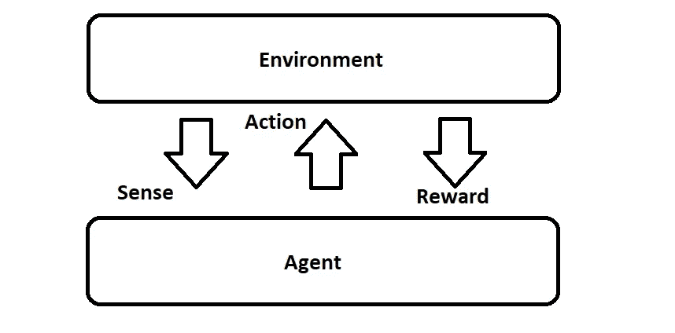
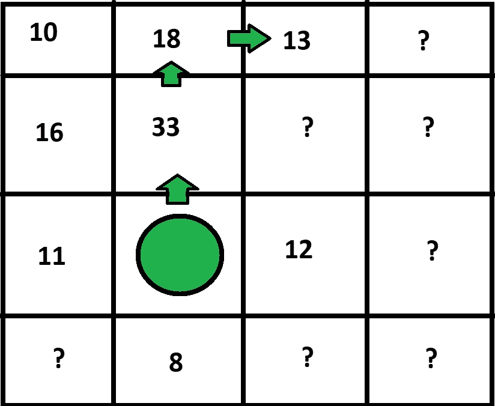

# 实用强化学习。一

> 原文：<https://medium.com/coinmonks/practical-reinforcement-learning-pt-1-5d45b029f93c?source=collection_archive---------0----------------------->

RL in Action

## 介绍

在接下来的几篇文章中，我想开始探索 RL 如何应用于家庭机器人应用，比如这篇博客中的 MARVIN bot。我希望从直观地介绍强化学习背后的思想开始，然后朝着我认为适合实际应用的方法努力。一旦找到了，我将在 MARVIN 身上实现这个方案，看看它在实际机器人上的表现如何。

我们开始吧！

## 强化学习

在进入我希望探索的方法之前，为那些可能还不熟悉强化学习(RL)的人提供一个简短的介绍是有意义的。

从最广泛的角度来说，RL 包括训练一个主体学会根据它从环境中得到的奖励(或惩罚)来执行一个动作。训练一只狗是我见过的理解这项任务实际执行的最好例子。当一只狗被训练时(假设它使用的是现代积极训练技术，而不是基于力量的训练)，每一个正确的动作都会得到某种形式的奖励。例如，你让狗坐下，它坐下了，你给它立即的奖励。如果它不坐下，就没有奖励。

RL 工作在一个相似的前提下——代理根据其环境做出的每一个正确的动作都会得到一个奖励。(如果我们愿意，我们也可以提供负面奖励)。代理人开始时不知道哪些行为会带来最好的回报，他的任务是学习最大化他所收到的回报。

上图中可以看到一个具体的例子，取自 Udacity 的 Deep RL 项目。这里的目标是让手臂的抓手接触绿色圆柱体。为接触滚筒和稳定地向其移动夹具提供奖励。该代理控制机器人手臂上各种关节的速度，同时接收来自指向场景的摄像机的输入。

让我们快速看一下 RL 是如何工作的。首先考虑离散的情况更简单。在离散情况下，代理经历以下周期:

1.  它感知或接收来自环境的某种输入。
2.  它在环境中执行一个动作。
3.  它从环境中获得回报(可能是零)。

Sense, Action, Reward

> 为了讨论的目的，我将引用代理在“感知”阶段收集的数据，如代理所述。该信息包括代理可以访问的关于其自身配置和环境配置的任何数据。

从一个不连续的观点来看这个问题，代理人在环境中经历的整个历史可以被认为是一个(状态、动作、奖励)三元组的序列。如果我们想知道一个代理到目前为止得到的总奖励，我们只需要把它历史上所有奖励的总和加起来。

A Simple Maze

我们如何利用这一事实？让我们来看一个非常简单的玩具问题——上图所示的迷宫。我们无畏的迷宫解算者发现他们在菱形处有两种可能的行动选择。绿色的选择最终会让他们得到绿色的奖励，反之亦然。

如果我们事先知道回报，我们就可以计算每个选择的回报。在这种情况下，图像被标注了适当的奖励，因此我们可以看到:

*   返回红色:75
*   返回绿色:21

应该清楚的是，如果代理人想要最大化其回报，它应该选择红色选项。换个角度来看，向上移动为我们赢得 75 分，向下移动为我们赢得 21 分。我们想往上走！

这里做了一些关键的假设——值得注意的是，我们不仅知道环境的完整结构，而且知道每种奖励会是什么。这是一个巨大的优势，在任何实际应用中我们都不能依赖它。

在现实世界中，我们必须*根据我们以前的经验估算*每一个行动的回报。让我们来看看另一张地图，看看这是如何改变现状的:

A Mysterious Maze!

在我们的新场景中，代理只对两种选择有经验——当它恰好上升一次时会发生什么，当它下降时会发生什么。它不知道移动后动作的结果应该是什么。纯粹基于手头的信息，如果代理想要最大化，它需要*利用*向下方向具有最高已知分数的事实，并向绿色箭头移动。

然而，这揭示了一个新的问题，如果找到红点比所有可能的下一步行动更有价值呢？我们目前天真地选择我们能看到的最高分选项的策略实际上会导致低于标准分的分数。如果我们想找到最佳选择，我们将不得不进行某种*探索。*

我们如何决定何时*探索*以及何时*利用*？最常见的方法是概率性地做这件事。使用这种方法，代理从随机探索每个节点的 100%动作开始。随着时间的推移——基于代理查看环境的次数，或其他一些适合于任务的衡量标准——这个值逐渐降低，代理有时随机移动，其余时间利用最高的可用奖励。

然而，这留下了一个问题——代理“学习”的到底是什么。我们学到的是状态、奖励和行动之间的关系。在一个典型的例子中，代理从一张白纸开始——它不知道环境中可用的奖励。

What Rewards?

让我们暂时忽略*探索* / *开发*问题，假设我们的代理正在系统地搜索环境。它探索绿色圆圈上方、下方、左侧和右侧的方格，获得下图所示的奖励:

Preliminary Rewards

在一次迭代之后，代理从“绿点”状态中了解到，如果:

*   向上移动得到 15 分
*   向左移动得到 11 分
*   向下移动得到 8 分
*   向右移动得到 12 分

这很简单，让我们更进一步。假设经过几次迭代后，代理探索黄色方块，得到下图所示的奖励:

Updated Rewards

我们现在必须回答一个新问题——根据当前的信息，应该给“升职”行动分配什么奖励？我们知道，在一次“移动”之后，代理人会得到 15 分。第二招呢？我们可以假设代理试图最大化其当前得分，所以它会选择值 6 分的选项。

把这些加起来，我们看到在这种情况下“向上移动”行动的总奖励应该是 21 分。我们可以遵循类似的策略来填充网格中的其余值，始终假设代理人将最大化其总报酬。我已经提供了一个例子，这个例子在未来的一步中会更好地说明这一点:

New Rewards provide a change in behavior

从更新后的网格中可以看出，多一点的信息会导致代理改变其在世界中的路径。以前我们有一条“向上，向左”的路径，现在我们可以看到这条路径已经变成了“向上，向上，向右”。

在这个映射中，我们指定在每个状态下要采取的动作被称为*策略*。看待 RL 正在做的事情的一种方式是将其视为学习代理要遵循的策略。在这种情况下，学习包括每当发现新信息时不断更新策略。

关于政策，我们能说的很少:

*   我们可以根据回报给他们打分，例如，给定上述政策(上，上，右)的值为 33 分，但政策(上，左)仅值 21 分。
*   我们可以根据分数来比较策略—这里我们可以说策略(上，上，右)>(上，左)，因为前一个策略比后一个策略给出了更高的回报。
*   我们可以为最优策略制定一个定义——它是一组(状态、动作)对，这些对产生的回报是其他策略无法比拟的。

我们已经接近这个系列的第一部分的结尾了，但是系统中还有一个缺陷我们还没有解决——我们应该允许这个政策走多远？

让我们回到网格中来看一个更进一步的例子——如果我们不是停留在(上，左)处，而是进一步扩展先前的“劣势”策略(上，左，上，右，右)会怎么样？这一新政策的得分将高于前一个政策，因为它能够利用比其他政策获得更多奖励的优势。现在我们可以决定所有的策略*必须*有相同的动作名称，所以如果我们从一个地方开始，我们总是精确地走 27 步，但这不是真实世界的代表。在现实世界中，我们可以采取多少行动没有预先定义的限制(至少在实际意义上)。

为了解决这个问题，我们可以引入“贴现回报”的概念。这里的想法是，我们更喜欢“接近”我们当前状态的奖励，而不是更远的奖励。下图应该有助于进一步说明这一点:

Discounting the Reward

在上面的例子中，我们将代理人采取的每一步的奖励打了 50%的折扣。黄色三角形表示进入网格中的给定方块所获得的奖励加上了多少折扣奖励，而白色三角形表示获得的总奖励(从策略结束时向后计算)。这里的 50%值被称为*贴现因子。*

这里我们可以看到，我们非常重视接近代理当前位置的奖励，而对那些需要更长时间才能达到的位置则大打折扣。事实上，在这个例子中，每个额外步骤的值会很快接近零。

这个*折扣因子*通常是代理设计者为世界上的代理设置的常数。它允许我们模拟遥远国家对代理人决策的影响程度，通常在 0 到 1 之间。在这种情况下，1 表示所有步骤的权重应该相等(这是我们在本文中引入折扣因子之前的做法)，0 表示只有紧接的下一个步骤才对代理的决策有任何影响。

我提供了另一个图像来帮助形象化折扣因子的两个极端选择对下图中的代理行为的影响。左边的绿色箭头显示了如果折扣因子设置为 0，代理将通过我们的小网格世界的路径，而右边的箭头显示了如果折扣因子设置为 1，代理将采取的不同路径。

A change of Policy

这对于一篇文章来说已经足够了——在我的下一篇文章中，我将扩展到目前为止所解释的内容，开始构建一个个人机器人可能感兴趣的简单 RL 问题。

在那之前，

分享享受！

## 参考

下面是一些很好的参考资料，帮助我学习强化学习背后的概念:

[强化学习导论萨顿和巴尔托 2017](http://incompleteideas.net/book/bookdraft2017nov5.pdf)

[优达城的强化学习课程](https://www.udacity.com/course/reinforcement-learning--ud600)

> [在您的收件箱中直接获得最佳软件交易](https://coincodecap.com/?utm_source=coinmonks)

