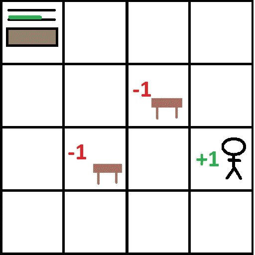

# 实用强化学习。2

> 原文：<https://medium.com/coinmonks/practical-reinforcement-learning-pt-2-8196e4ccab0d?source=collection_archive---------3----------------------->

## 介绍

在本系列的前一篇文章中，我介绍了强化学习(RL)背后的一些直觉——它是什么，它做什么。在这篇文章中，我想从一个受家庭机器人场景启发的简单问题——马文的世界——开始研究如何应用 RL 背后的思想。

Marvin’s World

马文的世界是一个非常简单的游戏，盯着马文谁，我们看到在左上角的网格。马文带着一杯饮料(或其他感兴趣的物体),并被指示将其带回给它的主人。

当然，我们可以用任意数量的现成路径查找算法轻松解决这个问题，但出于本文的目的，我想从 RL 的角度来看这个问题。如何才能设计出一个可以解决这个问题的 RL 系统？

## 公式化问题

在我看来，为了描述一个 RL 问题，我们需要明确三个主要组成部分:

*   **代理:**我们需要知道它能采取什么行动，以及它会接受什么输入。例如，分拣机器人可以完全控制复杂的机械臂，同时接受来自机载摄像机的输入。
*   **环境:**这是代理将“生活”的地方，这可以是一个模拟，或者如果你有一个物理机器人，它可以是真实的世界。代理的所有输入都来自环境。
*   **奖励:**本质上，这些是我们如何控制代理将在环境中尝试做什么。例如，如果我们可以为代理提供解决迷宫的高分奖励，以及迷路和花费太长时间的低分奖励(可能是负奖励)。

这和马文的世界有什么关系？环境是以网格的形式呈现给我们的——马文在左上角，几张我们可能想避免撞到的茶几，马文的主人在网格右下角附近。

我们解决这个问题的代理人将是有名无实的马文。马文有四种动作可以做:上、下、左、右。每一个都将马文移动到选定方向上与其相邻的方块中。如果不存在这样的方块，那么马文不会移动。

奖励呢？这是一个棘手的问题——也是许多创造力和迭代将发挥作用的地方。现在，让我们从下图所示的奖励开始:

Rewards!

奖励以最基本的方式分配——到达马文的主人时给予正奖励(此时“游戏”将结束，并重置),撞到桌子时给予负奖励(这可能会损坏马文或桌子),之后模拟将再次结束，并重置为最初的开始状态。假设空白方块提供的奖励为零。

这给了我们一个问题的基本公式——让我们看看如何才能真正解决这个问题。

## 寻找奖励

现在，马文没有太多关于这个世界的信息，从他的角度来看，这个世界本质上是一个空白的网格。在没有其他信息的情况下，唯一真正的选择是随机选择一些动作，看看会发生什么——我在下图中展示了一种可能的随机路径:

A “random” path

所以马文做了一些探索，然后碰到了一张桌子。让我们应用我们在上一篇文章中学到的方法，看看我们是否能够根据这一组特殊的经历来计算出奖励应该是什么。为了简单起见，我将假设这个演示的折扣因子是“1 ”,我们可以稍后调整这个参数，看看它如何影响我们的最终解决方案。

An Updated Model of the World

从表中回溯，我们得到上图中看到的奖励值。让我们尝试这个想法的几次迭代，看看会出现什么奖励值。我将在下图中说明这些。

> 注意:任何空白网格方块都被假定为它们的动作都是零值。空白三角形也被认为是零回报。

Randomly Exploring the Environment

我们看到，当代理探索这个世界时，它发现了更多关于它的世界的东西，它最终会遇到我们散布在它周围的各种奖励(和惩罚)。该信息可用于为机器人从给定状态采取的每个动作分配一个*值*。如果你看了上面提供的演示图片，你可能已经注意到了这样做的模式:

> 一个动作的值是通过采取该动作可以获得的最高分数。

对于这种情况，我们还可以观察到另一种情况——两条直接通向目标的路径都有相同的分数+1。这是我们如何选择奖励的直接结果——我们只是奖励或惩罚到达目标/失败位置的人，我们的奖励系统中没有任何迹象表明会区分路径的长度！

我们可以用一种相当简单的方式解决这个问题——只需更新奖励！在这种情况下，代理需要找到到达目标的最短的 T4 路径，所以我们惩罚它所走的每一步。这里的直觉是，由于代理人在每一步都*最大化其报酬*，这应该鼓励它给更短的解决方案更高的分数。下图展示了当我们给每个空白方块-0.1 的奖励时，奖励是如何变化的。

New Rewards!

这就好了一点，代理现在有办法区分“绕远路”和最短路径了！这就是我们想要的。这也显示了奖励函数对代理人的行为有多么大的影响——同一个代理人，探索同一个环境，但是用两个不同的奖励函数发现了两个完全不同的解决方案！

我想再强调一下这一点，因为在我看来，奖励函数是成功 RL 解决方案的关键。本质上，当 RL 被应用时，我们真正做的是将问题重新铸造到一个新的领域。下图更好地说明了这一点:

Recasting the problem

这正是我们在这里所做的——我们遇到了一个问题，代理需要在环境中找到“最佳”路径，并改变了我们找到解决方案的方式。代理人和环境保持不变，但我们没有使用传统的方法如 A*来寻找最佳路径，而是让机器人搜索奖励，并选择最大化这些奖励的策略。

换句话说:在传统的解决方案中，我们必须实现一个路径寻找方法，而在 RL 解决方案中，我们选择一个奖励函数。决定何时以及如何使用 RL 基本上归结为一个什么更实用的问题——设计一个奖励函数，还是设计一个传统算法！

## 下一篇文章…

到目前为止，这最后两篇文章已经集中在获得如何使用 RL 的直观理解上。我们还没有看到任何方程，或任何代码来演示如何将它付诸实践。在下一篇文章中，我将介绍如何将我们所学的一切转化为一个简单的 python 程序，我们可以用它作为解决更复杂的 RL 相关问题的垫脚石。

在那之前，

分享享受！

> [在您的收件箱中直接获得最佳软件交易](https://coincodecap.com/?utm_source=coinmonks)

