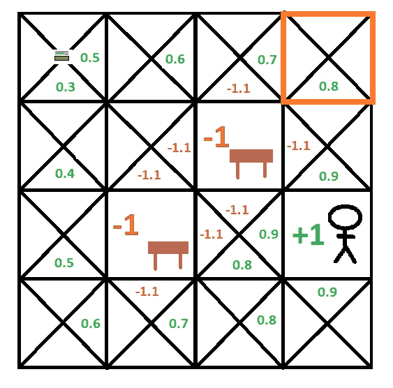
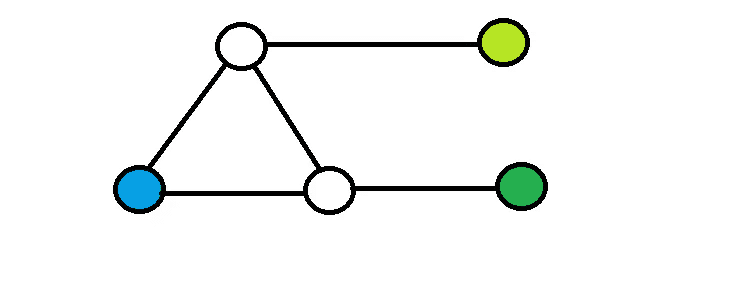
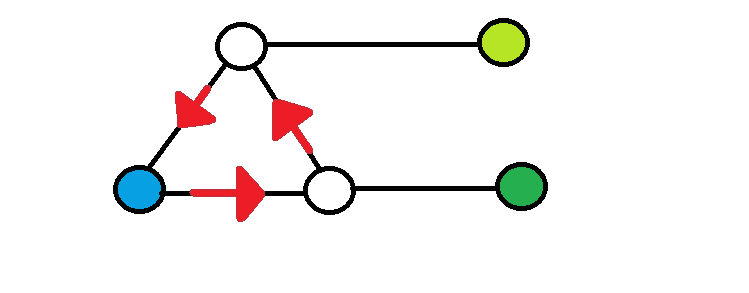
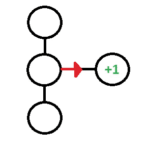
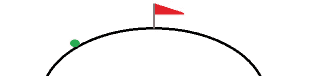

# 实用强化学习。3

> 原文：<https://medium.com/coinmonks/practical-reinforcement-learning-pt-3-7dc614e850c9?source=collection_archive---------2----------------------->

## q 学习算法


Get the Cheese!

> 这篇文章是我之前关于这个主题的[文章](/coinmonks/practical-reinforcement-learning-pt-2-8196e4ccab0d)的延续。如果您还没有阅读其他文章，建议您先阅读这些文章。

## 问——学习

在这一点上，如果你一直在跟进，你应该对强化学习的主要成分有一个直观的理解。在我们能够构建自己的强化学习代理之前，还剩下一些成分。我们的下一个要素是 Q-Learning。

让我们先来看看上一篇文章中的一个例子:



我们将从检查上面例子中突出显示的方块开始。在这个例子中，从高亮显示的方块“向下”的奖励设置是 0.8。对于下面的讨论，我们将这个值称为“Q”。这种价值从何而来？回忆以下细节:

*   每个非障碍和非人物正方形的成本为-0.1。
*   我们假设我们的每一步行动都能最大化潜在的回报。
*   如果代理到达一个障碍，或一个目标，插曲结束。

如果特工倒下了会发生什么？首先它得到了-0.1 的回报。因为我们试图在这里建立一个形式化，让我们给这个奖励一个名字——“R”。接下来它将有两个选择，“左”和“下”。向“左”移动的代价是-0.1，击中桌子会得到-1.0 的额外“奖励”。下降成本为-0.1，达到目标可获得 1.0 的额外奖励。

应该清楚的是，从突出显示的正方形正下方的位置获得的最大值是 0.9 (-0.1 + 1.0)。让我们称这个值为 Qmax。综上所述，我们有:

```
Q = R + Qmax  (Eq. 1)
```

我们越来越接近了，但这仍然不够全面。为了完全推广这个等式，我们需要引入一些新的变量:

*   s:这将代表代理当前所在的方格(在以后的例子中，我们称之为代理的“状态”)。
*   答:这指的是代理采取的动作——在上面的例子中，这个动作是“DOWN”。
*   s1:这将指代理在采取动作 a 后将处于的状态。在本例中，这指的是高亮显示的方块下面的方块。
*   a1:这是指当座席处于状态 s1 时采取的操作。

我们现在可以更新我们的等式:

```
Q(s,a) = R + gamma * Qmax(s1, a1)   (Eq. 2)
```

这里 Qmax(s1，a1)指的是从状态 s1 的所有可用动作中可获得的最大分数。因此，在本例中，这将指向左(-1.1)或向下(0.9)获得的分数的最大值。代入表中的值，我们得到:

```
Q(s, "DOWN") = -0.1 + 0.9 = 0.8
```

这与假设折扣系数为 1 的表格一致。

我们几乎达到了可以为 RL 制定所谓的 Q 学习算法的程度。还缺少一部分—让我们考虑另一个例子:



Graph World

在这个“图形世界”中，代理从世界左侧的蓝色圆圈开始。然后，它可以移动到通过直线与之相连的任何相邻圆。这个世界有两个最终目标——由环境右侧的两个绿色圆圈表示。上面的绿色圆圈提供的奖励比下面的绿色圆圈少。和我们之前的世界一样，我们会用负奖励来惩罚代理人的每一个动作。

现在，让我们考虑如果代理在探索环境的过程中陷入循环会发生什么:



Going in Circles

这就产生了一个问题——每次代理通过这个循环时，它都会收集越来越多的负面奖励，这将对最终的策略产生不利的影响。考虑以下情况:

假设代理在访问更高价值更低的绿色圆圈之前，在环境中遍历循环一次。由于这是一个目标位置，代理结束其探索并重新开始。下一次它碰巧在真正完成一个完整的循环之前随机探索上面的绿色圆圈(具有较低的值)。在后一种情况下，代理人将因移动而获得较少的负回报，这将导致达到较高目标的回报大于达到较高价值的较低目标的回报！

> *:如果没有，我们可以让代理一遍又一遍地循环，直到它出现。由于它在前进的道路上收集负回报，最终必然会有一个点，在这个点上，较高目标的回报大于较低目标所采取的循环路径的回报。

这种情况不是很直观——我们不希望我们的代理人的策略对探索过程中采取的确切路径如此敏感。然而，我们可以通过改变方法来解决这个问题。

到目前为止，我们只是在代理人全面完成模拟后才计算我们的奖励。这使得计算回报变得相对简单——但是这也使得我们的方法容易受到上述问题的影响。此外，如果我们必须等到一集结束才更新奖励，我们将如何处理没有预定义“结束状态”的环境？

与其等这一集结束，不如我们一次更新一点奖励？我们怎么能这样做呢？

想象一下，如果你愿意的话，某个值代表了任何给定状态的行为的“真实回报”。每当我们采取行动时，我们都会获得新的奖励，在这种情况下，比如说+1，而不是等到整个情节完成，我们会立即更新分数。诀窍是，我们不是将值完全更新为+1，而是简单地将分数向+1 移动一点点。



这可以看作是爬山。每采取一次行动，我们就向山顶迈进一步。当我们到达山顶时，我们停止攀登并插上我们的旗帜。



Climbing the Mountain

这可以总结成一个等式:

```
Q(s,a) = Q(s,a) + step_size * ( (R + gamma * Qmax(s1, a1) - Q(s,a) ) (Eq. 3)
```

基本上这个等式说，每次我们采取行动，我们通过增加一点点(步长)我们得到的奖励和我们期望的奖励之间的差异来更新奖励。我们通常将这个步长称为“学习率”，因为它决定了系统适应奖励变化的速度。

将前几篇文章中的所有内容放在一起，我们得到了所谓的 Q 学习算法


或者更正式地说:

```
Q-Learning AlgorithmGiven exploration constant e
Given a learning rate l
Given an Environment S composed of state, action pairs
Given a set of Terminal states T
Given an initial state s0
Given a reward function RLet Q:S -> Real be the zero function.while s0 is not a terminal state:
   Let p <- a random value between 0 and 1
   if p < e:
     choose a random action from the state s0
   else:
      choose the action "a" that maximizes Q(s0,a) Let s1 <- the state obtained by performing action a at s0
   Let a0 be the action that maximizes Q(s1, a)
   Let r be the reward obtained by taking action a at s0.

   Q(s0, a) = Q(s0, a) + l * [r + gamma * Q(s1,a1) - Q(s0, a)] Let s0 <- s1
```

## 下次

本文涵盖了开始编写 Q-Learning 算法所需的知识。下一篇文章将把这个算法转换成 python，这样我们就可以感受一下它在实践中是如何工作的。

在那之前，

分享享受！

> [在您的收件箱中直接获得最佳软件交易](https://coincodecap.com/?utm_source=coinmonks)

[](https://coincodecap.com/?utm_source=coinmonks)