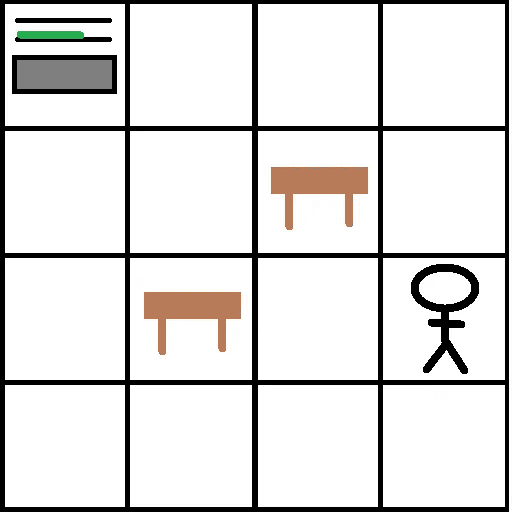
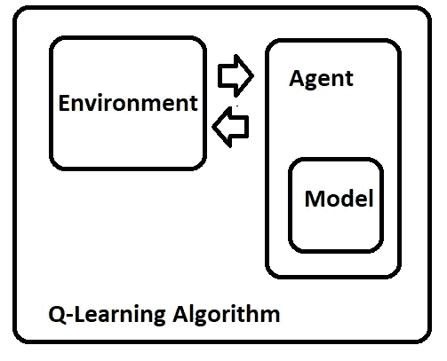
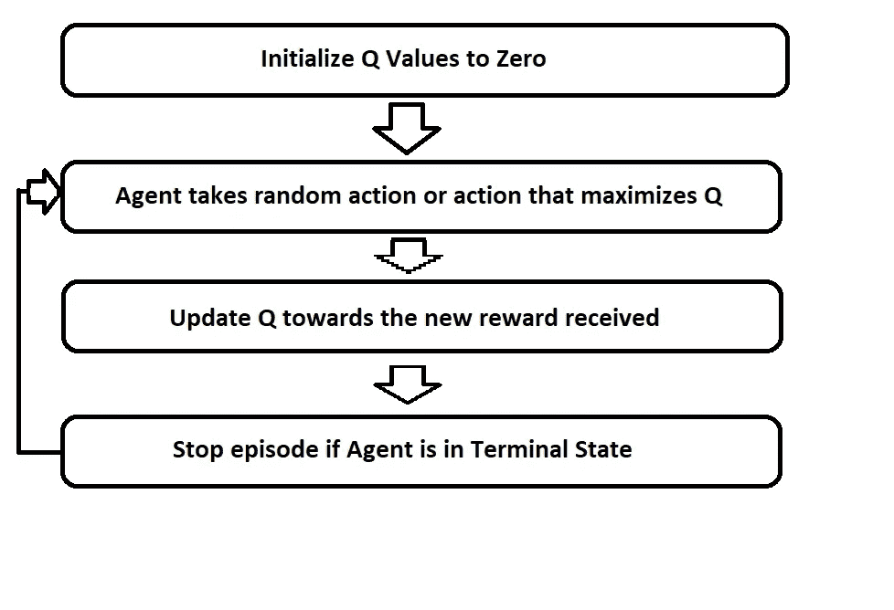
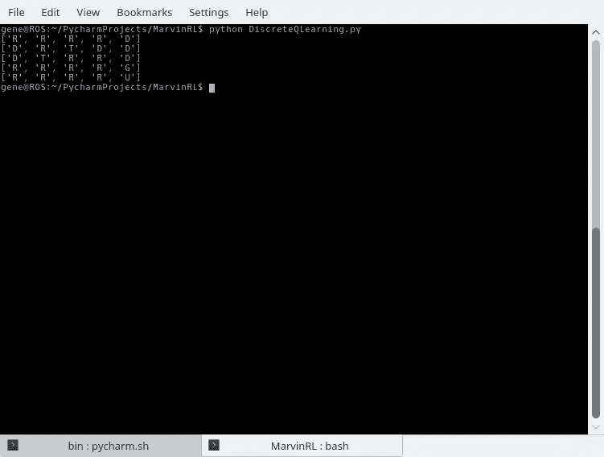

# 实用强化学习。四

> 原文：<https://medium.com/coinmonks/practical-reinforcement-learning-pt-4-76022bfab5d8?source=collection_archive---------3----------------------->

## 一个简单的实现

## 介绍

这篇文章是这个[系列](/coinmonks/practical-reinforcement-learning-pt-3-7dc614e850c9)的上一篇文章的延续。在本文中，我们将专注于构建一个简单的基于 python 的实现，实现到目前为止已经介绍过的思想。

## 问题是



Living Room

让我们来布置舞台。我们想教我们的机器人(位于左上角)在不撞到任何桌子的情况下找到它的主人(小简笔画)。为了简单起见，我们的机器人世界被分成格子，如果它和主人占据相同的格子，我们就认为它成功了。如果它和一张桌子占据同样的面积，我们会认为它是失败的。

现在，如果我们可以完全访问上面的地图，那么解决这个问题的显而易见的方法是使用一个路径查找算法(如前几篇文章中所提到的)，但是我们将假设代理对它所处的世界没有先验知识，并且将我们自己限制在使用到目前为止在第 1、2 和 3 篇文章中介绍的 RL 技术。

## 设计

一个好的起点是将问题分解成各个部分。我们将实施分为四个主要部分:

*   **环境**:代表代理将与之交互的世界。我们将它建模为一个 5x 5 的网格，其中“空白”空间是横向的，“T”空间是表格，“G”空间代表人。
*   **代理:**代表代理本身。这将接收当前状态(由环境产生)并输出要采取的下一个动作。
*   **模型:**代表代理的 Q 值函数。在我们的例子中，这将被表示为一个简单的状态动作对表，其中包含每个动作对的预期回报。其他更复杂的表示也是可能的，将在后面的文章中探讨。
*   **Q-Learning:**表示 Q-Learning 算法本身的容器。它管理学习过程和代理与环境之间的接口。



Q-Learning Design

好了，我们有了一个高级方法，我们可以构建一个简单的 RL 系统，让我们开始研究一些 python 代码。

## 环境

由于环境是任何 RL 问题的核心，我们将从构建代码开始。通常，我们的环境需要处理一些行为:

*   它需要跟踪模拟的当前状态(如果我们使用物理机器人，那么我们只需要跟踪那些与机器人传感器交互所需的状态)
*   它需要在代理和环境之间提供一个接口。代理需要能够执行操作并观察其当前状态。(就可观察到的状态而言)
*   我们需要一种方法来重置环境，以便我们可以运行另一个训练集。

出于我们的目的，我们将环境表示为一个五乘五的令牌矩阵，如前一节所述。我们通过下一个方法为代理提供一个到环境的接口。

下一个方法接受一个操作并输出一个填充了以下信息的元组:

*   **状态:**这将被表示为代理在世界上的当前网格坐标。
*   **动作:**这只是返回与提供的动作相同的动作。如果我们想用概率来模拟行为，这在以后会很有用。即机器人要求向上走，但实际上向左走了。在大多数用例中(包括概率性的，我们将忽略这一点)。
*   **奖励:**从环境中获得的奖励。在这个特定的环境中，击中桌子的奖励是-1，走过一个空格的奖励是-0.1，找到主人的奖励是 100。
*   **done:** 这标志着一集是否已经到达终止状态，例如，如果代理运行到一个表中，我们想要重置该集。

下面包含了实现该环境的 Python 代码。这个类中还包含了一个辅助函数“draw_self ”,以便于学习过程的可视化。

```
# Environment
# Observation:
#    state
#    action
#    reward
#    done
class Environment():

    # Encoding:
    # "*": agent position
    # " ": empty square
    # "T": Table
    # "G": Goal
    def __init__(self):
        self.agent_position = (0, 0)
        self.map = [
            [" ", " ", " ", " ", " "],
            [" ", " ", "T", " ", " "],
            [" ", "T", " ", " ", " "],
            [" ", " ", " ", " ", "G"],
            [" ", " ", " ", " ", " "]
        ]

    def draw_env(self):

        x = self.agent_position[1]
        y = self.agent_position[0]

        last_token = self.map[y][x]

        self.map[y][x] = "*"
        print '----------------------'
        for l in self.map:
            print l

        self.map[y][x] = last_token

    # get the token from the current position
    def get_token(self):
        x = self.agent_position[1]
        y = self.agent_position[0]

        return self.map[y][x]

    # reward mapping:
    #  " " ->  0
    #  "T" -> -1
    #  "G" -> +1
    def reward(self):
        token = self.get_token()

        if token == " ":
            return -0.1

        if token == "T":
            return -1

        if token == "G":
            return 100

        return 0

    # clamp a value between 0 and 4
    def clamp_to_map(self, value):
        if value < 0:
            return 0

        if value > 4:
            return 4

        return value

    # action:
    #   UP, DOWN, LEFT, RIGHT
    #   state_position, action, reward, done
    def next(self, action):

        start_position = self.agent_position

        x = self.agent_position[1]
        y = self.agent_position[0]

        # move the agent
        if action == "U":
            y = y - 1

        if action == "D":
            y = y + 1

        if action == "L":
            x = x - 1

        if action == "R":
            x = x + 1

        # clamp it to the environment
        x = self.clamp_to_map(x)
        y = self.clamp_to_map(y)

        self.agent_position = (y, x)

        # determine the reward
        reward = self.reward()

        # is episode complete ?
        token = self.get_token()
        done = (token == "G" or token == "T")

        return (start_position, action, reward, done)

    # sets the agent position back to (0,0)
    def reset(self):
        self.agent_position = (0, 0)
```

## 代理人

好了，是时候建立我们的代理了！在本文遵循的设计中，我们的代理负责接受环境的当前状态，并选择将要采取的下一步操作。

选择下一个行动会带来所谓的*探索*因素。正如在前面的文章中所解释的，这是一个介于 0 和 1 之间的值，表示代理将采取随机行动的可能性。用于该实现的方法将使该值从 1 开始，并在每次学习迭代后略微减少。鼓励读者尝试这个值，看看他们是否能得到更好的结果！

为了选择一个行动，我们需要对代理期望从环境中获得的回报进行建模。因为具有改变模型的灵活性是有帮助的，所以模型作为参数被接受。预计模型将公开一个*预测*方法，该方法接受当前状态并输出下一个动作。

代理对象的代码如下所示:

```
# Agent:
#   model as Model
#   state as State
#   exploration as Float
class Agent():

    # needs a model to represent the rewards
    def __init__(self, model, start_state, exploration):
        self.model = model
        self.state = start_state
        self.exploration = exploration

    # encoding
    #   0 <- UP
    #   1 <- RIGHT
    #   2 <- LEFT
    #   3 <- DOWN
    def get_action(self, action_id):
        if action_id == 0:
            return "U"

        if action_id == 1:
            return "R"

        if action_id == 2:
            return "D"

        return "L"

    def next_action(self, env):
        # test against the current exploration constant
        prob = np.random.random()
        action_id = None

        if prob < self.exploration:
            action_id = np.random.choice(4)
        else:
            action_id = self.model.predict(self.state)

        # get the action token
        action = self.get_action(action_id)
        observation = env.next(action)

        self.state = observation[0]

        # return the observation
        return observation

    def reduce_exploration(self):
        self.exploration = self.exploration ** 0.99
```

## 模型

对于这个问题，我们将保持模型尽可能简单。我们将把 Q 值表示为状态/动作对的表格。例如，如果代理在位置(0，0)，我们可以在表中有相应的 Q 值:

*   向上:0.0
*   左侧:0.0
*   右:0.4
*   向下:0.3

除了表示 Q 值之外，我们需要我们的模型能够根据已知的 Q 值和当前状态来预测最佳行动。这是通过选择使当前状态的值最大化的动作来完成的(如前几篇文章所建议的)。例如，基于上表，模型将预测向上的动作。

最后，我们需要模型能够自我更新。为此，我们将使用上一篇[文章](/coinmonks/practical-reinforcement-learning-pt-3-7dc614e850c9)中介绍的等式:

```
Q(s,a) = Q(s,a) + step_size * ( (R + gamma * Qmax(s1, a1) - Q(s,a) )
```

在下面的代码中，step_size 映射到 alpha，gamma 映射到 discount_factor。

该代码中还包含一个*策略*方法，用于帮助可视化模型在训练后产生的最终策略。

```
# Model
class Model():

    def __init__(self, discount_factor, alpha):
        self.discount_factor = discount_factor
        self.actions_options = ("U", "R", "D", "L")
        self.alpha = alpha
        self.Q = {}

        # initialize the actions for all states to zero
        for y in range(5):
            for x in range(5):
                state = (y, x)

                self.Q[state] = {}

                for a in self.actions_options:
                    self.Q[state][a] = 0

    def predict(self, state):

        actions = self.Q[state]

        max_key = None
        max_val = float('-inf')
        for k, v in actions.items():
            if v > max_val:
                max_val = v
                max_key = k

        return max_key

    def update(self, state, action, reward, state2, action2):
        lastQ = self.Q[state][action]
        self.Q[state][action] = self.Q[state][action] + self.alpha * (reward + self.discount_factor * self.Q[state2][action2] - self.Q[state][action])

        return np.abs(lastQ - self.Q[state][action])

    def policy(self, map):
        policy = []

        for y in range(5):
            l = []

            for x in range(5):
                action = self.predict((y, x))

                if map[y][x] != " ":
                    action = map[y][x]

                l.append(action)

            policy.append(l)

        return policy
```

## q 学习算法



Q-Learning

在下一段代码中，我们有 Q 学习算法本身。为简单起见，它被分成两部分。*插曲*方法是在环境中执行单个插曲，运行代理直到它到达终端状态，并在每个动作之后更新模型。

train_agent 迭代情节，直到 Q 值的变化足够低，或者模拟达到 1000 次迭代(设置这个硬上限是为了保证系统停止)。训练完成后，生成的策略输出到终端供用户检查。

```
def episode(agent, env):

    done = False

    state = (0, 0)
    observation = agent.next_action(env)
    action = observation[1]

    highest_delta = 0

    while not done:
        #  state_position, action, reward, done
        observation = agent.next_action(env)

        state2 = observation[0]
        action2 = observation[1]
        reward = observation[2]
        done = observation[3]

        delta = agent.model.update(state, action, reward, state2, action2)
        highest_delta = max(delta, highest_delta)

        state = state2
        action = action2

        if done:
            agent.model.Q[state][action] = reward

    return highest_delta

def train_agent(agent, env):
    done = False
    max_iterations = 1000
    i = 0

    while not done:
        change = episode(agent, env)
        env.reset()
        done = (change < 0.005)

        i = i + 1
        if i == max_iterations:
            done = True agent.reduce_exploration() policy = agent.model.policy(env.map)

    for l in policy:
        print l

if __name__ == '__main__':
    grid_world = Environment()
    agent_model = Model(discount_factor=0.98, alpha=0.1)
    agent = Agent(agent_model, (0,0), 1.0)
    train_agent(agent, grid_world)
```

## 讨论和结果



Output

以上是我们到目前为止的工作成果。我们可以看到，如果代理从位置(0，0)开始，我们的策略是一直向右移动，然后向下移动到目标。因为在我们当前的场景中，我们的代理总是从(0，0)开始，所以这是唯一相关的策略。

## 后续步骤

本文介绍了一个简单问题的非常基本的 RL 解决方案。到目前为止，尽管这个系列的标题，很难说有什么实用的东西。在接下来的几篇文章中，我将开始介绍我们可以将这里的想法扩展到可能在真实机器人上工作的方法。

在那之前，

分享享受！

> [直接在您的收件箱中获得最佳软件交易](https://coincodecap.com/?utm_source=coinmonks)

[](https://coincodecap.com/?utm_source=coinmonks)