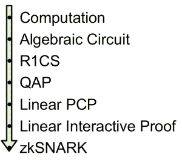

# 以太坊实用 ZK 音乐

> 原文：<https://medium.com/coinmonks/practical-zk-snarks-for-ethereum-140cbddcb55d?source=collection_archive---------1----------------------->


Artos Systems 的区块链开发人员 Alexandre 为您准备了一篇新的技术文章！

2018 年对于加密货币来说是艰难的一年。2017 年的平流层高度在 1 月份坠毁，一年内从未恢复。那是疯狂的一年，充满了 ico 和对区块链前线无限承诺的狂热。

但如果 2017 年是海市蜃楼和期望之年，2018 年则是反思或意识到工作仍有待完成的一年。这一年也取得了很多成就，现在远离了媒体的关注和兴奋的投资者的喧嚣。在以太坊方面，我们已经有了几项创新[](/@jjmstark/the-year-in-ethereum-87a17d6f8276)**，但一个主要话题是使用零知识技术进行扩展。这些目前有两种类型:**

*   **[*-*](https://eprint.iacr.org/2013/879.pdf)[*SNARKs*](https://github.com/scipr-lab/libsnark#references)，2013 年左右推出，并有众多研究者参与**
*   **ZK-斯塔克斯，[*2018*](https://eprint.iacr.org/2018/046.pdf)由伊莱-本-萨松和 [*他的团队*](https://www.starkware.co/) 推出。**

**Vitalik Buterin 本人一直是使用这项技术来提高以太坊网络吞吐量的热情支持者，ZCash 在 2018 年再次全面实施了 ZK-斯纳克法。**

**虽然加密社区已经讨论和研究这个概念好几年了，但在区块链地区我们才刚刚起步，仍然很难找到关于如何进入和使用这项技术的文档。有几个我特别喜欢的好参考:**

*   **[*ZCash 的博客*](https://z.cash/technology/zksnarks/)**
*   **克里斯蒂安·赖特威斯纳的[*ZK——一言以蔽之*](https://blog.ethereum.org/2016/12/05/zksnarks-in-a-nutshell/)**
*   **维塔利科关于 ZK 的 [*三贴系列*](/@VitalikButerin/zk-snarks-under-the-hood-b33151a013f6)-SNARKs**
*   **另一个 [*三柱*](https://vitalik.ca/general/2017/11/09/starks_part_1.html) 系列由维塔利克在 ZK-斯塔克斯**
*   **区块极客们的[*ZK 指南——SNARKs 和零知识通*](https://blockgeeks.com/guides/what-is-zksnarks/)**

**我以前在这个博客中写过关于 STARKs 的文章，主要是作为 Vitalik 帖子的个人学习指南。这篇文章是我关于 ZK-斯纳克的第一篇文章，来自一个不同的角度:它讲述了我去战壕的经历，并实际实现了该技术的一个工作原型。**

# **从哪里开始？**

**上述参考资料很好地引导读者了解了 ZK-斯纳克理论中涉及的几个不同概念:什么是零知识(ZK)，什么语句可以在 ZK 得到证明，什么是 NP 语言和决策问题，椭圆曲线密码学，椭圆曲线上的配对以及从语句到 ZK-斯纳克的整个 [*流程。*](/@VitalikButerin/quadratic-arithmetic-programs-from-zero-to-hero-f6d558cea649)**

**读完所有这些之后，我相信我能理解其中的数学原理(尽管不能同时把它们都记在脑子里)，但是有一个基本问题仍然没有解决。我从哪里开始？我如何证明我想要证明的东西？**

**这几乎就像有人在你面前手工组装了一辆汽车，告诉你可以把它带到任何你想去的地方，但没有给你钥匙。点火不足。**

**问题是你不能只为你想要的任何程序做一个标记，你只能以一种非常特殊的格式将它们与*电路一起使用。***

****

**这些参考资料并没有告诉你如何去那里。他们要么会向你展示一个非常简单的计算，可以毫不费力地转化为一个代数电路，要么他们会完全忽略这个问题。当需要证明一个简单的陈述时，像这样**

> ***“我，证明者，知道一个前像 s，使得 Hash(s) = H，其中 H 是公知的”，***

**我只是不知道如何开始写必要的相应电路。**

**这也不是我的错。Zerocash 的作者(同样是 Eli Ben-Sasson 和 Alessandro Chiesa 等人)在一篇 [*深刻的技术论文*](http://zerocash-project.org/media/pdf/zerocash-extended-20140518.pdf) 中详细说明了他们是如何为加密货币中使用的 ZK-斯纳克构建电路的。这是由几个不同的组件组成的，其中一个是计算单个哈希的电路(技术上来说，是 SHA256 的*哈希压缩函数)，它需要将近 28000 个代数门！这个*不是*你想用手做的事情。***

*当我到了这个阶段，有一件事变得很清楚:我们需要一个工具来生产电路。撰写 Zerocash 论文的同一个团队还制作了一个 C++库来创建电路，名为 [*Libsnark*](https://github.com/scipr-lab/libsnark/) 。然而，进入的门槛太高了。为了快速生产出 ZK-斯纳克原型，我需要别的东西。而那个东西原来已经存在: [*ZoKrates*](https://github.com/Zokrates/ZoKrates) 。我再次感谢一个非常有用的 [*教程*](https://github.com/jstoxrocky/zksnarks_example) ，它指导我如何使用它。*

# *[ZoKrates](https://github.com/Zokrates/ZoKrates)*

*ZoKrates 是一个在 Libsnark 和人类理解之间架起桥梁的工具。它通过提供一种简单的语言来编写函数，然后将它们翻译成电路，从而使 ZK-斯纳克的建筑变得易于使用。文档不是很好，事实上，它非常稀疏，但给了你一些基础知识。*

*另一方面，有大量的 [*示例*](https://github.com/Zokrates/ZoKrates/tree/develop/zokrates_cli/examples) 向您展示 ZoKrates 语言的所有功能。ZoKrates 只有两种实数类型:固定素数域的数字(`field`)和这些数字的有限大小数组(`field[n]`)。它有能力评估条件，这些条件本身是布尔型的，但是不能赋给任何变量。*

*记住一件事。`field` 的元素看起来像整数，但是有一个基本的区别:它们是字段`Zp`的成员，其中`p`是一个 254 位的素数。我们唯一可以使用的数字是在`0`和`p-1`之间(包括在内)。*

*在编程语言中，用来表示一个数的位数受到限制是很正常的。但通常，我们可以使用任何给定大小的字(例如 Solidity 的`uint`中的 256 位，C#的`int`中的 32 位)。佐克拉特不一样。所有的算术都是计算出来的`modulo p`，因为这是一个质数，所以不可能是 2 的幂。因此，有许多限制大小(254 位)的数字不是组的一部分，因此不能使用。不要对此感到不安，以太坊中的 ZK-斯纳克有一个特定的格式，需要在这个领域进行计算，因此这种类型是一个最佳的表示。事实上，素数`p`被选择为以太坊的 EIP197 所使用的组的顺序，这使得以太坊能够执行和调用智能合约中的配对。*

*ZoKrates 的主要目标是在一个模域中实现一些算术计算的验证。这是有趣的部分:在任何时候，我们都可以使用这种格式来验证等式*

```
*a == b*
```

*这就像断言一样:如果等式失败，程序将中止。因为我们想构建 ZK-斯纳克，大多数情况下我们会编码谓词，即评估为真或假的函数。这个 ZoKrates 习语是写一个断言，我们想要证明什么，并立即遵循它*

```
*return 1*
```

*不等式更加困难，效率也低得多，因为它们明显增加了电路中的门的数量。要断言两个值是不同的，我们可以用这个习语:*

```
*0 == (if a == b then 1 else 0 fi)*
```

*也就是说，如果`a == b`那么 if 的结果是`1`，并且断言失败。否则，结果为`0`，断言成功。*

*下面是一个非常简单的例子，说明证明者知道某个数的因式分解:*

```
*// a and b are factorization of cdef main(field c, private field a, private field b) -> (field):field d = a * bc == dreturn 1*
```

*就我的兴趣而言，ZoKrates 最好的一点是计算 SHA256 散列函数的能力。这使得证明知道给定散列的前映像变得非常容易:*

```
*import "LIBSNARK/sha256packed" 
def main(private field a, private field b, private field c, private field d, 
field v0, field v1) -> (field):h0, h1 = sha256packed(a, b, c, d)v0 == h0
v1 == v1return 1*
```

*ZoKrates 的一个优点是它不局限于谓词:您可以进行普通的计算，如乘法、求和等，并返回结果。这甚至可以由一种以上的元素组成。*

# *佐克拉特流动*

*ZoKrates 管道有几个阶段是我们通常想要做的。它们从最初的功能到证明验证。这些包含在以下命令中。*

*   ***编译**:生成原函数的电路。这将返回两个文件，以二进制和人类可读的形式指定电路。要小心，这些文件可能很大。*
*   ***设置**:生成该电路的验证密钥和验证密钥。它们只需要生成一次，但是该过程是伪随机的，如果重复，将会产生不同的值。*
*   ***compute-witness**:ZK-斯纳克证明断言证明者知道一些满足原始函数的私人信息。这个私人信息被称为*证人*，因此，每个证人都有不同的证据。证人在被 ZK-斯纳克使用之前必须被编码，这项工作在这里完成。因此，在生成证明之前需要这一步。*
*   ***防生成**:这是 ZoKrates 流程的最后一步。它使用前一步的证明密钥和见证编码生成一个证明。*
*   ***export-verifier** :这是一个可选步骤，创建一个可靠性契约来验证证据。当然，在全流程中，拥有某种类型的验证器是很重要的，而且 ZoKrates 创建了一个在链上运行的验证器也很棒。但是这很慢，如果你只想独立于以太坊创建一个 ZK-斯纳克，你可以用另一种语言写一个验证器。这需要使用适当的库来计算椭圆曲线对，并不是所有的加密库都可以做到这一点(这将在以后的另一篇文章中讨论)。*

*ZoKrates 是一款非常好的软件，但仍处于开发阶段。例如，文档中没有提到任何关于命令行参数的内容，我必须在源代码中找到这些信息。通过这样做，我还了解到 ZoKrates 支持两种 ZK-斯纳克，并且您有一个命令行选项来指定您想要使用哪一种:Pinnochio 协议( [*PGHR13*](https://eprint.iacr.org/2013/279.pdf) )和 Groth-Maller 构造( [*GM17*](http://chrome-extension//oemmndcbldboiebfnladdacbdfmadadm/https://eprint.iacr.org/2017/540.pdf) )。这可以通过命令`setup`、`export-verifier`和`generate-proof`的选项`-b`来指定。*

*其他主要命令选项包括:*

*   ***编译-输入-输出**:指定输入输出路径。*
*   ***setup -i -p -v -m** :指定输入、证明密钥、验证密钥和元信息的路径。*
*   ***export-verifier -i -o** :指定输入输出路径。*
*   ***compute-witness -i -o -a** :输入输出路径同上；原始函数的公共和私有参数的以空格分隔的列表，这些参数组成见证。*
*   ***生成-证明-w -p -j -i** :证人路径、证明密钥、证明和元信息。*

# *表演*

*在我的第一次尝试中，ZoKrates 非常容易使用。如果你不指定任何路径，文件将被创建并从它们的默认位置读取，一切都将顺利进行。原始函数的语言很简洁，可能有点困难，但是我的例子非常简单。几分钟后，我已经生成了一个证明，并用生成的合同进行了验证。*

*然后我把验证器移植到 Python，用 [*py_pairing*](https://github.com/ethereum/py_pairing/tree/master/py_ecc/optimized_bn128) 然后 C++，用 [*libff*](https://github.com/scipr-lab/libff/tree/master/libff) 。我向三个人核实了同样的证据。Python 版本是最慢的。在我的特定计算机上，对于我的特定功能，大约需要 4 秒钟。固体版本大约是 2 秒。我实现了 C++版本，试图提高速度，我没有失望:我把它降低到了大约 40 毫秒。*

*根据操作的不同，电路和证明的生成时间在 5 到 15 秒之间。密钥和证明的大小是最大的惊喜:在我的例子中，证明密钥非常大，对于一个简单散列的验证有 32Mb。验证两个散列产生了大约 65Mb 的证明。*

*我还简要探讨了这种结构的可伸缩性。研究结果支持了学术论文的预测:证明大小和验证密钥的大小；并且验证时间实际上不随不同的电路而改变。另一方面，证明密钥的大小似乎与门的数量成线性比例，生成电路和见证的时间也是如此。生成证据的时间似乎没有变化。*

*以上的价值观让我觉得 SNARKs 很适合在聚光灯下使用。验证可以很快完成，虽然证明生成相对较慢(如果每个事务只需要做一次就可以了，但如果一个事务需要很多证明就不行)，但关键是它只做一次，大多数操作都是验证。*

*总的来说，我和 ZoKrates 在一起很开心。它使用方便，可以帮助你有 ZK-斯纳克运行和在一个上午。考虑到这个概念背后的数学是多么令人生畏，我非常高兴地感到惊讶，我相信这将有助于使 ZK-斯纳克成为主流。这是一次非常有益的探索。*

*我希望你和我一样对零知识辩论感兴趣，并决定尝试一下 ZoKrates。如果你需要任何帮助，你可以随时联系我。欢迎评论，如果你喜欢这个帖子，请在下面说出来，并与他人分享。*

*下次再见，在区块链开发领域的又一次冒险。*

**

*Alexandre Pinto — Blockchain developer at Artos (Aventus Ecosystem Party)*

*Alex 是我们生态系统合作伙伴 Artos 的软件工程师，在区块链工程团队工作。他拥有 20 年的技术工作经验，完成了计算机科学博士学位和密码学博士后学位。作为研究的一部分，Alex [发表了关于 Kolmogorov 复杂性、密码学、数据库匿名化和代码混淆的论文](https://www.researchgate.net/profile/Alexandre_Pinto2)。*

*Pinto 还花了七年时间在 Maia 大学学院讲课，包括指导计算机科学和信息系统与软件学士学位课程。*

*这篇文章最初发表在[的博客](http://coders-errand.com/practical-zk-snarks-for-ethereum/)上。还有，你可以关注亚历克斯的推特账号——@ alexMirPinto。*

*既然你在这里，我们希望你能在 [**【电报】**](http://bit.ly/2A343qG)**[**Reddit**](http://bit.ly/2MExLop)**[**Twitter**](http://bit.ly/2Rlv5Nf)**[](http://bit.ly/2WrJLhH)****[**Youtube**](http://bit.ly/2HE6fZw)***********

*******我们还为开源开发人员/票务开发人员和票务专业人员创建了一个小组，并邀请您在此加入— [区块链上的票务](http://bit.ly/2G65ohO)。*******

> *******[直接在您的收件箱中获得最佳软件交易](https://coincodecap.com/?utm_source=coinmonks)*******

*******[](https://coincodecap.com/?utm_source=coinmonks)*******