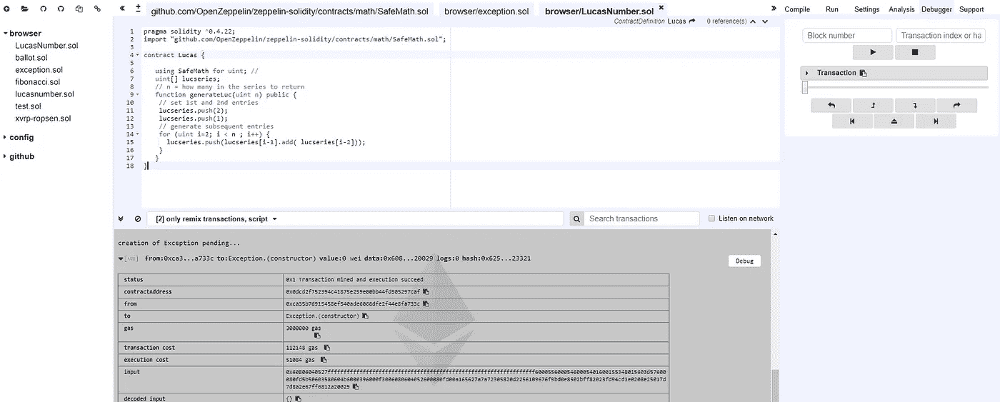
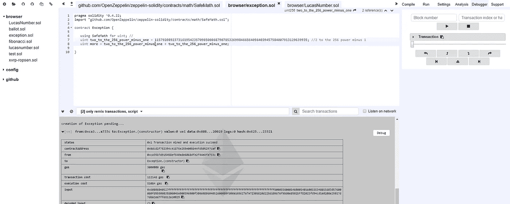

# 使用 Solidity 和 Openzeppelin 实践智能合约的安全数学

> 原文：<https://medium.com/coinmonks/practicing-safemath-with-solidity-and-openzeppelin-cde4cba9ce39?source=collection_archive---------0----------------------->


View of Navy Pier from the Distributed Confrence

在我开始学习更多关于分布式账本技术的时候，我遇到了 Solidity，但后来我试图查找其他智能契约语言，如 Viper 或 LLL。我对这个断言大错特错，因为这个领域的真正领导者是 Solidity，它与 Javascript 紧密结合。所有的 EVM 语言要么是原型，要么是废弃的原型。LLL 作为编译目标会很有用，因为它非常接近机器码(在这方面它实际上让我想起了 prescheme)。

这是我第二个真正的 Solidity 程序，我没有使用 inherits。我在做下面的教程(我推荐的)来自[http://truffle framework . com/tutorials/debugger-variable-inspection](http://truffleframework.com/tutorials/debugger-variable-inspection)。在本教程中，他们回顾了斐波那契数列。我想我也会尝试尝试类似的项目。在不知道如何在 Solidity 中编写阶乘函数之后，我决定尝试编写一个计算 Lucas 数的程序。

首先回忆一下斐波那契数列(1，1，2，3，5…)。这个数列是如何产生的，你把最后两个数相加，得到下一个数。一个区别是前两个数字都是 1。卢卡斯数字是一个类似于斐波那契数字的整数序列，除了起始数字是$L_1 = 2$和 L_2+1。这就给出了卢卡斯数(2，1，3，4，7…)。

```
pragma solidity ^0.4.22;contract Lucas {uint[] lucseries; // n = how many in the series to return
  function generateLuc(uint n) public { // set 1st and 2nd entries
    lucseries.push(2);
    lucseries.push(1); // generate subsequent entries
    for (uint i=2; i < n ; i++) {
      lucseries.push(lucseries[i-1] + lucseries[i-2]);
    } }}
```

这实际上是一个玩具实现。如果我们想正确地练习 safemath，我们真的需要分析程序并在需要的地方应用它。现在，既然我们知道卢卡斯数列类似于斐波那契数列，它会增加(除了我们忽略的第一个数字)，我们必须使用 Safemath 将智能合约中的加法替换为加法。下面是相同的程序，但使用的是 safemath 库。

```
pragma solidity ^0.4.22;
import "github.com/OpenZeppelin/zeppelin-solidity/contracts/math/SafeMath.sol";contract Lucas {

   using SafeMath for uint; // 
   uint[] lucseries;
   // n = how many in the series to return
   function generateLuc(uint n) public {
    // set 1st and 2nd entries
    lucseries.push(2);
    lucseries.push(1);
    // generate subsequent entries
    for (uint i=2; i < n ; i++) {
      lucseries.push(lucseries[i-1].add( lucseries[i-2]));
    }
   }
}
```

现在，当我们想要计算一大串卢卡斯数时，我们得到了一个异常。注意，我在这里没有用 add 来做减法，因为这不会触发下溢，但是由于程序设计的原因，我们可以触发上溢。读者可以做一个练习，看看运行上面的程序会发生什么，以及它是如何抛出异常的？我知道人们实际上讨厌锻炼，所以实际上发生的是它不会溢出。这真的让我大吃一惊，但它似乎在 Javascript 模拟器中给出了一个错误“无效操作码”。所以程序在第 111 次迭代时失败。



Computation of the Lucas Number in Solidity fails at the 111th iteration

为了查看 safemath 触发异常时实际发生了什么，让我们在一个简单的智能合约中添加两次 2 ⁵⁶-1。

```
pragma solidity ^0.4.22;
import "github.com/OpenZeppelin/zeppelin-solidity/contracts/math/SafeMath.sol";contract Exception {

   using SafeMath for uint; // 
   uint two_to_the_256_power_minus_one = 115792089237316195423570985008687907853269984665640564039457584007913129639935; //2 to the 256 power minus 1
   uint more = two_to_the_256_power_minus_one + two_to_the_256_power_minus_one;

}
```

在这里，我们得到了我们所希望的例外！



Practicing Safemath and getting the exception you desire.

我们希望触发这个异常，而不是整数下溢，因为这可能会导致真正的安全缺陷，并花费您大量的金钱。

请注意，我使用的语法只有在 Remix 中才能找到。当在一个非混合的智能合同中使用它时，你需要通过一个相对包含来包含文件，它不接受 URL。

无论如何，我希望你发现这篇博文非同寻常。想看更多就跟我来！我接下来的博文将围绕开发 ICO 原型展开，敬请关注！

如果你想把 ETH 捐给我，你可以通过以下地址:

**0x 3d krzvdjxaanbmnjidvr 5 ronjt 9 hkplxn**