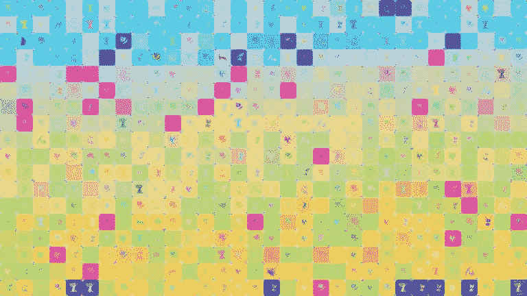
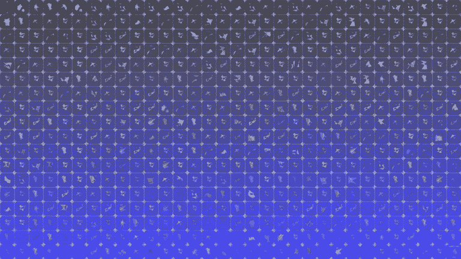
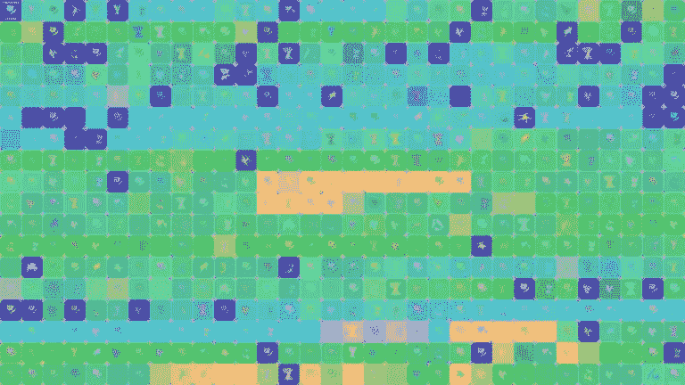
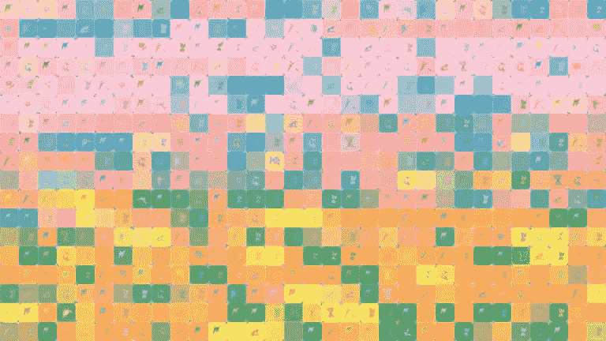
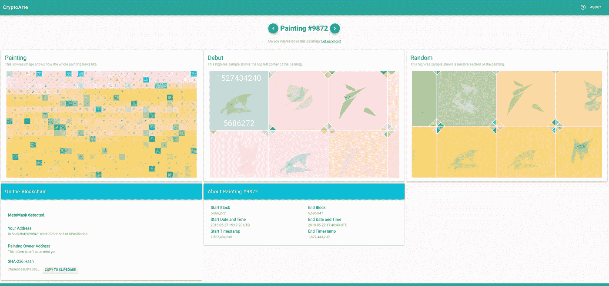

# 发射前加密

> 原文：<https://medium.com/coinmonks/pre-launching-cryptoarte-56c967bcf2e9?source=collection_archive---------3----------------------->

CryptoArte — Painting #2985

## 以太坊艺术收藏&不可替代的代币

***TLDR:****crypto arte 系列将以太坊区块链的历史投射成 9895 幅丰富多彩、独一无二、意味深长的画作。您可以在我们的* [*OpenSea 店面*](https://opensea.io/category/cryptoarte) *，* [*购买上市前的画作，在 cryptoarte.io 网站*](https://www.cryptoarte.io) *浏览收藏，并在 etherscan* *上查看* [*智能合约。*](https://etherscan.io/address/0xbace7e22f06554339911a03b8e0ae28203da9598)

继我之前关于以太坊开发的中型帖子之后，今天我非常兴奋地分享我已经工作了几个月的一个项目:

> [CryptoArte](https://www.cryptoarte.io) — *一个融合了以太坊网络、艺术收藏、不可替代的代币和去中心化应用的多学科项目*。

让我们来分析一下！

## 以太艺术

CryptoArte 收藏目前包括 9895 幅可证明是独一无二的画作。每幅画都代表了以太坊区块链 576 个连续的街区，通过形状、颜色、装饰等有意义的组合。

例如，[绘画#0](https://www.cryptoarte.io/paintings/0) 是从 0 块(以太坊创世纪块)到 575 块的艺术表现。[画#1](https://www.cryptoarte.io/paintings/1) 从块 576 到块 1151，等等。这是 0 号画作的低分辨率图像:

CryptoArte — Painting #0

这些画配有 7680 x 4320 像素的数字图像(或 8K UHDTV 分辨率，也称为 4,320p)，既可以高分辨率打印，也非常适合显示器和电视。画主可以从 [cryptoarte.io](https://www.cryptoarte.io) 网站免费下载自己对应的数字图像。该网站还允许所有者订购高质量的，签名和加框的，准备挂 18x12 的印刷品。

这里是[画 80 号](https://www.cryptoarte.io/paintings/80)，这里发生了第一次以太坊交易:

CryptoArte — Painting #80

这些画将 576 块积木分成 18 排，每排 32 个连续的积木。第一个和最后一个块用它们相应的块号和时间戳来修饰。所有其他块由 4 个角三角形装饰，作为一种“安全标志”，同时给绘画带来一种玻璃或节点/网络效果。

这里是[画#2488](https://www.cryptoarte.io/paintings/2488) :

CryptoArte — Painting #2488

块挖掘器通过每个块中的形状或图标来表示。它们的形状是独一无二的(即:没有两个矿工会有相同的图标)，并在整个系列中保持不变。

这里是[画#7934](https://www.cryptoarte.io/paintings/7934) :

CryptoArte — Painting #7934

这些画是通过对公开的以太坊区块链信息进行数学转换而创作的。变换是确定的，对所有的画都一样。这是[的画#8118](https://www.cryptoarte.io/paintings/8118) :

CryptoArte — Painting #8118

因此，该系列通过设计几个数据点和统计数据(例如:交易金额、区块矿工等)来展示以太坊区块链的历史。)变成五颜六色的画。前往[关于页面](https://www.cryptoarte.io/about)了解更多关于该系列的信息。

## 不可替换的令牌

CryptoArte 也是以太坊不可替代令牌( [ERC721](http://erc721.org/) )。每个发行的令牌代表一幅独特的画，并与存储在区块链上并显示在 CryptoArte 网站上的该画的 SHA-256 散列相匹配。

实现完整的 ERC721 标准并将绘画的哈希存储在区块链上为绘画所有者提供了许多好处，包括:

*   **无信任所有权**:所有者拥有分散的、自动的、不可改变的和不可审查的所有权记录。
*   **真实性验证**:给定一幅画的全分辨率图像，所有者可以通过简单地重新计算其哈希并将其与链上存储的哈希进行比较来独立证明其真实性。
*   **转让机制**:所有者可以通过许多支持 NFTs 的交易所和市场，例如 [OpenSea](https://opensea.io) ，轻松出售和转让其画作的所有权。

为透明起见，您可以在 etherscan 上读取经过验证和发布的 CryptoArte [不可替代令牌智能合约代码。](https://etherscan.io/address/0xbace7e22f06554339911a03b8e0ae28203da9598)

## 网站和分散应用

CryptoArte 网站允许您[浏览整个系列](https://www.cryptoarte.io/)。

每幅画都有自己的页面，有三个公共图像版本:整幅画的低分辨率图像、画左上角的高分辨率图像和随机部分的高分辨率图像。这是第 9872 号画作的样子:

CryptoArte.io — Painting Page example

网站也是集成了 web3 和 MetaMask 的以太坊 Dapp。

这种集成允许安装了 MetaMask 的所有者安全地**免费下载他们画作的全分辨率图像**，只需签署一项交易。此外，**画作所有者还可以订购高质量的、签名的、加框的和准备悬挂的版画**，这使得加密收藏品更加有价值，因为它从数字世界跨越到了物理世界。

## 上市前销售

在预发布期间，我们将在 [OpenSea 店面](https://opensea.io/category/cryptoarte)提供特定的代币和绘画供购买。在那里，你可以立即以报价购买画作，或者根据自己的选择出价购买。

如果你想购买一幅尚未创作的画，只需[告诉我们](mailto:hello@cryptoarte.io)。

## 什么来了

在接下来的几周内，我们将致力于进一步自动化和完善我们的流程，为 CryptoArte 网站添加更多功能，铸造更多代币，并使购买过程更简单，更普遍。

我们也可能会举办一些赠品和/或竞赛。确保[在 Twitter](https://twitter.com/cryptoarte) 上关注我们，[在脸书](https://fb.me/cryptoarte)上关注我们，或者[加入我们的 Discord chat](https://discord.gg/kwbRuwf) 以获得 CryptoArte 的最新消息！

## 问题

如果您对我们有任何问题，请在 [hello@cryptoarte.io](mailto:hello@cryptoarte.io) 给我们留言，或前往我们的 Discord 聊天室。

**感谢阅读！如果你喜欢 CryptoArte，请为我们鼓掌并分享给你的朋友来支持这个项目:)**