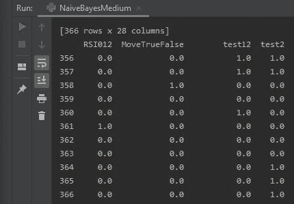
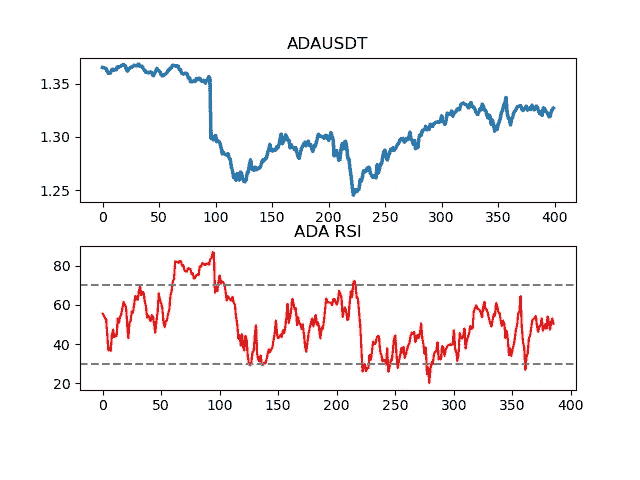
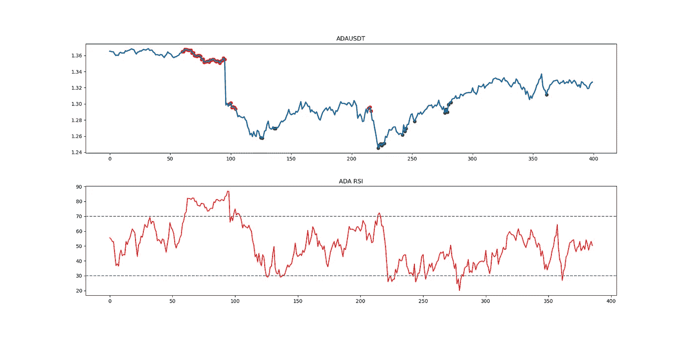
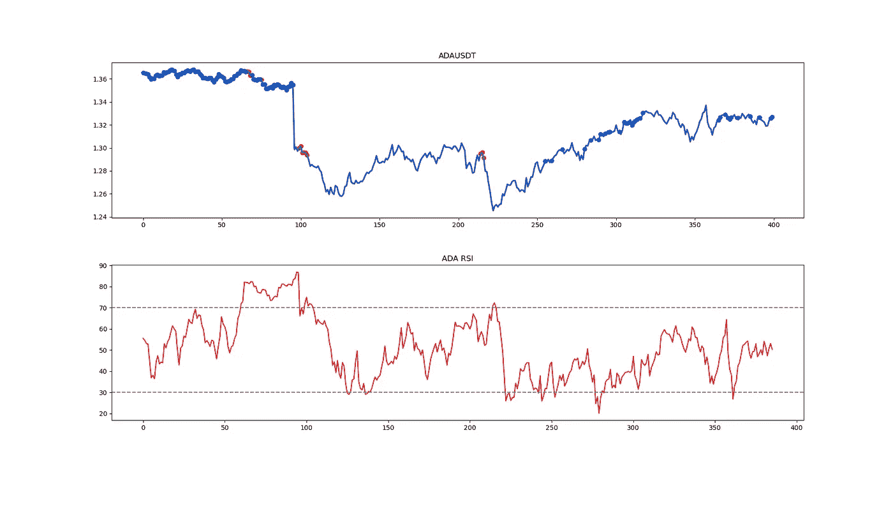
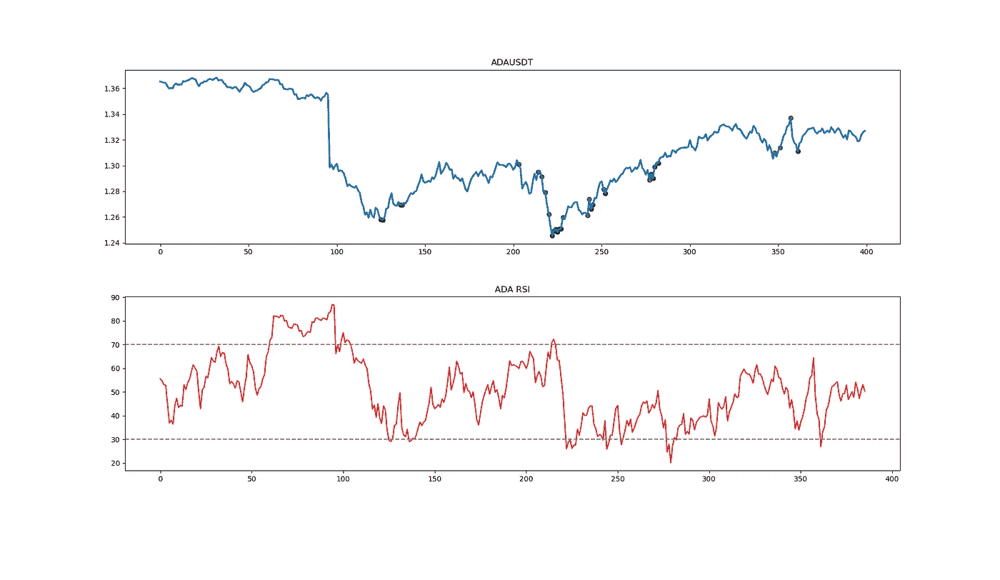
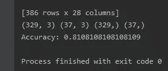

# 用朴素贝叶斯预测密码市场

> 原文：<https://medium.com/coinmonks/predict-crypto-market-with-naivebayes-49e8caa7d088?source=collection_archive---------1----------------------->

比特币的下一个价格会是多少？我真的不在乎:)任何算法也不在乎。更重要的是市场下一步会在哪里上涨、下跌还是保持中立？！

我测试的大多数算法都是根据过去的价格来预测未来的价格，作为一个长期交易者，我可以肯定这对一些交易者来说就像是眼里的沙子，给了他们一个不容易预测的东西的希望。


Photo by [Jeremy Bezanger](https://unsplash.com/@jeremybezanger?utm_source=medium&utm_medium=referral) on [Unsplash](https://unsplash.com?utm_source=medium&utm_medium=referral)

# 跳出框框思考！

如果我有不同的想法，愿意让未来的预测价格更像数字 0，1，2 呢？我知道这对你来说没什么好激动的。现在我可以说，0 表示市场中性，1 表示市场看涨，2 表示市场看跌。

这篇文章是临时写的，我还不知道最后的结果会是什么。也许我找到了圣杯，或者只是在浪费时间。

# 数据准备

对于数据，我使用我自己的数据库，通过套接字从币安存储，因为我认为它更适合一些公共的。主要原因是我正在收集更详细的数据，这些数据应该是(我希望)做出预测的关键优势。

使用 websocket 将数据记录到币安，并存储到 MongoDB。这是我调用它的那部分代码:

```
#Details to connect to DB - you can use mysql, csv, yfinance or any other I am using MongoDB
from mongo.mongodb import DBConnection
import pymongo
import pandas as pd
#Load dataset

login = DBConnection().login()
db_login = login["binance_24hTicker"]["ADAUSDT"]
the_list2 = []
get_all_data_from_token2 = db_login.find().sort('_id', pymongo.DESCENDING).limit(400)
for last_values_fromDb2 in get_all_data_from_token2:
    the_list2.append(last_values_fromDb2)

df = pd.DataFrame(the_list2)
print(df)
```

[](https://tokensquant.medium.com/store-binance-socket-data-mongodb-450781809bac) [## 将币安套接字数据存储到 mongoDB

### SQL 很好，对于与 db 交互的较大群体来说，可能是 Mongo 的更好选择。就一次我去了…

tokensquant.medium.com](https://tokensquant.medium.com/store-binance-socket-data-mongodb-450781809bac) 

所有数据都更改为 0，1，2 值后，DF 如下所示:



除了标准的 OHLC 数据量，我还记录了一些额外的深度，更详细的数据量等。虽然我喜欢在这些阶段分享很多东西，但一些详细的数据和公式，我是如何计算的，将在下一篇文章中讨论。

经过几次测试、思考、奋斗、发展、教育……我的想法是 DF 中的每一行都应该是独立的值——意思是适合朴素贝叶斯。比如说。上午 11:00:01 的数据是一个无名氏，有参数。他最后一分钟的移动是 0，1 或 2。意思是 0 =不移动，1 =向下移动，2 =向上移动。在这些点上，算法不需要知道它移动了多少，只需要知道它确实移动了。朴素贝叶斯不是那种可以预测移动的算法。因此，数据的管理方式如下:

> ***秒杀:*真为 0，假为 1**
> 
> ***基于上次收盘移动:*0 =无，1 =向下，2 =向上**
> 
> ***RSI:* 30 = 0，30–70 = 1，70+= 2**
> 
> ***音量:*0 =不变，1 =低，2 =高**
> 
> ***选择的符号是:* ADAUSD**

```
import talib
def RSI(data, window=14, adjust=False):
    delta = data['Close'].diff(1).dropna()
    loss = delta.copy()
    gains = delta.copy()

    gains[gains < 0] = 0
    loss[loss > 0] = 0

    gain_ewm = gains.ewm(com=window - 1, adjust=adjust).mean()
    loss_ewm = abs(loss.ewm(com=window - 1, adjust=adjust).mean())

    RS = gain_ewm / loss_ewm
    RSI = 100 - 100 / (1 + RS)

    return RSI

reversed_df = df.iloc[::-1]
df["RSI"] = talib.RSI(reversed_df["Close"], 14)

import matplotlib.pyplot as plt
ax1 = plt.subplot2grid((10, 1), (0, 0), rowspan=4, colspan=1)
ax2 = plt.subplot2grid((10, 1), (5, 0), rowspan=4, colspan=1)
ax1.plot(df['Close'], linewidth=2.5)
ax1.set_title('ADAUSDT')
ax2.plot(df['RSI'], color='red', linewidth=1.5)
ax2.axhline(30, linestyle='--', linewidth=1.5, color='grey')
ax2.axhline(70, linestyle='--', linewidth=1.5, color='grey')
ax2.set_title('ADA RSI')

plt.show()
```



为了使我的 0，1，2 点可视化，下面的图表将向你展示我是如何想象它们的。红色表示 RSI 高于 70，在我的 DF 中记为 1，绿色表示 RSI 低于 30，在 DF 中记为 2，所有其他值为 0，表示 RSI 在 30-70 之间(不在图表上)。



RSI with marings of values above 70 and bellow 30

好吧，我们要去一个地方。免责声明:在我的图表上，仅从低于 30 的绿点或 RSI 水平交易看起来是成功的，事实比这更复杂。

让我们在图表上绘制一些额外的数据，就像体积一样。又是 0 正常，1 低，2 高。这个想法是计算平均值，从 10%到 90%都是 0 为正常，0-10 为低，90-100 为高。公式是这样的:

```
df["VolumePercent"] = (df["Volume"] / df["Volume"].sum()) * 100
```

在我们计算出每一行的百分比后，是时候对它们进行正确排序，然后将前 10%(红色)和后 10%(紫色)相加:



经过一些测试，挖掘，计算，一些有趣的东西出现了。在下面的第一张图中，蓝色散点图显示了成交量低于 10%的区域，红色仍然显示了 RSI 突破 70 的位置。这两者的结合似乎是一个很好的切入点。意义。不要真的只是在相对强弱指标达到 30 就交易，而是等待合适的时机，也许合适的时机与交易量相结合(有待测试)。



现在我真的感到很兴奋，从这些图表中，我更接近结合两个指标预测进入。将它们更改为 0、1、2 级看起来效果不错。现在是测试 NB 和他的准确性的时候了。

```
# Split dataset into training set and test set
x = df[["BuyCount012", "SellCount012", "test1"]].astype(int)
y = df["RSI012"].astype(int)

X_train, X_test, y_train, y_test = train_test_split(x, y, test_size=0.2) # 70% training and 30% test
print(X_train.shape, X_test.shape, y_train.shape, y_test.shape)

#Create a Gaussian Classifier
gnb = GaussianNB()

#Train the model using the training sets
model = gnb.fit(X_train, y_train)

#Predict the response for test dataset
y_pred = gnb.predict(X_test)

# Model Accuracy, how often is the classifier correct?
print("Accuracy:",metrics.accuracy_score(y_test, y_pred))
```

初步数据的最终结果看起来很有希望，高达 81%！



NaiveBayes

# **结论**

工作还没有完成，看起来只是一些有希望的结果的开始。下一个阶段是回溯测试，也就是动态测试，修改收集的数据并找出关键数据。

请继续关注更新，如果你有什么想法/意见，请联系我！

> 谢谢你没有保存我的上一个版本。给自己一个提示——总是在本地保存一份副本。由于文章是重做的，一些丢失的数据对不起读者！！

**鼓掌！**

**关注**了解更多！

> 加入 Coinmonks [电报频道](https://t.me/coincodecap)和 [Youtube 频道](https://www.youtube.com/c/coinmonks/videos)了解加密交易和投资

## 也阅读

[](/coinmonks/leveraged-token-3f5257808b22) [## 杠杆代币[多头代币]终极指南

### 杠杆化令牌是具有杠杆化风险敞口的 ERC20 令牌，不考虑保证金、要求、管理…

medium.com](/coinmonks/leveraged-token-3f5257808b22) [](https://blog.coincodecap.com/crypto-exchange) [## 最佳加密交易所| 2021 年十大加密货币交易所

### 加密货币交易所的加密交易需要了解市场，这可以帮助你获得利润。之前…

blog.coincodecap.com](https://blog.coincodecap.com/crypto-exchange) [](https://blog.coincodecap.com/best-swap-platforms) [## 2021 年最佳加密交换平台| CoinCodeCap

### 编辑描述

blog.coincodecap.com](https://blog.coincodecap.com/best-swap-platforms) [](/coinmonks/top-5-crypto-lending-platforms-in-2020-that-you-need-to-know-a1b675cec3fa) [## 2021 年最佳加密借贷平台| 6 大比特币借贷平台

### 获得比特币和其他加密货币的最佳贷款利率

medium.com](/coinmonks/top-5-crypto-lending-platforms-in-2020-that-you-need-to-know-a1b675cec3fa) [](/coinmonks/the-best-cryptocurrency-hardware-wallets-of-2020-e28b1c124069) [## 2021 年 6 大最佳硬件钱包|顶级加密硬件钱包[更新]

### 最好的加密货币硬件钱包是绝对必要的。我们将在 NGRAVE、Ledger Nano X 和…

medium.com](/coinmonks/the-best-cryptocurrency-hardware-wallets-of-2020-e28b1c124069) [](/coinmonks/crypto-trading-bot-c2ffce8acb2a) [## 2021 年最佳免费加密交易机器人

### 2021 年币安、比特币基地、库币和其他密码交易所的最佳密码交易机器人。四进制，位间隙…

medium.com](/coinmonks/crypto-trading-bot-c2ffce8acb2a) [](/coinmonks/best-crypto-signals-telegram-5785cdbc4b2b) [## 最佳 4 个加密交易信号电报通道

### 这是乏味的找到正确的加密交易信号提供商。因此，在本文中，我们将讨论最好的…

medium.com](/coinmonks/best-crypto-signals-telegram-5785cdbc4b2b) [](https://blog.coincodecap.com/bitsgap-review) [## 获取信号、交易机器人和套利

### 编辑描述

blog.coincodecap.com](https://blog.coincodecap.com/bitsgap-review)