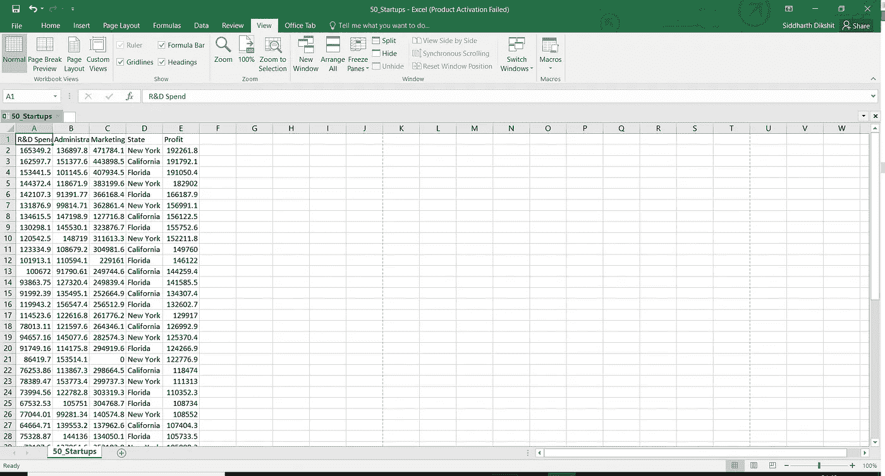

# 使用 Python 中的多元线性回归预测创业公司的利润/成功率

> 原文：<https://medium.com/coinmonks/predicting-a-startups-profit-success-rate-using-multiple-linear-regression-in-python-3ceb91650b24?source=collection_archive---------1----------------------->


> 在使用多元线性回归建立这个模型时，我们处理了一个包含 50 家初创公司详细信息的数据集，并根据某些特征预测了一家新初创公司的利润。对于风险资本家来说，这可能是一个福音，他们是否应该投资于某个特定的创业公司。假设你为一家风险投资公司工作，你的公司聘请你作为数据科学家来获得对数据的洞察力，并帮助他们预测投资某家初创公司是否安全。
> 我们还可以通过实际观察在特定的州启动一家初创公司会有什么不同，来获得对数据的有用见解。或者，哪家初创公司最终表现更好，是因为他们在营销上花了更多的钱，还是因为他们出色的研发部门让他们获得了巨额利润，进而获得了巨大的声誉和成功。

# 那么这篇文章的读者是谁呢？

你可以是刚刚完成机器学习 MOOC 的人，也可以是正在寻找基于机器学习的更实用/动手项目的初露头角的数据科学家。

如果你想将一些商业方面与机器学习结合起来，这也是相关的。

# 我们还在等什么？我们开始吧！！

我将要提到的可能更多的是机器学习的理论方面，但是一点理论知识也没有坏处！:P
在继续建立线性回归模型之前，有一些假设应该是正确的…
1)线性度
2)同态方差
3)多元正态性
4)误差的独立性
5)缺乏多重共线性
我不会讨论所有这些事情，但是如果我们将来将线性回归作为我们的最大似然算法，我们必须尝试并跟踪它们。有兴趣的人可以自己研究一下！！

# 第 1 部分—数据预处理

正在导入库…

```
*import* numpy *as* np
*import* matplotlib.pyplot *as* plt
*import* pandas *as* pd
```

导入数据集

```
dataset = pd.read_csv('50_Startups.csv')
```

这就是数据集的样子…



数据集包含以下特征(独立变量):—
……..1)R&D Spend——初创公司在研发上花费的资金总额。
……..2)管理-初创公司在管理上花费的资金总额。
……..3)营销支出-初创公司在营销上花费的资金总额。
……..4)州-创业公司启动或运营的州或地区。

为了在 X 中存储特征，我们使用…

```
X = dataset.iloc[:, :-1].values
```

因变量利润告诉你创业公司获得的利润。

```
y = dataset.iloc[:, 4].values
```

> 如果我们看一下我们的数据集，我们可以清楚地看到状态是一个字符串类型的变量，就像我们已经讨论过的那样，我们不能将字符串类型的变量输入到我们的机器学习模型中，因为它只能处理数字。为了克服这个问题，我们使用标签编码器对象，并使用 OneHotEncoder 对象创建虚拟变量…
> 假设我们的数据集中只有纽约州和加利福尼亚州这两个州，那么我们的 OneHotEncoder 将只有 2 列…
> 类似地，对于 n 个不同的州，它将有 n 列，每个州将由一系列 0 和 1 表示，其中所有列都为 0
> ，除了该特定州的列。
> 举个例子:-
> 如果 A，B，C 是 3 个状态，那么 A=100，B=010，C=001
> 我想现在你可能明白我的意思了，关于 OneHotEncoder 是如何工作的…

## 编码分类数据

将标签编码器类与 OneHotEncoder 一起导入

```
*from* sklearn.preprocessing *import* LabelEncoder, OneHotEncoder
```

创建标签编码器类的对象

```
labelencoder = LabelEncoder()
```

很明显，唯一的分类数据是存储在数据集中第三个索引处的州名，因此我们对该列进行了编码！

```
X[:, 3] = labelencoder.fit_transform(X[:, 3])
onehotencoder = OneHotEncoder(categorical_features = [3])
X = onehotencoder.fit_transform(X).toarray()
```

# 避免虚拟变量陷阱

线性回归方程看起来像这样—> y = b(0)+b(1)x(1)+b(2)x(2)+b(3)x(3)+b(4)D(1)+b(5)D(2)+b(6)D(3)…b(n+3)D(m-1)
这里 D(1)…D(m-1)是 m 个虚拟变量，我们之前在 LabelEncoder 和 OneHotEncoder
中定义过！

从包含 OneHotEncoded 值之一的数据集中删除第一列…

```
X = X[:, 1:]
```

## **将数据集分为训练集和测试集**

导入库并应用交叉验证，80%的数据作为训练数据，20%作为测试数据。

```
*from* sklearn.model_selection *import* train_test_split
X_train, X_test, y_train, y_test = train_test_split(X, y, test_size = 0.2, random_state = 0)
```

# 第 2 部分—拟合我们的线性回归模型

## 将多元线性回归拟合到训练集

线性回归方程看起来像这样—> y = b(0)+b(1)x(1)+b(2)x(2)+b(3)x(3)+b(4)D(1)+b(5)D(2)+b(6)D(3)…b(n+3)D(m-1)

导入线性回归类

```
*from* sklearn.linear_model *import* LinearRegression
```

创建线性回归类的对象

```
regressor = LinearRegression()
```

使创建的对象适合我们的训练集

```
regressor.fit(X_train, y_train)
```

# 第 3 部分—预测测试集结果

```
y_pred = regressor.predict(X_test)
```

打印预测值

```
print(y_pred)
```

为了查看预测结果和实际结果的差异，我们还将打印测试值

```
print(y_test)
```

> 你认为这实际上是我们刚刚建立的最佳模型吗？我们的模型包含了所有的特征，其中一些特征对我们的预测在统计上是不重要的。我们需要做的是找到一组对我们的预测有实际帮助的独立变量。
> 为此，我们使用了另一种叫做**逆向淘汰**的方法来建立一个最优模型……
> 但这是另一个故事，需要一篇自己的文章:P 敬请关注！！

Yayyy！！所以你刚刚建立了一个多元线性回归模型来预测一个新成立的公司的利润。雇佣你作为数据科学家的风险投资家现在能够做出明智的决定，他是否需要投资一个特定的创业公司！

我希望你喜欢我的教程！我将 github(现在是 Gitlab :P)链接附加到代码和数据集上。

[](https://github.com/Sid-darthvader/Predicting_Startup_Profits_using_Multiple_Linear_Regression) [## sid-Darth Vader/Predicting _ Startup _ Profits _ using _ Multiple _ Linear _ Regression

### predicting _ Startup _ Profits _ using _ Multiple _ Linear _ Regression-这包含了我们如何预测利润的模型…

github.com](https://github.com/Sid-darthvader/Predicting_Startup_Profits_using_Multiple_Linear_Regression) 

谁知道你的模式可能会成为下一个谷歌的资金来源；P

参考文献-机器学习课程，作者:基里尔·叶列缅科和哈德琳·德·庞特维斯