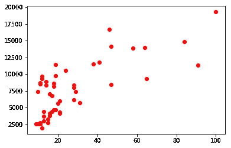
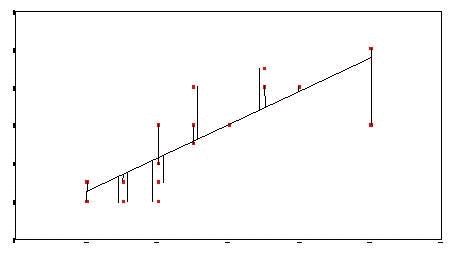
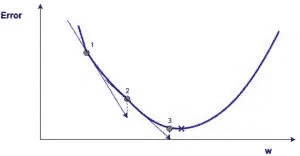
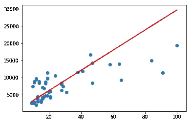

# 使用线性回归和梯度下降预测比特币价格。

> 原文：<https://medium.com/coinmonks/predicting-bitcoin-prices-using-linear-regression-and-gradient-descent-b1ec122ed5ee?source=collection_archive---------1----------------------->


## 在这篇文章中，我将使用比特币价格及其在谷歌上的搜索次数作为数据，展示梯度下降与线性回归的结合是如何工作的。

让我们假设比特币在谷歌上被搜索的次数与其价格之间存在关系，如果我们绘制一张图表，其中 x*-轴*是搜索次数， *y* 是价格，我们可以注意到比特币获得更多搜索时价格上涨的线性模式。



y-axis is the price in US$ and x is the number of searches.

> *这篇文章的重点是展示梯度下降是如何工作的。* ***没有一个准确的比特币价格预测。***

我们可以沿着线性模式画一条线，但是为了有一个准确的预测，这条线必须靠近数据点。

# 用等式画线:

```
y = mx + b
```

其中 *m* 是直线斜率，而 *b* 是直线与 y 轴相交的位置。然而，我们如何为它们找到最佳值呢？有一种叫做梯度下降的技术可以帮助我们找到最优值。

## 什么是梯度下降

梯度下降是一种优化技术，有助于减少由误差函数产生的误差，这里的误差函数是误差平方的[和**。**](https://www.wikiwand.com/en/Residual_sum_of_squares)



Imagine this line was drawn with guessed values for `m` and `b`. The error is the sum of the distance from the points to the line squared and divided by the number of points

## 我们怎样才能减少误差？

我们可以盲目猜测 m*和 b*和*T21 的值，并检查误差是否减小，然而这种方法是不合理的。如果我们计算偏导数，我们将知道误差值移动得有多快，因此我们可以灵活地更新这些值。想象一个向下移动的球，底部是我们想要到达的地方，导数会告诉我们如何更新值以接近底部。*



In our case the x-axis is `m` or `b` **not w**.

# 用 Python 和 numpy 查找 m 和 b。

## 我们要做的是:

1.  提取比特币价格和谷歌搜索次数。
2.  将价格与搜索日期匹配。
3.  设置超级参数: *m* 和 *b* 的历元、学习率和初始值。
4.  计算误差来检查我们的算法学习。
5.  计算梯度: *m* 的导数和 *b* 的导数。
6.  乘以学习率，并用当前 *m* 和 *b* 的差值进行更新。

## 提取比特币价格、谷歌搜索次数，并将价格与搜索日期匹配..

## 设置超级参数: *m* 和 *b* 的纪元、学习率和初始值。

## 计算误差来检查我们的算法学习。

## 计算梯度:对 *m* 的偏导数和对 *b 的偏导数，然后 m* 乘以学习率，并用当前 *m* 和 *b* 的差值进行更新。

# 把所有东西放在一起

# 画一条最符合我们数据的线



With optimal values of `m` and `b` we can draw a line that is closer to the points.

由于梯度下降，我们能够在我们想要的方向上更新值，并降低了误差率，从而得到符合我们数据的线。你可以在 github 上找到完整的笔记本。

# 参考资料:

*   [https://github.com/llSourcell/linear_regression_live](https://github.com/llSourcell/linear_regression_live)
*   [https://www.wikiwand.com/en/Linear_regression](https://www.wikiwand.com/en/Linear_regression)