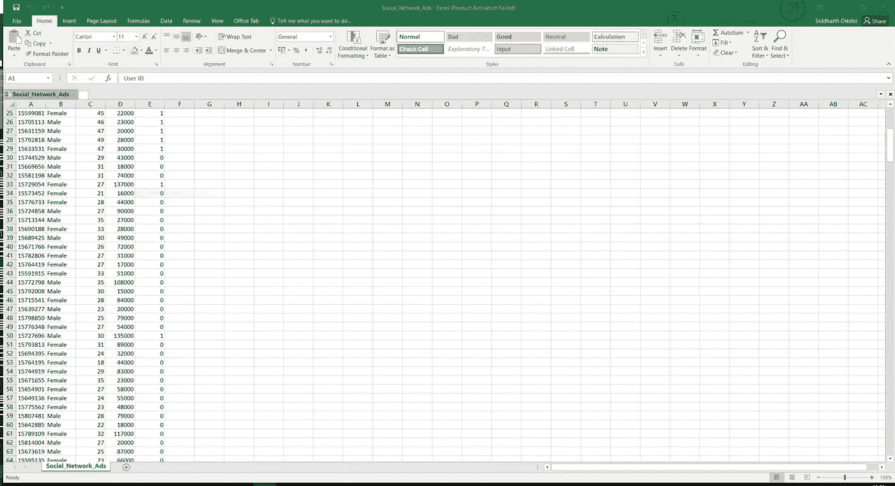
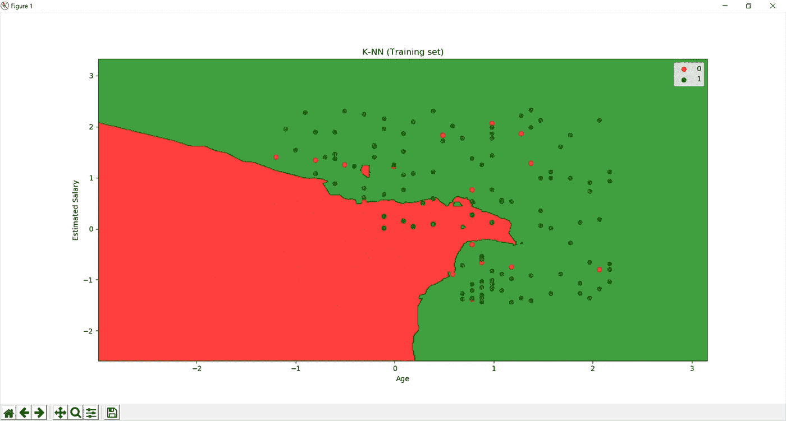
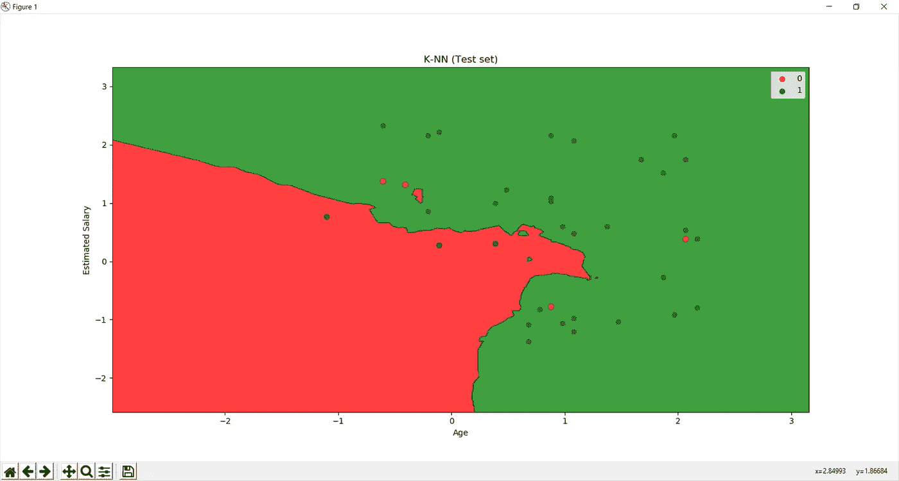

# 使用 Python 中的 k-N.N，通过社交网站上的广告预测产品销售

> 原文：<https://medium.com/coinmonks/predicting-product-sales-through-ads-delivered-on-social-networking-sites-using-k-n-n-in-python-b9f955d184af?source=collection_archive---------0----------------------->


> 简而言之，我们判断社交网站上的用户在点击网站上显示的广告后，最终是否会购买该产品。这对销售该产品的公司来说非常有帮助。假设一家汽车公司付费给社交网站(为了简单起见，我们从现在开始假设它是脸书)来展示其新上市汽车的广告。现在，由于该公司在很大程度上依赖于其新推出的汽车的成功，它会不遗余力地为汽车做广告。那还有什么比现在在最流行的平台上做广告更好的呢？但是如果我们只对正确的人群做广告呢？这可能有助于促进销售，因为我们将只向选定的人群展示汽车广告。
> 所以这就是你的用武之地……
> 汽车公司聘请你作为数据科学家，找出正确的人群，你需要向他们宣传汽车
> ，并根据某些特征找出最有可能购买汽车的人，这些特征描述了以前通过点击广告购买汽车的用户类型
> 。

# 那么这篇文章的读者是谁呢？

你可以是刚刚完成机器学习 MOOC 的人，也可以是正在寻找基于机器学习的更实用/动手项目的初露头角的数据科学家。

如果你想将一些商业方面与机器学习结合起来，这也是相关的。

# K.最近邻(k-N.N .)

## **温柔的介绍……**

k-NN 算法是所有机器学习算法中最简单的。输入由特征空间中的 *k* 个最接近的训练样本组成，而输出取决于 *k* -NN 是用于分类还是回归:

在 **k-NN 分类**中，输出是一个类成员。对象通过其邻居的多数投票进行分类，对象被分配到其 k 个最近邻居中最常见的类别(k 是正整数，通常很小)。如果 k = 1，那么该对象被简单地分配给该单个最近邻的类。

在 ***k-NN 回归*** 中，输出的是对象的属性值。这个值是它的 *k 个*最近邻居的平均值。

> 在这种特殊情况下，我们正在处理一个分类问题，因为我们需要将用户分类为那些想要或不想要汽车的人。

## 算法是如何工作的？

步骤 1)选择 K 个邻居
步骤 2)根据欧几里德距离
步骤 3)在这 K 个邻居中，计算每个类别中数据点的数量
步骤 4)将新数据点分配到您计算出邻居最多的类别。

……现在你的模型准备好了！！

# 我们还在等什么？我们开始吧！！

## 第 1 部分—数据预处理

导入库

```
*import* numpy *as* np
*import* matplotlib.pyplot *as* plt
*import* pandas *as* pd
```

导入数据集

> 数据集包含关于社交网站上的用户的信息，并使用该信息作为我们的 ML 模型的特征，我们试图预测特定用户在点击社交网站上的广告后是否会继续购买特定产品。这个特殊的社交网络有一个商业客户，如前所述，是一家汽车公司，它通过在社交网站上添加广告来宣传自己。现在，社交网络的工作是收集用户是否购买了产品的信息。这种情况下的因变量是 Purchased，如果用户购买汽车，则为 1，否则为 0。
> 因此，这里的目标是创建一个分类器，通过预测用户是否购买产品，将每个用户归入正确的类别。

```
dataset = pd.read_csv('Social_Network_Ads.csv')
```

打印数据集的前几个条目

```
print(dataset.head())
```

以下特征将被视为独立变量……
…1)**年龄**
…2) **预计工资**
现在，你们中的一些人可能会奇怪，数据集还包含 3 个以上的列，为什么我们要删除它们？这个问题的答案很简单……我们很快就会知道为什么他们中的每一个都被抛弃了。
…1) **用户标识** -用户标识对用户是否会购买汽车没有影响
…2) **性别** -有些人可能会说性别会起作用，但这确实是一个主观的讨论。
此外，由于性别是一个分类变量，我们必须对其使用变量编码器。

```
X = dataset.iloc[:, [2, 3]].values
```

将因变量存储在 y 中，即购买，如果用户购买汽车，则为 1，否则为 0。

```
y = dataset.iloc[:, 4].values
```

这是数据集的实际样子…



## 将数据集分为训练集和测试集

导入交叉验证库，在 Python 的新版本中现在称为 ModelSelection

```
*from* sklearn.model_selection *import* train_test_split
```

我们将数据分为 75%用于训练，25%用于测试我们的数据

```
X_train, X_test, y_train, y_test = train_test_split(X, y, test_size = 0.25, random_state = 0)
```

**现在我们要应用特征缩放吗？**
**是的**，我们肯定会应用特征缩放，因为我们想要准确的预测，也就是说，我们想要预测哪些用户会购买或不购买汽车。

## 特征缩放

导入库

```
*from* sklearn.preprocessing *import* StandardScaler
```

创建预处理类的标准标量对象

```
sc = StandardScaler()
```

通过将标准标量对象拟合到我们的特征矩阵 X_train 来缩放 X_train

```
X_train = sc.fit_transform(X_train)
```

在相同的基础上缩放 X_test

```
X_test = sc.transform(X_test)
```

要真正看到差异并确认它们几乎达到相同的比例，如果你愿意，你可以…

```
print(X_train)
print(X_test)
```

# 第 2 部分—拟合我们的 k-n-n 模型

将 K-NN 拟合到训练集

所以我们需要导入 scikit.neighbours 库，并从中导入 KNN 分类器

```
*from* sklearn.neighbors *import* KNeighborsClassifier
```

创建类的对象…
通过按 Ctrl+Q 显示文档并查看所有参数及其相应定义来检查分类器
→最近邻数=5(默认)
→指定公制为“闵可夫斯基”，幂为“2”，以使用 k-N.N 的欧几里德距离。== >设置 p=2

```
classifier = KNeighborsClassifier(n_neighbors = 5, metric = 'minkowski', p = 2)
```

现在我们让分类器对象适合我们的训练集

```
classifier.fit(X_train, y_train)
```

# 第 3 部分—预测测试集结果

由于分类器已经适合数据集，我们可以预测测试集的结果。

```
y_pred = classifier.predict(X_test)
```

显示预测值

```
print(y_pred)
```

现在来计算我们模型的准确性…

```
c=0
*for* i *in* range(0,len(y_pred)):
    *if*(y_pred[i]==y_test[i]):
        c=c+1
accuracy=c/len(y_pred)
print("Accuracy is")
print(accuracy)
```

所以当你运行它时，你会得到大约 93%的准确率，这对我们的分类器来说是一个巨大的成就。

我们以此结束我们的预测。现在下一部分是数据可视化，它帮助我们可视化模型的准确性和错误。

# 第 4 部分—数据可视化和混淆矩阵

## 可视化训练集结果

```
*from* matplotlib.colors *import* ListedColormap
X_set, y_set = X_train, y_train
X1, X2 = np.meshgrid(np.arange(start = X_set[:, 0].min() - 1, stop = X_set[:, 0].max() + 1, step = 0.01),
                     np.arange(start = X_set[:, 1].min() - 1, stop = X_set[:, 1].max() + 1, step = 0.01))
plt.contourf(X1, X2, classifier.predict(np.array([X1.ravel(), X2.ravel()]).T).reshape(X1.shape),
             alpha = 0.75, cmap = ListedColormap(('red', 'green')))
plt.xlim(X1.min(), X1.max())
plt.ylim(X2.min(), X2.max())
*for* i, j *in* enumerate(np.unique(y_set)):
    plt.scatter(X_set[y_set == j, 0], X_set[y_set == j, 1],
                c = ListedColormap(('red', 'green'))(i), label = j)
plt.title('K-NN (Training set)')
plt.xlabel('Age')
plt.ylabel('Estimated Salary')
plt.legend()
plt.show()
```

所以现在运行上面的代码后会显示类似这样的内容…



在新打开的训练集图表中可以看到，我们有一个非常适合数据的非线性分类器。

除了极少数错误分类的点…红色点在绿色区域，反之亦然，我们的模型在分类这些点方面做得相当不错。

## 可视化测试集结果

```
*from* matplotlib.colors *import* ListedColormap
X_set, y_set = X_train, y_train
X1, X2 = np.meshgrid(np.arange(start = X_set[:, 0].min() - 1, stop = X_set[:, 0].max() + 1, step = 0.01),
                     np.arange(start = X_set[:, 1].min() - 1, stop = X_set[:, 1].max() + 1, step = 0.01))
plt.contourf(X1, X2, classifier.predict(np.array([X1.ravel(), X2.ravel()]).T).reshape(X1.shape),
             alpha = 0.75, cmap = ListedColormap(('red', 'green')))
plt.xlim(X1.min(), X1.max())
plt.ylim(X2.min(), X2.max())
*for* i, j *in* enumerate(np.unique(y_set)):
    plt.scatter(X_set[y_set == j, 0], X_set[y_set == j, 1],
                c = ListedColormap(('red', 'green'))(i), label = j)
plt.title('K-NN (Training set)')
plt.xlabel('Age')
plt.ylabel('Estimated Salary')
plt.legend()
plt.show()
```



就像我们在对测试集结果进行分析之前对训练集的图形进行分析一样…

然而，我们再次看到，大多数点都被正确分类，只是有几个例外，顺便说一下，这很好，因为我们试图防止我们的模型过度拟合，我们知道这可能是一个严重的威胁。

现在，我们已经可视化了训练和测试集图，我们已经正式完成了模型的构建和数据可视化。

Yayyy！！所以你刚刚建立了一个 k-n-n 模型来预测在社交媒体上做广告的产品的销售。雇用你作为数据科学家的汽车公司现在将能够做出明智的决定，瞄准正确的人群，为其全新的汽车做广告，而你将是其巨大销售的原因。我希望你已经感到自豪了！！:P

我希望你喜欢我的教程！我将 github(现在是 Gitlab :P)链接附加到代码和数据集上。

[https://github . com/Sid-Darth Vader/Predicting _ Product _ Sales _ through _ ads _ on _ social media _ using _ k-n . n .](https://github.com/Sid-darthvader/Predicting_Product_Sales_through_ads_on_SocialMedia_using_k-N.N.)

**谁知道你的车型可能只是帮你宣传特斯拉的下一款车型；P**

参考文献-机器学习课程，作者:基里尔·叶列缅科和哈德琳·德·庞特维斯