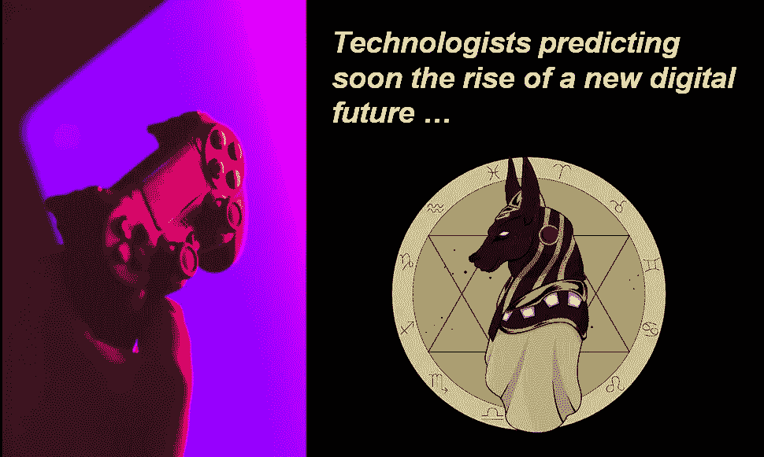
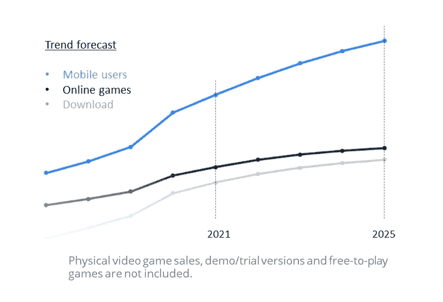
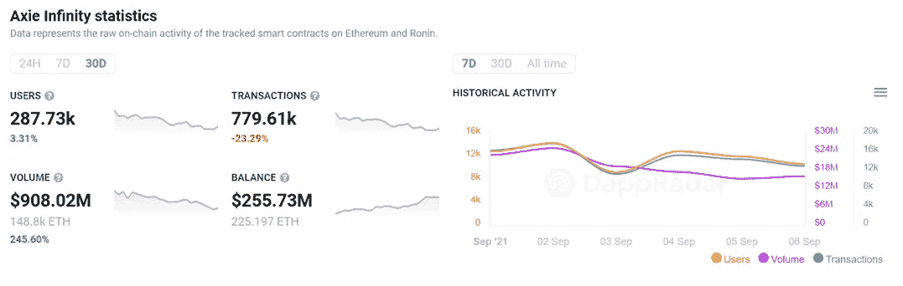
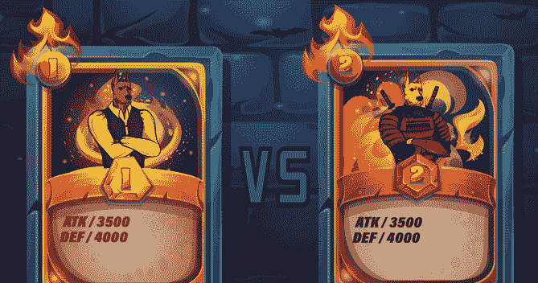

# 预测一个新的数字未来即将崛起——“区块链游戏”

> 原文：<https://medium.com/coinmonks/predicting-soon-the-rise-of-a-new-digital-future-blockchain-game-b3c337ed6db8?source=collection_archive---------10----------------------->

自从疫情开始以来，人们已经接受了虚拟生活。视频游戏是这种转变的主要受益者，尤其是人们用来消磨时间和娱乐的在线游戏。千禧一代在线游戏的增长趋势为视频游戏玩家创造了一个虚拟世界，他们可以在其中处理虚拟经济、货币、贸易环境和实时场景。

《数字市场展望》预测，到 2025 年，全球在线游戏领域的用户数量将达到 13 亿左右。

*Source: Statista*

许多游戏中的购买是暂时的，或者是通过赢得几个挑战来创造稀缺和增加他们的感知价值。在很大程度上，购买它们的玩家并不合法拥有它们。web 2.0 在线游戏的另一个问题是，它们在很大程度上仍然是集中的。这种集中化非常容易受到攻击和中断。

# 区块链和 NFTs:

因此，正如 CITI 风险投资公司在他们的意见报告中所表达的那样，非功能性测试似乎是一种天然的匹配。一个成功的例子是最近在首轮融资中筹集了 5000 万美元的虚拟足球交易卡游戏。

我们知道游戏在疫情时期增长，游戏投资和收购也出现了繁荣。如果你把游戏和区块链结合起来，那只会越来越火，对吗？这是新加坡开发工作室 Sky Mavis 开发的视频游戏 Axie Infinity 提供的梦想。这款游戏最近爆发了，8 月份吸引了超过 100 万名每日玩家，而 2020 年 7 月份的玩家不到 500 名。

# # Axie Infinity 的成功并没有被忽视。

许多游戏开发商正在采用区块链技术来保护玩家的游戏内资产所有权(NFTs)，并将游戏内的行为货币化，以推动现实生活中的交易(游戏内经济)。

2021 年上半年，24 家加密/区块链游戏公司完成了价值 4.76 亿美元的投资。根据 InvestGame 的一份报告，仅三家公司——Forte(筹集了 1.85 亿美元)、Animoca Brands(在第二季度筹集了 8900 万美元，随后筹集了更多资金)和神话游戏(7500 万美元)——就占了总额的 75%。

# 转向基础:

过去，NFT 收藏品的价值主要是由投机和其他人愿意支付的价格驱动的。因此，需求驱动价格，而不是基本面、技术或经济指标，这些指标通常会影响股票价格，至少通常会形成投资决策的基础。

在 Axie Infinity 取得成功之后，今天新一波的 NFT 项目正在为他们的 NFT 收藏品带来独特的效用，例如用作可玩的化身或元宇宙体验和 Defi 机会(玩赚，游戏内经济或赌注)。

**《K-9 星球》和类似的 NFT 项目是对“数字未来”的押注**——“游戏保留了传统桌游的强大吸引力，同时采用区块链技术来保护玩家在游戏中的资产所有权，并将游戏中的行为货币化以推动现实生活中的交易”。

【token 星球是一个拟人化的以狗为主题的不可兑现令牌(NFT)项目，其中包括一个名为 [K-9 任务](https://planetk9nft.medium.com/)的游戏。从分布在杜宾、皮特保罗、哈士奇和德国牧羊犬这四个犬种的 5033 只手绘 K-9 开始，这些 K-9 将被装饰在几件人类服装上。

该系列将作为 ERC-721 代币存在于区块链以太坊。在游戏推出后，K-9 持有者将提前进入 K-9·区块链游戏世界，拥有大量的游戏赚取模式，如纸牌决斗、太空射击、开放世界建设等。，并赚取游戏内的原生货币。

# K9-Konquest 游戏的神话:

很久以前，在另一个地球上，传说来自神圣古代的远古外星人在他们可怕的宇宙飞船里绑架了狗，并把它们带到了一个遥远的外星球。在那里，在它的一个卫星上，进行了痛苦的实验，永远改变了这些杂种狗的本性。

几个月过去了，几年过去了，几个世纪过去了，亿万年过去了，这些被征服的犬科动物终于鼓起勇气，领导了一场反抗捕获它们的人的运动。

在似乎漫长的时间里，这些狗在那颗贫瘠的卫星上陷入了一场消耗战，直到最后，它们在卡尼斯玛丽亚的围攻中给了绑架它们的人决定性的一击。这场胜利扭转了对他们有利的局势，他们继续攻破一个又一个外星人的堡垒。最后，他们冲破了在沙坝高地的设防营地的大门，并在 10，000 名前俘虏的鲜血中获得了胜利。

面对失败和必然的死亡，剩下的外星人逃离了这颗贫瘠的卫星。随着其余的外星部落被赶出他们的基地，增强型犬科动物改装了起落架，并前往这颗星球，一个现在在通用语中被称为 K-9 星球的新家。

# 总结:

区块链游戏、play2earn 以及围绕这个游戏利基的一切仍然是一个相对较新的概念。区块链科技和游戏的交叉或多或少是不可避免的，现在它在这里，它的受欢迎程度迅速上升。“K-9 星球”和数百个其他 NFT 项目是对这一交汇点的赌注，以创造一个新的数字未来。

> 加入 [Coinmonks 电报频道](https://t.me/coincodecap)，了解加密交易和投资

## 另外，阅读

*   [尤霍德勒 vs 考尼洛 vs 霍德诺特](/coinmonks/youhodler-vs-coinloan-vs-hodlnaut-b1050acde55a) | [Cryptohopper vs 哈斯博特](https://blog.coincodecap.com/cryptohopper-vs-haasbot)
*   [币安 vs 北海巨妖](https://blog.coincodecap.com/binance-vs-kraken) | [美元成本平均交易机器人](https://blog.coincodecap.com/pionex-dca-bot)
*   [如何在印度购买比特币？](/coinmonks/buy-bitcoin-in-india-feb50ddfef94) | [WazirX 评论](/coinmonks/wazirx-review-5c811b074f5b) | [BitMEX 评论](https://blog.coincodecap.com/bitmex-review)
*   [比特币主根](https://blog.coincodecap.com/bitcoin-taproot) | [Bitso 点评](https://blog.coincodecap.com/bitso-review) | [排名前 6 的比特币信用卡](/coinmonks/bitcoin-credit-card-bc8ab6f377c6)
*   [双子座 vs 比特币基地](https://blog.coincodecap.com/gemini-vs-coinbase) | [比特币基地 vs 北海巨妖](https://blog.coincodecap.com/kraken-vs-coinbase) | [硬币罐 vs 硬币点](https://blog.coincodecap.com/coinspot-vs-coinjar)
*   [印度密码交易所](/coinmonks/bitcoin-exchange-in-india-7f1fe79715c9) | [比特币储蓄账户](/coinmonks/bitcoin-savings-account-e65b13f92451) | [Paxful 审核](/coinmonks/paxful-review-4daf2354ab70)
*   [杠杆令牌](/coinmonks/leveraged-token-3f5257808b22) | [最佳加密交易所](/coinmonks/crypto-exchange-dd2f9d6f3769) | [AscendEX 评论](/coinmonks/ascendex-review-53e829cf75fa)
*   [Godex.io 审核](/coinmonks/godex-io-review-7366086519fb) | [邀请审核](/coinmonks/invity-review-70f3030c0502) | [BitForex 审核](https://blog.coincodecap.com/bitforex-review) | [HitBTC 审核](/coinmonks/hitbtc-review-c5143c5d53c2)
*   [Crypto.com 费用](/coinmonks/binance-fees-8588ec17965) | [Botcrypto 审查](/coinmonks/botcrypto-review-2021-build-your-own-trading-bot-coincodecap-6b8332d736c7) | [替代方案](https://blog.coincodecap.com/crypto-com-alternatives)
*   [有哪些交易信号？](https://blog.coincodecap.com/trading-signal) | [Bitstamp vs 比特币基地](https://blog.coincodecap.com/bitstamp-coinbase) | [买索拉纳](https://blog.coincodecap.com/buy-solana)
*   [ProfitFarmers 回顾](https://blog.coincodecap.com/profitfarmers-review) | [如何使用 Cornix Trading Bot](https://blog.coincodecap.com/cornix-trading-bot)
*   [MXC 交易所评论](/coinmonks/mxc-exchange-review-3af0ec1cba8c) | [Pionex vs 币安](https://blog.coincodecap.com/pionex-vs-binance) | [Pionex 套利机器人](https://blog.coincodecap.com/pionex-arbitrage-bot)
*   [我的密码交易经验](/coinmonks/my-experience-with-crypto-copy-trading-d6feb2ce3ac5) | [《比特币基地评论》](/coinmonks/coinbase-review-6ef4e0f56064)
*   [CoinFLEX 评论](https://blog.coincodecap.com/coinflex-review) | [AEX 交易所评论](https://blog.coincodecap.com/aex-exchange-review) | [UPbit 评论](https://blog.coincodecap.com/upbit-review)
*   [AscendEx 保证金交易](https://blog.coincodecap.com/ascendex-margin-trading) | [Bitfinex 赌注](https://blog.coincodecap.com/bitfinex-staking) | [bitFlyer 审核](https://blog.coincodecap.com/bitflyer-review)
*   [麻雀交换评论](https://blog.coincodecap.com/sparrow-exchange-review) | [纳什交换评论](https://blog.coincodecap.com/nash-exchange-review)
*   [加密货币储蓄账户](/coinmonks/cryptocurrency-savings-accounts-be3bc0feffbf) | [赌注加密](https://blog.coincodecap.com/staking-crypto) | [加密交易机器人](https://blog.coincodecap.com/best-crypto-trading-bots)
*   [BigONE 交易所评论](/coinmonks/bigone-exchange-review-64705d85a1d4) | [CEX。IO 审查](https://blog.coincodecap.com/cex-io-review) | [交换区审查](/coinmonks/swapzone-review-crypto-exchange-data-aggregator-e0ad78e55ed7)
*   [最佳比特币保证金交易](/coinmonks/bitcoin-margin-trading-exchange-bcbfcbf7b8e3) | [比特币保证金交易](https://blog.coincodecap.com/bityard-margin-trading)
*   [加密保证金交易交易所](/coinmonks/crypto-margin-trading-exchanges-428b1f7ad108) | [赚取比特币](/coinmonks/earn-bitcoin-6e8bd3c592d9) | [Mudrex 投资](https://blog.coincodecap.com/mudrex-invest-review-the-best-way-to-invest-in-crypto)
*   [WazirX vs CoinDCX vs bit bns](/coinmonks/wazirx-vs-coindcx-vs-bitbns-149f4f19a2f1)|[block fi vs coin loan vs Nexo](/coinmonks/blockfi-vs-coinloan-vs-nexo-cb624635230d)
*   [BlockFi 信用卡](https://blog.coincodecap.com/blockfi-credit-card) | [如何在币安购买比特币](https://blog.coincodecap.com/buy-bitcoin-binance)
*   [火币交易机器人](https://blog.coincodecap.com/huobi-trading-bot) | [如何购买 ADA](https://blog.coincodecap.com/buy-ada-cardano) | [Geco。一次审查](https://blog.coincodecap.com/geco-one-review)
*   [加密副本交易平台](/coinmonks/top-10-crypto-copy-trading-platforms-for-beginners-d0c37c7d698c) | [五大 BlockFi 替代方案](https://blog.coincodecap.com/blockfi-alternatives)
*   [CoinLoan 点评](https://blog.coincodecap.com/coinloan-review)|【Crypto.com】点评 | [火币保证金交易](/coinmonks/huobi-margin-trading-b3b06cdc1519)
*   [Bybit vs 币安](https://blog.coincodecap.com/bybit-binance-moonxbt)|[stealth x 回顾](/coinmonks/stealthex-review-396c67309988) | [Probit 回顾](https://blog.coincodecap.com/probit-review)
*   [顶级付费加密货币和区块链课程](https://blog.coincodecap.com/blockchain-courses)
*   [在美国如何使用 BitMEX？](https://blog.coincodecap.com/use-bitmex-in-usa) | [BitMEX 评论](https://blog.coincodecap.com/bitmex-review)
*   [最佳免费加密信号](https://blog.coincodecap.com/free-crypto-signals) | [YoBit 评论](/coinmonks/yobit-review-175464162c62) | [Bitbns 评论](/coinmonks/bitbns-review-38256a07e161)
*   [OKEx 回顾](/coinmonks/okex-review-6b369304110f) | [Kucoin 交易机器人](/coinmonks/kucoin-trading-bot-automate-your-trades-8cf0ca2138e0) | [期货交易机器人](/coinmonks/futures-trading-bots-5a282ccee3f5)
*   [AscendEx Staking](https://blog.coincodecap.com/ascendex-staking)|[Bot Ocean Review](https://blog.coincodecap.com/bot-ocean-review)|[最佳比特币钱包](https://blog.coincodecap.com/bitcoin-wallets-india)
*   [霍比审核](https://blog.coincodecap.com/huobi-review) | [OKEx 保证金交易](https://blog.coincodecap.com/okex-margin-trading) | [期货交易](https://blog.coincodecap.com/futures-trading)
*   [比特币基地跑马圈地](https://blog.coincodecap.com/coinbase-staking) | [Hotbit 点评](/coinmonks/hotbit-review-cd5bec41dafb) | [KuCoin 点评](https://blog.coincodecap.com/kucoin-review)