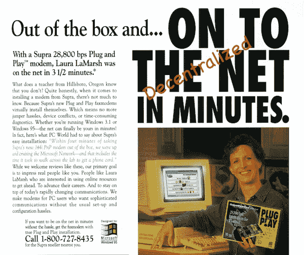
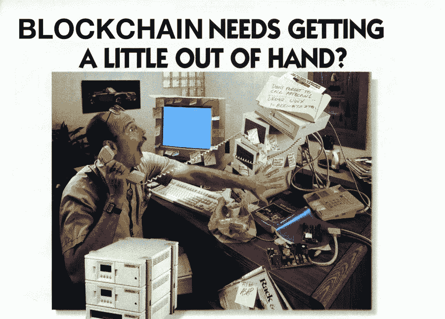

# 预测去中心化网络

> 原文：<https://medium.com/coinmonks/predicting-the-decentralized-web-81bd57158576?source=collection_archive---------5----------------------->

我经历过集中式和分散式网络的开端，看到了它们之间的许多相似之处。在这篇文章中，我将强调其中的一些相似之处，并让它们作为预测 2019 年去中心化网络的见解。

# 内容

*   早期采用者
*   黑仔应用
*   浏览器市场
*   企业采用
*   工具和开发
*   2019 年预测

# 时间跨度

我关注的是 1992-1995 年的集中式网络和 2015-2018 年的分散式网络。

# 早期采用者

直到 1994 年，网络还是学生和业余爱好者的天地。这是因为大学是少数几个能够提供互联网连接的机构之一。那个时代幸存下来的网站屈指可数，最突出的是 IMDB、Wired 和 Amazon。如果我们遵循[创新扩散](https://en.wikipedia.org/wiki/Diffusion_of_innovations)的理论，1994 年的网络处于早期采用阶段，其使用增长是基于兴趣而不是盈利能力。

进入的门槛很高，因为你需要以下东西才能上网:

*   个人电脑
*   调制解调器
*   互联网服务提供商
*   互联网连接软件，如小号 Winsock

[到 1995 年，大约 1400 万美国人在家里接入了互联网](http://www.people-press.org/1995/10/16/americans-going-online-explosive-growth-uncertain-destinations/)，尽管互联网速度慢、不直观且价格昂贵。[报告显示，1995 年经合组织地区的平均连接速度为 56 kbps。](https://www.oecd.org/internet/broadband/2758588.pdf)

即使网络本身是新的，用户仍然知道它有多慢，因为他们在大学里经常体验到更快的网络连接。

> 以 28.8 Kbps(或更低)的速度使用万维网可能是一种令人沮丧的体验:以以太网的速度下载一个只需几分之一秒的多媒体页面，以调制解调器的速度则需要几秒钟。

上面的[引文](https://pdfs.semanticscholar.org/4a81/6d23e0eea6dc224ca14c9aeac1d85fb5b1dd.pdf)很有趣，因为去中心化的网络面临着同样的挑战。人们意识到去中心化的平台，比如以太坊，对于消费者来说是缓慢和不成熟的，但是他们仍然继续构建去中心化的应用。但是同一时代的另一句话，1995 年[实际上把可伸缩性问题变成了积极的事情](https://quod.lib.umich.edu/j/jep/3336451.0001.121?view=text;rgn=main)。

> 早期互联网的发展是为了满足一个特定的目标:为了开放的学术研究和教育的目的，学术网站的互连。在实现这一目标的过程中，互联网不仅成功了，而且太成功了。互联网迅速发展到它从未被设计为服务的经济部门(如银行和在线信息服务)，暴露了一些能力上的差距，这些差距对早期用户来说不重要，但对新用户来说非常重要。

我们可以对去中心化的网络得出同样的结论。当 CryptoKitties 等应用程序导致网络拥塞时，它太成功了，Vitalik Buterin 表示，试图在此刻建立一个去中心化优步或 Lyft 的开发人员已经完蛋了。就像 1995 年一样，分散式网络的采用速度超过了其底层的区块链技术。

集中式和分散式网络之间的另一个相似之处是它遇到了 T2 的怀疑。我经常被问到“*去中心化的网络解决了什么商业问题？”。在 1995 年，集中式网络也没有解决很多商业问题。这更像是由非常聪明的人所做的一系列承诺和炒作。但它仍然设法发展成为大众消费，成为公共事业。*

# 黑仔应用

到 1994 年中期，已经有 2738 个网站，互联网速度慢，不安全，而且对于商业等应用来说过于简单。这导致它最初只为早期采用者服务。第一批杀手级应用是在搜索领域，即雅虎、AltaVista 和 Lycos。他们会让互联网爱好者找到更多的网站。对于一个局外人来说，这是毫无意义的，因为他们不知道要搜索什么。当地的比萨饼店没有网站来查找他们的营业时间，你不能在网上订购任何东西，流媒体仍然是 15 年后的事情。然而，随着 1994 年网站数量从 2738 个增加到 10000 个，互联网也在增长。

你可以把它与去中心化的网络相提并论，在去中心化的网络中，第一批杀手级应用只服务于发烧友。到 2018 年年中，有 [1510 个分散式应用](https://www.stateofthedapps.com/)，在我看来，目前唯一提供价值的是分散式交易所。这使得分散式网络对于没有密码的人来说毫无用处。然而，去中心化的网络正在发展，下面的统计数据:

*   2015 年发布了 104 个 dapps
*   2016 年发布了 164 个 dapps
*   2017 年发布的 618 款 dapps
*   2018 年上半年发布的 623 个 dapps

这并不像上世纪 90 年代的集中式网络那样呈爆炸式增长。这可能是因为分散式应用程序是业务关键型软件，因为它们处理其他人的资金，这是早期网站从未做到的。这也导致了分散式应用程序的开发过程比构建静态网站要复杂得多，在 90 年代，静态网站主要是由 web 构成的。

另一个导致分散式网络不如集中式网络发展迅速的因素是 ICO 热潮和随之而来的金钱。第一个真正的杀手级 dapp 是 ERC20 token，因此人们花更多的时间试图为上市时间为 1-2 年的产品筹集 ICO 资金，而不是专注于构建更小的 dapp。

# 浏览器市场

1995 年，Internet Explorer 1.0 作为 Windows 95 的附加软件包发布，名为 Microsoft Plus！它和网景导航器一起，是第一批试图控制新生的万维网并将其商业化的公司之一。将 90 年代的浏览器市场与 dapp 浏览器市场进行比较，我们看到更多的参与者，如 Toshi、Metamask 和 Trust Wallet 等浏览器正在获得动力。不同的是，这些浏览器不是来自大型组织，也许除了被比特币基地收购的[密码浏览器。](https://techcrunch.com/2018/04/13/coinbase-acquires-decentralized-app-browser-wallet-cipher-browser/)

# 企业采用

就网络存在而言，像苹果公司(1996 年)、麦当劳公司(1996 年)和可口可乐公司(1995 年)这样的大公司上网速度非常慢。总的来说，大品牌并不关注网络，因为它们不是科技公司，也缺乏有能力的 IT 组织。

目前还没有来自大公司的去中心化的应用程序，坦白地说，我认为对他们来说，除了为了公关目的，尝试去中心化的网络是没有意义的。但有迹象表明，可口可乐等品牌正在测试区块链技术，考虑到大公司现在比 90 年代拥有更强的信息技术能力，他们进入这一领域的障碍降低了。

# 工具和开发

工具方面，90 年代出现了 Macromedia Shockwave、Microsoft FrontPage 和 Macromedia Dreamweaver 等产品。这些工具是一把双刃剑，因为它们简化了创建网站，但也导致了 21 世纪初支离破碎和专有的互联网。

将生成智能合约代码的服务进行类比并不难，比如 [TokenGen](https://cointelegraph.com/press-releases/tokengen-the-ultimate-smart-contract-creator-for-the-token-economy) 或 [EtherParty](https://etherparty.com/) 。它们最初可能在有能力的智能合约开发人员稀缺的市场中占有一席之地，但从长远来看，这些工具往往会被新开发人员的涌入所淘汰。

1995 年的开发智慧——CGI、JavaScript 和 HTML 被用来创建网站。CGI 本身[相当慢](http://www.answers.com/Q/What_are_the_advantages_and_disadvantages_of_CGI_programming)，JavaScript 和 HTML 是新标准。随着人们对网络的兴趣超过了它的管理组织——IETF，微软和网景等浏览器供应商继续实现 HTML 特性的不同子集。随后，Java Swing 等平台也将出现，它们诞生于网络的资本化尝试和对其可用性的失望。

我们在这里看到了同样的结果，因为 Solidity(去中心化网络最流行的编程语言)正受到 NeoVM、EOS 和 Lisk 等平台的挑战，这些平台都在使用其他语言。

# 对 2019 年去中心化网络的预测

在这里，我将给出我对去中心化网络未来的预测。我所做的分析是基于定性研究的，一方面是基于历史的发展，另一方面是基于我在信息技术领域 10 多年的个人经验。

# 早期采用者-2019 年预测

dapps 的数量将继续增加，这几乎只发生在以太坊平台上。以太坊具有先发优势，并且是开源的——这在历史上是成功的有力指标。它还受到一个热情友好、乐于助人的社区的推动，该社区进一步加强了其周围的生态系统。

为了让去中心化的网络获得更大的动力，像比特币基地这样的大玩家将不得不进入这个市场。我相信它们将把资产管理和 dapps 交织在一起，在你的钱包和去中心化的网络之间创造一个无缝的体验。比特币基地将是推动 dapps 在早期大多数人中采用的关键角色，可能在 2019 年底的某个时候。

# 黑仔应用-2019 年预测

分散式交易所将继续发展，但我们也将看到赌博变得更加流行。对集中式网络的赌博在 1998 年及以后稳步增长，但由于金钱是区块链不可或缺的一部分，我相信对分散式网络来说，这将发生得更快。我还考虑到，区块链的可扩展性问题要到 2019 年才能得到解决，这使得赌博这个对计算要求较低的市场变得更大。

# 浏览器市场-2019 年预测

比特币基地将专注于他们的浏览器之一，Toshi 或 Cipher，并抢占大部分移动市场。他们在早期采用者中拥有品牌认知度，并将目标锁定在早期大多数人。他们还拥有一支伟大的 UX 设计师队伍，人数超过了任何试图进入这一领域的小公司。另一个预测是，他们将推出或收购一款用于台式电脑的 dapp 浏览器。比特币基地是 90 年代互联网的微软，既有野心也有资源将 dapps 带给大众。

# 企业采用-2019 年预测

这里不会发生太多事情，因为大型组织传统上害怕尖端技术。也许我们会看到一些出于公关目的的事情，但除此之外，不要对麦当劳或苹果 dapp 抱太大希望。

# 工具和开发—2019 年预测

工具将变得更有竞争力，出现了像松露这样的框架、T2 这样的集成开发环境和更多的外包智能合同审计。Solidity 仍将是一门糟糕的语言[，但它将是最流行的语言(就像 90 年代的 JavaScript 一样)。不过，随着刀和平价钱包在最近的记忆中被黑客攻击，集体意识会变得更聪明。因此，开发人员将更加谨慎地编码，并有更多的工具可以依靠。2019 年继续将 Solidity 视为事实上的去中心化网络编程语言，并将 Truffles 视为其框架。](https://news.ycombinator.com/item?id=14807779)

# 结论

历史往往会重演，这也是我大多数预测的基础。90 年代的互联网和分散式网络的主要相似之处在于它们都是如此的缓慢、昂贵和不安全。然而，我们不能帮助自己建立在它之上。谁知道呢，去中心化的网络可能只是一个永远不会实现的白日梦。但 2018 年是我第一次像 1995 年那样对互联网有同样的直觉。