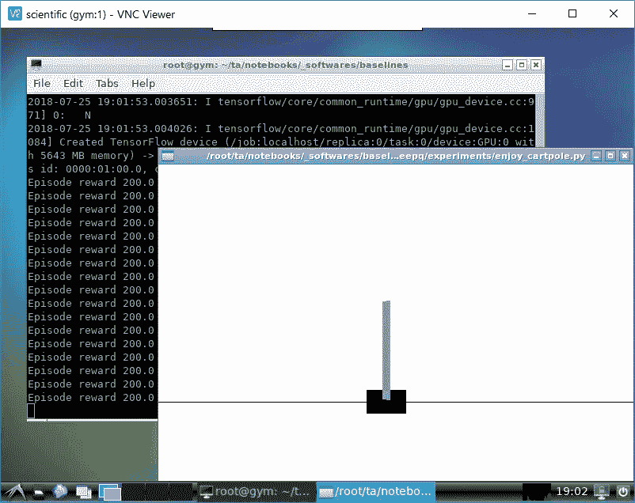

# 为 OpenAI 的健身房准备一个无头环境(与 Docker 和 Tensorflow 一起)

> 原文：<https://medium.com/coinmonks/preparing-a-headless-environment-for-openais-gym-with-docker-and-tensorflow-1bd0e0d31663?source=collection_archive---------2----------------------->



Running Cartpole DeepQ OpenAI’s baseline on GTX1060 inside a container

应该不难吧？

实际上，仅仅在一个无头(或云)服务器上制作 OpenAI 的 Gym 渲染是非常困难的，因为自然地，这些服务器没有屏幕。

Gym 需要一个显示器(而不是屏幕)来渲染许多环境。我认为最可靠的方法是拥有一个“成熟的桌面环境”,万一你想看现场直播，你可以远程控制它，最好是通过 VNC。

所有这些都可以在一个 Docker 容器中完成，这将减轻你某种程度的依赖性，我认为这是 Gym 真正关心的问题。而且，**我更喜欢 Ubuntu** 。

所以，我们首先在 Docker 上找到一个工作桌面环境作为起点。我很快找到了这个[https://github.com/fcwu/docker-ubuntu-vnc-desktop](https://github.com/fcwu/docker-ubuntu-vnc-desktop)，里面包含:

*   Ubuntu 18.04(以及你可以选择的其他版本)
*   LXDE on **Xvfb** 。为什么是 LXDE？这是一个非常轻便的桌面环境。Xvfb 是什么？它是一个虚拟显示提供商。无头服务器没有显示器，这实际上创建了一个显示器。
*   允许通过 **x11vnc** 远程访问，其要点是 x11vnc 是一种通过 vnc 托管 X11 显示器的方式。基本上，这将托管 Xvfb 显示。
*   拥有一个网络客户端意味着你不需要安装一个 VNC 客户端，你只需要一个网络浏览器(这是一个很好的功能，但我不会用它)

## **用什么 Ubuntu 版本？**

我觉得最兼容的是 16.04(不是 18.04)。特别是，如果你想使用 Tensorflow，你需要 CUDA 9.0 的官方支持，但是 CUDA 9.0 的官方支持版本是 16.04。这意味着 18.04 版的 CUDA 9.0 是一个未知领域。

然而，健身房出了点小问题。即使我的内心相信健身房会和 16.04 一起很棒，但是我试过了，没有用。问题出在环境上。我有足够的证据得出结论，无论是什么原因造成的，都一定是 16.04 和 18.04 之间的差异(当然是在安装了桌面环境的情况下)，因为我发现 18.04 可以工作。

最后，我将为本文选择 Ubuntu 18.04，并向您展示在未知领域生存的方法。

## 只是一个工作的健身房

在工作桌面环境中，这似乎微不足道。我们需要的是遵循 https://github.com/openai/gym 的指示。在 18.04 中，并不是所有的依赖项都可以用于 example**libav-tools**在 18.04 中不可用，我们需要安装 **ffmpeg** 来代替。

从属关系变成:

```
apt-get install -y python-numpy python-dev cmake zlib1g-dev libjpeg-dev xvfb **ffmpeg** xorg-dev python-opengl libboost-all-dev libsdl2-dev swig
```

而且我倾向于不依赖系统的 Python 主要是因为不完全了解，也有`python`是 Python 2 的意思。如果我们想使用 Python 3，需要一直使用对我来说很麻烦的`python3`和`pip3`。那就别管系统巨蟒了！我们将使用一辆[迷你康达](https://conda.io/miniconda.html)。幸运的是，Miniconda 提供了一个[官方 Dockerfile](https://github.com/ContinuumIO/docker-images/tree/master/miniconda3) 我们可以很容易地集成它。

**我在这里提供了 Dockerfile 的修改版(没有 noVNC 和 web 客户端):**[https://github . com/phizaz/docker-cuda-gym/tree/master/gym-only](https://github.com/phizaz/docker-cuda-gym/tree/master/gym-only)

**关于文档的注释**

所有 docker 文件都假设在容器中总是使用“root”用户。但是，这并不意味着它必须从外部根源。Docker 为[用户名间距](https://docs.docker.com/engine/security/userns-remap/)提供了一种简洁的方式，这样容器中的根用户在外部将被视为普通用户。这使得我们的 docker 文件更容易编写。

## 如果你想用 Tensorflow

我假设你也想要 Tensorflow 的 GPU 版本，这意味着你需要安装某个版本的 CUDA(最好是官方支持的最新 CUDA 版本 9.0)，为此你还需要 [nvidia-docker](https://github.com/phizaz/docker-cuda-gym/tree/master/gym-only) 。

好吧，我们想用 CUDA 9.0，但如上所述我们也想用 Ubuntu 18.04(不知何故 16.04 对 Gym 有问题)。这造成了一个尴尬的局面，因为 CUDA 9.0 不支持 Ubuntu 18.04(你不会找到来自 nvidia 的官方 Docker 映像)。因此，我们需要靠自己实现这一目标。

在 Ubuntu 18.04 上安装 CUDA 9.0 的通用配方可以从[https://gist . github . com/马赫迪-61/2a2f 1579d 4271717d 421065168 ce 6a 73](https://gist.github.com/Mahedi-61/2a2f1579d4271717d421065168ce6a73)中找到

一般需要从 Nvidia 网站下载一个“runfile”。此外，Tensorflow 需要 CUDNN 7 才能工作，您也需要从网站下载它。

我已经为 docker 文件提供了一个模板。如果您有一个合适的 runfile 和 CUDNN 档案，您应该能够轻松地构建 Docker 映像。

【CUDA Dockerfile 的一个配方:【https://github.com/phizaz/docker-cuda-gym/tree/master/cuda】T3

鉴于您现在已经有了 CUDA 基础映像，我们继续安装 Tensorflow 和 Jupyterlab。这应该是最微不足道的，因为我们有 CUDA 9.0，它是官方支持的。此外，Jupyterlab 也可以通过`conda install`获得。

**下面是其余的 Docker 食谱(tensor flow+Jupyterlab):**[https://github . com/phizaz/Docker-cuda-gym/tree/master/tensor flow](https://github.com/phizaz/docker-cuda-gym/tree/master/tensorflow)

*希望这篇文章能为你节省几个小时的试错时间，为你营造一个工作的健身房环境。*