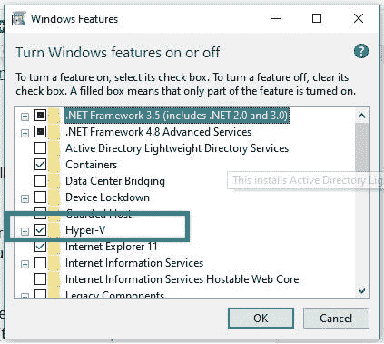
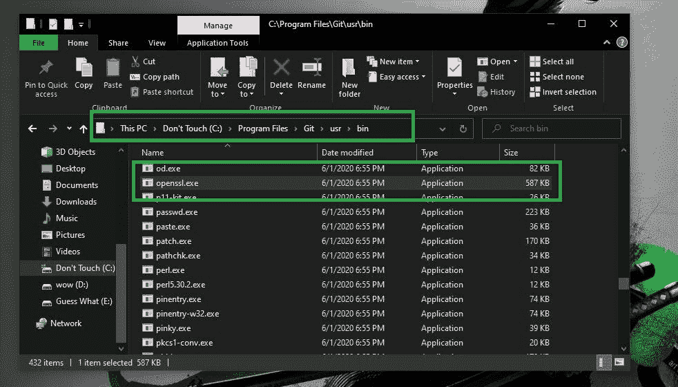
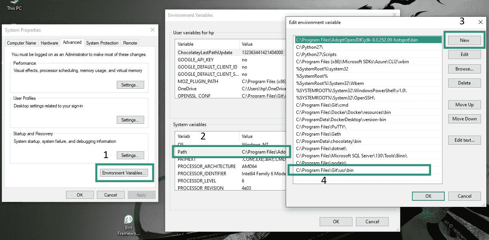
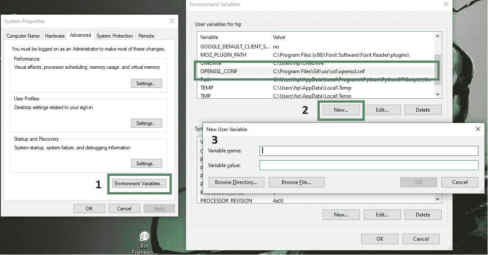
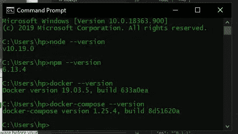
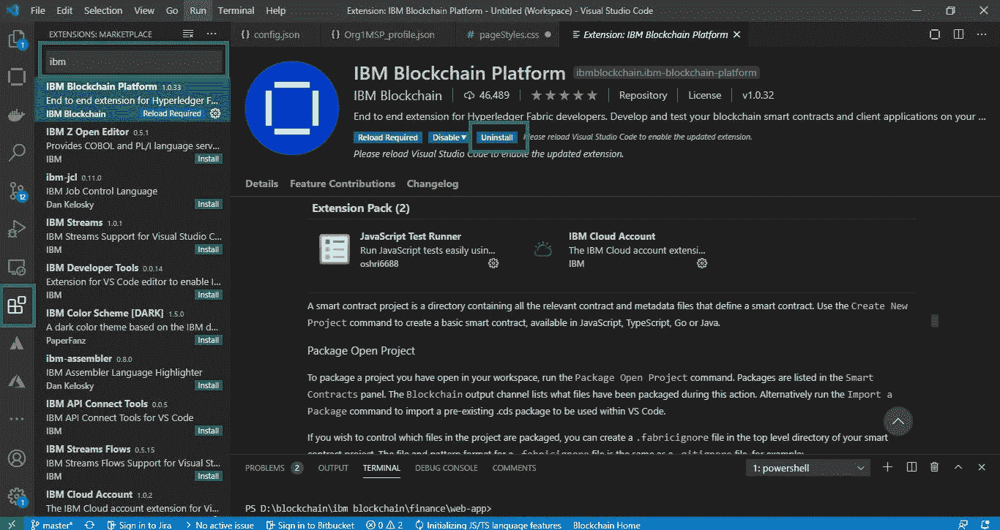
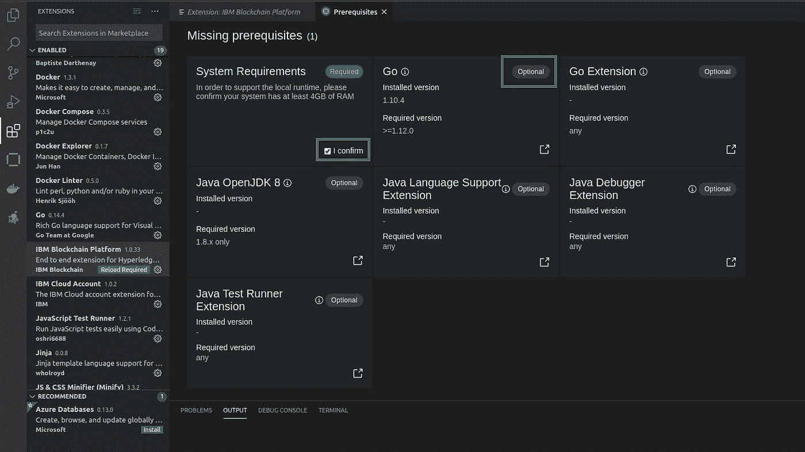
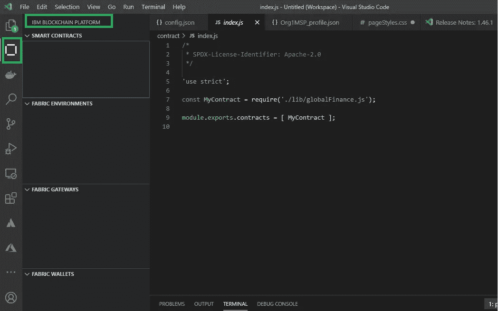

# 使用 IBM 区块链平台 VS 代码扩展部署智能合同的先决条件

> 原文：<https://medium.com/coinmonks/prerequisites-to-deploy-your-smart-contract-with-ibm-blockchain-platform-vs-code-extension-d940efe18c1c?source=collection_archive---------0----------------------->

Ref from: BITCOIN BLACK

如果您是 IBM 区块链平台或 Hyper ledger Fabric 的新手，请跟随我们的教程，学习如何在本地入门，以及如何设置事务并将其提交到部署到 IBM Cloud 的区块链网络。在这里，您将实际学习在 VS 代码扩展中为 IBM 区块链平台设置环境。

## 使用这个 IBM 区块链平台扩展，您能做些什么呢？

它允许您创建一个基础，例如智能合约的基础或框架。在那里你可以选择更适合你的语言。它提供了多种选项，如 JavaScript、Type Script、Go 和 Java。

现在让我们看看这个项目实际需要的先决条件，为了使用这个扩展，您需要安装以下内容:

*   **VS 代码**[链接 ](https://code.visualstudio.com/download)
*   **节点 v8.x** 以上和 npm v5.x 以上 [**链接**](https://nodejs.org/en/blog/release/v10.19.0/)
*   **Docker 版本** v17.06.2-ce 以上 [**链接**](https://docs.docker.com/docker-for-windows/edge-release-notes/#docker-community-edition-2010-2019-01-11)
*   **Docker 撰写** v1.14.0 或更高版本 [**链接**](https://docs.docker.com/compose/install/)

如果你是 windows 用户，那么你也需要担心以下问题，你的 Windows 版本支持 **Hyper-V** 和 **Docker**

> 也就是说，你需要确保 **Hyper-V** 在你的**本地机器**中被启用，为此你需要在你的开始菜单或控制面板中搜索**打开或关闭 Windows 功能**。

确保您已经打开了 Hyper-V 功能，如下所示，

**Windows Features**

## 操作系统请求:

带有 1607 周年更新或更高版本的 Windows 10 企业版、专业版或教育版

Docker for Windows 被配置为使用 Linux 容器(这是默认设置)

您应该从 windows-build-tools 安装 C++ Build Tools for Windows。

您必须从 Win32 OpenSSL 安装 OpenSSL v1.0.2，如下所示:

> 安装的是**普通版本**，而不是标注为[的版本**链接**的](https://www.openssl.org/source/)

在 32 位系统上将 **Win32** 版本安装到 C:\OpenSSL-Win32 中

在 64 位系统上将 **Win64** 版本安装到 C:\OpenSSL-Win64 中

> **上面提到的对 OpenSSL 的要求实际上对我不起作用，所以我使用了 Git bash，它实际上是 OpenSSL 安装的，也就是预建的。我只是为它设定了环境路径。**
> 
> **Git 单片机链接到** [下载](https://git-scm.com/downloads)

一旦你完成了 git 的安装，就转到你的本地机器上安装 Git 的位置。

即，在我的本地计算机中，我有以下位置，您可以验证相同的内容

> **" C:\ Program Files \ Git \ usr \ bin "**

**OpenSSL Location in C Drive**

在这里你可以看到我提到的位置→你需要在环境变量 path 中更新 OpenSSL 的这个位置，如下所示

开始菜单→键入**环境变量**，然后按照下图所示进行操作

**Environment Variables setup**

首先，我们需要更新系统变量，然后我们需要更新本地机器的用户变量，如图所示，并确保找到 openssl.cnf 文件

如果你已经安装在 c 盘，那么它也会在如下所示的位置，

> " C:\Program Files\Git\usr\ssl "

现在你需要在创建一个名为 **OPENSSL_CONF** 的新用户变量中进行更新，如图所示

**Update User Variable for your Local Machine for Openssl CNF**

> 在**变量名**中给出→ **OPENSSL_CONF**
> 
> 在**变量值**中给出→**C:\ Program Files \ Git \ usr \ SSL \ OpenSSL . CNF**

完成依赖关系后，您可以通过从终端运行以下命令来检查安装的版本:

> **节点—版本**
> 
> **npm —版本**
> 
> **docker —版本**
> 
> **docker-compose —版本**
> 
> **Openssl**

**Verification**

希望不同版本的输出是一样的，

现在您需要做的就是在您的 Visual studio 代码中安装 IBM 区块链平台扩展

> [**链接**](https://marketplace.visualstudio.com/items?itemName=IBMBlockchain.ibm-blockchain-platform#dependency-installation)

你可以通过打开这个链接来安装它，点击这个链接会把你重定向到本地机器上你自己的 VS 代码，或者你可以从 VS 代码扩展下载它。

您需要选择扩展市场并搜索 IBM 区块链，然后单击 install。

**VS Code Extension Manager**

由于我们已经安装了依赖项，我们将打开如下所示的先决条件页面，它实际上显示了是否缺少什么。

**Prerequisites**

由于我们已经安装了依赖项，我们将打开如下所示的先决条件页面，它实际上显示了是否缺少什么。

一旦你完成了，你将会有如下内容，你可以安装你自己的智能合同，并启用网关和其他东西，如下所示

**IBM BlockChain Platform**

> **参考:**[https://developer . IBM . com/technologies/区块链/tutorials/IBM-区块链-平台-vscode-smart-contract/](https://developer.ibm.com/technologies/blockchain/tutorials/ibm-blockchain-platform-vscode-smart-contract/)
> 
> **如果您希望保持联系，**
> 
> [**领英**](https://www.linkedin.com/in/narenltk/)
> 
> **或**
> 
> 你可以用谷歌搜索“narenltk / narendiran krishnan”或者发邮件到→narenltk@gmail.com→乐意帮忙..！！！

> [直接在您的收件箱中获得最佳软件交易](https://coincodecap.com/?utm_source=coinmonks)

