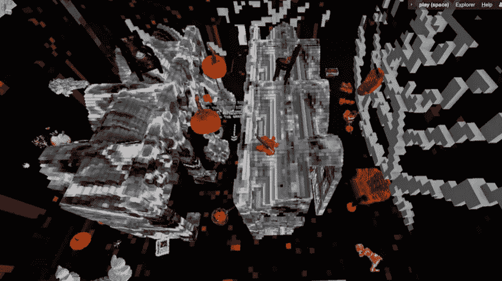

# 元宇宙隐体素的现在和未来

> 原文：<https://medium.com/coinmonks/present-future-of-cryptovoxels-metaverse-a4ed94f6b309?source=collection_archive---------3----------------------->

作者:DawnXue( [@dawnx666](https://twitter.com/dawnx666) )

翻译:秦九月([@秦九月](https://twitter.com/C_Chyn))

**前言**

在推特上， [CryptoVoxels](https://twitter.com/cryptovoxels) 团队表示，用户数据没有达到他们的预期，他们就此举行了公开讨论。这篇文章受到了那次讨论的启发。

**CryptoVoxels(CV)在地块所有权、交通和可穿戴方面表现如何？数据背后，有哪些问题及其可能的解决方案？**

首先，我们将讨论以下几个方面的数据和影响因素:

> *1。包裹所有者的数量。*
> 
> *2。月流量。*
> 
> *3。CV 可穿戴设备的数据。*

**地块所有者数量**

地块所有者的数量增长远低于新造地块的数量。截至 2021 年 10 月 15 日，共有 5，996 个包裹在 CV 上铸造。其中已售出 5603 辆。然而，只有 1576 个业主。下图跟踪每个月底的累计包裹数量和所有者数量。很明显，业主群的扩张速度比包裹群慢得多。

*Note: Number of parcels sold in the primary market is almost the same as number of parcels minted, so we’ve only kept the latter. A small percentage of ownerships result from gifts, which are not included in the figure above.*

拥有小块土地的人数增长缓慢可能主要归因于以下原因:

**包裹比较贵**。6000 美元这样的价格标签相对常见。尽管比真实世界的物理包裹便宜得多，但对于许多用户来说，这仍然是一个财务障碍。

**机构和某些个人拥有大量包裹**，使得出售给新来者的包裹变少。例如，2021 年 10 月 15 日，[MVB](https://metaverse-billboards.com/)(CV 上的一家户外媒体展示公司)拥有 148 个地块，而 justlike.eth(个人)拥有 40 个地块。

**购买过程相对复杂**。对于刚接触 CV 的人来说，更不用说刚接触 crypto 的人了，购买包裹的过程并不直观，也没有现成的信息或客户支持。

**月流量。**

无论多么缓慢，拥有小块土地的人数一直在上升。然而，月度流量波动很大，在 2021 年 4 月升至 1.59 百万的历史高点后，9 月份逐渐降至 0.83 百万，略高于高点的一半。好消息是，10 月上半月的流量已经达到了 0.64 百万，预计可能会反弹。

[https://www.k1ic.com/imgs/cv_month_traffic.png](https://www.k1ic.com/imgs/cv_month_traffic.png)

剧烈波动可能由以下原因引起:

CV 团队更倾向于技术和产品，而不是运营。CV 创始人 Ben 似乎专注于产品的科技面，只是偶尔通过 twitter 与用户互动，缺乏系统化运营。

**建造者更倾向于创造的短期满足，而不是明确的目标、用户交互性和长期价值**。一个例子是 MetaCat 书店，在那里你可以开派对，但你不能看书，所以在建筑完工后它并不经常被使用。

流量取决于事件。例如，下图显示了 [imnotArt Chicago](https://www.cryptovoxels.com/play?coords=6692W,72N,) 的日客流量，这是 2021 年 9 月访问量最大的地块之一。橙色柱表示有事件的天数，大大超过无事件的天数。

[https://www.k1ic.com/imgs/4927.png](https://www.k1ic.com/imgs/4927.png)

**CV 可穿戴设备的数据。**

截至 2021 年 10 月 15 日，536 个包裹所有者创造了 8，634 件 CV 可穿戴设备。平均而言，他们每个人创造了 16 种可穿戴设备，但记录保持者创造了 455 种可穿戴设备。这些可穿戴设备由 11532 个人拥有。拥有者的数量远远超过创造者，因为每件可穿戴设备都可以有多份拷贝。

以下是 CV 可穿戴设备面临的一些问题:

**除非你在 CV 上拥有一个包裹，否则你无法铸造可穿戴设备。每个人都可以制作可穿戴设备，但只有包裹所有者可以在 CV 上制作它们。这些障碍可能会阻碍高质量创作。**

除非你以前做过，否则穿上可穿戴设备很难。就像下图中的用户一样，为了戴上可穿戴设备,“新手”经常需要咨询他人。

现在，我们将从不同利益相关者的角度讨论上述问题:

> 1.CV 团队
> 
> 2.包裹所有者
> 
> 3.所有其他用户

**CV 团队**

CV 团队最近在流量和交互方面做了一些努力，取得了一些进展。

为了方便包裹所有者和访客之间的互动， **CV 于 2021 年 10 月 5 日增加了留言簿功能**。包裹所有者可以给所有在留言簿上签名的访客送礼物，或者复制他们所有的地址。

[https://www.cryptovoxels.com/play?coords=W@873E,9S](https://www.cryptovoxels.com/play?coords=W@873E,9S)

**CV 也在招聘营销**。2021 年 10 月 12 日，CV 的 Kasey 在推特上发布了一则招聘通知，招聘社交媒体、新闻发布和营销人员。

CV 也在考虑**让** **从脸书和 Twitter** 登录，以促进用户增长。当然，一些 CV 用户反对这样的举动，因为这些是集中的平台。

此时，用户的虚拟形象展示由 CV 的默认形象和用户的可穿戴形象组成，不允许用用户上传的 3D 文件替换默认形象。不过，根据 CV 的官方推特，这正在考虑中。如果实现，装扮头像会更有可玩性。

除了 CV 团队已经在考虑的上述问题之外，以下几点也值得注意:

CV 自由空间不仅可以通过 URL 访问，也不能从 CV 本身访问。但是自由空间的用户可能和包裹所有者一样有创造力。CV 是否应该允许从官方网站访问免费空间？我们是否应该建立一个连接免费空间和包裹的激励系统？也许这可以鼓励高质量的建设项目。

**我们是否应该为用户提供一个系统化的指南**，醒目地展示在 CV 官网上？例如，该指南可以涵盖如何购买包裹，以及如何穿上可穿戴设备。

**一级市场的包裹价格似乎面临着微妙的平衡**。较高的价格导致业主数量增长缓慢，而较低的价格直接损害了开发商的利益。目前，售价低于 1 英镑的包裹非常罕见。一级市场的低价也损害了现有地块所有者的经济利益和信心。

**包裹拥有者。**

**地块所有者在建筑时应该更多地考虑长远问题**:更多地考虑建筑的用途，而不是建筑的外观。

**游客和建筑之间的互动有助于交通。**有些建筑即使没有导游也很有可玩性。比如在 CV 的自由空间 [@uttermelone](https://twitter.com/uttermelone) 打造的万圣节主题场馆里，有一个寻找西瓜的游戏，你跟着一个导向箭头走。另一个名为 solar 的建筑，也在太空中，是一个程序化的互动游戏，模仿银河系。

play(space)[https://www . cryptovoxels . com/spaces/dfee9c 8d-6256-469 f-896 b-8 a 76 ab 1 be 45 c](https://www.cryptovoxels.com/spaces/dfee9c8d-6256-469f-896b-8a76ab1be45c)

太阳能(太空)[https://www . cryptovoxels . com/spaces/5f 439817-8122-4 DBF-8330-913 e 84600d 74](https://www.cryptovoxels.com/spaces/5f439817-8122-4dbf-8330-913e84600d74)

建筑物内访客之间的互动越强，停留时间越长，访客就越多。即使在一栋建筑里的玩家也不能形成有意义的互动，他们倾向于离开。然而，如果他们互动，例如 2021 年 10 月 13 日在[lep empire-Beach](https://www.cryptovoxels.com/play?coords=6484W,71S,)大楼的 5 分钟提问时间，游客会留下来。该网站的日流量达到 360。

[https://www.k1ic.com/imgs/4967.png](https://www.k1ic.com/imgs/4967.png)

对于活动来说，有组织的旅游似乎比分散的个人参观更好。在这里，我们比较两个刚刚举办过活动的场馆。在 [AILY gallery](https://www.cryptovoxels.com/play?coords=W@365W,9N) 中，对于 10 月 10 日的晚会活动，主持人组织了一次与嘉宾进行多人互动语音通话的游览。结果相当引人注目，有 305 名访客。相比之下， [BCA 巨作](https://www.cryptovoxels.com/play?coords=N@107E,324S)在其官方推特账户上呼吁游客拍照并留言。数据表明，至少在这种情况下，前一种方法更好。当然，活动组织者仍在探索不同的可能性，现在说什么是确定的最佳实践还为时过早。

[https://www.k1ic.com/imgs/1441.png](https://www.k1ic.com/imgs/1441.png)

[https://www.k1ic.com/imgs/1198.png](https://www.k1ic.com/imgs/1198.png)

**所有其他玩家**

这些是每个人都可以做的:

如果没有官方的操作指南，用户可以创建一个。我们计划根据 [Will Lang](https://twitter.com/FinanceYF3) 的[总结](https://www.yuque.com/ubiswap/cv/lxwm29)发布一套指南，主题包括:如何购买包裹，如何飞行和坐着，如何穿上可穿戴设备，如何给包裹和用户重新命名，如何铸造可穿戴设备。

**为 CV 包裹创建导航图。现在很难找到你喜欢的艺术家、朋友、地点等等。一张“什么在哪里”的图表肯定会有帮助。定期更新的景点推荐列表会更好。可能有隐藏的宝石:有趣的场地，交通很少。**

**建设中的新闻和事件摘要**。除了探索现有的场所，用户通常对新的东西感兴趣。数据已经每月更新(由 [CV Analytics](https://www.k1ic.com/cvb-zh.html) )。如果关于新建筑和新事件的信息可以被收集和发布，人们会阅读它们。

**易于使用和修改的交互式脚本。**剧本总是能加强互动性，但不是每个人都能写出剧本。一个现成的脚本库(或者更好的，带有演示的可修改脚本)可以帮助地块所有者建立更多的交互场所。

**CV 可穿戴设备生产流程的整合**。只有包裹所有者可以制造 CV 可穿戴设备，但他们可能不知道如何制造 vox 物体。那些知道如何制作 vox 对象的人可能不拥有地块。连接包裹所有者和“vox 制造商”将推动高质量可穿戴设备的创造。

**最后的想法**

[@AndrewSteinwold](https://twitter.com/AndrewSteinwold) 说:

15 年前，如果我告诉你，我们醒着的大部分时间都会盯着屏幕，这听起来可能是反乌托邦。今天，我们每天花大约 7 个小时在电视、智能手机和电脑上，没有人会眨一下眼睛。

这在今天听起来像是反乌托邦，但在大约 15 年后，我们将在元宇宙度过大部分时间，没有人会对此视而不见。**人类行为以我们几乎注意不到的方式改变和进化**

> 加入 Coinmonks [电报频道](https://t.me/coincodecap)和 [Youtube 频道](https://www.youtube.com/c/coinmonks/videos)了解加密交易和投资

## 也阅读

 [## 最佳加密交易所| 2021 年十大加密货币交易所

### ICON _ PLACEHOLDEREstimated 预计阅读时间:28 分钟加密货币交易所的加密交易需要知识…

blog.coincodecap.com](https://blog.coincodecap.com/crypto-exchange)  [## 2021 年 10 大最佳加密贷款平台| CoinCodeCap

### 当谈到加密货币贷款时，大量因素等同于良好的收入状况。此外，借款的一部分…

blog.coincodecap.com](https://blog.coincodecap.com/crypto-lending)  [## 2021 年最佳免费加密交易机器人

### 2021 年币安、比特币基地、库币和其他密码交易所的最佳密码交易机器人。四进制，位间隙…

medium.com](/coinmonks/crypto-trading-bot-c2ffce8acb2a)  [## 最佳 4 个加密交易信号电报通道

### 这是乏味的找到正确的加密交易信号提供商。因此，在本文中，我们将讨论最好的…

medium.com](/coinmonks/best-crypto-signals-telegram-5785cdbc4b2b)  [## BlockFi 评论 2021:利弊和利率| CoinCodeCap

### 今天，我们提出了一个全面的 BlockFi 评论，这是一个成立于 2017 年的加密贷款平台，拥有其…

blog.coincodecap.com](https://blog.coincodecap.com/blockfi-review)  [## 如何在印度购买比特币？2021 年购买比特币的 7 款最佳应用[手机版]

### 如何使用移动应用程序购买比特币印度

medium.com](/coinmonks/buy-bitcoin-in-india-feb50ddfef94)  [## 加密税务软件——五大最佳比特币税务计算器[2021]

### 不管你是刚接触加密还是已经在这个领域呆了一段时间，你都需要交税。

medium.com](/coinmonks/best-crypto-tax-tool-for-my-money-72d4b430816b)  [## 存储比特币的最佳加密硬件钱包[2021] | CoinCodeCap

### 保管您的数字资产很容易，但找到正确的存储方式却是一项繁琐的任务。在线钱包有一个风险…

blog.coincodecap.com](https://blog.coincodecap.com/best-hardware-wallet-bitcoin)