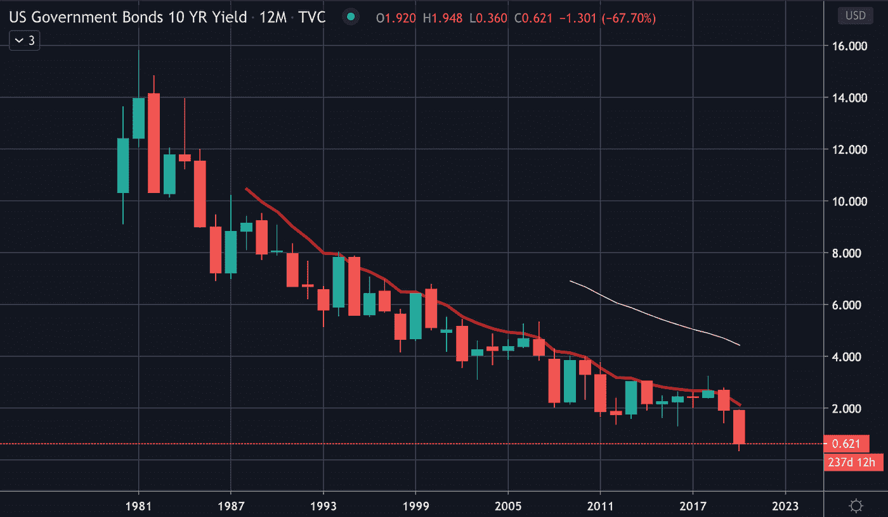
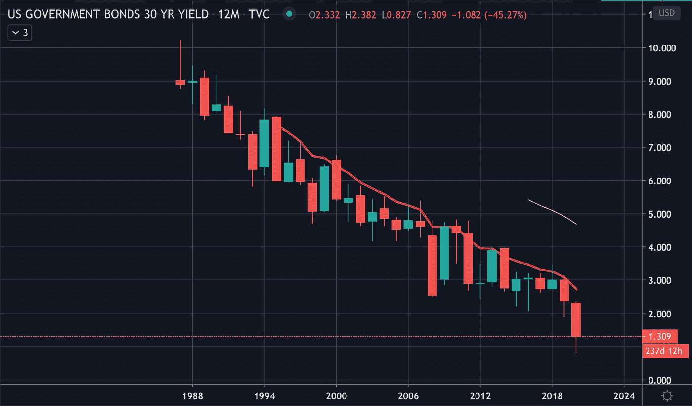
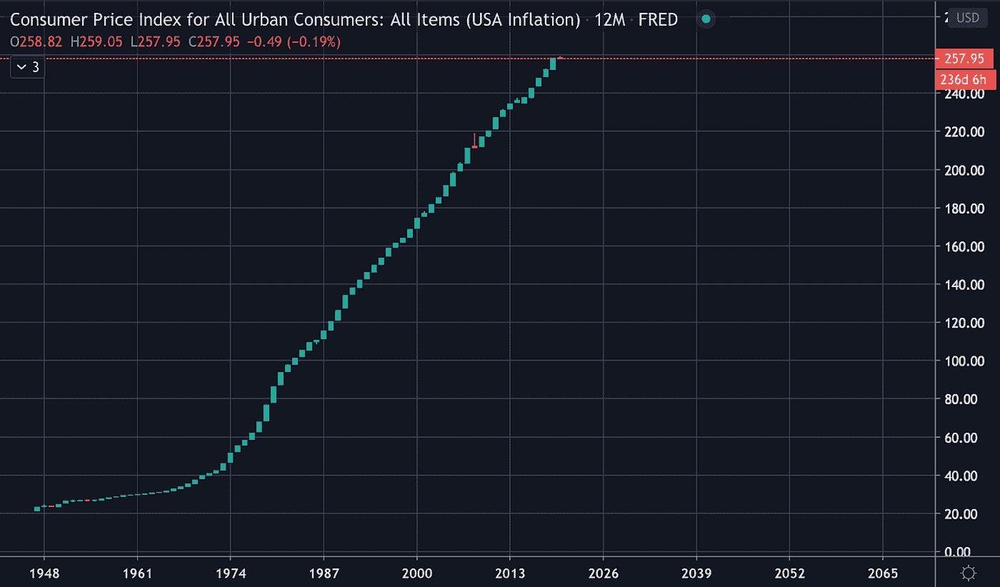
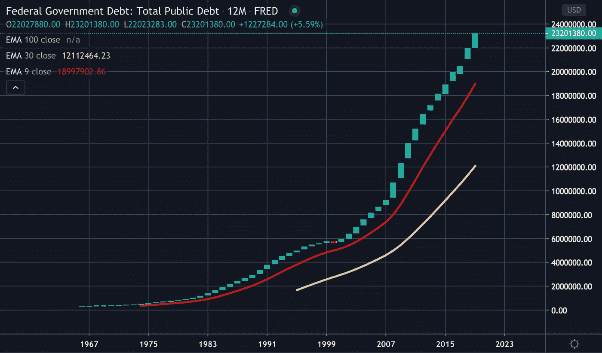

# 让你的钱保值

> 原文：<https://medium.com/coinmonks/preserving-the-value-of-your-money-a561e1b34477?source=collection_archive---------1----------------------->

## 亚历克斯·哈斯泰特

**免责声明:本文内容并非理财建议。作者不对读者的投资决策和选择负责。这取决于读者是否尽职调查自己的主题，了解与交易加密货币相关的风险，在做出任何投资选择之前咨询金融专业人士。**

我们距离 2020 年只有 5 个月的时间，而这一年已经变得相当曲折。随着新冠肺炎疫情影响世界大部分地区，世界的政治和经济气候已经升温到令人担忧的温度。

尽管第一波新冠肺炎的影响至少有点令人不安，但这并不是不寻常的知识，许多随之而来的方面已经被预见和预言了相当一段时间。

人们常说，2008 年是一个预示未来的信号，但许多人都忽略了眼前形势的严重性。

# 从富有到贫困

第二次世界大战定义了我们今天所知的世界，包括自 1944 年[以来美元被公认为世界储备货币的事实。](https://www.investopedia.com/articles/forex-currencies/092316/how-us-dollar-became-worlds-reserve-currency.asp)

这实质上意味着，美元一直是衡量其他一切事物价值的货币。

许多人，包括我自己，从来没有生活在一个不是这样的时代。不幸的是，由于我们缺乏第一手经验，我们中的许多人对美元在未来几年可能不会保持其价值的事实视而不见或一无所知。

纵观历史，世界目睹了不同的世界储备货币崛起，最终崩溃，被另一种货币取代。

再加上这样一个事实，尽管这可能不完全是有意的，世界大国可能正在通过增加[黄金](https://www.marketwatch.com/story/watch-out-america-china-and-russia-are-stockpiling-gold-2019-07-29)的重量来将美元从其全球宝座上拉下来。

现在，不管你知不知道，美元是由黄金支持的，从 1933 年开始就不是了。

# 货币的品质与现代现金的机制

历史上，人类用各种不同的东西作为“货币”的交换媒介。

从雅浦岛上发现的大型 Rai 石头到今天使用的纸张和金属，可以发现一些共同的特征。

正如 Saifedean Ammous 在*的比特币标准*中提到的，要想被视为一种货币形式，它必须:

*   充当交换媒介
*   能够被每个人容易地采用和使用
*   持有人可随时选择在市场上出售或交换
*   起到价值储存的作用，持有人可以确信其购买力价值始终保持不变或更高
*   能够分成多个单位，如便士到一美元的金额等。

# 好吧…但是我不认为美元有什么问题？

从客观、日常生活的角度来看，美元似乎并没有什么变化，但实际上，自 1933 年美国放弃金本位以来，美元的购买力已经显著下降。

首先，我们可以看看美国政府提供的债券的收益率，它允许人们购买债券，持有一段时间，并能够以(理想的)相等或更大的价值兑现。

第一张图表是 10 年期美国政府债券的收益率。如果您不熟悉如何阅读价格图表，蜡烛的长度表示给定时间内的价格范围(数字在右边框中，在底部框中)，颜色表示价格移动的方向(绿色=向上，红色=向下)。图表上的每根蜡烛代表一整年。

*(图表由 TradingView 提供)*

你不需要太深入地阅读图表，就能看出这项投资的收益率已经严重下降。在撰写本文时，我们看到 10 年期美国政府债券的收益率为 0.62 美元。这是从 1981 年近 15.80 美元的历史高点开始的。

如果你注意到，收益率从 2007 年到 2008 年从大约 4 美元下降到 2 美元(直接反映了当年的金融危机)。按照 2008 年至 2019 年的收益率，回报率相对保持不变……直到 2020 年，低点触及约 0.35 美元，截至本文撰写时已修正至 0.62 美元。

如果你看一看 30 年期美国政府债券，你会发现大致相同。自 1987 年以来，收益率大幅下降，当时收益率一度接近 10.25 美元。还要注意，2008 年收益率显著下降，2020 年再次显著下降。

*(图表由 TradingView 提供)*

那么，这到底有什么关系呢？嗯，政府债券一度被认为是一个人可以进行的最安全的投资，因为债券是由政府支持的，而不是银行。通过购买并持有一段时间的债券，人们有效地将他们的信任寄托在政府身上，认为他们将在一段时间内(10 年、30 年等)获得投资回报。).

2020 年 30 年期美国国债收益率跌至近 0.80 美元的低点。没错…30 年投资 80 美分的回报。想想看……

# 房间里的大象

虽然美元*符合之前列出的货币标准，但抛弃金本位制已经产生了严重的后果。*

首先，它让美国政府的支出远远超出了他们的能力，每次经济需要援助时，它都依赖美联储的印钞机印更多的钱。

但是如果经济强劲，我们就不需要救助，*对吗？*

那么是什么原因呢？到底是怎么回事*？*

烟雾和镜子，但要理解魔术是如何工作的，我们需要更深入地挖掘，看看几个相关的方面。

# 一帮银行

美联储负责控制美国的货币供应，但它不是美国政府的一部分。

那么谁在管理美联储呢？尽管美联储声称不属于任何个人或实体，但事实是控制权掌握在一个银行集团手中。

在美联储成立之前，美国经历过几次经济危机，1883 年和 1907 年，摩根用自己的钱拯救了美国。

1910 年，一些大银行的代表召开了一次高度秘密的会议，制定了一项提交给国会的计划。这将是他们解决经济问题的办法，但他们知道，如果他们知道这个计划是由银行为银行写的，没有人会投票支持这个计划。

最后，在 1913 年，美联储法案获得通过，有效地赋予了美联储(一个独立的实体，无论如何不是联邦政府)对国家货币供应的控制权。

# 金本位制

最初，因为美元是由黄金支持的，流通中的货币供应量直接反映了美国政府在其储备中持有的黄金数量。

由于大萧条时期的经济压力，美国政府在 1933 年放弃了金本位制，因为美国公民在囤积黄金。

这反过来允许美联储将货币供应量膨胀到远远超过该国的黄金储备，因为美元不再与黄金价值挂钩。

此外，在 1944 年，由于布雷顿森林协定，许多国家的货币价值与美元和黄金的汇率挂钩。这并不意味着美元是由黄金支持的，只是一种货币的价值等同于将美元兑换成黄金的成本。

准金本位并没有持续太久，1971 年，尼克松结束了这一局面，有效地切断了与金本位的最后联系，留下了美元和许多其他货币，作为自由浮动的货币，没有任何支持。

由于美联储创造更多货币的权力不再受金本位制的限制，美联储可以随心所欲地印刷政府需要的货币。

# 但我认为通货膨胀是好事？

在我成长和上学的过程中，我清楚地记得被告知通货膨胀是一件好事，这是美联储通过“刺激”市场来保持经济健康的方式。

我们经济的一个基本方面似乎是建立在这样一个理念上，即如果出现问题，创造更多的货币将会缓解这种情况。

现实情况与我最初认为的真相相去甚远。

我一生从未质疑过金钱是如何运作的，相信它总能支付我需要支付/被支付的东西。

# 考虑一下这个…

有没有想过是什么赋予了事物价值？

从最基本、最客观的角度来看，我们可以看到独一无二的物品通常都非常有价值，非常稀缺和稀有的物品也是如此。

有大量存在的物品往往价值较低，这也是显而易见的。为什么？因为你可以在任何地方得到它们！

同样的原则也适用于金钱。存在的货币越多，它就变得越不值钱。尤其是这样，它没有有价值的资产支持的时间越长。

当你考虑到美元仅仅是由人们对美国政府的信任所支撑，并且法定货币将能够做它所说的事情(在保值的同时充分充当货币)，这就变得非常麻烦了。

不可否认的是，在这个艰难的时刻，美联储向经济注入了数以百计的美元，有效地稀释了美元的购买力。

但是还有一个方面完全让我大吃一惊，这个方面在整个崩溃中扮演着重要的角色。

# 制作银行

你是否曾经停下来想知道，银行的钱似乎是无限的？

事实上，这是因为只要你把钱存在银行里，他们就会这么做。

当你把钱存入银行账户并持有时，银行会把钱取出来借给其他客户，这实际上是通过支付利息的过程凭空创造了钱。

这一过程被称为[部分准备金银行](https://www.investopedia.com/terms/f/fractionalreservebanking.asp)，它允许银行只需在金库中保留一定比例的实际银行持有量，允许银行扩大其资产，远远超出其能力。

如果你不能领会言外之意，这实质上意味着你银行账户里的钱大部分是 ***只是屏幕上的数字*** ，因为银行*并不需要*手头有实际的现金来支持他们的客户账户。

也许这整个场景中最可怕的可能性是，如果人们决定从银行取出他们的钱，银行可能会非常困难(如果不是崩溃的话)，特别是因为不是所有的钱都在那里。

# 结论

所以，美元只有信任作为后盾，美元越多，就越不值钱……然而美联储和银行系统不断创造货币……在经济危机的时候，我们能做些什么来保护你的财富呢？

传统上，黄金一直被认为是一种安全的资产，总是能够保持其价值。然而，随着比特币的诞生，人类获得了持有黄金固有好处的现代替代选择。

与美元的通胀方面相反，[比特币协议](https://blog.coincodecap.com/a-candid-explanation-of-bitcoin/)包含一个通缩模型，随着时间的推移，新供应的创造*会减少*，从而确保永远不会有超过 2100 万个比特币存在。

2020 年 5 月 11 日，比特币协议将经历“减半”，比特币的供应/创造速率将比目前的速率减半。

这种减半机制实际上意味着比特币将继续稀缺，因为其最终总供应量的 80%已经在流通，剩下的 20%左右将慢慢进入流通，持续到 2140 年左右。

理论上，由于比特币固有的通货紧缩性质，其价值应该保持稳定或更高(与美元相比)。然而，我们仍然处于比特币的时间框架的早期，即使价格确实出现波动，当前的价格也可能被大大低估，因为更多的公众采用以及更高的通货膨胀率只会推动比特币的价格上涨。

通货膨胀和比特币的价格有什么关系？还记得之前我说过美元是用来衡量某物价值的吗？

价格代表了美元对比特币的购买力。价格越高，比特币的购买力就越高。这带来了对比特币的更高需求，但对美元的购买力较低，因为每比特币花费更多美元。

现实情况是，随着更多的货币进入系统，所有东西的价格都会上涨，因为美元的购买力随着货币的增加而被稀释，货币流通在很大程度上反映了国家的整体债务，因为法定货币在今天看来只不过是一张借据。

*(图表按交易视图)*

*(图表由 TradingView 提供)*

# 黄金呢？

几个世纪以来，黄金一直是一种很好的避险资产，直到今天依然如此。不幸的是，归根结底，黄金很难用作货币，因为大量的黄金很难运输，而且黄金不容易分割(例如，如果我想把一盎司黄金分成更小的数量——并保持准确的重量——如果没有合适的工具，我会很难做到)。

很多人似乎分成了黄金和比特币两个阵营。如果这是一件大事，为什么不两者都拥有呢？分散投资组合是寻求投资的人可以做的最聪明的事情之一，因为它确保投资组合的价值与多个资产而不是一个或几个资产联系在一起。

# 明智地计划

由于美国政府在新冠肺炎疫情期间分发了如此多的钱，并考虑到美联储的行动以及通胀的后果，购买哪怕一小部分比特币也是有意义的，即使只是为了对冲美元的通胀性质。

在我们之前，许多人都在谈论金融体系会如何失败。如果你账户里的钱变得一文不值，对冲或许是你能做的最聪明的事情。

一段时间后，创可贴会变得又旧又粘，根据伤口的不同，有时需要新的创可贴，而其他时候，伤口需要更仔细的观察和不同的治疗。

2008 年的创可贴开始变得黏糊糊，部分准备金银行模式造成了过度杠杆化的债务出血，这些债务将需要在未来某个时候偿还，但美联储稀释了美元的力量，以至于上述债务可能永远不会偿还。

没有一个系统可以在不预期严重后果的情况下创造和超出其能力的支出。如果人们决定美元不再有价值，它就不会有价值。

> [直接在您的收件箱中获得最佳软件交易](https://coincodecap.com/?utm_source=coinmonks)

