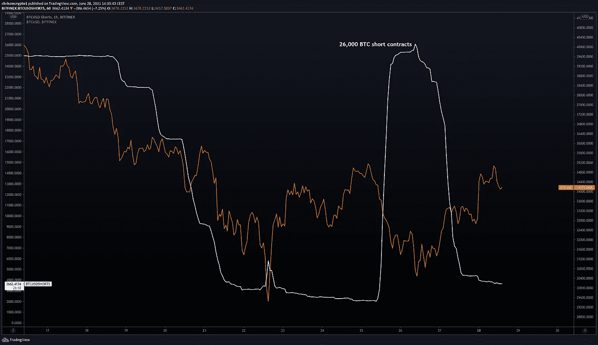
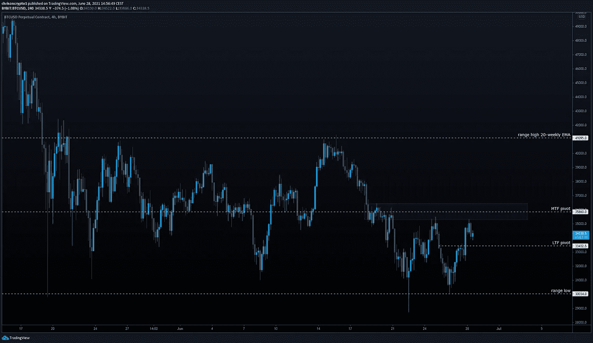
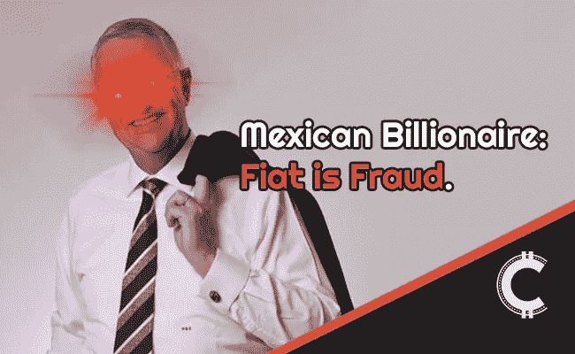

# 价格操纵？Bitfinex Whale 周末平仓空头头寸

> 原文：<https://medium.com/coinmonks/price-manipulation-bitfinex-whale-closes-short-position-over-the-weekend-3589cd828639?source=collection_archive---------7----------------------->

Photo by [Richard Sagredo](https://unsplash.com/@sagredophotography?utm_source=medium&utm_medium=referral) on [Unsplash](https://unsplash.com?utm_source=medium&utm_medium=referral)

上周末成功打压 BTC/美元的 Bitfinex 鲸已经平仓，为价格行动不受控制的进展打开了大门。与此同时，最新的链上数据显示，短期比特币持有者已将比特币出售给更强的人。

咱们挖吧。

# 墨西哥亿万富翁声称他的银行将接受比特币

领导墨西哥最大企业集团之一的亿万富翁商人里卡多·萨利纳斯·普里戈发布了大量支持比特币的推文，周日透露，他正在努力使他的阿兹特克银行成为墨西哥第一家接受比特币的银行。

萨利纳斯的推特帖子是对迈克尔·塞勒(Michael Saylor)的回应，他在一段视频中回应了这位墨西哥企业家将政府支持的纸币或菲亚特(fiat)称为“欺诈”，并敦促投资者购买比特币。

**查看** [全篇点击这里](https://chrisoncrypto.com/blog/f/mexican-billionaire-claims-his-bank-will-accept-bitcoin) **！**

***成为第一批收到此简讯的人！*** [***订阅此处***](http://www.chrisoncrypto.com) ***。***

# 技术上来说

## 比特币鲸鱼平仓做空

比特币在周末测试了低点，尽管交易量很低，但再次在 30，000 美元上方找到了支撑。

自那以后，BTC/美元图表呼吸着似曾相识的气息，价格再次从低点上涨 17%，达到 35，300 美元。在周一早盘交易中，随着买家进场，加密交易价格略高于 34，400 美元。

正如 Twitter 所报道的，越来越多的空头合约是在埃隆·马斯克(Elon Musk)在 Twitter 上发布比特币之后出现的，这标志着完美的本地顶部。在这条推文发布后不久，一只 Bitfinex 鲸鱼用大约 26，000 BTC 做空比特币，而价格开始下跌。

碰巧的是，BTC [见证了](https://www.tradingview.com/x/zZ20ycID/)连续 15 个红色小时蜡烛。通常情况下，很难确定价格是否受到这样或那样的操纵，但在这种情况下，很明显 Bitfinex 鲸鱼是幕后黑手。

当有关价格操纵的报道扩散时，买家介入，Bitfinex 实体开始平仓(回购)，最终进一步支撑了 back 美元价格。

鲸鱼已经平仓了他 90%的空头头寸。

## BTC/美元瞄准区间高点？

现在，迫在眉睫的威胁已经消退，比特币似乎表现出价格上涨的倾向。

然而，只要价格行为保持在上述范围内，35，800 美元(或 36，000 美元)仍然是决定中期预期的关键水平。多头将在支点上方寻找几个 4 小时蜡烛线收盘点，而空头将试图通过卖出来捍卫这一水平。

根据 4 小时(MTF)图，BTC/美元已经形成了一个双底结构，表明动能最终有利于多头。如果支点被收回，那么 40，000 美元是下一个目标。

## 链上数据提供融合

当在链上数据的背景下看时，很明显[短期比特币持有者](https://twitter.com/ChrisOnCrypto1/status/1408745738360741889)已经投降。

正如链上分析师 [Lex Moskovski](https://twitter.com/mskvsk/status/1408735775076847621) 所指出的，短期持有者支出产出利润率显示年轻的硬币(短期交易者)已经“投降”，该指标达到自 2020 年 3 月崩盘以来从未见过的水平。这一更新表明，所有打算出售的人都已经出售了，天平再次向有利于买家的方向倾斜。

另一个表明有利市场条件的连锁数据点是稳定的硬币供应比率振荡器(源自 [SSR](https://twitter.com/ChrisOnCrypto1/status/1408079628007313415) )。简而言之，稳定币供应量比率(SSR)是比特币供应量与以 BTC 表示的稳定币供应量之间的比率，或:比特币市值/稳定币市值。当 SSR 较低时，当前稳定的货币供应有更多的“购买力”来购买 BTC。

说白了，有大量盯住美元的稳定货币在场外等待，准备一接到通知就投入市场。

总而言之，棋子摆好了，游戏开始了。

这次公牛会大规模出现吗？时间会证明一切。

下次再见。

**加入** [电报](https://t.me/chrisoncryptochannel) **频道，实时更新&设置！
关注我** [推特](https://twitter.com/ChrisOnCrypto1) **&** [多嘴多舌](https://gab.com/chrisoncrypto) **下面还有我的社交门户。**

[https://www.paypal.com/donate?hosted_button_id=C9VRLGTBHQX2N](https://www.paypal.com/donate?hosted_button_id=C9VRLGTBHQX2N)

# 阅读更多:墨西哥亿万富翁声称他的银行将接受比特币

[https://chrisoncrypto.com/blog/f/mexican-billionaire-claims-his-bank-will-accept-bitcoin](https://chrisoncrypto.com/blog/f/mexican-billionaire-claims-his-bank-will-accept-bitcoin)

[http://www.chrisoncrypto.com/](http://www.chrisoncrypto.com/)

你也可以用比特币支持我！
BTC 地址:**3 eydseypjhn 68 axkncuqbb 7 ebqcxrejamr**

最诚挚的问候，
**克里斯托·阿塔尔德**
克里斯通密码的创始人
贡献者[www.cityam.com](https://www.cityam.com)
直接接通:[电报](https://t.me/chrisoncrypto)

*最初发布于*[*https://mailchi . MP*](https://mailchi.mp/830d13c7b96c/price-manipulation-bitfinex-whale-closes-short-position-over-the-weekend?e=[UNIQID])*。*

> 加入 [Coinmonks 电报频道](https://t.me/coincodecap)，了解加密交易和投资

## 另外，阅读

*   [网格交易机器人](https://blog.coincodecap.com/grid-trading) | [加密交易机器人](/coinmonks/cryptohopper-review-a388ff5bae88) | [加密交易机器人](https://blog.coincodecap.com/best-crypto-trading-bots)
*   [加密复制交易平台](/coinmonks/top-10-crypto-copy-trading-platforms-for-beginners-d0c37c7d698c) | [如何在 WazirX 上购买比特币](/coinmonks/buy-bitcoin-on-wazirx-2d12b7989af1)
*   [信用贷款审核](/coinmonks/coinloan-review-18128b9badc4)|[Crypto.com 审核](/coinmonks/crypto-com-review-f143dca1f74c) | [货币融资融券交易](/coinmonks/huobi-margin-trading-b3b06cdc1519)
*   [尤霍德勒 vs 科恩洛 vs 霍德诺特](/coinmonks/youhodler-vs-coinloan-vs-hodlnaut-b1050acde55a) | [Cryptohopper vs 哈斯博特](https://blog.coincodecap.com/cryptohopper-vs-haasbot)
*   [加密货币储蓄账户](/coinmonks/cryptocurrency-savings-accounts-be3bc0feffbf) | [YoBit 审查](/coinmonks/yobit-review-175464162c62) | [Bitbns 审查](/coinmonks/bitbns-review-38256a07e161)
*   [Botsfolio vs nap bots vs Mudrex](/coinmonks/botsfolio-vs-napbots-vs-mudrex-c81344970c02)|[gate . io 交流回顾](/coinmonks/gate-io-exchange-review-61bf87b7078f)
*   [Godex.io 评审](/coinmonks/godex-io-review-7366086519fb) | [邀请评审](/coinmonks/invity-review-70f3030c0502) | [BitForex 评审](/coinmonks/bitforex-review-c4bb28d9e271) | [北海巨妖评审](/coinmonks/kraken-review-6165fc1056ac)
*   [最佳比特币保证金交易](/coinmonks/bitcoin-margin-trading-exchange-bcbfcbf7b8e3) | [萝莉点评](/coinmonks/lolli-review-e6ddc7895ad8) | [比特币保证金交易](https://blog.coincodecap.com/bityard-margin-trading)
*   [创造并出售你的第一个 NFT](https://blog.coincodecap.com/create-nft) | [本地比特币评论](/coinmonks/localbitcoins-review-6cc001c6ed56) | [Prokey 评论](/coinmonks/prokey-review-26611173c13c)
*   [加密保证金交易交易所](/coinmonks/crypto-margin-trading-exchanges-428b1f7ad108) | [赚取比特币](/coinmonks/earn-bitcoin-6e8bd3c592d9) | [Mudrex 投资](https://blog.coincodecap.com/mudrex-invest-review-the-best-way-to-invest-in-crypto)
*   [WazirX vs CoinDCX vs bit bns](/coinmonks/wazirx-vs-coindcx-vs-bitbns-149f4f19a2f1)|[block fi vs coin loan vs Nexo](/coinmonks/blockfi-vs-coinloan-vs-nexo-cb624635230d)
*   [杠杆令牌](/coinmonks/leveraged-token-3f5257808b22) | [最佳密码交易所](/coinmonks/crypto-exchange-dd2f9d6f3769) | [Paxful 点评](/coinmonks/paxful-review-4daf2354ab70)
*   [加密套利](/coinmonks/crypto-arbitrage-guide-how-to-make-money-as-a-beginner-62bfe5c868f6)指南| [如何做空比特币](/coinmonks/how-to-short-bitcoin-568a2d0b4ae5) | [1xBit 回顾](https://blog.coincodecap.com/1xbit-review)
*   [如何在印度购买以太坊？](https://blog.coincodecap.com/buy-ethereum-in-india) | [如何在币安购买比特币](https://blog.coincodecap.com/buy-bitcoin-binance)
*   [在美国如何使用 BitMEX？](https://blog.coincodecap.com/use-bitmex-in-usa) | [BitMEX 评论](https://blog.coincodecap.com/bitmex-review) | [期货交易机器人](/coinmonks/futures-trading-bots-5a282ccee3f5)
*   [最佳加密交易信号电报](/coinmonks/best-crypto-signals-telegram-5785cdbc4b2b) | [MoonXBT 评论](/coinmonks/moonxbt-review-6e4ab26d037) | [OKEx 评论](/coinmonks/okex-review-6b369304110f)