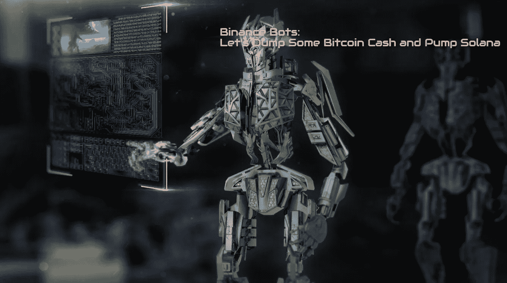
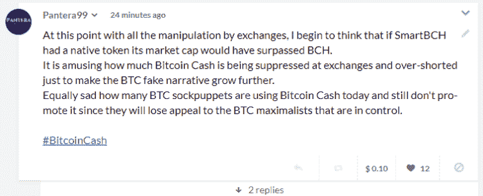
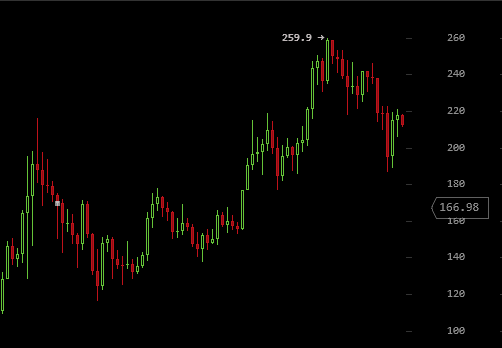
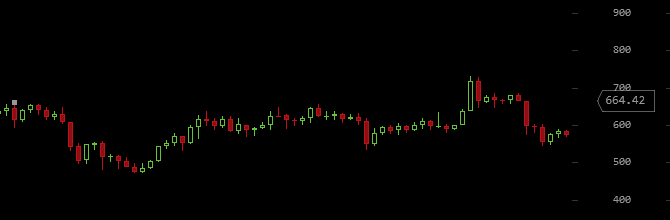
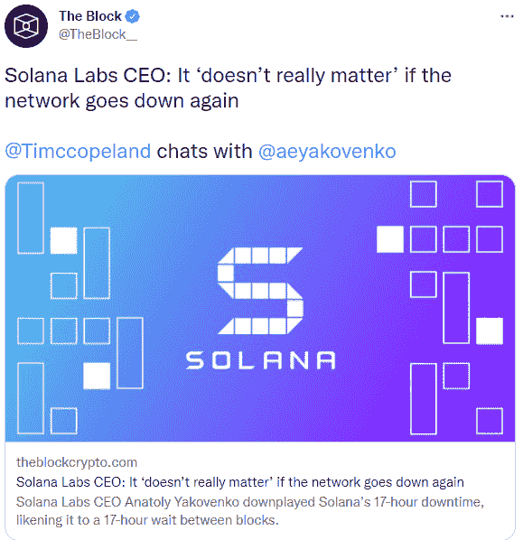

# 比特币现金的价格抑制和操纵——交易所“抽水”黑幕网络(索拉纳)

> 原文：<https://medium.com/coinmonks/price-suppression-and-manipulation-of-bitcoin-cash-exchanges-pumping-shady-networks-solana-ad5f3a7c1481?source=collection_archive---------13----------------------->

*Source:* [*Pixabay*](https://pixabay.com/tr/photos/robot-makine-teknoloji-kentsel-ai-2301646/)

SmartBCH 预示着智能合约、区块链互操作性、Web3 开发、去中心化金融和强大的比特币现金网络的 NFTs 的新时代。

SmartBCH 是比特币现金最先进的侧链。在 mainnet 发布以来的几个月里，受到了成千上万用户的欢迎。不可否认，网络效应和 SmartBCH 的内在潜力足以推动比特币现金再次成为人们关注的焦点，因为 **BCH 是 SmartBCH** 的原生加密程序。

此外，连锁发展增加了我们的期望。比特币现金不像其他区块链网络那样受到集中化发展的影响。

比特币现金由 hashpower 支持，其价值达到了今天的 2 Exahash，**比莱特币和以太坊的 hashrate 加起来还要高(** [**link**](https://bitinfocharts.com/comparison/hashrate-eth-ltc-bch.html#3y) **)。**

然而，对于所谓的密码专家或盲目投资的羊群投资者来说，似乎连网络安全都不重要，他们只是盲目地听从像 Twitter 和 Reddit 这样的骗子的建议。

看来公众喜欢被操纵。不过，这一直是趋势。

# 比特币(BCH)是 SmartBCH 的本地令牌

我今天写了一篇噪音，表达了我对交易所对待比特币现金的担忧。

[**noise.cash**](https://noise.cash/post/z2403p0svr4n)

> … **我开始想，如果 SmartBCH 有一个本地令牌，它的市值就会超过 BCH。**
> 
> [noise . cash](https://noise.cash/post/z2403p0svr4n)

SmartBCH 已经有成千上万的用户。40 个不同的项目，3 个指数，还有 3 个正在开发中，一个即将开放交易的 NFT 市场，各种成功的 NFT 项目，以及巨大的潜力。

你觉得 Solana，AVAX，Algorand，Terra-Luna 有多少用户？

所有这些项目的绝大多数社区是由价格采纳驱动的投机者构成的。“数字上升”。没有人使用这些网络，SmartBCH 提供了更好的替代方案。

我以前写过同样的关于卡尔达诺，波尔卡多特，和其他一些。卡尔达诺和波尔卡多特一直都是关于推广和营销的。公关和有组织的活动将这些项目带入了一个不应有的市场地位。我从一开始就对这两个网络持批评态度，特别是自 2017 年 Cardano 开始积极开展推广活动以来。

我提到的其余部分与卡尔达诺相同，但更加集中。

尤其是索拉纳，似乎是由个人恶意隐藏 2020 年流通的硬币总数( [source1](https://twitter.com/Justin_Bons/status/1456703476633939972) ， [source2](https://web.archive.org/web/20200701055655/https://medium.com/coinmonks/solanas-snowball-of-lies-entraps-sol-holders-after-a-month-long-coin-burn-deception-ce908dc0a398) )集中运营。

> 原生区块链探索者(【explorer.solana.com】)是一个热门垃圾。在某一点上，交易甚至没有时间标记，使得审计和问责几乎不可能。
> 
> [**来源**](https://web.archive.org/web/20200701055655/https://medium.com/coinmonks/solanas-snowball-of-lies-entraps-sol-holders-after-a-month-long-coin-burn-deception-ce908dc0a398)

后来，在今年九月，索拉纳的网络关闭了近一天！

**让我重复一下:**

索拉纳网络瘫痪了 17 个小时！

> Solana 的开发者决定在 7 个多小时的停机后重启网络。
> 
> [Coindesk](https://www.coindesk.com/markets/2021/09/14/solana-validators-ready-potential-restart-amid-blockchain-outage/)

停机时间**是 17 个小时**，尽管([来源](https://www.youtube.com/watch?v=jf9JfOmEWp8))。

无法破解的秘密新闻渠道再次发布错误信息。

**索拉纳只是一个集中的黑幕项目**交换“泵”到木星。

这是自 9 月 15 日事件发生，开发商“重启”索拉纳集中网络后，索拉纳普莱斯的反应。

**SOLUSD 1D Chart. (**The dot depicts the September 14th candle.)

从 166 美元，它达到了一个新的 ATH 260 美元后，所有的批评和停机时间！

然而，**比特币现金在同一时间段内不断陷入加密兑换操纵的深渊。**

**Chart: BCHUSD Daily** since September 14th (dot):

说真的。**今天没人卖比特币现金**。

尤其是在 SmartBCH 的当前发展情况下。这是恐惧战术，也是出售数字、而非杠杆空头区块链交易的交易所容易得手的猎物。

SmartBCH 是分散的，很快将升级以降低甚至更低的费用(90%)。这是 DeFi、NFTs 和任何智能合约应用的终极互操作侧链。没有一个头脑正常的人会在拥有如此巨大潜力和发展前景的情况下卖掉他们的 BCH。

交易所和“秘密专家”等对索拉纳的巨大支持，以及秘密媒体的庆祝活动，这些媒体不顾所有主要的危险信号继续大规模宣传索拉纳(因为他们是被付钱来这样做的)。

最终的结果是，币安昨日完全没有比特币现金可供提现。

它**一直保护着像 Chainlink、Solana 和其他集中的、见不得人的网络这样的软件**，只是为了继续从那些不断往垃圾箱里扔钱的天真的投资者身上赚取数十亿美元。

[*Source*](https://twitter.com/TheBlock__/status/1461722139854311430)

我告诉你一件事。我会买索拉纳，但不是今天。

不是 200 美元。**我会以 1 美元甚至更低的价格购买索拉纳，因为这是这个令牌的公允价值。**如果哪天不永久关机，马上潜到零。

我会回来，引用这篇文章，当着所有支持这种集中垃圾的人的面说出来。当然，到那时所有这些花招都将不复存在。他们被支付一定的时间来保持垃圾邮件的废话，并继续下一个和下一个。

与索拉纳有关的任何事情都有巨大的风险。无论是在 it 基础上开发、投资，还是以任何方式使用 Solana，所涉及的风险都是至关重要的。

# 最后

投资者应该明白，比特币现金有着巨大的潜力。

一个从未关闭、始终安全、完全可靠、散列率高(高于莱特币和以太坊)的运营网络。一个分散的网络，提供高容量和高效率，极低的费用和闪电般的交易速度。

不是短期投机者，但真正发现区块链网络价值的投资者应该**投资比特币现金**，因为这是目前可用的最佳选择**。**

考虑一下这个财务建议。来自交易所的操纵能持续多久？几个月？几年？10 年或更长时间的长期投资是关于网络的效用。

比特币现金社区的数量正在快速增长。我不认为任何这样的操纵能持续一两年以上。

每一个比特币现金的新来者都需要几个月的时间来理解从事这项工作的人身上有一种风气。比特币现金的专业方法与索拉纳这样不安全、集中、见不得人的网络毫无关系。

Writing at the following websites: ● [ReadCash](https://read.cash/@Pantera) ● [NoiseCash](https://noise.cash/u/Pantera99) ● [Medium](/@panterabch) ● [Hive](https://hive.blog/@pantera1) ● [Steemit](https://steemit.com/@pantera1) ●[Vocal](https://vocal.media/authors/pantera) ● [Minds](https://www.minds.com/pantera99/) ● [Twitter](https://twitter.com/Panterabch) ● [LinkedIn](https://www.linkedin.com/in/panterabch/) ● [email](https://read.cash/@Pantera/localcryptos-p2p-exchange-is-now-offering-bitcoin-cash-trading-06637230#bad-link)

**备注:**

> **免责声明**:本内容中发布的所有材料均用于娱乐和教育目的，并符合合理使用准则。无意侵犯版权。如果你是或代表本文所用材料的版权所有者，并且对所述材料的使用有问题，请发送[电子邮件](https://read.cash/@Pantera/cryptouknowns-battlegrounds-the-crypto-battle-royal-part-i-0ca762da#bad-link)。这篇文章或我发表的任何文章都不是金融建议，但包含与投资研究相关的信息。

***支持内容创作者。***

如果你喜欢这个故事，就订阅吧！

*原发布于*[*https://read . cash*](https://read.cash/@Pantera/price-suppression-and-manipulation-of-bitcoin-cash-exchanges-pumping-shady-networks-solana-cd0c16ad)*。*

> 加入 Coinmonks [电报频道](https://t.me/coincodecap)和 [Youtube 频道](https://www.youtube.com/c/coinmonks/videos)了解加密交易和投资

## 也阅读

 [## 杠杆代币[多头代币]终极指南

### 杠杆化令牌是具有杠杆化风险敞口的 ERC20 令牌，不考虑保证金、要求、管理…

medium.com](/coinmonks/leveraged-token-3f5257808b22)  [## 最佳加密交易所| 2021 年十大加密货币交易所

### 编辑描述

blog.coincodecap.com](https://blog.coincodecap.com/crypto-exchange)  [## 2021 年最佳加密借贷平台| 6 大比特币借贷平台

### 获得比特币和其他加密货币的最佳贷款利率

medium.com](/coinmonks/top-5-crypto-lending-platforms-in-2020-that-you-need-to-know-a1b675cec3fa)  [## 2021 年最佳免费加密交易机器人

### 2021 年币安、比特币基地、库币和其他密码交易所的最佳密码交易机器人。四进制，位间隙…

medium.com](/coinmonks/crypto-trading-bot-c2ffce8acb2a)  [## 最佳 4 个加密交易信号电报通道

### 这是乏味的找到正确的加密交易信号提供商。因此，在本文中，我们将讨论最好的…

medium.com](/coinmonks/best-crypto-signals-telegram-5785cdbc4b2b)  [## 5 个最佳社交交易平台[2021] | CoinCodeCap

### 编辑描述

blog.coincodecap.com](https://blog.coincodecap.com/best-social-trading-platforms)  [## BlockFi 评论 2021:利弊和利率| CoinCodeCap

### 编辑描述

blog.coincodecap.com](https://blog.coincodecap.com/blockfi-review)  [## 如何在印度购买比特币？2021 年购买比特币的 7 款最佳应用[手机版]

### 如何使用移动应用程序购买比特币印度

medium.com](/coinmonks/buy-bitcoin-in-india-feb50ddfef94)  [## 加密税务软件——五大最佳比特币税务计算器[2021]

### 不管你是刚接触加密还是已经在这个领域呆了一段时间，你都需要交税。

medium.com](/coinmonks/best-crypto-tax-tool-for-my-money-72d4b430816b)  [## 存储比特币的最佳加密硬件钱包[2021] | CoinCodeCap

### 编辑描述

blog.coincodecap.com](https://blog.coincodecap.com/best-hardware-wallet-bitcoin)  [## Pionex 评论 2021 |免费加密交易机器人和交换

### Pionex 是为交易自动化提供工具的后起之秀。Pionex 上提供了 9 个加密交易机器人…

medium.com](/coinmonks/pionex-review-exchange-with-crypto-trading-bot-1e459d0191ea)