# PrimeXBT 评论 2021 —它是合法的还是骗局？[已更新]

> 原文：<https://medium.com/coinmonks/primexbt-review-88e0815be858?source=collection_archive---------1----------------------->

[PrimeXBT](https://blog.coincodecap.com/go/primexbt) 是一家领先的加密货币交易所，于 2019 年初在塞舌尔成立。它呈指数增长，客户遍布全球。该公司的愿景是创建一个创新平台，为其用户提供日常交易活动所需的基本工具。 [**ADVFN 国际金融大奖**](https://uk.advfn.com/awards) 授予 PrimeXBT 2020 年度最佳[加密保证金交易](/coinmonks/the-most-simple-guide-to-cryptocurrency-margin-trading-69f7fafb1960)奖。

它有一个强大的平台，适合新手和有经验的交易者。 [PrimeXBT](https://blog.coincodecap.com/go/primexbt) 每秒执行 12，000 笔订单，与超过 12 家流动性提供商集成。

# **交易产品**

[PrimeXBT](https://blog.coincodecap.com/go/primexbt) 在其平台上提供加密货币资产、指数、外汇和商品交易。

*   **加密货币**:支持五种加密货币。分别是比特币、以太坊、莱特币、Ripple、EOS。
*   **指数:**它为你提供世界上最受欢迎的交易指数。其中包括富时 100 指数、标普 500 指数、DAX 30 指数、ASX 200 指数等等。
*   **外汇:**您可以交易主要和次要货币对。你将被收取佣金，也称为交易费。
*   商品:你可以投机石油、黄金、天然气等商品的价格。

# **PrimeXBT 杠杆交易**

PrimeXBT 为你提供杠杆交易，以获得比你在基金中投入更多的资产。它给了你用“借来的资金”赚钱的优势如果资产价格下跌，你甚至可以赚钱。

对于加密对，您可以在外汇对上获得最大 100:1 和高达 1000:1 的杠杆比率。确切的杠杆率取决于资产的类型及其规模。如你所见，与其他交易所相比，它们提供了更高的杠杆率。较大的头寸需要更多的保证金来减少你的风险敞口，最终降低风险。

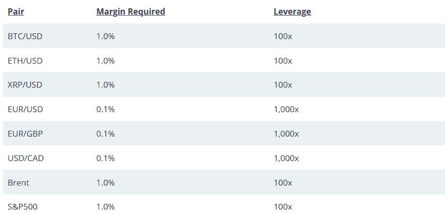

Leverage offered on different cryptocurrency pairs.

例如，假设你的交易账户上有 10，000 美元。你赌 100 美元，BTC 会以 100 倍的杠杆做多。如果 BTC 升值 10%，你将赚 1000 美元。另一方面，如果 BTC 贬值 10%，你将损失 1000 美元。可能会有巨大的利润和损失。

# **订单**

PrimeXBT 提供一系列订单类型。这允许你为进入和退出定义特定的级别。它具有大多数标准订单类型，以及一些保护订单。它们包括:

*   **市场订单:**这是最直接的传统订单之一。它们以现行市场价格立即配售和执行。如果你想立即买入或卖出，你通常会使用这个指令。
*   **限价单**:这种类型的订单是在远离市场的预定水平上购买或出售资产。第二次市场触及这个水平；您的订单将被自动执行。就这些请求建立的时间而言，它们要么是“有效的，直到被清除”，这意味着它们将永远保持这种状态。另一方面，这些订单只能是当天完成的当天订单。
*   **止损市价单**:这些类似于达到特定预设水平后的市价单。你可以用它们作为“止损”指令来限制你头寸的损失，或者在有利的头寸上获利。
*   **保护令**:这些保护令可以作为对你目前持有的任何头寸或订单的额外保护。您可以点击订单上的“设置止损/止盈”框，在新市场设置止损、限价或止损订单。你也可以设置一个保护订单，让你的主订单在它上面。它们就像密码交换的“安全闸”。
*   **一个取消另一个(OCO)** :这些是订单，其中一个订单的执行将触发另一个订单。在这里，您根据优先级设置订单。如果您的“1”号订单被执行，其他订单将自动取消。它让你建立复杂的互动和分层投资。

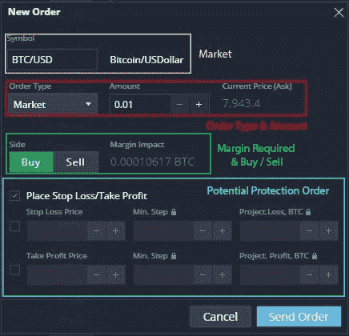

Order form at PrimeXBT

建议在交易时使用保护令，因为你将会面临很多杠杆。你不应该忘记“**订单滑点**所包含的风险这种情况发生在你下单的时候，你得到的价值甚至还没有接近你的理想进场点。

下滑可能有各种原因-

1.市场上的流动性有限。

2.exchange 匹配引擎不够快。

PrimeXBT 建立了一个高效的交易引擎，可以在不到 7.12 毫秒的时间内执行订单。这意味着你可能会有更少的滑动。

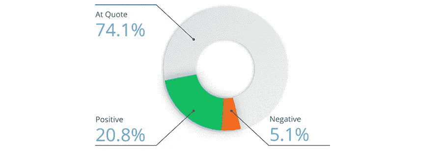

PrimeXBT review: Order Slippage Stats

# 如何使用 PrimeXBT

您可以通过点击 [**注册**](https://blog.coincodecap.com/go/primexbt) 选项卡来创建您的帐户。之后，您将收到一封电子邮件进行验证。您也可以在登录后启用双因素身份验证。没有必要做 KYC 验证。这是一个完全匿名的交流。

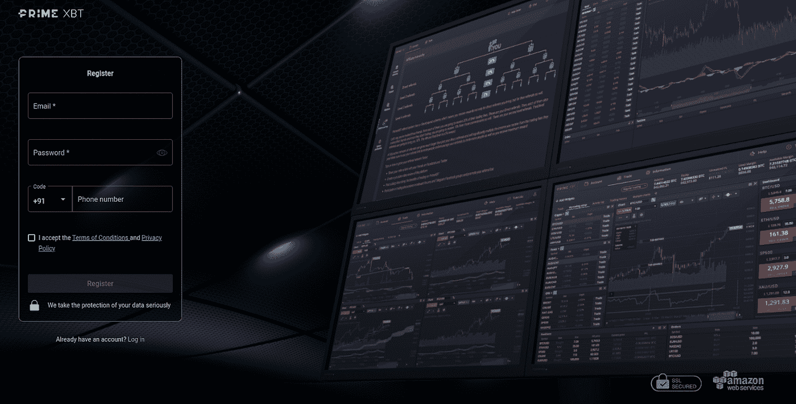

PrimeXBT Signup

# **PrimeXBT 审核:存款**

您必须到您帐户的[存款](https://primexbt.com/my/account/deposit)页面进行存款。你有两个选择-

## 1.**比特币直接存款**

你可以直接把比特币从你的比特币钱包转到你的 PrimeXBT 钱包。你可以通过扫描二维码或复制比特币存款地址来实现。存款金额没有限制。

## 2.**通过银行/借记卡存款**

你可以通过 PrimeXBT 的合作伙伴 CEX 用你的信用卡购买比特币。你必须点击“购买比特币”，这是 CEX 的一个小工具，会弹出来帮助你购买 BTC。

资金可能需要一段时间才能反映到您的帐户中，因为总共需要在网络上进行六次确认。

# PrimeXBT 审查:**提款**

所有 PrimeXBT 提现都是用[比特币](https://blog.coincodecap.com/a-candid-explanation-of-bitcoin)。考虑到安全性，有限的加密货币放在热钱包中，其余的放在冷钱包中。它每天在协调世界时 12:00 到 14:00 之间处理一次所有待处理的提款。如果您在世界协调时 12:00 之前提出请求，将在当天处理；否则第二天处理。

如果怀疑有可疑活动或超过特定金额，PrimeXBT 有权在批准提款请求之前对其进行人工审查。这可能会延迟取款，直到取款被批准。

如果您想取款，您必须导航至您账户的[取款](https://primexbt.com/my/account/withdraw)页面。步骤如下-

*   选择您的取款地址
*   输入您想要提取的比特币金额，然后点击提交
*   通过电子邮件确认取款。

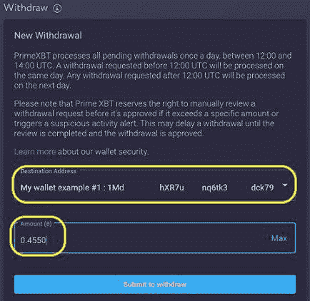

PrimeXBT review: Withdrawals

# **PrimeXBT 费用和收费**

有两种费用:交易费和隔夜费。前者是入仓收费，后者是隔夜融资建仓。

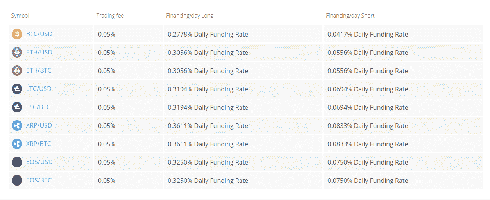

PrimeXBT margin trading Fees

交易费用在 0.01–0.05%之间，相比其他交易所较低。您还可以获得 30 天滚动交易量的折扣。

*   300–600 BTC:七五折优惠
*   600 + BTC: 五折优惠

它不会向您收取存款费用。提取资金时，您必须支付任意的矿工费用(行业标准)才能完成交易。

他们也有交易限额。在 [PrimeXBT](https://blog.coincodecap.com/go/primexbt) 交易平台上，您可以维持的仓位大小是有限制的。如果超过限额，您的订单将不会被执行。限制取决于波动性、工具流动性和其他市场条件等因素。

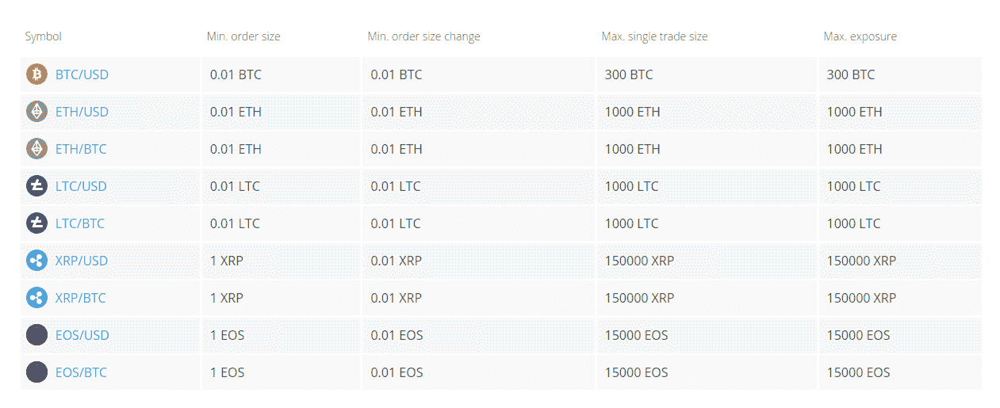

PrimeXBT review: Trading Limits Chart

# **PrimeXBT 安全**

使用 Cloudflare 保护它免受 DDOS 攻击。该平台由 Amazon Web Services (AWS)提供的 SSL 保护。这将加密所有通过互联网传输的数据。只有少量资产存储在热钱包中；剩下的存放在冰冷的钱包里。所有从冷钱包到热钱包的转账都是通过 [PrimeXBT](https://blog.coincodecap.com/go/primexbt) 手动转账。他们使用“bcrypt”算法来存储密码，也就是说，即使黑客能够访问服务器，他们也无法获得你的密码。

为了提供额外的安全层，它提供了谷歌的双因素认证。它只使用谷歌认证应用，不使用短信。你必须选择“启用 GA”在谷歌认证部分在你的帐户。您应该保留密钥的备份，并通过输入生成的代码来确认设置。

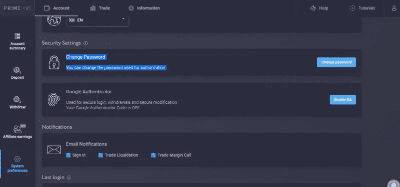

PrimeXBT security review

它使用**比特币地址白名单**为客户的资金提供额外的一层保护。您只能向白名单中的钱包地址取款。如果你犯了任何一个错误，都会造成资金的永久损失；通过白名单确认外部[比特币钱包](/coinmonks/the-best-cryptocurrency-hardware-wallets-of-2020-e28b1c124069)地址至关重要。您可以通过进入取款选项卡并添加一个新地址来将钱包地址列入白名单。

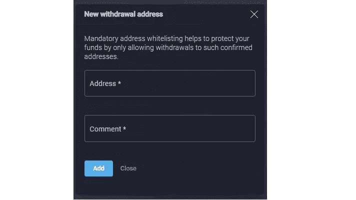

PrimeXBT bitcoin address whitelisting

> 另外，请阅读我们的 [FTX 密码交易所评论](/coinmonks/ftx-crypto-exchange-review-53664ac1198f)

# prime-XBT“Turbo”平台

对于初学者来说， [PrimeXBT Turbo 平台](https://blog.coincodecap.com/go/primexbt)很容易理解。它允许你在一段时间内对一项资产建仓，以获得一定的收益。

如果您的价格预测是正确的，在指定的时间后，您将获得固定的支出。你可以选择做多或做空。

关于这些交易的持续时间，你有三个选择。它们是三十秒、一分钟或五分钟。这么短时间的交易总是不理想的。

目前，它支持六种不同的资产。它们是 BTC/美元、瑞士法郎/美元、英镑/美元、欧元/日元、欧元/美元和美元/日元。

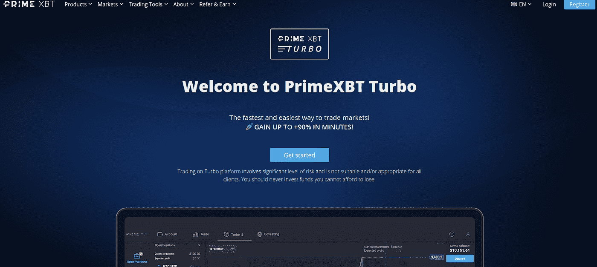

PrimeXBT Turbo review

根据到期时间，正确预测的可能利润可以是 70%或 85%。你能损失的最大金额是你存入的金额。这限制了风险。

它也为你提供了一个社会视角。你可以观察其他交易者在做什么，同样也可以在排行榜上与他们竞争，为你的交易增加竞争优势。关于交易图，这是相当简化的。它不提供像主要分析平台这样的技术工具。

# PrimeXBT 覆盖

最近 [PrimeXBT](https://blog.coincodecap.com/go/primexbt) 已经让 Covesting 模块对其平台的所有用户开放。这让你可以自动复制和执行专业交易者的交易策略。这是首批使用该功能的交易所之一。它有助于建立一个透明的环境。

在 Covesting 选项卡下，您会看到加密货币交易商的详细名单。你可以看到交易伙伴在过去 24 小时内以及加入后的收益。

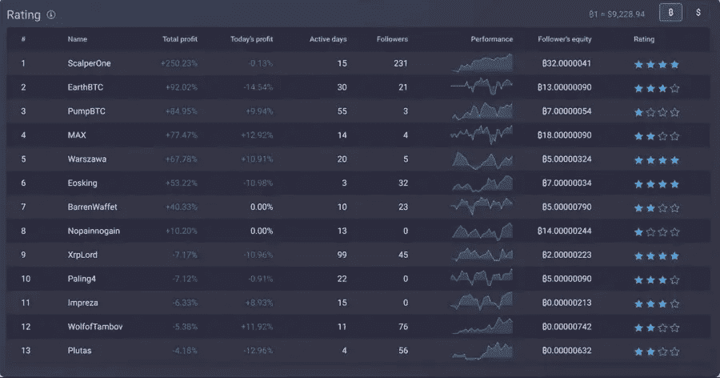

PrimeXBT Covesting Review

> 另请阅读:最佳[加密复制交易平台](/coinmonks/top-10-crypto-copy-trading-platforms-for-beginners-d0c37c7d698c)

# PrimeXBT 覆盖仪表板

新手和有时有经验的交易者有兴趣学习和了解一个有巨大回报的交易者。你也可以按照他们的利润排序。

你可以通过三个简单的步骤复制交易者-

1.  通过评估交易者的表现来选择交易者。
2.  设定您愿意分配的金额。
3.  然后点击关注，享受同样的回报。

你的追随者越多，你从[有利可图的加密交易](/coinmonks/whats-the-best-crypto-trading-bot-in-2020-top-8-bitcoin-trading-bot-c16adeb13317)中赚的钱就越多。

# **语言和支持的国家**

PrimeXBT 支持的国家超过 200 个。由于法律的干涉，它们受到限制的主要国家是美国、加拿大、日本和其他国家。

它支持各种语言，如英语、印地语、中文、韩语、西班牙语、葡萄牙语、俄语、意大利语等。

# PrimeXBT 分析工具

PrimeXBT 为其交易平台上支持的所有工具的技术分析和基本面分析提供支持。

1.  PrimeXBT 平台提供了许多内置的指标和图表分析工具。
2.  在 PrimeXBT 平台上很容易创建和导入自己的定制工具和指标。
3.  你也可以很容易地导出和分析你的交易历史。

# PrimeXBT 移动应用程序

用户可以从 Google Play 商店安装 PrimeXBT 应用程序。移动应用程序的用户界面非常直观，便于用户导航和访问复杂的图表工具。

# **PrimeXBT 附属计划**

还可以通过把平台介绍给朋友来赚取佣金。PrimeXBT 提供基于层级的推荐计划。你从你直接推荐的人那里赚取一定比例的交易费，从二、三级推荐人那里赚取一定比例的佣金。这和其他平台提供的大不相同。

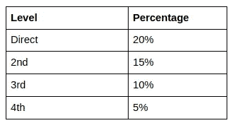

PrimeXBT referral review

您可以在您的帐户管理页面的“推荐”部分获得您的 PrimeXBT 推荐代码。

# **PrimeXBT 客户支持**

它提供全天候的客户支持。你可以在 support@help.primexbt.com 的[和 info@primexbt.com 给他们写信。](mailto:support@help.primexbt.com)

您还可以通过他们的实时聊天功能(帐户菜单)与他们取得联系。聊天助手反应很快。聊天助手经常开始对话。

也可以在 PrimeXBT [Telegram](https://t.me/primexbt) 频道上接触平台。

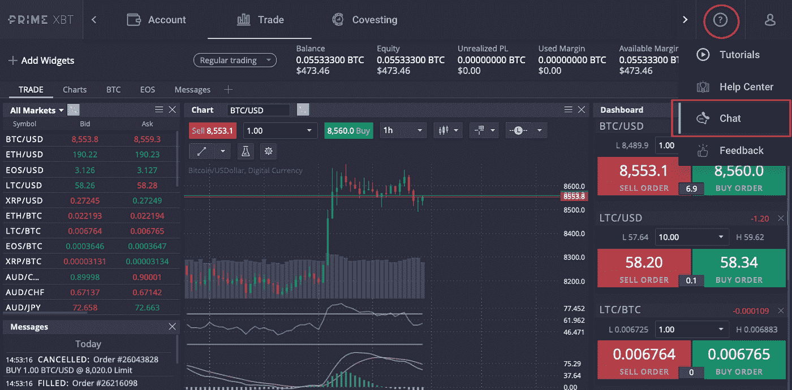

# **PrimeXBT 回顾:用户体验**

PrimeXBT 有一个简单易用的界面。该平台是完全可定制的。您可以根据需要重新排列市场窗口、图表和小部件。您可以更改颜色、间距和网格。它有一个酒吧，蜡烛，和折线图。您可以自定义图表的颜色。

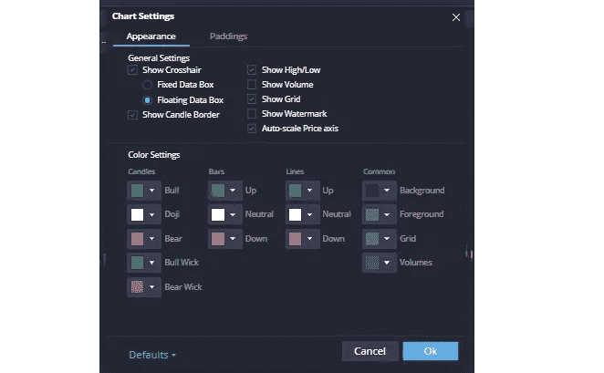

该平台为技术分析提供了 90 个内置指标。比如 MACD、均线、[一目库](https://en.wikipedia.org/wiki/Ichimoku_Kink%C5%8D_Hy%C5%8D)等。他们的整个平台都是围绕小部件构建的。您可以在所需的工作场所添加面板。这些小部件包括消息、图表、订单等等。

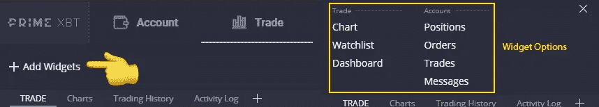

也可以安装 [primeXBT](https://blog.coincodecap.com/go/primexbt) 移动应用。它帮助你在旅途中监控你的交易。它适用于 Android 和 iOS 设备。该应用程序的界面非常直观，易于导航。可以根据自己的喜好定制 app。

> 另外，阅读 [PrimeXBT vs FTX vs 德里比特](/coinmonks/primexbt-vs-ftx-vs-deribit-cb39860f41db)

# PrimeXBT 评论:利弊

**优点**

1.  在 PrimeXBT 中，不需要 KYC。
2.  非常快，执行时间不到 7.12 毫秒
3.  高杠杆率
4.  24 x 7 交易时间

**缺点**

1.  他们没有提供用于测试和熟悉平台的演示平台。
2.  这是一个相对较新的平台。

# PrimeXBT 审查:结论

总之，PrimeXBT 交易平台提供了保证金交易交易所的所有功能，并且已经运行了 1 年。PrimeXBT 是合法的，每天为数以千计的密码交易者提供服务。不过， [PrimeXBT](https://blog.coincodecap.com/go/primexbt) 暂时不监管。此外，Covesting 和 Turbo 有助于初学者了解保证金交易，并向其他交易者学习。如果你想交易加密货币，你一定要查看 PrimeXBT。

# 常见问题

*   **PrimeXBT 合法吗？**

是的，PrimeXBT 是合法且安全的(与其他集中交易一样)交易所。然而，永远记住，“不是你的钥匙，不是你的密码”。

*   **在美国可以用 PrimeXBT 吗？**

根据规定，PrimeXBT 不接受来自美国、加拿大魁北克省和其他一些地方的用户。

*   **如何在 PrimeXBT 上设置杠杆？**

阅读[这篇](https://help.primexbt.com/trading-with-primexbt/how-to-place-a-trade) PrimeXBT 教程，了解更多 PrimeXBT 交易界面和在 PrimeXBT 上设置杠杆。

*   **PrimeXBT 受监管吗？**

不，PrimeXBT 还没有被完全监管。

## 另外，阅读

*   最好的[密码交易机器人](/coinmonks/crypto-trading-bot-c2ffce8acb2a)
*   [德里比特评论](/coinmonks/deribit-review-options-fees-apis-and-testnet-2ca16c4bbdb2)
*   [Bybit 交换审查](/coinmonks/bybit-exchange-review-dbd570019b71)
*   [FTX 密码交易所评论](/coinmonks/ftx-crypto-exchange-review-53664ac1198f)
*   最好的比特币[硬件钱包](/coinmonks/the-best-cryptocurrency-hardware-wallets-of-2020-e28b1c124069?source=friends_link&sk=324dd9ff8556ab578d71e7ad7658ad7c)
*   [密码本交易平台](/coinmonks/top-10-crypto-copy-trading-platforms-for-beginners-d0c37c7d698c)
*   最好的[加密税务软件](/coinmonks/best-crypto-tax-tool-for-my-money-72d4b430816b)
*   [最佳加密交易平台](/coinmonks/the-best-crypto-trading-platforms-in-2020-the-definitive-guide-updated-c72f8b874555)
*   最佳[加密贷款平台](/coinmonks/top-5-crypto-lending-platforms-in-2020-that-you-need-to-know-a1b675cec3fa)
*   [block fi vs Celsius](/coinmonks/blockfi-vs-celsius-vs-hodlnaut-8a1cc8c26630)vs Hodlnaut
*   [莱杰 vs 特雷佐](/coinmonks/ledger-vs-trezor-best-hardware-wallet-to-secure-cryptocurrency-22c7a3fd391e)
*   Bitsgap 评论——一个轻松赚钱的加密交易机器人
*   [Quadency Review](/coinmonks/quadency-review-a-crypto-trading-automation-platform-3068eaa374e1) -为专业人士打造的加密交易机器人
*   [3 商业评论](https://blog.coincodecap.com/3commas-review-an-excellent-crypto-trading-bot) |一款优秀的密码交易机器人
*   [3Commas vs Cryptohopper](/coinmonks/cryptohopper-vs-3commas-vs-shrimpy-a2c16095b8fe)
*   Bitmex 上的[保证金交易指南](/coinmonks/the-idiots-guide-to-margin-trading-on-bitmex-dbbd7742c6fc?source=friends_link&sk=7bfa99d2a181142510c8442c8ddb0786)
*   [加密摇摆交易权威指南](/coinmonks/the-definitive-guide-to-crypto-swing-trading-7e4af6496d4d?source=friends_link&sk=70448050bd9323b42f63bfc0bb1e60d1)
*   [Bitmex 高级保证金交易指南](/coinmonks/bitmex-advanced-margin-trading-guide-2270c195ce25?source=friends_link&sk=1d986cca731f5084b9a2db4a4bc4a7ad)
*   [开发人员的最佳加密 API](/coinmonks/best-crypto-apis-for-developers-5efe3a597a9f)
*   [加密套利](/coinmonks/crypto-arbitrage-guide-how-to-make-money-as-a-beginner-62bfe5c868f6)指南:新手如何赚钱
*   顶级[比特币节点](https://blog.coincodecap.com/bitcoin-node-solutions)提供商
*   最佳加密制图工具
*   了解比特币的[最佳书籍有哪些？](/coinmonks/what-are-the-best-books-to-learn-bitcoin-409aeb9aff4b)

> [直接在您的收件箱中获得最佳软件交易](https://coincodecap.com?utm_source=coinmonks)

