# PrimeXBT vs FTX vs 德里比特|哪个更好？

> 原文：<https://medium.com/coinmonks/primexbt-vs-ftx-vs-deribit-cb39860f41db?source=collection_archive---------4----------------------->

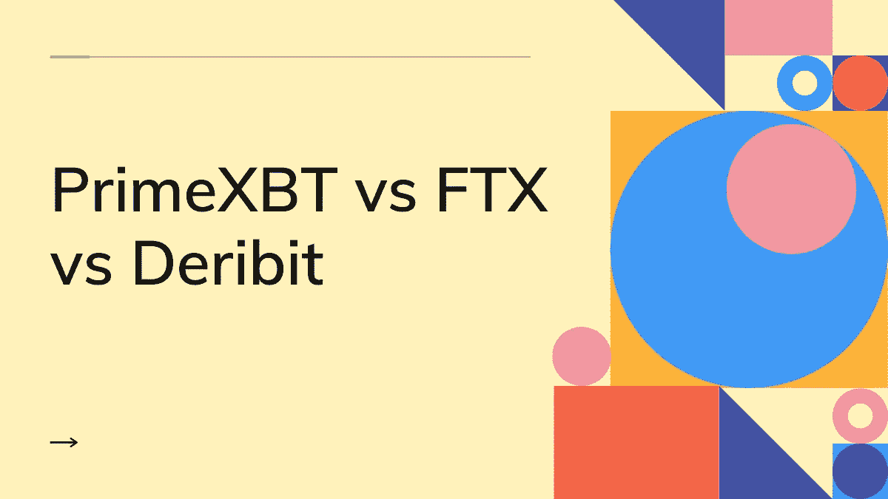

## [德里比特](https://blog.coincodecap.com/go/deribit)、 [FTX](https://blog.coincodecap.com/go/ftx) 、 [PrimeXBT](https://blog.coincodecap.com/go/primexbt) 是顶级的加密货币交易所。

[Deribit](https://blog.coincodecap.com/go/deribit) 成立于 2016 年，总部位于荷兰。它专注于期货和期权市场，每秒处理来自一个帐户的数千个订单和数百个订单。

[FTX](https://blog.coincodecap.com/go/ftx) ，顶级加密货币流动性提供商，由[阿拉米达研究](https://www.alameda-research.com/)支持，帮助 FTX 获得行业领先的订单。它帮助交易者分散投资，通常被称为衍生品交易。

[PrimeXBT](https://blog.coincodecap.com/go/primexbt) 于 2019 年在塞舌尔成立。它呈指数增长，客户遍布全球。该组织的愿景是创建一个创新平台，为其客户提供日常交易活动所需的基本工具。 [**ADVFN 国际金融大奖**](https://uk.advfn.com/awards) 授予 PrimeXBT 2020 年度最佳加密保证金交易奖。

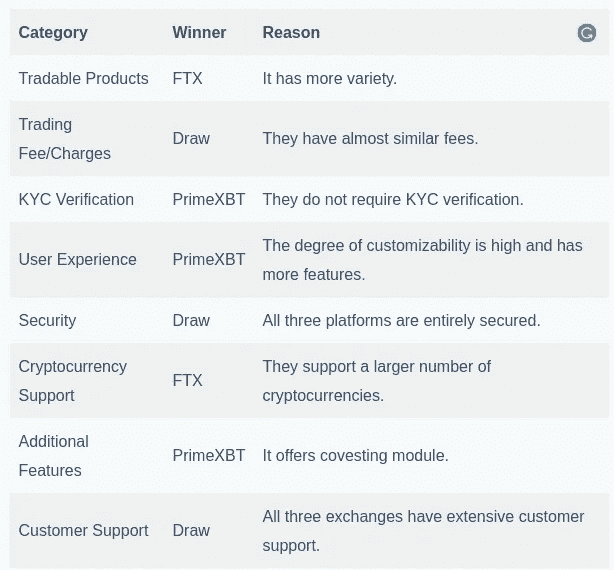

# 德里比特:可交易的**产品**

他们主要处理期权和期货。它在以太坊提供高达 50 倍的杠杆，在[比特币](https://blog.coincodecap.com/a-candid-explanation-of-bitcoin)提供高达 100 倍的杠杆。你也可以在 Deribit testnet 上练习他们的交易策略。

## **期货交易**

期货是一种在未来以预定的价格和时间出售或购买 BTC 或 ETH 的协议。在 Deribit 上，一份合同的价格是 10 美元。Deribit 还提供没有到期日的永久期货。季度期货是在三月、六月、九月和十二月的最后一个星期五。

## **期权交易**

Deribit 提供欧式风格的选择。它们只能在到期时行使，Deribit 会自动行使。所有的现金结算都将发生，而不是转移资产。它也给你其他重要的信息，如波动性、delta 等。您还可以查看您的交易和订单历史。有四种类型的选项可用:限制，市场，停止限制，停止市场。

您希望订单有效的时间称为“订单寿命”有三种类型的订单生命周期:**清关前有效(GTC)、填充或清除(FOK)或立即清除(IOC)。**

如果你想完全控制你的订单，GTC 是一个很好的选择。

> 另外，请阅读我们的综合[德里比特评论](/coinmonks/deribit-review-options-fees-apis-and-testnet-2ca16c4bbdb2)

# ****:**可交易产品**

## ****期货****

**FTX 支持 BTC、BNB、林克等 20 多种加密货币的永久期货。该交易所还提供指数期货，使您可以更加轻松地交易各种加密市场。它们包括大面值、中面值和小面值的硬币。同样，您可以交易交换令牌、区域购物篮和隐私令牌。**

## ****杠杆代币****

**这些代币为您提供加密货币市场的杠杆敞口，而无需管理杠杆头寸。**

**该平台提供高达 101 倍的杠杆作用，并将 10 倍杠杆作用作为安全性的默认设置。分为三个不同的类别:**

*   **1x 代币称为对冲**
*   **0.5x 长称为一半。**
*   **3x 代币通常被称为牛或熊。它们是 ERC20 代币。**

**熊市和牛市令牌自动重新平衡自己，以保持目标杠杆和防止清算。**

## ****移动****

**MOVE 允许您通过承担少量风险，根据特定加密货币运动的价格进行交易。运动可以是任意方向的。**

**它们是根据[比特币](https://blog.coincodecap.com/a-candid-explanation-of-bitcoin)的原始金额到期的期货。它可以是每天、每周、每月或每季度。主要因素是比特币在一段时间内的整体波动性。这一特点吸引了很多客户来到交易所。**

## ****选项****

**它提供了欧式期权合约。你有权在预定的日期和价格卖出一项标的资产，但这不是必须的。你可以选择你的期权合约为“买入权”或“卖出权”你也可以设定你的执行价格和到期时间。在输入建立期权合约的所有重要信息后，你在 10 秒钟内得到 FTX T21 的报价。它们是高度可定制的。**

> **另外，请阅读我们的 [FTX 密码交易所评论](/coinmonks/ftx-crypto-exchange-review-53664ac1198f)**

# **[**PrimeXBT**](https://blog.coincodecap.com/go/primexbt)**:**可交易产品**

**PrimeXBT 在其平台上提供指数、加密货币资产外汇和商品交易。**

*   **指数:它为您提供世界上最知名的交易指数，如富时 100 指数、标准普尔 500 指数、DAX 30 指数、ASX 200 指数等。**
*   ****加密货币**:支持五种加密货币。分别是比特币、以太坊、Ripple、莱特币、EOS。**
*   ****外汇:**您可以交易主要和次要货币对。你被收取佣金，或者叫做交易费。**
*   ****商品**:你可以推测石油、黄金、天然气等商品的成本。**

> **阅读我们的 [PrimeXBT 评论](/coinmonks/primexbt-review-88e0815be858)**

# **[**德里比特**](https://blog.coincodecap.com/go/deribit) **:交易费用和手续费****

**它采用了一种创造者-接受者模式。“庄家”指令用于增加指令簿的流动性，并立即执行。“接受者”订单从订单簿中移除流动性，并且不会立即完成。**

**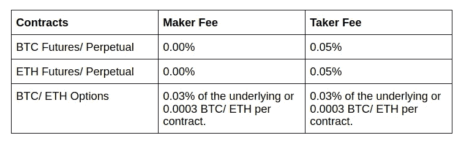**

**Deribit Fees**

**期权费不能高于期权价格的 12.5%。**

**期权和期货交割也要额外收费。期权和期货分别为 0.015%和 0.025%。**

**有一笔额外的清算费用自动加入保险基金。**

**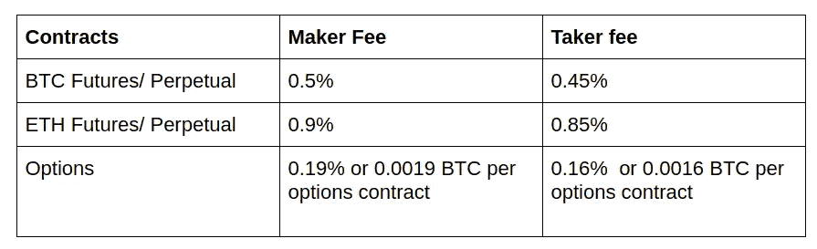**

**Deribit Liquidation Fees**

**您无需支付押金。只有一定比例的资金存在于“热库”中，而其余资金则处于“冷库”中。所以存在不能立即执行撤回的可能性。如果需要，每天可以将资金从冷库转移到热库一次。因此，退出费用取决于网络的状态。**

# **[**FTX**](https://blog.coincodecap.com/go/ftx) **:交易费用和手续费****

**FTX 提供分级收费结构。**

**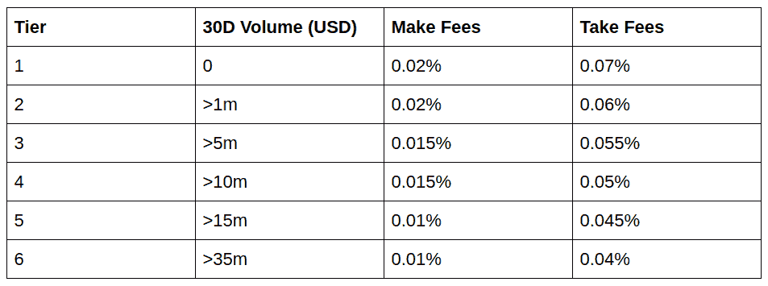**

**FTX Fees**

**它已经宣布，在 2020 年的剩余时间里，制造商费用为零。**

**永久合约收取融资费，并提供给对方合约的持有人。**

**它向 FTT 持有者提供折扣。收取的费用不能低于 0.015%。你的折扣限额是基于你的 FTT 股份。**

**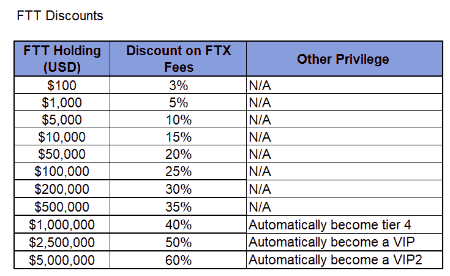**

**FTT discount**

**[FTX](https://blog.coincodecap.com/go/ftx) 收取 0.10%的杠杆代币创建和赎回费用，以及 0.03 %的日常管理费。**

**如果你利用 50 倍的杠杆，你的交易费用增加 0.02%，100 倍以上增加 0.03%，支付给保险资金。**

**移动合约的费用取决于基础指数，而不是移动合约价格。**

**FTX 不对您的存款、取款、场外交易或兑换收取费用。**

**如果您的法定/稳定币存款/提款量大于交易量，您将被收取高达 0.10%的提款费。在设置之前，他们会与您确认这一点。**

# **[**PrimeXBT**](https://blog.coincodecap.com/go/primexbt) **:交易手续费****

**有两种费用:交易费和隔夜费。交易费是为了进入头寸，隔夜费是为了隔夜融资。**

**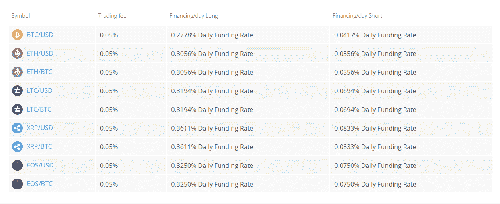**

**PrimeXBT Fees**

**交易手续费在 0.01–0.05%之间。你也可以利用 30 天滚动交易量的折扣。**

*   ****300–600 BTC:**七五折优惠**
*   **600 + BTC: 五折优惠**

**他们不收你存款的费用。提取你的资金，你将不得不支付任意矿工费。**

# ****PrimeXBT vs FTX vs 德里比特:KYC 验证****

## **[**Deribit**](https://blog.coincodecap.com/go/deribit)**

**Deribit 提供了两种不同级别的 KYC—0 级和 1 级。0 级需要一些基本信息，1 级需要身份证明。**

**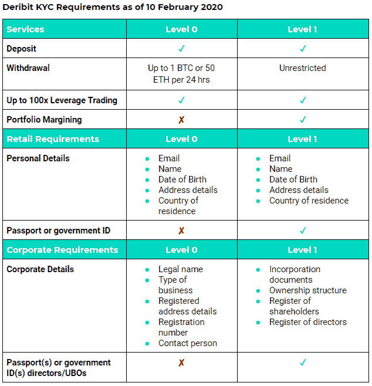**

**Deribit KYC Process**

****KYC 要求****

**如果您提供任何虚假信息， [Deribit](https://blog.coincodecap.com/go/deribit) 有权立即关闭您的账户并清算任何未平仓头寸。他们已经与[chain analysis](https://www.chainalysis.com/)合作监控可疑的加密货币交易。您可以在您帐户下的“验证”选项卡下完成您的 KYC。**

## **[**FTX**](https://blog.coincodecap.com/go/ftx)**

**如果 FTX 怀疑存在任何恶意活动，它可以随时要求提供更多详细信息。**

**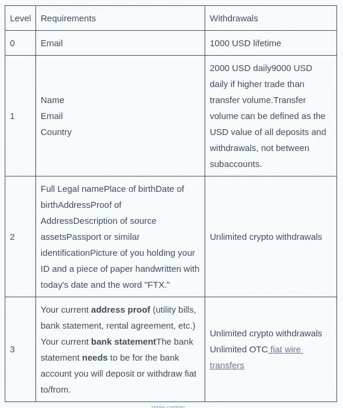**

**FTX KYC Process**

## **[**PrimeXBT**](https://blog.coincodecap.com/go/primexbt)**

**PrimeXBT 中不需要 KYC 验证。**

# ****PrimeXBT vs FTX vs 德里比特:用户体验****

## **[**德里比特**](https://blog.coincodecap.com/go/deribi)**

**Deribit 有一个直观的界面。他们有一个交易匹配引擎，延迟不到 1 毫秒。该网站支持光明和黑暗主题。Deribit 也有一个适用于 Android 和 iOS 的应用程序。Deribit API 集成了[交易机器人软件](/coinmonks/crypto-trading-bot-c2ffce8acb2a)，如 Actant、 [HaasOnline](/coinmonks/haasonline-review-d8d1a3400419) 等。**

**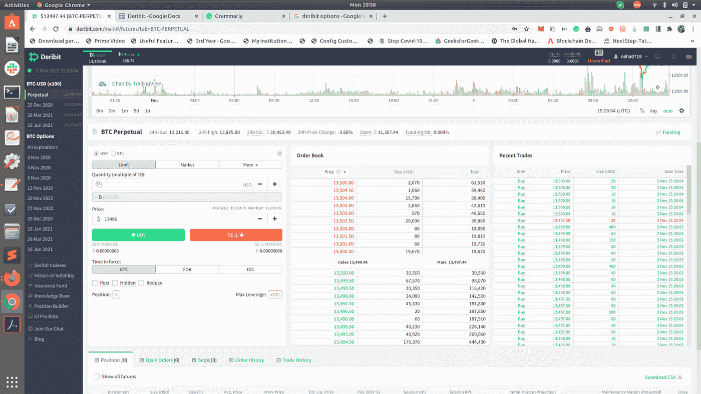**

**Deribit User Interface**

## **[T5【FTX】T6](https://blog.coincodecap.com/go/ftx)**

**网站界面友好，支持黑暗模式。每当您将鼠标悬停在某个按钮上时，就会获得该功能的相关信息。有很多关于如何开始的视频、文章和用户手册。它使用来自 TradingViews 的标准图表。您也可以自定义此图表。订单簿、订单输入表和其他的分组可以重新排列。您可以在 Trollbox 聊天窗口中与其他用户聊天。他们也有支持 Android 和 iOS 的应用程序。**

**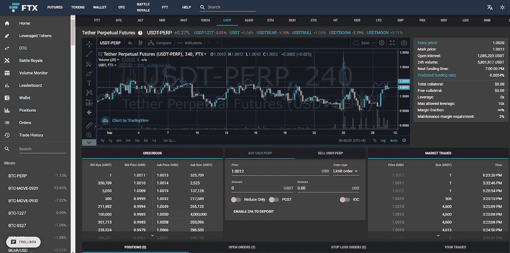**

**FTX User Interface**

## **[**PrimeXBT**](https://blog.coincodecap.com/go/primexbt)**

**PrimeXBT 有一个简单易用的界面。该平台是完全可定制的。您可以根据需要重新排列图表、市场窗口和小部件。它允许您更改间距、颜色和网格。它有一个酒吧，蜡烛，和折线图。**

**您可以使用 90 个内置指标进行技术分析。整个平台是围绕消息、图表、订单等小部件构建的。**

**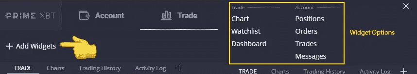**

**您可以安装适用于 Android 和 iOS 设备的 [primeXBT](https://blog.coincodecap.com/go/primexbt) 移动应用程序。它帮助你快速监控你的交易。**

# ****加密货币支持****

**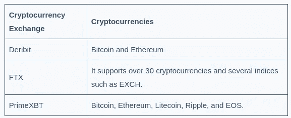**

# ****附加功能****

## ****德里比特保险基金****

**Deribit 提供了一项保险基金，用于弥补破产交易者的损失。它确保了获胜的交易者得到全部付款。它给你负资产保护。如果保险基金耗尽，尽管存在保证金，剩余的金额将从获胜的交易者处获得平衡。**

## ****德里比特 API****

**Deribit API 对于开发自己的[交易算法和机器人](/coinmonks/whats-the-best-crypto-trading-bot-in-2020-top-8-bitcoin-trading-bot-c16adeb13317?source=post_page-----d8d1a3400419--------------------------------)的交易员很有用。它有两个 API:web socket API 和 REST API。后者既有公有部分，也有私有部分。如果你正在开发利用市场的东西，你应该使用公共 API。如果您使用的是私有 API，那么应该用您的 API 密钥对其进行签名。您的 API 密钥在网站中您的帐户下的 API 选项卡中。您应该安全地保存您的 API 密钥。**

## ****德里比特测试网****

**德里比特提供了一个现场[测试网。](https://test.deribit.com/)您可以创建不同的帐户或使用同一个帐户。对于想要习惯 Deribit 用户界面的新手或交易者来说，这很有用。你可以使用 Deribit API 开发[加密交易机器人](/coinmonks/crypto-trading-bot-c2ffce8acb2a)。您也可以在将加密货币算法用于真实账户之前进行尝试。只有少数[加密货币交易所](/coinmonks/the-best-crypto-trading-platforms-in-2020-the-definitive-guide-updated-c72f8b874555)提供这一功能。**

## ****FTX 清算引擎****

**[FTX](https://blog.coincodecap.com/go/ftx) 从零开始有了自己的清算引擎，用高效智能的价值观来选择清算流程。它防止了收回的可能性，尽管在市场高度不可预测的情况下，收回仍然是可能的。你应该留意他们的估计清算价格。**

## **FTX 保险基金**

**它用于防止客户因突然的市场波动而遭受损失，这种波动可能会迅速清算交易所的许多未结头寸。**

**使用 50 倍至 100 倍杠杆的客户支付更高的费用，这些费用直接增加到保险基金中，因为他们在 FTX 清算引擎发生故障(比特币价格突然出现意外下跌)的极小可能性下增加了清算概率。**

**大约 5%的非 FTX 所有的 FTT 代币同样被搁置，以防万一保险基金没有钱支付给客户。这些收益的利润由 FTT 代币持有者分享，也称为“社会化收益”**

## **PrimeXBT“Turbo”平台**

**对于初学者来说，PrimeXBT Turbo 平台相对容易理解。你可以在一段时间内对一项资产建仓，以获得确定的利润。**

**如果你的价格预测在指定期限后是正确的，你将得到一笔固定的支出。你可以选择做多或做空。**

**关于这些交易的时间，你有三个选择。它们可以是三十秒、一分钟或五分钟。**

**[**PrimeXBT**](https://blog.coincodecap.com/go/primexbt) 支持 BTC/美元、ETH/美元、英镑/美元、欧元/日元、欧元/美元、美元/日元。可能的利润可以是 70%或 85%，取决于到期时间。它给你一个社会视角。你可以观察和学习其他交易者的做法，并在排行榜上与他们竞争。交易图表被简化了。**

## **PrimeXBT 覆盖**

**[PrimeXBT](https://blog.coincodecap.com/go/primexbt) 最近向所有用户开放了 Covesting 模块。它可以让你[自动复制并执行专业交易者的交易策略](/coinmonks/top-10-crypto-copy-trading-platforms-for-beginners-d0c37c7d698c)。PrimeXBT 建立了一个透明的环境，为您提供了加密货币交易者的详细情况以及他们在过去 24 小时内以及自加入以来的回报。**

**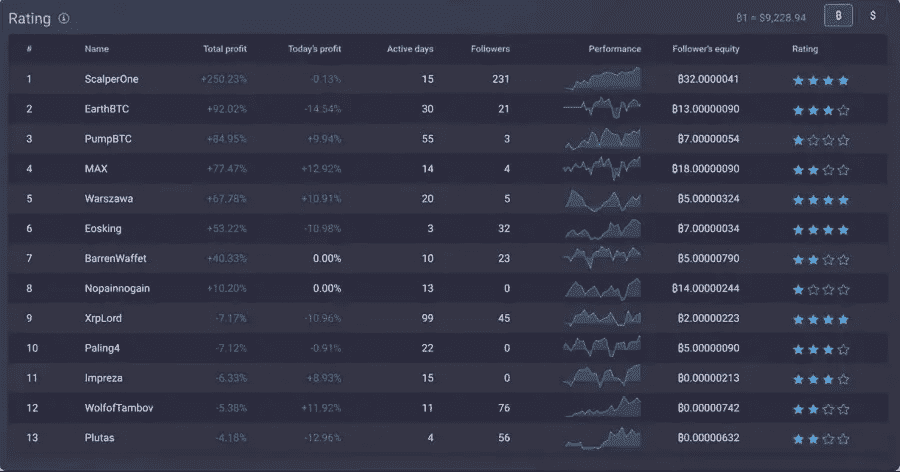**

**PrimeXBT Covesting Dashboard**

**你可以用三个简单的步骤复制交易者-**

1.  **通过检查交易者的表现来选择交易者。**
2.  **设置您想要分配的金额。**
3.  **然后点击关注，享受同样的回报。**

# ****PrimeXBT vs FTX vs 德里比特:安全****

**所有三个加密交易所都将大约 95%的资金存储在冷库中，以保护用户的资金。这三家加密交易所都将大约 95%的资金冷藏起来，以确保用户资金的安全。但是，它降低了客户取款的速度。**

## **[**德里比特**](https://blog.coincodecap.com/go/deribit)**

**Deribit 具有双因素身份验证，您可以在登录后设置它，默认情况下不启用。还有，它有一个 IP 钉住的特点；如果会话期间 IP 地址发生变化，它将结束会话。您可以调整会话超时和默认超时时间。**

## **[**FTX**](https://blog.coincodecap.com/go/ftx)**

**根据 Mozilla 的 Observatory-test，FTX 的安全性为 B+。这是一个令人印象深刻的分数。**

**它还使用双因素身份验证。你可以使用谷歌认证，认证，或短信。您也可以使用不同的密码取款。在“登录”部分，您可以添加各种子帐户的权限。**

**此外，FTX 有一个非常专业的团队，来自麻省理工学院、柏克莱大学和谷歌、脸书等公司。**

**最后，这项交易与加密货币领域的大公司有关联。FTX 的合作伙伴的纲要纳入了 FBG 资本，循环，和真正的美元，这支持其可靠性的贸易兽医。**

## **[**PrimeXBT**](https://blog.coincodecap.com/go/primexbt)**

**使用 Cloudflare 保护它免受 DDOS 攻击。该平台由 Amazon Web Services (AWS)提供的 SSL 保护。它使用“bcrypt”算法对所有通过互联网传输的信息进行加密。即使黑客可以访问服务器，他们也无法解密用户密码。**

**为了提供额外的安全层，它提供了谷歌的双因素认证。它使用谷歌认证应用程序，不使用短信。建议您备份密钥，并通过输入生成的代码来确认设置。**

**它使用**比特币地址白名单**为你的资金增加一层安全保障。这意味着你只能向白名单上的钱包地址取款。如果你犯了任何错误，将导致永久的资金损失。**

# ****PrimeXBT vs FTX vs 德里比特:客户支持****

**德里比特、FTX 和 PrimeXBT 这三家交易所都有广泛的客户支持。**

## **[德里比特 ](https://blog.coincodecap.com/go/deribit)**

**德里比特一直非常重视它的客户。它有一个实时聊天框。和用于与其用户交互的电报信道。Zqoon 和 MrJozza 是社区经理。要联系他们的支持人员，您可以在[deribit.zendesk.com](http://deribit.zendesk.com)开罚单。**

**你也可以在 support@deribit.com 和 feedback@deribit.com.If 写信给他们。如果有任何技术问题，你可以在 dev@deribit.com 写信给他们。**

**他们还运营着一个 Youtube 频道，里面有很多解释视频。也可以通过 [Twitter](https://twitter.com/DeribitExchange?s=20) 联系他们。**

## **[**FTX**](https://blog.coincodecap.com/go/ftx)**

**你可以在 support@ftx.com 给他们写信。如果你在朝鲜，你也可以在 support@ftxkr.com 联系到他们。他们用十多种语言经营电报频道。他们的网站上有一个详细的 FAQ 部分。他们还有一个微信群(FTX 官方)。**

**他们还运营着一个 Youtube 频道，在那里他们定期分享如何有效使用该平台的最新信息。**

## **[**PrimeXBT**](https://blog.coincodecap.com/go/primexbt)**

**它提供全天候的客户支持。你可以在 support@help.primexbt.com 的[和 info@primexbt.com 的](mailto:support@help.primexbt.com)和[给他们写信。](mailto:info@primexbt.com)**

**您还可以通过他们的实时聊天功能(帐户菜单)与他们取得联系。聊天助手反应很快。聊天助手经常开始对话。**

**你也可以通过他们的[电报](https://t.me/primexbt)频道联系他们。**

# **PrimeXBT vs FTX vs 德里比特:结论**

**总之，如果你正在寻找良好的流动性， [FTX](https://blog.coincodecap.com/go/ftx) 是流动性最好的交易所。然而，如果你不想 KYC 的问题，尝试 PrimeXBT。然而， [Deribit](https://blog.coincodecap.com/go/deribit) 正在推动 KYC，这样它就可以遵循合规性并保护其用户。所有三个交易所都有一个用户友好的界面。FTX 的可交易产品最多，Deribit 和 PrimeXBT 主要受保证金交易的欢迎。另外，PrimeXBT covesting 帮助你复制其他交易者的策略。该功能不适用于德里比特和 FTX。**

## **另外，阅读**

*   **最好的[密码交易机器人](/coinmonks/crypto-trading-bot-c2ffce8acb2a)**
*   **[Deribit 审查](/coinmonks/deribit-review-options-fees-apis-and-testnet-2ca16c4bbdb2) |选项、费用、API 和 Testnet**
*   **[FTX 密码交易所评论](/coinmonks/ftx-crypto-exchange-review-53664ac1198f)**
*   **[Bybit 交换审查](/coinmonks/bybit-exchange-review-dbd570019b71)**
*   **最好的比特币[硬件钱包](/coinmonks/the-best-cryptocurrency-hardware-wallets-of-2020-e28b1c124069?source=friends_link&sk=324dd9ff8556ab578d71e7ad7658ad7c)**
*   **[密码本交易平台](/coinmonks/top-10-crypto-copy-trading-platforms-for-beginners-d0c37c7d698c)**
*   **最好的[加密税务软件](/coinmonks/best-crypto-tax-tool-for-my-money-72d4b430816b)**
*   **[最佳加密交易平台](/coinmonks/the-best-crypto-trading-platforms-in-2020-the-definitive-guide-updated-c72f8b874555)**
*   **最佳[加密贷款平台](/coinmonks/top-5-crypto-lending-platforms-in-2020-that-you-need-to-know-a1b675cec3fa)**
*   **[莱杰 vs 特雷佐](/coinmonks/ledger-vs-trezor-best-hardware-wallet-to-secure-cryptocurrency-22c7a3fd391e)**
*   **Bitsgap 评论——一个轻松赚钱的加密交易机器人**
*   **[Quadency Review](/coinmonks/quadency-review-a-crypto-trading-automation-platform-3068eaa374e1) -为专业人士打造的加密交易机器人**
*   **[3 商业评论](https://blog.coincodecap.com/3commas-review-an-excellent-crypto-trading-bot) |一款优秀的密码交易机器人**
*   **[PrimeXBT 审查](/coinmonks/primexbt-review-88e0815be858) |杠杆交易、费用和交易**
*   **Bitmex 上的[保证金交易指南](/coinmonks/the-idiots-guide-to-margin-trading-on-bitmex-dbbd7742c6fc?source=friends_link&sk=7bfa99d2a181142510c8442c8ddb0786)**
*   **[eToro 评论](/coinmonks/etoro-review-78807ddeb33c) |交易股票、密码、交易所交易基金、差价合约和商品**
*   **[Bitmex 高级保证金交易指南](/coinmonks/bitmex-advanced-margin-trading-guide-2270c195ce25?source=friends_link&sk=1d986cca731f5084b9a2db4a4bc4a7ad)**
*   **[开发人员的最佳加密 API](/coinmonks/best-crypto-apis-for-developers-5efe3a597a9f)**
*   **[加密套利](/coinmonks/crypto-arbitrage-guide-how-to-make-money-as-a-beginner-62bfe5c868f6)指南:新手如何赚钱**
*   **顶级[比特币节点](https://blog.coincodecap.com/bitcoin-node-solutions)提供商**
*   **最佳加密制图工具**
*   **了解比特币的[最佳书籍有哪些？](/coinmonks/what-are-the-best-books-to-learn-bitcoin-409aeb9aff4b)**

> **[直接在您的收件箱中获得最佳软件交易](https://coincodecap.com?utm_source=coinmonks)**

****