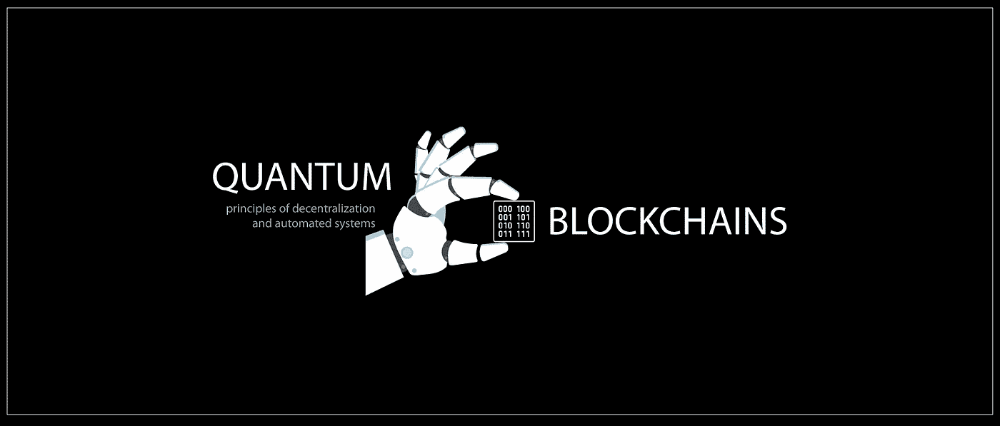
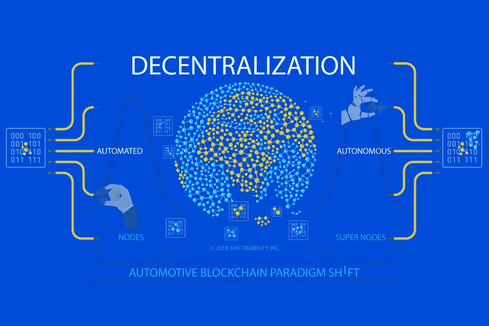

# 去中心化和自动化系统的原则适合区块链经济

> 原文：<https://medium.com/coinmonks/principles-of-decentralization-and-automated-systems-suits-blockchain-economy-43bd20208c74?source=collection_archive---------6----------------------->

在区块链建设分散的自动化系统需要目标感，以及智能合同与区块链核心基础设施组件的适当整合。本文概述了一系列对汽车零部件制造商和经销商都很重要的原则，因为他们将最先从区块链的车辆数据中获益，以及在快速兴起的区块链驱动的商业模式和代币经济中增长企业足迹或获得市场份额的潜在收入机会[1]。

本节介绍的去中心化的五个原则，即简单性、重复性、透明性、安全性和速度，源自对几个汽车行业用例的分析:制造商、经销商、维修中心和消费者。这些原则对于数字自动化系统和机器人的开发非常重要，这些系统和机器人可以实时分析任何联网车辆的需求，处理并与原始设备制造商和售后行业实施的许可和非许可分布式账本技术共享这些需求。

1.  *简单*:简单是可靠的前提[2]。这在有限和智能状态机的情况下尤其重要，状态机由用于分析车辆信息的专用程序组成，从而可以对要诊断的问题的性质和要在区块链上促进的替换零件交易做出决定。
2.  *重复*:许多服务事件本质上是重复的，例如以英里为间隔的定期维护。然而，在数千英里的行程中，程序将不得不运行更多的汽车检查程序，并识别可用部件的退化。因此，自动化系统中内置的重复功能需要与机器学习能力相结合，以快速识别故障并将其传递给分销商和维修中心。如果检测到早期故障，区块链还必须包括原始设备制造商和零件制造商，以便从分销渠道即时召回和移除缺陷零件。
3.  *透明度*:每当汽车零部件被提交给制造商和维修中心进行更换时，客户都会希望对程序的建议有更大的信心。这需要透明的先前症状和已解决问题的准确描述。区块链可以在分布式账本上捕获此类事件以及确定性修复。*安全性*:实现自动化系统的可靠性需要运行时环境的安全性，以确保程序不仅安全地执行所有的任务和事务，还能保证系统在网络威胁的情况下恢复。网络和网络安全协议的进步也使超级节点和对等网络更具弹性。区块链技术为公共和私人传输协议上的敏感车辆数据通信提供了额外的安全性。这将确保在客户需要的任何时候获得关键的紧急服务和路边援助。
4.  *速度*:快速的生产能力和周期时间对于企业在市场中建立差异化地位、提高市场份额和发展有效服务客户的能力至关重要。

在分散式汽车系统的设计中利用这些原则，将允许制造商和经销商为他们的客户创建增值计划，例如即时访问附近的经销商和服务中心，零件到达时的可用性，零件在服务中意外故障时的快速召回和更换，与车辆的当前和预测需求相匹配的正确零件库存，降低所有分销渠道的库存水平，以及针对单个客户需求定制的服务。

自动化区块链系统和智能合约还将为组织提供必要的操作灵活性，以创建奖励计划和令牌，为其生态系统增加价值。在我们的下一个博客系列中会有更多关于令牌类型的内容。参考资料:

[1] 1988 麦克劳克林·威廉姆斯和兰迪·李·威廉姆斯，贡萨加大学，代币经济

[2]2011 年 10 月 20 日，Rich Hickey，[简单易行](https://www.infoq.com/presentations/Simple-Made-Easy)，信用卡:Edsger W. Dijkstra