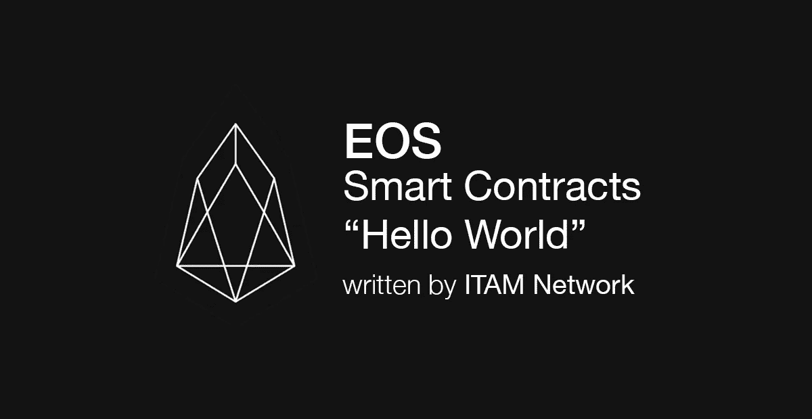
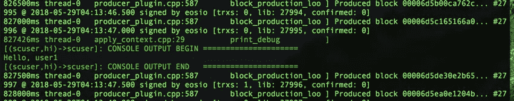

# 用 EOS 智能合同打印 Hello World

> 原文：<https://medium.com/coinmonks/printing-hello-world-with-eos-smart-contract-50fbe873d1b4?source=collection_archive---------3----------------------->



简单地说，智能合同的开发使用了 [llvm](https://llvm.org/) 和 abigen，目的是生成一个 abi 文件。为了实现这个目标，eos 提供了一个名为 eosiocpp 的实用程序。在本帖中，我们将讨论如何使用这个工具来生成 hello world 智能合约。

这个帖子的内容是通过 CentOS 制作的。

# **智能合同撰写**

首先，编写一个 ahello.cpp 文件。

```
#mkdir /home/centos/sc/ahello#cd /home/centos/sc/ahello#vim ahello.cpp
```

将以下内容插入 ahello.cpp 文件

```
----- ahello.cpp file -----------#include <eosiolib/eosio.hpp>#include <eosiolib/print.hpp>
using namespace eosio;class hello : public eosio::contract {
  public:
      using contract::contract;/// [@abi](http://twitter.com/abi) action 
      void hi( account_name user ) {
         print( "Hello, World", name{user} );
      }
};EOSIO_ABI( hello, (hi) )
------ end of ahello.cpp file ---------------
```

接下来，编译并创建 wast (web 程序集)文件和 abi 文件。

```
#/root/eos/build/program/tools/eosiocpp -o ahello.wast ahello.cpp#/root/eos/build/program/tools/eosiocpp -g ahello.abi ahello.cpp
```

# **智能合同样本上传和建档**

## **创建用于测试智能合约的账户**

首先，创造一个钱包。

```
#./cleos wallet create -n scuserCreating wallet: scuser
Save password to use in the future to unlock this wallet.
Without password imported keys will not be retrievable.
"PW5JzRwAUN-----------------------------nAuCRWvHx4XnMPmGf9Kz "
```

创建一个私钥和一个公钥。

```
#./cleos create keyPrivate key: 5KZzUHNFNvf------------------------------vuF5z7d29uAUbsdn
Public key: EOS63ndkvF-----------------------9ZVcByP9nfZcwMLzbMpn
```

把钥匙放在钱包里。

```
#./cleos wallet import -n scuser 5KZzUHNFNvf---------------------d29uAUbsdn
```

为测试创建一个额外的钱包。

```
#./cleos create keyPrivate key: 5JbriTGYsnrpNDvL------------------LgniHVgyTnS5ommxo
Public key: EOS8XZoG2248Gu42-------------ps7JoW8tdHQwCsV
```

把备用钥匙也放在钱包里。

```
#./cleos wallet import -n scuser 5JbriTGYsnrpND----------HVgyTnS5ommxo
```

接下来，创建一个用户。

```
#./cleos create account eosio scuser EOS63ndkvF---------cByP9nfZcwMLzbMpn EOS8XZo-------wJnieps7JoW8tdHQwCsV
```

现在上传智能合同。

```
#./cleos set contract scuser /home/centos/sc/ahelloReading WAST/WASM from /home/centos/sc/ahello/ahello.wasm...
Using already assembled WASM...
Publishing contract...
executed transaction: 053a4883d9c191c2754656544dd045da17bd869250af13a00284a613eed3d23b  1792 bytes  601 us
#         eosio <= eosio::setcode               {"account":"scuser","vmtype":0,"vmversion":0,"code":"0061736d01000000013b0c60027f7e006000017e60027e7...
#         eosio <= eosio::setabi                {"account":"scuser","abi":{"types":[],"structs":[{"name":"hi","base":"","fields":[{"name":"user","ty...
warning: transaction executed locally, but may not be confirmed by the network yet
```

提出上传的智能合同，添加 hi 行为数据(参数)并执行。

```
./cleos push action scuser hi '["user1"]' -p scuserexecuted transaction: 9ed2894aef0f476687ad893ed16594588cc7a813c524d4b8497ba9f50793b151  104 bytes  330 us
#        scuser <= scuser::hi                   {"user":"user1"}>> Hello, World user1
warning: transaction executed locally, but may not be confirmed by the network yet
```

类似于下面捕捉到的图像的内容将被记录在区块链中。



In this case, it was recorded in the 27,995th block.

# **代码分析**

上面的示例代码是 EOS 智能合同的基本模板。我们现在将分解和分析上面写的代码。

```
#include <eosiolib/eosio.hpp>#include <eosiolib/print.hpp>
```

*   包括 eos 智能合同的头文件。

```
using namespace eosio;
```

*   分配 eos 命名空间作为基础。
*   因为 eos 命名空间是基础，所以可以直接使用 account_name 等数据类型。

```
class hello : public eosio::contract {
```

*   将契约类包含到 eos 名称空间中以创建 hello 类。

```
public:
using contract::contract;/// [@abi](http://twitter.com/abi) action
```

*   这显示了当指定一个动作时，在区块链中实际发生的执行函数。

```
 void hi( account_name user ) {
         print( "Hello, World", name{user} );
      }
};EOSIO_ABI( hello, (hi) )
```

*   EOSIO_ABI 是一个宏，包含 apply()函数的早期版本。

在这篇文章中，我们讨论了如何使用 EOS 将 Hellow World 打印到智能合同中。我们计划随着 EOS 主网的推出分享更多有用的信息，所以请订阅并关注 ITAM 媒体。

如果您在 Telegram 上关注 ITAM 网络的公开聊天，您可以与 ITAM 网络分享和讨论 EOS 开发及更多内容。点击下面的链接！

网址: [http://itam.games](http://itam.games)

电报:[https://t.me/itamnetwork](https://t.me/itamnetwork)