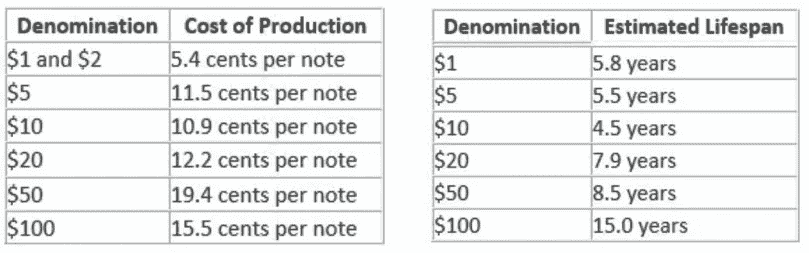
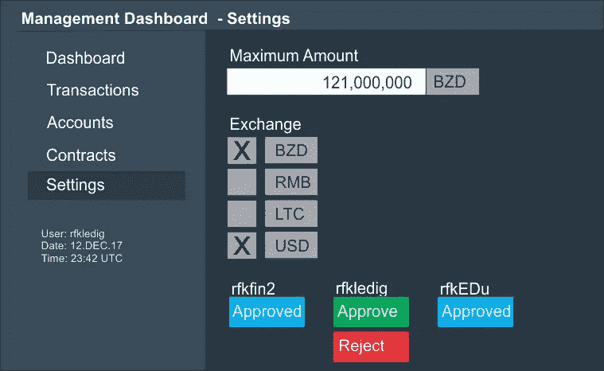
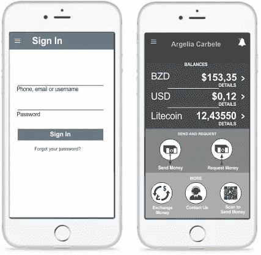

# 印刷货币 vs 数字货币

> 原文：<https://medium.com/coinmonks/printing-money-vs-digital-money-1b4e29a498f4?source=collection_archive---------1----------------------->

我写的下面这篇文章考虑到了小型经济。

**生产纸币需要多少成本？**

在美国，[美联储委员会](https://www.federalreserve.gov/faqs/currency_12771.htm)每年向财政部雕刻和印刷局下订单，该局生产美元并向委员会收取生产成本。2017 年预算中的印刷订单为 66 亿美元，货币预算为 7.266 亿美元(这包括运输和其他相关成本)。相当于 11%左右。

USA: costs of production and average lifespan

另一方面，委内瑞拉正在经历一种不同的情况。那里的通货膨胀率大约为[2300%](https://en.wikipedia.org/wiki/Venezuelan_bol%C3%ADvar)，政府被迫印刷更大面值的钞票。对于这个例子，我假设委内瑞拉的[印钞成本](https://www.wsj.com/articles/inflation-wrought-venezuela-orders-bank-notes-by-the-planeload-1454538101)与美国的印钞成本相似，尽管我预测由于印钞量较低且不得不在国外印钞，印钞成本实际上会更高。今天，一张 100 玻利瓦尔的钞票大约值 3 美分，因此低于生产成本。简而言之，如果一张纸币的价值低于 10 美分，那么当地财政部和整个国家都在亏损。实际上，这一价值甚至会更低，因为纸币的平均寿命是 6 年，因此通货膨胀起了重要作用

**呼吁区块链解决方案**

在一个区块链和移动电话技术的世界里，是时候考虑改变印刷钞票的需求了。这样的改变有很多好处。货币创造的成本不仅降为零，而且变化可以更快地实施，因为可用数字货币的数量是由计算机程序中的变量决定的。

这是全世界都经历过的事情。多个国家已经在广泛使用数字货币。例如，在肯尼亚，数字货币的数量相当于该国年 GDP 的 44%(每年有 1 亿笔交易)，这种货币被称为 M-Pesa，由一家手机公司处理和创造。这意味着 [44%的 GDP](https://qz.com/873525/safaricoms-m-pesa-has-kenyas-government-worried-what-happens-in-the-event-of-a-crash/) 只是由政府间接控制。这甚至可能是危险的，因为一家手机公司控制着一个经济体运行的很大一部分；例如，该公司理论上可以对其支持的产品的特定交易增加交易费。

**税费大战**

在数字经济中，交易通常与费用相关联。这意味着不仅生产和运输货币没有成本，而且数字货币可以为政府带来经常性收入。

**灵活性**

最近，两场飓风给加勒比地区许多国家造成了巨大损失。为了重建国家，特克斯和凯科斯政府迅速而明智地提高了重要物资的进口关税。这些国家中的大多数仍在努力重建经济，许多国家被迫向美国或欧洲寻求财政支持。如果这些国家有一个数字货币系统，他们可以很容易地在一段时间内增加可用的货币供应，并以这种方式更快地重建国家。例如，他们可以增加 1000 万美元的容量来立即重建电网。

**通货膨胀？**

这种货币供应量的增加不会产生通胀效应吗？可能吧，虽然我很怀疑。其他政策对通胀的影响要大得多。目前有两个国家出现了恶性通货膨胀:津巴布韦和委内瑞拉。津巴布韦证明，在一个严重依赖商业农业的经济中，从商业农场主手中拿走所有的农场，并把它们交给不知道如何耕作的人，会导致经济的彻底崩溃。事情变得如此糟糕，以至于上一批钞票的价格还抵不上印刷下一批钞票所需的墨水的价格。委内瑞拉的错误是反市场主义，而不是大肆吹嘘的社会主义的地方特色。一项糟糕的经济政策会比货币供应量的增加更快地导致通货膨胀。根据[Richard vagger](https://www.ineteconomics.org/perspectives/blog/rapid-money-supply-growth-does-not-cause-inflation)在他的文章《快速的货币供应增长不会导致通货膨胀》中的说法，他回顾了 47 个国家，大体上从 1960 年开始，发现高通货膨胀不会跟随货币供应的快速增长。

**银行**

在传统经济中，货币通过银行进入流通。在数字社会中，这种情况将会改变，因为用户或公民将可以直接访问系统，而不再需要去银行。虽然可能有缺点，但好处是巨大的。一方面，中介变得过时，另一方面，以前不能开立银行账户的人将能够通过例如通过手机应用程序开立账户来访问该系统。简单。

**腐败**

我经常读到区块链货币会导致腐败增加，因为加密系统是分散的和匿名的，很难追踪到谁在哪一天给了谁多少钱。对于政府控制的加密货币来说，这是不正确的，因为这样的系统不是匿名的，支付很容易被追踪。它是数字化的，因此是可追踪的。另一方面，现金是不可追踪的。在透明的制度下，涉及金钱的腐败几乎可以杜绝。

> [直接在您的收件箱中获得最佳软件交易](https://coincodecap.com/?utm_source=coinmonks)

