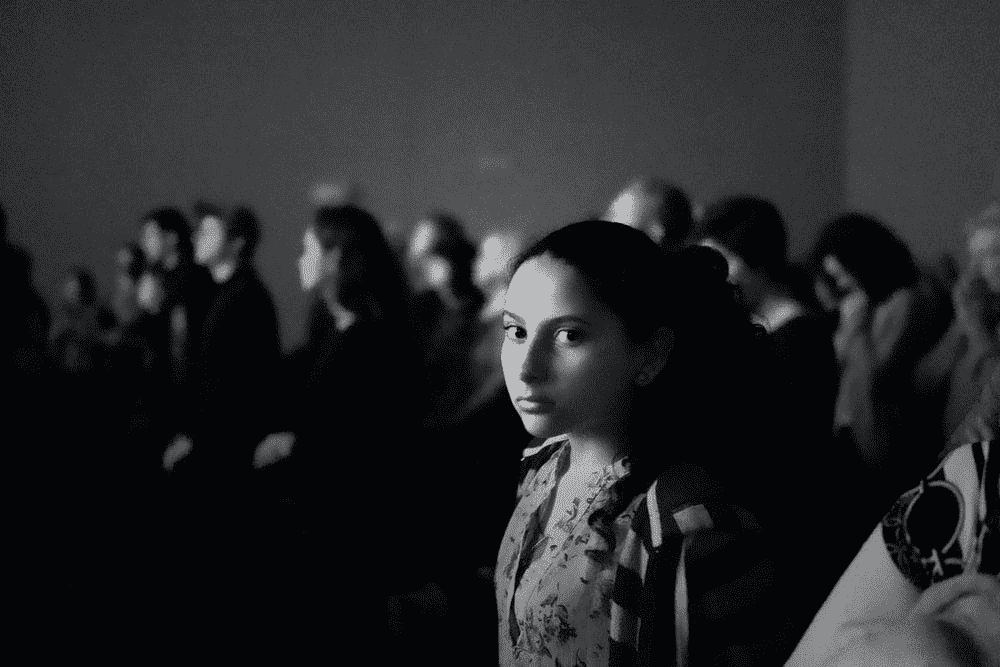

# 公共登记处的隐私——人性的证明 x VeilOS

> 原文：<https://medium.com/coinmonks/privacy-for-public-registries-proof-of-humanity-x-veilos-9c693456f7d5?source=collection_archive---------3----------------------->

You are being watched (Photo by [Justice Amoh](https://unsplash.com/@juhsteezy))

# 博爱医院简介

人类的证明是一个伟大的项目，旨在建立一个人类抗西比尔登记系统。通过确保每个人最多在注册表中注册一次，该项目可以成为应用程序的核心基础设施，这些应用程序在去中心化的世界中更容易受到 Sybil 攻击。一个这样的用例是[防止不诚实的](https://twitter.com/JimmyRagosa/status/1389604000635424769) …