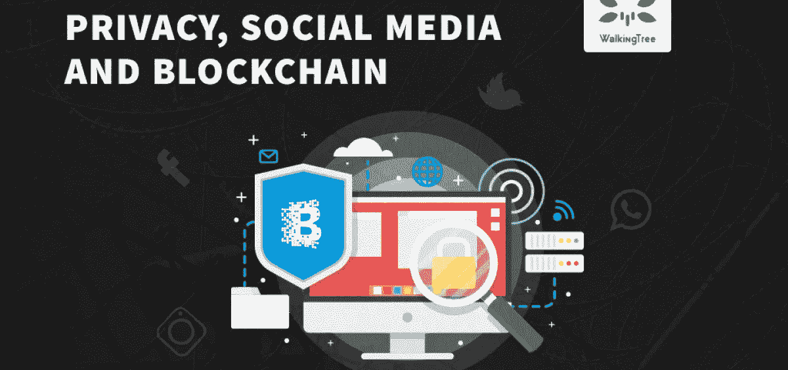

# 隐私、社交媒体和区块链

> 原文：<https://medium.com/coinmonks/privacy-social-media-and-blockchain-621518ee7e11?source=collection_archive---------10----------------------->

区块链有时似乎是所有问题的解决方案。因此，随着脸书-剑桥分析数据丑闻，涉及收集多达 8700 万[脸书](https://en.wikipedia.org/wiki/Facebook)用户的[个人身份信息](https://en.wikipedia.org/wiki/Personally_identifiable_information)，震动了社交媒体，人们自然会问这样一个问题，基于区块链的社交媒体解决方案如何能够防止这种情况。

此外，当脸书导演[马克·扎克伯格](https://en.wikipedia.org/wiki/Mark_Zuckerberg)为剑桥分析公司的情况道歉时，称这是一个“问题”、“错误”和“背信”，那么探索一种在不信任环境中确保信任的解决方案听起来就更有必要了。同样，区块链看起来像一个可能的救星。

此外，相信免费资助的数字社会主义者理想情况下会希望通过使用脸书、Reddit、Twitter、LinkedIn 等社交媒体获得报酬。逻辑是他们在这些平台上创造内容。区块链开始看起来像是这个领域的一种需求。

# 隐私权是一项基本权利

在我们进一步讨论之前，让我们先了解一下隐私。隐私是(许多国家将其作为宪法的一部分)并且应该是一项基本权利，应该受到最高级别的保护。

在有如此多生活的现代世界中——个人的、职业的、社会的，甚至使用不同个人资料和虚拟角色的生活，等等。同一个人的隐私必须受到人们信任的组织的保护。然而，事实是，围绕这一点没有标准，有数百万种组合，这使得很难迎合每个人的定制需求。隐私由大量的亚种组成，宪法不允许将隐私的每个方面都定义为基本权利，因此保护隐私肯定会成为一个巨大的挑战。

# 共享细节的共识

虽然很少有人会非常严格，他们甚至可能会支付订阅费来保护他们的隐私，但有大量的人会为了方便和其他服务(包括促销优惠)而愿意分享他们的部分数据。所以，对于那些想尽可能多地探索世界的人来说，采取理想主义的立场可能不是最有利的。

当事情如此复杂，平台应该迎合数百万和数十亿的用户时，我认为下面的方法是可取的

1.  人们应该知道谁有权访问哪些数据
2.  人们必须有一个简单的方法来查看和管理这些细节
3.  必须对用户进行持续教育，以确保他们意识到他们与任何人共享的隐私和详细程度
4.  平台公司必须教育开发人员并仔细审查他们的应用程序，以确保他们不会滥用最终用户共享的数据
5.  平台公司不得与任何第三方共享数据，当他们这样做时，他们必须征得用户的同意，并与用户分享利益

作为任何平台的用户，人们会因为特定的需求而访问给定的平台，他们相信该平台会保护他们免受任何滥用。这种信任对人和平台都很重要。

# 区块链和这个有什么关系？

假设给定的用户根本没有同意共享他/她的数据，那么他们的数据将根本不会被共享。句号。当前的社交媒体必须尊重这一点，并尽一切可能保护这一点。

有趣的是，虽然区块链通过不可变的防篡改设计谈论强大的安全性，但交易(即通信)仍然可以被网络上的参与节点看到。虽然像 zk-SNARKs 这样的基于零知识证明的隐私协议试图允许双方验证交易而不泄露特定的交易细节集，但它仍然没有被广泛使用。毫无疑问，这似乎不是为解决社交媒体消息相关的隐私问题而开发的。因此，为了隐私而应用区块链可能不是一个好主意。与一个中央系统(现有的社交媒体)分享数据并说我不信任你并因此放一个区块链是没有意义的。

# 区块链在社交媒体中到底有没有用？

我确信会有社交媒体利用区块链来制作一些令人兴奋的东西的使用案例。然而，在目前的情况下，这看起来就像是在一根针可以完成工作的地方拔出一把剑。

然而，如果用户正在创建一个加密稀缺的对象，该对象应该被保护免于隐私和欺骗，并且由对等网络中的节点管理，那么它肯定需要区块链。具体来说，如果这种特定的媒体被游戏化了，社区参与进来了，商业广告会自然增长，那么让区块链上法庭是有意义的。

我在社交媒体中看到了几个区块链将改变当今工作方式的案例。例如

*   假新闻:在新闻成为网络的一部分之前，应用某种共识机制来验证新闻的真实性，并使新的创作者和验证者从这些有价值的新闻/内容中赚取一定的金钱，这可以在很大程度上解决这个令人讨厌的问题。
*   **令牌化内容分享**:基于以太坊的去中心化[民用](https://joincivil.com/)平台和基于 STEEM 的内容创作、策展和分享等。将为贡献者和参与者创造一个为有价值内容的创造和使用而赚钱的机会。
*   **社交游戏**:已经有一款名为 CryptoKitties 的社交游戏建立在区块链之上，它允许你像购买传统收藏品一样购买、出售或交易 [CryptoKitty](https://youtu.be/btkNKBmD6zw) 。他们还饲养数码猫，这为创造下一代可爱的收藏品提供了巨大的可能性。同样，你可以构建更吸引人的游戏。

虽然我确实看到了可能性，但当我比较当前解决方案的规模和创造力时，这在目前看来是一项艰巨的任务。区块链可能看起来像一个承诺，然而，它看起来远没有能力挑战现有的社交媒体平台。当然，看看现有的解决方案如何受到挑战将会很有趣。

# 摘要

现在，区块链有自己的开销，挑战现任者看起来很棘手。然而，可伸缩性是区块链社区中的一个经常谈论的话题，并且像 Raiden 和 Lightning network 这样的项目被一些主流加密公司所采用，这确实给了人们克服可伸缩性和吞吐量问题的希望。幻想控制一切总是很有趣的。然而，像任何技术一样，这可能会被既得利益者滥用。所以，我相信在用户和开发者中进行持续教育会有很大的帮助。无论如何，看起来我们正在这个领域进行一些激动人心的创新，而且会很有趣。

**来源**:[**https://walkingtree.tech/privacy-social-media-blockchain/**](https://walkingtree.tech/privacy-social-media-blockchain/)