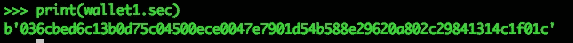

# 初学者指南:解密的私钥和公钥加密

> 原文：<https://medium.com/coinmonks/private-and-public-key-cryptography-explained-simply-4c374d371736?source=collection_archive---------0----------------------->

本文将在较高层次上解释比特币中使用的 ***私钥和公钥加密技术及其独特的安全特性。***

我们将看看**公钥**是如何生成的，为什么这是安全的，以及**私钥是如何链接到公钥**的。

# 为什么？

*   为复杂的主题提供高层次、易于理解的解释
*   对比特币如何衍生出一些安全特性有了更深刻的见解和理解
*   通过生成一个**公钥**，我们就有了一种与网络上其他人公开互动的方式，例如我们可能将一些比特币*附加到我们的**公钥**上*
*   我们证明自己拥有比特币的唯一方法是证明**公钥**是从我们的私钥**派生出来的(通过提供签名，超出了本文的范围)**

We are going to make this simple to understand

# 什么是私钥？

*   私钥是一个非常大且高度随机的数字
*   下图显示了一个由我编写的钱包程序生成的**私钥**
*   不要用这个号码作为你的私人密钥

Generated Private Key

# 什么是公钥？

*   公钥可以与网络上的其他人共享
*   我们可以从**公钥**中生成**地址**
*   公共密钥被网络上的其他用户用来挑战比特币的所有权
*   这是从我们上面的**私钥**生成的**公钥**

Public Key shown as hexadecimal representation of bytes

# 公钥是如何生成的？

*   从一个**私钥**我们可以生成一个**公钥**
*   **公钥**是一条**椭圆曲线**上的( *x，y* )坐标
*   **公钥**可以是这条曲线上的任何一点

Elliptic Curve

*   **私钥**用作**标量**(这意味着私钥号用作乘数)
*   我们现在需要知道的是，这条曲线上有一个众所周知的点，我们称之为 **G**
*   **G** 将是我们的起始位置，有一个( *x，y)* 坐标

G is a publicly known point

*   我们接下来要做的是将( *x，y)* 坐标 **G，**乘以自身**私钥(数量)的次数**
*   换句话说，我们正在执行 **G*G，私钥次数**
*   当这种情况发生时，有一个 *"* ***弹子球*** *"* 效应，这个点 **G** 会绕着**椭圆曲线反弹，**就像在弹子球机上一样，击中曲线上的另一点，反射过 x 轴，这就是**重复*次的私钥(数量)**
*   一旦这个过程完成，我们就有了我们的**公钥，** viola！
*   我们的**公钥**只不过是曲线上的一个( *x，y* )坐标

“Pin Ball” Effect, Point G is bounced around the curve

# 这如何提供安全性？

*   好了，我们已经简化了一些复杂的话题
*   要更详细地了解**椭圆曲线和它们背后的数学**这里是我下一篇文章< *的链接*
*   我们的**公钥**，也就是我们的**比特币**能够被组成的唯一方法就是透露我们的**私钥**

## 让我们做一个实验

*   在下图中，我们可以看到一张台球桌和母球的起始位置
*   假设这个起始位置是我们在椭圆曲线**上的点 **G****

Our starting position G

*   在将母球敲过台球桌后，我们停在了最终位置
*   假设这个最终位置是我们在**椭圆曲线**上的( *x，y* )位置，使它成为我们的**公钥**

Our final position, the Public Key point

*   能不能从看母球的起始位置( **G)** 和母球的最终位置(**公钥** )…
*   母球打了多少次垫子？
*   请在看答案前试着猜一猜…

*   我有视频证据…(是的，我确实花时间去敲那个母球)

Cue ball bouncing around example

*   答案是 36

# 离散对数问题

*   使用上面的实验，我们可以演示**私有和公共密钥密码术**的一个密钥安全特性，称为**离散日志问题**
*   通过知道起始位置( **G** )和最终位置(**公钥**)，我们**无法推导出**标量 ( **私钥**)，因为我们处理的是非常大的数
*   这个方程**不可逆转**，也称为**陷门函数或单向函数，**给定公开已知信息
*   给定**私钥**，很容易创建**公钥**
*   但是从**公钥**计算出**私钥**是极其困难的

****

**Trap-door function**

# **结论**

*   **私有密钥是非常大的随机数**
*   ****公钥**是**椭圆曲线**上的( *x，y* )点，使用**私钥作为标量**生成**
*   ****私钥和公钥密码学**的安全性来源于**离散对数问题**，给定**初始值**和**终值**，很难推导出**标量(私钥)****
*   ****陷门函数**是**不可逆函数**，给定**私钥**创建**公钥**很容易，但是从公钥计算出私钥**却非常困难****

****

**本文中获得的知识来自于 [Jimmy Song 为期两天的编程区块链研讨会](http://programmingblockchain.com/)。**

**我强烈推荐这门课程给任何想涉足比特币和区块链技术的程序员(不适合胆小的人)**

****

## **有兴趣深入兔子洞吗？**

**<learn about="" elliptic="" curves="" and="" the="" maths="" behind="" them=""></learn>**

> **加入 Coinmonks [电报频道](https://t.me/coincodecap)和 [Youtube 频道](https://www.youtube.com/c/coinmonks/videos)获取每日[加密新闻](http://coincodecap.com/)**

## **另外，阅读**

*   **[复制交易](/coinmonks/top-10-crypto-copy-trading-platforms-for-beginners-d0c37c7d698c) | [加密税务软件](/coinmonks/crypto-tax-software-ed4b4810e338)**
*   **[网格交易](https://coincodecap.com/grid-trading) | [加密硬件钱包](/coinmonks/the-best-cryptocurrency-hardware-wallets-of-2020-e28b1c124069)**
*   **[密码电报信号](http://Top 4 Telegram Channels for Crypto Traders) | [密码交易机器人](/coinmonks/crypto-trading-bot-c2ffce8acb2a)**
*   **[有哪些交易信号？](https://coincodecap.com/trading-signal) | [Bitstamp vs 比特币基地](https://coincodecap.com/bitstamp-coinbase)**
*   **[ProfitFarmers 回顾](https://coincodecap.com/profitfarmers-review) | [如何使用 Cornix 交易机器人](https://coincodecap.com/cornix-trading-bot)**
*   **[如何在势不可挡的域名上购买域名？](https://coincodecap.com/buy-domain-on-unstoppable-domains)**
*   **[印度的加密税](https://coincodecap.com/crypto-tax-india) | [altFINS 审查](https://coincodecap.com/altfins-review) | [Prokey 审查](/coinmonks/prokey-review-26611173c13c)**
*   **[最佳加密交易所](/coinmonks/crypto-exchange-dd2f9d6f3769) | [印度最佳加密交易所](/coinmonks/bitcoin-exchange-in-india-7f1fe79715c9)**
*   **开发人员的最佳加密 API**
*   **最佳[密码借贷平台](/coinmonks/top-5-crypto-lending-platforms-in-2020-that-you-need-to-know-a1b675cec3fa)**
*   **杠杆代币的终极指南**