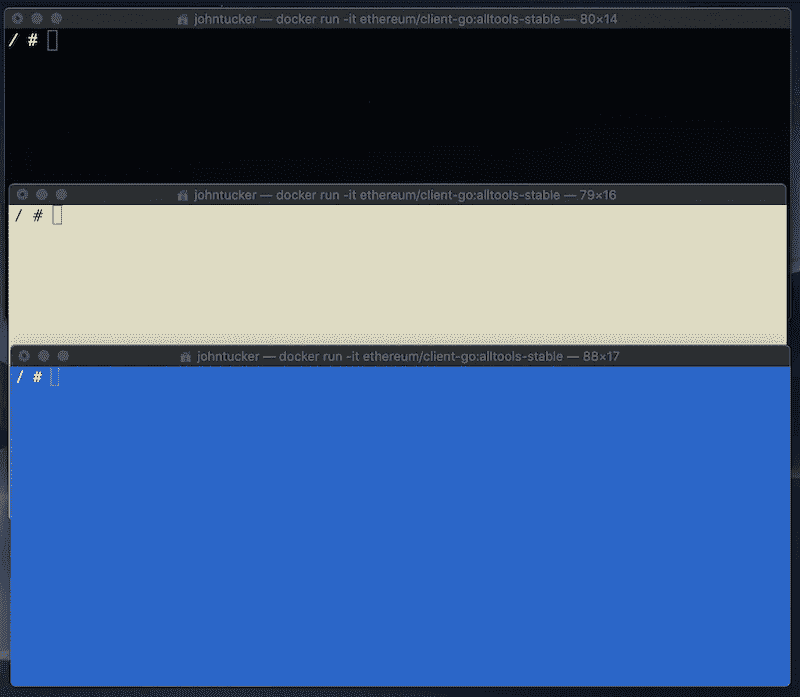
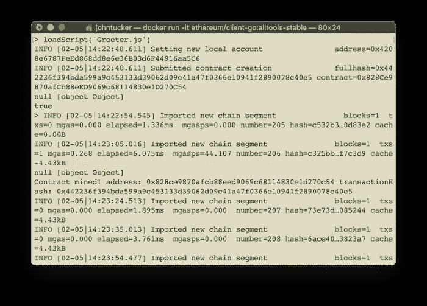

# 私人以太坊举例

> 原文：<https://medium.com/coinmonks/private-ethereum-by-example-b77063bb634f?source=collection_archive---------0----------------------->

私人*以太坊*示例使用权威共识证明，而不是更熟悉的工作共识证明。


首先，对 *Adeyemi Toluhi* 的文章 [*以太坊:建立私有区块链*](/coinmonks/ethereum-setting-up-a-private-blockchain-67bbb96cf4f1) 大声疾呼，因为它对我写这篇文章很有帮助。

**私人以太坊**

私人*以太坊*是私人区块链的一个例子；由*以太坊*创始人描述。

> 从本质上讲，除了拥有完全公开且不受控制的网络和受密码经济学保护的状态机(如工作证明、利益证明)，还可以创建一个系统，其中访问权限受到更严格的控制，修改甚至读取区块链状态的权限仅限于少数用户，同时仍保持区块链提供的多种部分真实性和分散性保证。

*—维塔利克·布特林—* [*论公私区块链*](https://www.coindesk.com/vitalik-buterin-on-public-and-private-blockchains)

> 还念:最好的以太坊[硬件钱包](/coinmonks/the-best-cryptocurrency-hardware-wallets-of-2020-e28b1c124069?source=friends_link&sk=324dd9ff8556ab578d71e7ad7658ad7c)

**授权证明**

对于*以太坊*，*集团*协议是一个更广泛的*权威证明*共识机制 *:* 的例子

> 对于那些不知道 PoA 如何工作的人来说，它是一个非常简单的协议，其中不是矿工们竞相寻找一个难题的解决方案，而是授权的签名者可以随时根据自己的判断创建新的块。
> 
> 这些挑战围绕着如何控制铸造频率、如何在不同的签名者之间分配铸造负载(和机会)以及如何动态地调整签名者的列表..

*—以太坊—* [*小团体 PoA 协议& Rinkeby PoA testnet*](https://github.com/ethereum/EIPs/issues/225)

**例子**

我们将构建一个私有的*以太坊*区块链，运行在由三个节点组成的网络上；每个人都有自己的账户。其中一个账户被指定为授权账户，又名密封账户。

然后，我们将在区块链上创建并运行*以太坊* [*欢迎者*智能合约示例](https://www.ethereum.org/greeter)。

**先决条件(可选)**

如果你想跟随，你需要安装[*Docker*](https://www.docker.com/products/docker-desktop)；我们将使用*码头*集装箱做一切事情。

**节点**

第一步是使用[*ether eum/client-go:all tools-stable*](https://geth.ethereum.org/install/#run-inside-docker-container)映像创建三个节点作为 *Docker* 容器(我们使用较大的映像，因为我们需要额外的工具来 *Geth* )。我们在三个终端中分别运行以下命令:

```
docker run -it ethereum/client-go:alltools-stable
```

观察结果:

*   *-it* 选项使 *Docker* 容器具有交互性
*   为了帮助跟踪每个节点，我为每个终端使用了不同的颜色。



**账目**

在每个节点中，我们执行以下命令；为以后的用户复制帐户地址:

```
geth --datadir ./datadir account new
```

观察结果:

*   如果您稍后需要查找地址，可以在*数据目录/密钥库*文件夹中的文件(每个帐户一个)中找到

**创世纪区块**

我们接下来创建创世纪模块:

> 每一个区块链都必须从某个地方开始，所以在开始的时候有一个所谓的创世街区。这是第一块，以太坊的创建者可以自由地说“首先，下面的账户都有 X 单位的我的加密货币。”区块链上乙醚的任何转移将源自这些初始账户中的一个(或来自采矿)。

*—Brandon Arvanaghi—*[*讲解以太坊*](https://arvanaghi.com/blog/explaining-the-genesis-block-in-ethereum/) 中的创世纪板块

这里我们使用 *Docker* 图像中的一个附加工具；在其中一个节点上执行以下命令**。**

```
puppeth
```

观察结果:

*   该工具有一个交互式向导界面
*   虽然这个工具有其他功能，但我们将只使用它来生成 genesis 文件

步骤:

1.  提供一个*网络名*；该值是该工具的内部值，否则没有意义
2.  选择*配置新起源*选项
3.  选择*从头创建新的起源*选项
4.  选择*集团—授权证明*选项
5.  保留问题*的默认值(15 ),阻塞需要多少秒？*
6.  在*上哪些账户允许封存？*，提供其中一个账户的地址(将是权限)；我使用了黑色窗口中节点上的帐户
7.  在*上，哪些账户应该预先拨款？*，提供全部三个账户地址
8.  选择默认(是)到*应该预编译地址(0x1..0xff)被预资助 1 魏？*
9.  提供一个随机数(默认)给*指定你的链/网络 ID…*
10.  选择*管理现有起源*选项
11.  选择*导出起源配置*选项
12.  选择*的默认(空)文件夹来保存 genesis 规格？*
13.  按下 *Ctrl+c* 退出 *puppeth*

观察结果:

*   不知道*预编译地址*是什么；找不到关于他们的信息
*   不用担心创建*第一链*和*第二链*规格的错误；反正我们不需要它们
*   继续删除生成的以 *-harmony.json* 结尾的文件
*   为了清楚起见，将另一个生成的文件重命名为 *genesis.json*

*genesis.json*

观察结果:

*   为了可读性，我删除了与*预编译地址*相关的大部分分配
*   文章 [*解释了以太坊*](https://arvanaghi.com/blog/explaining-the-genesis-block-in-ethereum/) 中的创世纪块，很好地描述了这个文件中的所有信息
*   由于 *eth* 货币与专用网络无关，我们预先分配了每个具有巨大(几乎无限)余额的账户(使用授权证明)；虽然*以太坊*还是需要它来操作。与此同时，不清楚我们应该如何管理新账户的余额。嗯？

我们现在将这个文件复制到另外两个节点中；在我的例子中，我使用 *cat* 来列出文件，选择我使用机器的 copy ( *cntl+c* )命令的输出，并粘贴到其他两个节点上打开的 *vi* 编辑器中。

**注意** : IMHO，会用 [*vi*](https://www.ccsf.edu/Pub/Fac/vi.html) 是必须的；就像知道如何打字一样。

最后，在每个节点上，我们执行:

```
geth --datadir ./datadir init genesis.json
```

**启动客户端**

我们使用以下命令启动节点上的客户端(没有授权帐户):

```
geth --datadir ./datadir --nat extip:`hostname -i` console
```

观察结果:

*   默认情况下，客户端试图确定一个公共 IP 地址进行通信(因为*以太坊*是一个对等网络)；然而，我们运行的是私有网络(因此需要使用 *nat* 选项)
*   *UNIX*

由于我们想要在节点上的客户机上登录(也称为解锁)授权帐户(使用授权帐户)，我们首先使用帐户的密码创建一个文件 *password.txt* ，然后执行:

```
geth --datadir ./datadir --nat extip:`hostname -i` --unlock 0 --password password.txt console
```

观察结果:

*   帐户在零索引数组中维护；因此，第一个也是唯一一个帐户的值为 0

**添加同行**

由于客户端开始于相同的起源块(因此具有相同的链 id ),因此它们可以参与相同的区块链。同时，按照配置，客户端不能发现彼此；我们需要手动添加它们的对等关系。

**注**:另一种方法，首选，是设置另一个节点作为引导节点；[中描述*以太坊:专网*。](https://github.com/ethereum/go-ethereum/wiki/Private-network)

我们在每个客户端上运行以下命令来获取其地址:

```
admin.nodeInfo.enode
```

在三个节点的情况下，我们有三个对等关系；因此，我们需要执行下面的命令三次(将由您来决定客户端和订单):

```
admin.addPeer('[CLIENT-ADDRESS]')
```

**注意**:这就是为什么使用引导节点是首选。

我们可以使用以下命令来验证对等体:

```
admin.peers
```

**启动矿工**

虽然我们在技术上不是在挖掘，但是我们使用了授权证明，我们仍然需要使用授权帐户登录的客户端持续生成块；否则，我们创建的交易将不会添加到区块链中。

**注意**:我觉得不断创建没有事务的块很奇怪。嗯？

我们在拥有 authority 帐户的客户机上执行以下命令，开始挖掘:

```
miner.start(1)
```

观察结果:

*   *1* 参数表示我们正在使用单线程
*   如果一切顺利，每隔 15 秒，我们就会看到一个新的区块被创建；记录每个客户端的输出

**创建智能合同**

按照 [*以太坊的说明:创建一个数字迎宾员*](https://www.ethereum.org/greeter) 创建一个智能合同示例:

> 智能合约是以太坊区块链上的账户持有对象。它们包含代码功能，可以与其他契约交互，做出决策，存储数据，并向其他人发送以太网。契约是由它们的创建者定义的，但是它们的执行，以及它们提供的服务，是由以太网本身提供的。只要整个网络存在，它们就将存在并可执行，只有当它们被编程为自毁时才会消失。

*—以太坊—* [*创建一个数字迎宾*](https://www.ethereum.org/greeter)

构建神器，从 *Remix* ，我们需要的是*JavaScript**web 3 deploy*代码；复制到两个客户端之一的文件中，例如 *Greeter.js* (没有权限帐户)。

我们还需要更新*JavaScript**web 3 deploy*代码的第一行，为 *Greeter* 构造函数提供所需的 *_greeting* 参数。

```
var _greeting = "Hello World!";
...
```

最简单的方法是使用 *exit* 命令终止客户端，创建文件，重启客户端(如上)，并添加回两个对等关系(如上)。

**注**:开始希望我们设置引导节点。

**部署智能合同**

为了部署智能合约，我们需要在客户端(在具有 *Greeter.js* 文件的节点上)登录(解锁)帐户(具有足够的 *eth* ):

```
personal.unlockAccount(eth.accounts[0], '[PASSWORD]')
```

观察:

*   同样，帐户在一个零索引数组中维护；因此，第一个也是唯一一个帐户为 0(在此节点上)
*   当帐户在客户端解锁时，它会在一分钟左右自动注销(锁定)

然后，我们可以使用以下命令部署智能合约:

```
loadScript('Greeter.js')
```

提交后，miner 客户端会定期(每 15 秒)将其添加到区块链中:



**运行智能合同**

从部署智能合约的客户端，我们只需使用以下命令即可运行智能合约:

```
greeter.greet();
```

显示*你好世界！*

虽然其他客户端可以访问 *Greeter* 智能合同(在区块链)，但是它们既没有对它的引用，也没有它的接口。

从部署了智能合约的客户端，我们可以运行以下命令来获取智能合约的地址(在区块链)；这是参考:

```
greeter.address
```

从我们编译智能契约的地方， *Remix* ，我们复制了 ABI；这是界面:

观察结果:

*   这只是智能合约的接口和元信息；没有实施

有了接口和引用，我们就可以定义 *greeter* 变量:

```
var greeter = eth.contract([INTERFACE]).at([REFERENCE]);
```

然后像我们之前一样称之为:

```
greeter.greet();
```

**总结**

虽然它还在我的脑海中挥之不去，但我现在已经看到了区块链(分布式账本)技术力量的一丝曙光；在这种情况下，我们能够在两个不同的帐户(组织)之间共享一段公共的不可变代码。

> 加入 Coinmonks [电报频道](https://t.me/coincodecap)和 [Youtube 频道](https://www.youtube.com/c/coinmonks/videos)获取每日[加密新闻](http://coincodecap.com/)

## 另外，阅读

*   [复制交易](/coinmonks/top-10-crypto-copy-trading-platforms-for-beginners-d0c37c7d698c) | [加密税务软件](/coinmonks/crypto-tax-software-ed4b4810e338)
*   [网格交易](https://coincodecap.com/grid-trading) | [加密硬件钱包](/coinmonks/the-best-cryptocurrency-hardware-wallets-of-2020-e28b1c124069)
*   [密码电报信号](http://Top 4 Telegram Channels for Crypto Traders) | [密码交易机器人](/coinmonks/crypto-trading-bot-c2ffce8acb2a)
*   [购买比特币印度](/coinmonks/buy-bitcoin-in-india-feb50ddfef94) | [Pionex 评论](/coinmonks/pionex-review-exchange-with-crypto-trading-bot-1e459d0191ea) | [加密交易机器人](/coinmonks/crypto-trading-bot-c2ffce8acb2a)
*   [印度的加密交易所](/coinmonks/bitcoin-exchange-in-india-7f1fe79715c9) | [比特币储蓄账户](/coinmonks/bitcoin-savings-account-e65b13f92451)
*   [Cloudbet 赌场评论](https://coincodecap.com/cloudbet-casino-review) | [点火赌场评论](https://coincodecap.com/ignition-casino-review)
*   [币安收费](/coinmonks/binance-fees-8588ec17965) | [僵尸加密审查](/coinmonks/botcrypto-review-2021-build-your-own-trading-bot-coincodecap-6b8332d736c7) | [热点审查](/coinmonks/hotbit-review-cd5bec41dafb)
*   [my constant Review](https://coincodecap.com/myconstant-review)|[8 款最佳摇摆交易机器人](https://coincodecap.com/best-swing-trading-bots)
*   [最佳加密交易所](/coinmonks/crypto-exchange-dd2f9d6f3769) | [印度最佳加密交易所](/coinmonks/bitcoin-exchange-in-india-7f1fe79715c9)
*   [开发人员的最佳加密 API](/coinmonks/best-crypto-apis-for-developers-5efe3a597a9f)
*   最佳[密码借贷平台](/coinmonks/top-5-crypto-lending-platforms-in-2020-that-you-need-to-know-a1b675cec3fa)
*   [杠杆代币](/coinmonks/leveraged-token-3f5257808b22)终极指南