# [已弃用]检测到私钥重用！如何解冻你的资金？

> 原文：<https://medium.com/coinmonks/private-key-reuse-detected-how-to-unblock-your-funds-3d75d182bbf7?source=collection_archive---------0----------------------->

在某些情况下，官方 iota GUI 钱包将显示上述警告，并有效阻止您转移资金。这篇文章将帮助你再次访问你的 iotas。

编辑:本文主要关注已被弃用的 Iota GUI 钱包。关于如何在三位一体钱包中解决同样问题的提示，请转到本文:
[**警告:资金花在了地址上！如何解冻您的资金**](/@hbmy289/warning-funds-on-spent-addresses-how-to-unblock-your-funds-3a8d763f0a51)

这是两部分故事的第二部分。这个故事的第一部分重点在于这个错误意味着什么，以及你是如何陷入这种境地的。

出现密钥重用警告有两个主要原因。已用地址上的未决交易和资金。将首先检查未决交易，因为如果这是您的问题，它可以很容易地解决，而不会给您的资金增加任何进一步的风险。

但是，如果找不到未完成的交易，这意味着您在已使用的地址上有资金，我们将使用官方 iota 命令行钱包(cli 钱包)转移您的资金。请注意，这涉及到一定的风险，稍后将详细解释。

## 内容:

1.[待处理交易](#2e04)
1.1 [查找待处理交易](#6e06)
1.2 [如何确认待处理交易](#6b43)

2.[移动资金](#6cbc)
2.1 [先移动解冻资金](#1c7f)
2.2 [使用 cli wallet 移动冻结资金](#3425)
2.3 [安装 cli wallet](#03ad)
2.4 [发送冻结资金](#fb66)

# 1.待定交易

未完成的交易可能会阻止您发送电子钱包中的 iotas。尽管在大多数情况下交易会很快得到确认，但仍会有一段时间处于待定状态。iota tangle 的工作方式是，另一个交易必须选择你的交易作为确认它的提示。由于 tip 选择算法的性质，一个交易越老，它就越不可能被其他交易确认。如果一个事务是几天甚至几周以前的，它可能根本不会被选中，并且可能永远处于挂起状态。

这就是为什么有时你必须积极推动你的交易得到确认。

## 1.1 查找待定交易

首先，您需要找到任何具有值的待定事务。零价值交易不需要确认，也不能屏蔽你的钱包。

打开钱包的历史记录部分，查看转账列表。列表顶部的是最近的交易。

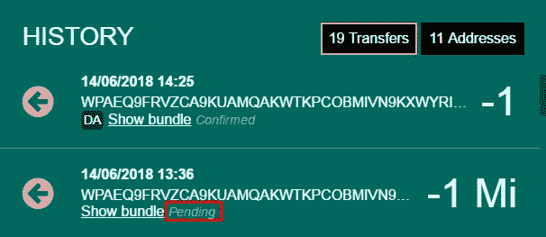

找到那些写着*待定的。*不幸的是，历史记录看起来也有点混乱，因为您可能会遇到多个条目，如下所示:

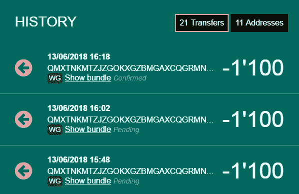

您会看到三个事务，一个已确认，两个待定。事实上，历史记录中的这三个条目是同一个包的重新附加或副本。如果您点击其中一个未决项目上的*显示捆绑包*，您将获得更多详细信息。

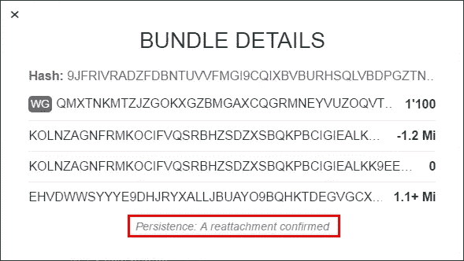

在 *Bundle Details* 对话框中，您可以看到一个更准确的状态表示，告诉您该事务的重新连接已经得到确认。因此，这笔交易不算未确认的冻结你的资金，你可以忽略它。

浏览您的全部历史记录，并检查其他未决交易。

## 1.2 如何确认未决交易

如果您已经确定了一个或多个未决交易，请点击*显示捆绑包*。

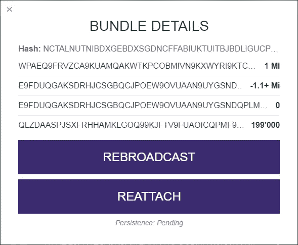

第一个按钮*转播*很少使用，只有在向其发送事务的节点没有正确广播事务给其邻居的边缘情况下才有用。使用*重新连接*按钮，在缠结的不同位置创建完整束的新副本。这是安全的，不会发布私钥的任何附加部分。新交易现在有更高的机会被其他交易选中并确认。

重新连接成功后，*重新连接*按钮会将其标题更改为*提升*。

您可以通过促进您的交易来进一步增加确认的机会。这将使它更受欢迎，被其他交易选为小费。

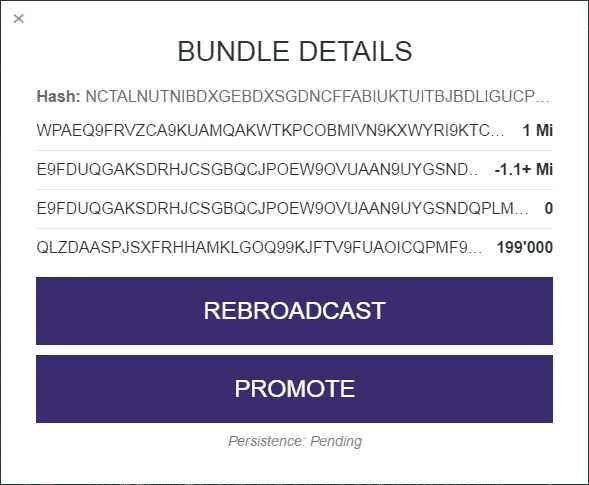

每次你点击提升按钮，钱包将提升你的交易 5 次。
根据经验，如果事务超过 30 分钟，您可以重新附加该事务，并在此期间升级任意多次。

如果您确认了钱包中的最后一笔未决交易，您应该可以发送更多交易，而不会看到密钥重用警告。如果您没有找到待处理的交易或仍然看到警告，您必须使用 cli wallet 转移您的资金。

# 2.转移资金

尽管在这一点上看起来是这样，但你目前的种子并没有破碎。如果你愿意，你以后还可以使用它。然而，为了让事情变得更容易，并有一个新的开始，我们将把你所有的资金转移到一个新的种子。

首先，确保你有一个可用的新种子。不要使用任何在线种子生成器。如果你不确定如何生成种子，请阅读 Koen 的文章:[安全的秘密——是秘密](https://blog.iota.org/the-secret-to-security-is-secrecy-d32b5b7f25ef)。

使用新种子登录 wallet 并生成新的接收地址。把那个地址复制到某个地方，这样你就可以随手拿到它。从现在开始这将是你的目标地址。此外，请确保您的新种子有一个安全的备份副本。

## 2.1 首先转移未冻结的资金

GUI 钱包和 Trinity 的工作方式会让你发现并不是所有的资金都被冻结了。实际上，只有受影响地址上的金额需要使用 cli wallet 进行转移。剩余的资金可以使用官方 GUI 钱包或 Trinity 移动。这些资金永远不会有被盗的风险，但如果在 cli 钱包转账过程中出现问题，这些先前未受影响的资金也可能被冻结。这只是一个概率非常低的边缘情况，但仍然推荐，特别是如果你有大量的资金在你的种子上。如果您想跳过这一步，可以直接跳到[使用 cli wallet 转移被冻结的资金](/p/383eeb8ca036/#3425)。

为了首先转移未受影响的余额，您需要知道它实际上是多少。如果您已经确定了冻结您资金的地址，您可以从您的总余额中减去该地址上的资金，并向新的目标地址发出一笔新的交易，金额为最终金额。

如果你不知道哪个地址阻塞了你，有多少平衡受到影响，你需要做一些调查工作。使用三一钱包这是一个相当简单的任务，因为有一个很好的概述显示您的地址和他们的余额。点击*设置* → *账户管理* → *查看地址*可以找到这个列表(在 Trinity 桌面上使用*账户*菜单)。滚动你的列表，找到一个有资金的用过的地址。使用的地址用红色突出显示，并带有删除的字符。

在上面的截图中，你可以看到地址 [9GIYJ…](https://thetangle.org/address/9GIYJHHZUGBPFJUUWDSPVJQZD9RQLPLAFSBYTNOIFGAOGQMMJPULBSTETWYKCNQD9CUYBXRGEORKBXKBX) 被使用，但仍然有 100i。这些资金被冻结，但假设这是唯一受影响的地址，剩余的 115 I(215 I 减去被冻结的 100i)可以顺利转移。

GUI 钱包缺少这样一个好的地址和余额列表。万一只能用这个钱包，识别受影响的地址就有点复杂了。您可以使用以下过程，一次清除一个地址的解冻资金。这可能很费时间，因为你必须为每个需要清算的地址执行两次交易，但如果你有相当多的资金，这仍然是推荐的。

使用钱包向您的目标地址发送 1i(不是 1Ki 或 Mi)。如果钱包接受转账而没有再次显示密钥重用警告，则您至少有一个地址的资金被解冻。

然后在您的历史记录中找到 1i 外发交易，并点击*显示捆绑包*。

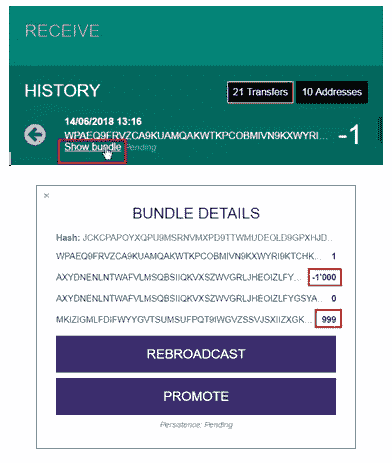

这将显示捆绑包中的所有交易。首先是 1i 事务，然后您会看到一个-1000i 事务，这意味着一个先前有 1000i 的地址被用于发送。最后，您会看到一个事务将 999i 的剩余部分发送到种子的另一个地址。现在你知道另一个 999i 可以发送了。确保 1i 交易得到确认，然后发出第二笔交易，金额为剩余金额。当然，在您的情况下，金额可能会有所不同。

重复此操作，直到发送一个 1i 事务都会显示密钥重用警告。

## 2.2 使用 cli wallet 转移冻结的资金

此时，只有被冻结的资金会留在你的钱包里。Iota 命令行钱包(cli wallet)是一个简单的钱包软件，没有 Iota 基金会发布的图形用户界面。它完全是通过命令行控制的。我们将在这里使用它，因为与大多数其他钱包(GUI 钱包，Trinity)相比，它不会阻止您重用地址的私钥。
了解其他钱包中的密钥重用警告是有原因的，这一点很重要。当使用一个地址进行多次发送时，存在资金被盗的风险。来自某个地址的每个传出事务都会随机发布该特定地址的 50%的私钥。每增加一笔对外交易，盗窃的风险就会增加。如果该地址以前只使用过一次，则风险相当低。但是，如果它被使用 3 次甚至更多，恶意方就很容易获得你的资金。必须指出的是，只有这个特定地址上的资金处于风险中，其他地址或您的种子的任何部分都不会被公布或处于危险中。请记住这一切，因为我不能对可能发生的任何损失负责。如果您在遵循此程序的过程中感到不确定或不舒服，请加入 iota Discord，并在#help 频道中解释您的案例详情，以寻找其他解决方案。

## 2.3 安装 cli wallet

为了安装和运行 Iota [cli wallet](https://github.com/iotaledger/cli-app) ，我们首先必须安装 Node.js。虽然名称相似，但这与运行 Iota 节点无关。Node.js 是一个运行 javascript 代码的开源运行时环境。

导航到 Node.js 官方网站([https://nodejs.org/](https://nodejs.org/))，下载适合您的操作系统的安装程序。建议选择长期支持版本(LTS)。下载并运行安装程序。一旦完成，就该打开操作系统的命令行界面了。对于 Windows，进入开始菜单，键入 *cmd* 并按回车键。在 Mac OS X 上使用 Spotlight 搜索寻找*终端*并启动它。

进入命令行界面后，我们可以使用 npm，即 Node.js 中的数据包安装程序，通过输入以下命令行直接下载并安装 iota cli wallet:

***npm 安装-g iota-cli-app***

按回车键，等待安装完成。

## 2.4 发送冻结资金

您需要有一个来自新种子的目标地址，并安装 cli wallet 才能继续。使用以下命令启动 cli wallet:

**iota-CLI**

启动后，它将看起来像这样:

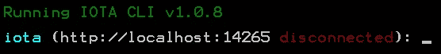

默认情况下，wallet 将尝试连接到在您的计算机上本地运行的节点。如果您不运行本地节点，则可以输入受信任的公共节点。这里我们将使用 Iota 基金会成员(Ralf Rottmann)运行的一个节点:nodes.iota.fm:80。
您可以选择相同的节点，也可以选择您信任的不同节点。例如，节点列表在这里可用[https://iota.dance/](https://iota.dance/)

通过键入以下命令将 wallet 连接到节点

***节点***[***http://nodes . iota . FM:80***](http://nodes.iota.fm:80)

几秒钟后，wallet 将连接，通过节点名称后的绿色复选标记可见。

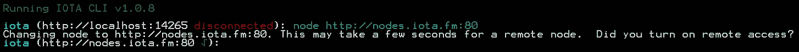

现在输入您的种子:

***种子***

用你自己的种子替换你的种子，然后按回车键。如果你从剪贴板粘贴你的种子，你可以在 Windows 上使用鼠标右键点击*粘贴*，在 OS X 上使用 Shift-Command-V。

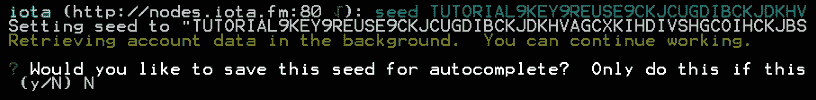

当要求在本地保存种子以便自动完成时，选择 No(键入 *N* 并点击 Enter)。

输入您的种子后，钱包将在后台自动检索完整的帐户数据。根据您已经使用的地址数量，电子钱包可能需要几分钟来检查所有地址。一旦完成，它会通知你，并显示可用余额(1.2 英里或 1200 公里，在这种情况下)。

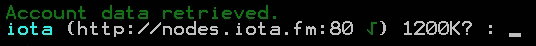

如果没有显示余额，您可以使用 balance 命令专门请求接收余额。

***平衡***

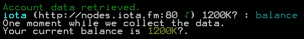

建议[使用您选择的钱包先将未冻结的资金移出](/p/383eeb8ca036/#1c7f)，因此此时，您应该会看到与被冻结地址上的资金相匹配的余额。

使用 cli wallet 发送资金时，您需要以 iotas 的数量给出金额，而不是 Ki、Mi 或 Gi。这意味着，如果您在天平后面看到 K、M 或 G 等单位，您需要将其转换为 iota 中的金额。1.2 Mi 显示为 1200 Ki，这也等于 1200000。如果您不确定单位，请使用此图表作为参考。

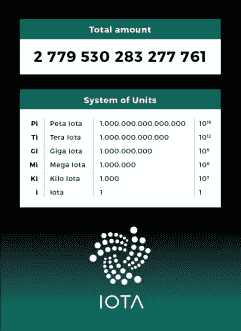

现在你已经准备好发布最后的转移命令了。请记住，从交易发布的那一刻起，您的资金就处于风险之中，直到交易被确认。即使这只是一个小风险，您也希望尽快确认新交易。

要最终从被阻止的地址发送资金，请像这样输入命令，并在按 enter 键之前仔细检查:

***转移地址金额***

将 ADDRESS 替换为您要向其发送资金的目标地址，将 amount 替换为您要转账的 iotas 数量。定义金额时不要包括任何单位。对于我的钱包，命令可能是这样的:

***转 hbmypazxkhmguvhzgeatcwcvuxlmsgzqfvlgjnyjmbwefuahmhdxwkbanjdsdzpvoovfzvwshakfjodrjwnmppxw 1200000***

钱包会检查地址的有效性，因此如果您在某处输入了一个错别字，它会因为无效的校验和而被检测出来。在这种情况下，您会看到以下错误消息:

如果你看到这条信息

意思是你可能在金额后面输入了一个单位(I，Ki 等)。确保只给出要传输的 iotas 数量。

在正确的传送命令上按下 Enter 后，钱包将开始创建传送包并将其发送到 tangle。这可能需要几分钟时间。完成后，它将看起来像这样:

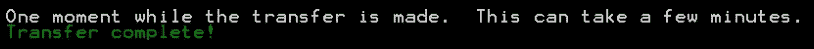

现在是时候推广新的交易，以帮助它更快地得到确认。可能需要一分钟的时间，交易才会显示在钱包的历史记录中，但之后您可以使用您的钱包来推广它。

一旦交易被确认，你的资金已经安全到达新的种子。

有问题或意见吗？在 Iota Discord (HBMY289)上找我。特别感谢帮助校对本文的 Discord 用户 olaz preton 和 berdiin。