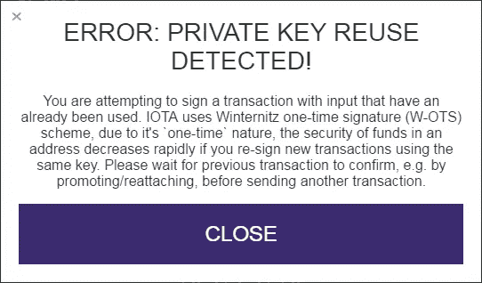
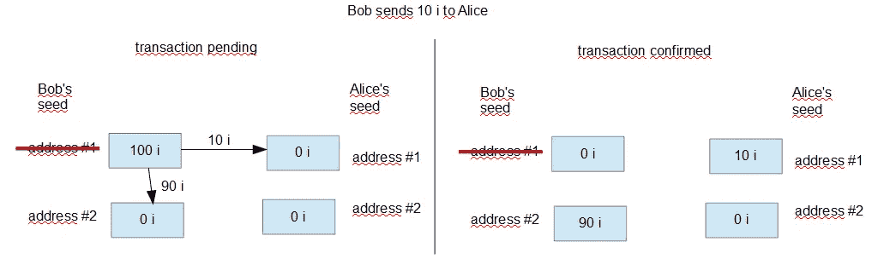
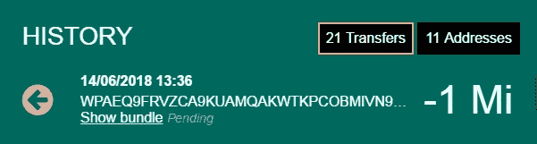

# [已弃用]检测到私钥重复使用—这意味着什么以及如何解冻您的资金

> 原文：<https://medium.com/coinmonks/private-key-reuse-detected-what-it-means-and-how-to-unblock-your-funds-383eeb8ca036?source=collection_archive---------2----------------------->

在某些情况下，Iota GUI wallet 会显示以下警告:

它检测到您将要进行一项新的交易，这可能会使您的资金面临风险，并阻止您这样做。实际上，资金现在被冻结了。

编辑:本文主要关注已被弃用的 Iota GUI 钱包。关于如何解决三位一体钱包中同样问题的提示切换到本文:
[**警告:资金花在地址上！如何解冻您的资金**](/@hbmy289/warning-funds-on-spent-addresses-how-to-unblock-your-funds-3a8d763f0a51)

这是一个分为两部分的故事。阅读这篇文章的第一部分，了解这个错误意味着什么，以及你是如何结束这种情况的。第二部分将涵盖您再次访问您的资金所需的一切:[检测到密钥重用！如何解冻你的资金](/p/3d75d182bbf7/)。

## 内容:

1.[密钥重用警告是什么意思？](#6827)
2。你是怎么陷入这种困境的？
2.1 [在另一个交易仍未完成时发送](#d7a8)
2.2 [已在使用的地址上接收资金](#4c0f)
2.3 [未正确同步的节点上的先前交易](#2169)

# 1.密钥重用警告是什么意思？

当您使用 iota 发送交易时，您可以通过在交易中添加签名来证明您是资金的真正所有者。签名是使用量子证明 Winternitz 一次性签名算法生成的。这种算法的一个副作用是它暴露了一个地址 50%的私钥。但这没有理由担心，即使有 50%的密钥暴露，除了真正的所有者之外，其他人仍然几乎不可能获得资金。然而，每次来自相同地址的另一个交易被签名时，密钥的另外 50%被再次公开。根据发布部分的随机重叠，每增加一次签名，暴力破解密钥将变得更加容易。

由于这种行为，iota 中的地址仅用于发送一次。钱包会自动将地址上的任何剩余资金转移到您的种子的新地址。

图为一个简单的 iota 交易的流程。鲍勃在他的种子的第一个地址上有 100 iotas。当他向 Alice 发送 10 i 时，钱包自动将剩余的 90i 发送到同一交易包中他自己的种子的新地址。他的种子的第一个地址以这种方式从任何资金中被清除，并且一旦交易命中纠结就被视为已使用。

那么，如果使用的地址总是清除任何剩余资金，你怎么可能在你的钱包里看到这个警告？

# 2.你怎么会落到这步田地？

如果您看到密钥重用警告，这意味着您在已经有传出交易的地址上有资金。该交易是已确认还是仍在等待中并不重要。从同一个地址发送另一封邮件会让你的资金面临风险，而钱包不会让你这么做。

只使用官方钱包，并遵循一些简单的基本规则，你永远不会在这种情况下结束，但在一些边缘情况下，仍然有可能有效地阻止你的资金。

以下三种行为是造成这种情况的最可能的原因。

1.  在另一个事务仍未完成时发送
2.  在使用的地址收到资金
3.  未正确同步的节点上以前的事务

## 2.1 在另一个事务仍未完成时发送

一旦事务被发送到 tangle，它就被挂起，直到被确认。在此期间，资金仍留在发送地址，并且可以在钱包中看到一笔传出的交易。然而，包含该地址的 50%私钥的签名已经被公布。

如果您仍然有一个未决的交易，并试图发送另一个交易，您的钱包可能必须再次使用相同的地址进行发送。但是如前所述，从单个地址发送两次意味着重用该地址的私钥，并且会显示密钥重用警告。因此，在发出另一笔交易之前，一定要确保所有交易(传出和传入)都得到确认。

## 2.2 在使用的地址收到资金

另一种常见的冻结资金的方法是在一个用过的地址上接收 iotas。您可能已经知道，您永远不应该向已经用于发送的地址发送或接收资金。通过使用官方钱包，这甚至是不可能的，因为你会看到一个警告，交易将不会被发送。

然而，如果发送方使用不同的方式来传输 iota，这仍然是可能的，并且是底层 iota 协议所允许的。例如，如果您从交易所提取资金，并使用已经有传出交易的种子地址，他们可能仍然会发送 iotas。我们也见过很多这样的情况，一些自认为有趣的家伙确实向其他用户的旧地址发送了 iota，以有效地阻止他们访问他们的资金。

不幸的是，当前的 GUI 钱包并不能真正帮助您找到受影响的地址，并且错误消息/警告与未决交易相同(因为从技术上讲，这是相同的原因)。

从这样的地址获取资金只有两种方法。一种是用不能防止你多次重复使用一把钥匙的钱包来转移它们。这带来了一些风险，将在第二部分详细描述。如果你已经知道这是你的问题，你可以跳到[把你的资金转移到新的种子](/p/3d75d182bbf7/#6cbc)。

无论如何，转移资金的第二种方法是重放旧的传出交易，这在必须转移较大金额时特别有用，因为它不需要第二次签名。然而，这只有在特定条件下才是可能的，也是推荐的，这将在另一篇文章中讨论([如何通过重新附加旧的捆绑包将 iotas 从一个已使用的地址中移走](/@hbmy289/how-to-move-iotas-from-a-used-address-by-reattaching-old-bundles-a916f80e64f7))。如果您有大量资金被冻结在一个已使用的地址上，并且不想增加任何风险，您应该考虑重新附加的情况，尽管这是一个相当复杂的过程。如果你有任何问题，请联系 iota 的 Discord，并在#help 频道寻求帮助。

## 2.3 不正确同步的节点上的先前事务

这种情况下的第三种方式可能是不健康的节点。当向 tangle 发送事务时，你应该确保你的节点是完全同步的。在官方的 GUI 钱包中，这可以通过左下角的两个里程碑数字看到。如果它们匹配并且不时更改(大约每 1-2 分钟一次),您选择的节点将被同步。

然而，如果一个节点没有完全同步，这意味着该节点不知道 tangle 上所有最近的事务，即它不是最新的。当您现在发送交易时，钱包可能会尝试从同时已经使用的地址发送，或者从已经收到更多资金的地址发送。第一种情况可能导致永远无法确认的交易，第二种情况可能导致发送地址中的剩余资金。在这两种情况下，你都可能以资金被冻结而告终。这是资金受阻的一个更复杂、更不常见的原因。您还需要使用 cli wallet 来移动 iotas。

文档的下一部分将帮助您找出真正的问题所在，并最终帮助您解决问题。

[检测到私钥重用！如何解冻你的资金？](/@hbmy289/private-key-reuse-detected-how-to-unblock-your-funds-3d75d182bbf7)

有问题或意见吗？在 Iota Discord (HBMY289)上找我。特别感谢帮助校对本文的 Discord 用户 olaz preton 和 berdiin。