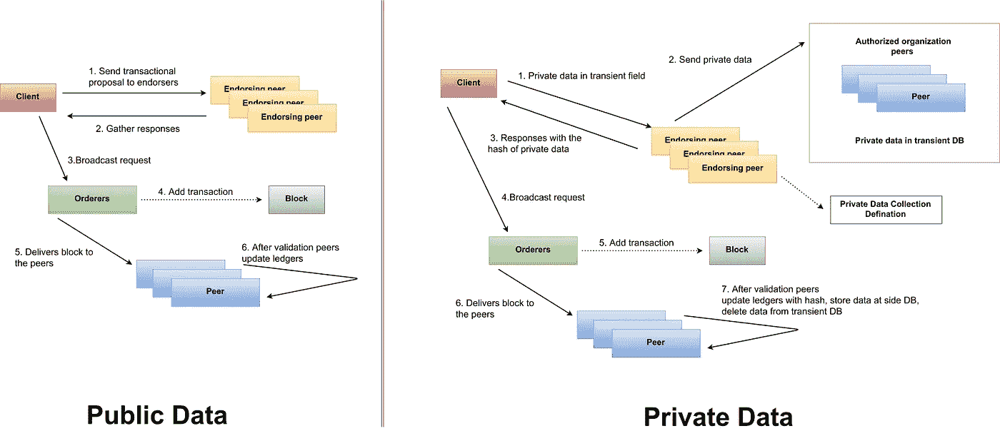

# Hyperledger 结构中的私有和公共数据

> 原文：<https://medium.com/coinmonks/private-public-data-at-hyperledger-fabric-v1-4-ff9f303f4bc1?source=collection_archive---------1----------------------->

# 概观

本文介绍了 Hyperledger Fabric v1.4 区块链平台上公共数据和私有数据的概念理论和实现过程，也是第一篇涵盖公共数据和私有数据在同一渠道中的实现过程的文章。

我们假设您已经了解 Hyperledger Fabric v1.4 版的所有[关键概念](https://hyperledger-fabric.readthedocs.io/en/release-1.4/key_concepts.html)，并且具备良好的…