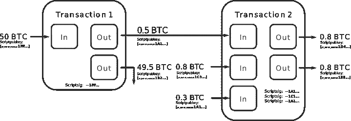

# 保密硬币的机制:第一部分

> 原文：<https://medium.com/coinmonks/private-transactions-part-i-9c4d64086135?source=collection_archive---------1----------------------->


Quentin Massys. The Tax Collectors, ca. 1500

这是深入研究隐私协议 ***CoinJoin*** (比特币)、Monero、ZCash 和 Mimblewimble 内部的系列文章的第一部分。目标是给出一个概念性的和更详细的解释，说明存储在公共分类账中的资金转移是如何匿名的，并且可以被任何感兴趣的一方验证——这是两个看似矛盾的要求。这部分探讨 coin join——一种仅使用普通比特币交易的隐私协议。

## TL；速度三角形定位法(dead reckoning)

*   比特币交易转让消费 UTXO 的权利
*   取消几个比特币地址的匿名可能会导致严重的隐私泄露，因为大多数交易都可以追溯
*   至少 15%的比特币区块链可以去匿名化
*   比特币交易可能在单笔交易中花费属于不同地址的 UTXOs
*   CoinJoin 将来自不同方的 UTXOs 输出到单个事务中，从而使接收者无法区分
*   CoinJoin 的一个主要缺点是它需要另一方参与混合事务(尽管各方可能保持完全匿名)

## 回归基础:UTXOs

首先，让我们更详细地考察一下基于比特币 UTXO 的交易的内部工作原理。我们描述的交易结构和签名方案是特定于比特币的(更准确地说，是 SegWit 之前的版本)。尽管如此，基于 UTXO 的会计将是我们的基本模型，因为它被我们在适当的时候将要考虑的所有硬币所采用。

比特币分类账不是保留一份有余额的账户列表(像以太坊一样)，而是包含每个 UTXO(代表未用交易输出)的地址信息。当 Alice 将 1BTC 转移给 Bob 时，她创建了一个事务，将她拥有的一些 UTXOs(比如说`utxo_1, utxo_2`)作为输入，并将两个新的 UTXOs `utxo_Bob`和`utxo_Alice`作为输出。`utxo_Bob`的值是 1BTC，`utxo_Alice`是“变化”。

当挖掘节点接收到 Alice 的事务时，它执行简单的验证检查

1.  `utxo_1`和`utxo_2`从未作为输入包含在另一项交易中(即它们确实是未使用的交易输出),并且
2.  交易输入的总价值等于交易输出的总价值。

更棘手的部分是确保只有 Bob 有权在未来花费`utxo_Bob`。这是通过一个聪明的机制来实现的，该机制在创建时解锁附加到每个 UTXO 的脚本。脚本是一个小程序，用一种特殊的非图灵完整语言编写，指令数量很少。为了将 UTXO 作为输入之一包含在新事务中，必须包含一些数据，以便 UTXO 解锁脚本返回`True`(免责声明:这是前 [SegWit](https://en.bitcoin.it/wiki/Segregated_Witness) 状态。现代比特币交易使用的方案略有不同。不过，老派的非 SegWit 交易仍然有效。

比如`utxo_Bob`的解锁脚本(爱丽丝附)可以是这样的

```
<Bob's public key> OP_CHECKSIG
```

注意，它只包含公共信息，所以 Alice 可以将这个脚本附加到`utxo_Bob`上，因为她知道 Bob 的钱包地址(粗略地说，就是他的公钥模散列)。反过来，在交易被包括在块中并且该块被接受之后，鲍勃可以验证他确实将获得花费`utxo_Bob`的权利。省略了许多技术细节，例如这里的[这里的](https://www.oreilly.com/library/view/mastering-bitcoin/9781491902639/ch05.html)和[这里的](https://en.bitcoin.it/wiki/OP_CHECKSIG)，上面的脚本粗略地指出，为了将`utxo_Bob`用作输入，应该提供一些附加数据`sig`,以便

```
return secp256k1.verify(sig, <Bob’s public key>, sha256(sha256(tx)))
```

评估为`True`。这里的重点是，只有知道 Bob 私钥的人才能产生`sig`。由于`sha256(sha256(tx))`足够随机且 ECDSA 足够安全，因此这一事实几乎得到了保证。例如，黑客可能试图通过梳理 Bob 之前签署的交易来找到`sig`。这种天真的尝试注定要失败——所有形式`sha256(sha256(tx))`的散列都是不同的。另一方面，Bob 使用他的私钥和任何字节序列生成`sig`，尤其是`sha256(sha256(tx))`，这是一项常规任务。所以没有任何与爱丽丝的直接交流(甚至不在线！)鲍勃可以安全地接受比特币到他公开宣布的地址，并放心，除了他没有人可以花这些资金。

## 比特币是安全的，但不是匿名的

让我们首先描述区块链取证可能利用的潜在匿名泄露(按严重程度递减):

1.  将地址 A 与控制私钥的真实个人/实体进行匹配。
2.  提供证据，证明 A 的所有人已经转移了一些钱给 B(可能通过一些中介交易)。
3.  提供证据证明地址 A 的所有者拥有 X 数量的密码(可能在多个帐户上)。

中本聪争辩说，既然任何人都可以匿名创建比特币地址，1)就不是严重的隐私威胁。回到比特币主要通过采矿获得的时代，这可能是真的。如今，由于无处不在的 KYC/反洗钱要求强加于主要的加密交易所，许多比特币地址可以与真实身份相关联。更糟糕的是，仅仅通过分析公开可用的 Bitcointalk 和 Twitter 个人资料，[有可能](https://arxiv.org/pdf/1801.07501.pdf)到[利用数据挖掘技术提取](https://arxiv.org/pdf/1502.01657.pdf)大量关于地址所有者的信息。与 2)相结合，可以跟踪多得惊人的交易。对于那些一直认为暗网意味着执法部门对交易对手一无所知的人来说，这是个坏消息(抱歉，[恐惧海盗罗伯茨](https://www.wired.com/2015/04/silk-road-1/))。Bitfury [声称](https://nulltx.com/bitfury-group-unveils-technique-to-analyze-bitcoin-transactions/)已经能够取消不少于 16%的所有比特币地址的匿名化。

请注意，虽然 1)至少需要一些数据 scarping，但关于 2)、3)、4)的信息是完全开放的(对于通常的比特币交易)并且可以免费获得(并且它经常被宣传为无许可 DLT 的一个功能)。

## CoinJoin

至少对于比特币交易来说，1)很大程度上取决于 2)。事实上，通过简单地将资金从账户 A 转移到其他账户 B(或多个账户，这是推荐的)，如果很难证明这样的资金转移已经完成，应该是相当安全的。但是，如果所有比特币交易都被设计成公开存储，那么怎么可能隐藏资金转移呢？

早在 2013 年，格雷格·麦克斯韦(Greg Maxwell)就提出了基础概念(CoinJoin)。比特币有很多种商业隐私解决方案，[这里的](https://bitcoinmagazine.com/articles/bitcoin-privacycoin-tech-making-bitcoin-more-private/)是一个全面且最新的评论。他们中的大多数人都以某种形式实现了 CoinJoin 的想法，主要是因为它不需要在比特币协议层面做出任何改变。

所以想法如下。回想一下，比特币交易是一个 UTXOs 列表:输入(花费)和输出。发送者为每个输入 UXO 提供一个解锁脚本，并在输出中锁定每个 UXO。在下列情况下，交易有效

[规则 1]所有输入均已成功解锁

[规则 2]输入的总和等于输出的总和。

这两个规则并不是说所有的输入都不应该来自同一个地址，输出也不应该以某种方式连接。因此，在一次交易中花费来自不相关地址的不同 UTXOs 是完全合法的。现在假设爱丽丝想给鲍勃发 1BTC，同时卡罗尔想给戴夫发 1BTC。爱丽丝和卡罗尔都想掩盖他们的行踪，所以不用追踪交易

```
tx1: A->B; tx2: C->D
```

它们可以形成单个交易

```
tx: {
  inputs: [
    {1BTC; <Alice' Sig>},
    {1BTC; <Carol's Sig>}, 
  ],
  outputs: [
    {1BTC; <Bob's PK>},
    {1BTC; <Dave's PK>}
  ] 
}
```

现在很难说爱丽丝是和鲍勃交易还是和戴夫交易；卡罗尔也是。上面的伪代码远非有效的比特币交易，但传达了 CoinJoin 的窍门。



Greg Maxwell’s original explanation. [Source](https://bitcointalk.org/index.php?topic=279249.0)

## CoinJoin 的缺点

CoinJoin 的主要缺点是必须找到愿意参与“混合”交易的匹配交易对手。如果没有足够多的参与地址，聚类分析仍可能揭示(或至少显著缩小)收件人集合。

其次，爱丽丝寄给鲍勃一轮比特币的情况很少。小额支付可能需要与不同的交易对手进行多次混合交易，从而增加了整体复杂性，同时减少了匿名性集合(即无法与 Alice 交易区分的交易集合)。

Monero、ZCash 和 MimbleWimble 解决了这两个问题，尽管方式有很大不同。将细节留给本系列的下一部分，这里有一个小难题:

*   **Monero 和 ZCash** (采用非常不同的方法)使用了一个非常不直观的事实，即粗略地说，在既不知道*公钥*也不知道*正在转移的金额的情况下，验证【规则 1】和【规则 2】都是可能的。Monero 本质上是使用加密类固醇的 CoinJoin(具有盲态 UTXO 值和诱饵交易方)。ZCash 使用 zk 证明，从而生成一个更大的匿名集。*
*   *MimbleWimble 是一种完全不同的东西，尽管底层的加密原语与 Monero 的相似。MimbleWimble 甚至没有通常意义上的私钥和地址。相反，使用具体 UTXO 的权利是以一种复杂但效率惊人的方式(存储和处理方式)实现的。*

*声明:所有不准确的地方都是我的(但我努力不说谎)。*

**如果你喜欢这篇文章，请在 Twitter 上关注我:@dizhel，我偶尔会在那里发布加密信息。**

*[](http://bit.ly/2G71Sp7)

[**Click to read today’s top story**](http://bit.ly/2G71Sp7)*