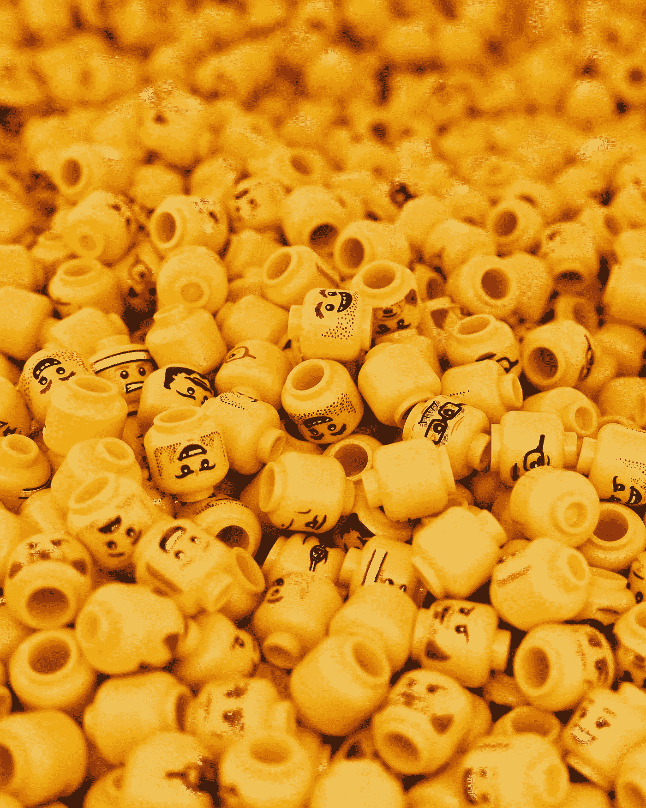

# 使用 Goldwasser–Micali(GM)方法的概率加密

> 原文：<https://medium.com/coinmonks/probabilistic-encryption-using-the-goldwasser-micali-gm-method-7f9893a93ac9?source=collection_archive---------5----------------------->

## 和同态加密的暗示

使用公钥加密，Alice 可以有两个可能的消息(一个“0”或一个“1”)发送给 Bob。如果 Eve 知道可能的消息(0 或 1)，她将使用 Bob 的公钥对每条消息进行加密，然后将结果与 Alice 发送的加密消息进行匹配。夏娃可以…