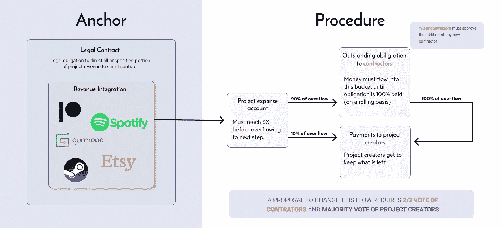

# Web3:程序与合同

> 原文：<https://medium.com/coinmonks/procedures-vs-contracts-web3-beyond-artists-fan-clubs-and-royalties-66c788100a5?source=collection_archive---------4----------------------->

## 除了艺术家、粉丝俱乐部和版税

> 更多关于 Web3 和法律交叉的故事。关注我们[*【https://medium.com/cooperativ】*](https://medium.com/cooperativ)

## 给区块链人的摘要

我们可以通过将智能合同的字符串抽象到一个接口中，让正常的集中式企业用类似 DAO 的过程取代法律协议，从而使 Web3 对广泛的企业有用。这样做会让更多的组织能够接触到区块链生态系统中最强大的部分。

## 其他人的总结

我们可以使用 Web3(定义如下)来帮助企业从使用法律合同转向我所说的“程序”**例如**，运行在区块链上的计算机程序根据各方持有的代币数量自动分配收入，而不是签署描述各方应获得的百分比的收入分享协议。程序*只能在当前令牌持有者*的批准下重新编程，因此收入只能重新分配(区块链使最后一部分成为可能)。

# 我使用的术语

**Web3** :一种描述区块链技术使之成为可能的应用类别的方式。

**道**:一个“分散的自治组织”，是一个决策过程由软件程序控制的组织。任何团体或个人都不能在不遵循预定义流程的情况下编辑软件。

# 让我们开始吧

这篇文章引发了围绕“但是 Web3 *实际上*有什么用处？”这个问题的[普遍的哭泣和咬牙切齿提出的答案往往围绕着:](https://networked.substack.com/p/web3-i-have-my-daots?utm_source=pocket_mylist)

1.  跨境和抵制审查的资金流动/管理，
2.  没有中央机构的认证形式，以及
3.  对艺术作品更公平的补偿。

前两个将是后面文章的主题。第三，创意工具，在过去的一年里已经成为一个非常热门的话题，这是我们讨论的一个有用的起点，因为在这里我们看到人们在创造足够简单和独立的解决方案，以成为产品和服务。

> **观众问题:我的分类正确吗？少了什么？**

# 面向艺术家的 Web3

第三类非常关注艺术家，因为在其他地方提供价值的技术限制。加密生态系统通常与经济的其他部分隔离开来，因为区块链没有任何方法来兑现与链外价值相关的承诺。**例如，**没有智能合约可以确保安妮支付鲍勃收入的 25%，除非安妮的雇主，支付安妮收入的那个人，*选择*将安妮的工资转换成加密货币，并将其发送到智能合约的地址。不用说，大多数雇主都不是为这种事情准备的。

创意产业围绕这个问题提供了两条路径。第一种是制作数字内容(如[crypto 朋克](https://www.larvalabs.com/cryptopunks))并从一开始就在网上分发(如 [OpenSea](https://opensea.io/) 、 [Foundation](https://foundation.app/) 等)。).第二种是向代币灌输某些好处和特权，如能够访问私人 Discord 频道或预售门票( [Coinvise](https://www.coinvise.co/) 、 [MintGate](https://www.mintgate.io/) 、 [Rally](https://rally.io/) 、 [Juicebox](https://juicebox.money/#/) )。这是因为艺术创造的价值完全基于与观众的互动。对于提供实用价值的 SaaS 产品、家电品牌或矿业公司来说，情况并非如此。很少有人会为了偶尔在洗衣机上打折而参加博世代币销售。

**注:**游戏享有能够利用上述两种途径的特权。他们的价值不仅来自于吸引玩家，而且他们还可以从一开始就在他们的玩家之间创造市场。

> 给观众的问题:艺术家们还会如何使用 Web3？是否有与此分析相关的其他模型？

## 一条线索！

上述动态的例外提供了关于如何从区块链理工学院构建普遍有用的商业工具的线索。以**为例**，这种服务允许音乐人与购买与特定内容相关的代币的粉丝分享收入。这是可能的，因为 Spotify 等流媒体平台依赖第三方分销商来提交内容并向艺术家支付费用。作为这些第三方之一，Web3 公司**有能力按照承诺**将艺人收入发送给 NFT 持有者。据我所知，这就是[皇家](https://royal.io/)和[创造安全](https://createsafe.io/)的工作方式。

我们可以把这个概念概括为两个部分:

1.  锚:一种移动链外资产的机制——在这种情况下是流动收入——在链上，以及
2.  程序:可编程的分配机制。

重要的是要注意，程序是价值主张，是主播促成的。

> **观众问题:有人确切知道 Royal 是如何给予代币持有者收益权的吗？这有法律合同方面的问题吗？**

# 一种新的一致范式

我们建议使用区块链来创建一种新的、更高效、更灵活的方法来处理常见的业务协议，就像 Dao 已经做的那样。

## 从描述权利到维护过程

传统协议——法律合同——旨在由第三方在争议事件中强制执行，因此*侧重于描述各方的权利*。

相比之下，程序可以持续执行*:它们并不要求当事人裁决争议，而是支持一个过程。它们并不描述当事人的权利，而是描述当事人在该过程中的权力。**例如**，一个项目可以根据创建者预先配置的“流程”来管理收入。然后，他们可以建立一个过程，让团队成员能够对那些流程的任何变更提议进行投票。这允许灵活性，同时保护成员的利益。*

***注:**这种资金管理在分权自治组织(Dao)中已经很常见。我们建议非分散或自治的组织仍然应该使用过程。这样做不仅会使它们更有效率，而且还会通过为它们提供更多以编程方式与常规组织进行交互的方式来提升 Dao 的价值。*

> *问:一个组织什么时候应该分权，什么时候不应该分权？*

## *利益*

*   *这种达成协议的方法不依赖于第三方裁决，因此更适合于想要快速、跨国、不依赖于国家法院系统的团队。比方说，**例如**，一个团队想要确保支付代币的人不能通过向自己发送代币来欺骗合作者。一个程序可以要求大多数当前的代币持有者批准向任何新的钱包地址付款，赋予他们阻止创建者让自己成为代币接收者的权力。相比之下，传统的法律合同没有这种内在的强制力。因此，如果合作者怀疑创作者违反了他们的协议，他们必须将她告上法庭，可能是在外国管辖区。*
*   *与传统合同不同，程序不需要预测关系的所有潜在未来结果。相反，它们规定了当这些结果出现时，各方将拥有何种权力来处理这些结果。**例如:**前一个例子中的创建者可能发现她需要建立另一个接收者钱包来支付费用，并且大多数当前令牌持有者可以选择批准它。*

## *示例使用案例*

*   *发行和分配税收代币的程序*
*   *允许创建者增加令牌总数上限的程序*
*   *更改费用分配的程序*

> ***给观众的问题:请分享你对其他用例的想法！***

**

*An example of a simple Anchor — Procedure combination*

# *锚有助于程序*

*程序只有在它们管理的资产在链上时才起作用，正如我们所知道的，大多数业务资产不是。因此，我们必须**将链连接到链外资产**(或负债)。我们将这种机制称为“锚”,我们可以使用以下参数来判断其质量:*

1.  *简单和透明:锚应该尽可能的简洁、狭窄和简单。它们应该易于参与者理解，并且易于维护。*
2.  *自动化:最好的锚自动地移动资产和负债。*
3.  *可信赖性和可预测性:传统的经济是由中央集权的政党管理的，所以从链条上的经济中获取资产通常是一项中央集权的活动。*
4.  *覆盖率:理想情况下，任何一方都不可能围绕主播进行价值路由。例如**，如果游戏工作室可以简单地通过向市场发布内容来规避对贡献者的义务，将收入导向工作室智能合同之外的地方，这将是破坏性的。这有时意味着依赖或至少支持一个有法院可以强制执行的法律合同的锚。***

> ***给观众的问题:我们如何分散主播去做像移动商业收入链这样的事情？换句话说，我们如何确保一家企业的所有收入都到达供应链，而不必信任任何个人来确保这一切已经发生？***

*****注:**在[合作会](https://cooperativ.io/project/sunshinelabs)，我们正在努力打造双层锚。第一层是自动化/集成，可以轻松地在链上转移收入，第二层是法律合同，在项目试图绕过自动化机制转移收入的情况下，为贡献者提供后备选项。***

# ***将此付诸实践***

***我们对这个模型的第一个实验是[贡献者信用](https://cooperativ.medium.com/a-new-way-to-compensate-contributors-to-early-stage-projects-fa7d83985fde)。这个想法是为用户提供一种方法来发行与法律义务相关的代币。我们确切地考虑了法律语言应该如何引用智能合同，以及智能合同应该如何引用法律语言。像社会代币一样，贡献者信用代表一种承诺。不像社会代币，这种承诺代表了对链外资产的要求，并有法律合同的支持。***

***[Fairmint.io](http://Fairmint.io) 和 [Tokensoft.io](http://Tokensoft.io) 都在类似的模式上打造了伟大的产品。他们让客户在(法院强制执行的)法律文件中定义权益条款，然后使用标准以太币代币管理权益。任何公司都可以使用这些产品来提高股票销售和管理的效率和程序化。***

> *****观众问题:如果你知道其他混合使用法律和区块链的公司，请分享！*****

# ***下一步是什么？***

***贡献者信用、公平令牌和令牌软令牌是锚，即令牌化的链外资产，仅由法律义务支持。Fairmint 是最早开发有用程序的公司。它们允许客户为代币编制价格曲线(随着投资者买入代币，价格会自动上涨)，它们可以将代币发行给经过预先审查的投资者。这是一种以编程方式最大化[高分辨率筹款](http://www.paulgraham.com/hiresfund.html)的方式(太棒了！).***

***但是这几乎没有触及程序可能提供的服务。释放他们的潜力，我们需要在以下领域进行创新:***

*   *****锚固结构:**可以做很多工作来优化上述参数。集成和支付处理服务是有待探索的丰富领域。***
*   *****流程创建界面:**我们正在投入大量时间研究最清晰的 UX，用于描述资金和资产应该如何在组织中流动，最重要的是，用于描述改变流程的流程。***
*   *****让钱包变得可选:**钱包让人们可以直接保管他们的资产，这很棒，但一些用户不想要或不需要这样做，他们也应该有可能参与其中。同时，其他用户使用钱包也应该是自然而然的。***

> *****给观众的问题:还有什么阻碍了这种方法？*****

# ***…结束***

> ****更多关于 Web3 与法律交集的故事。关注我们的*[*https://medium.com/cooperativ*](https://medium.com/cooperativ)***

## ***也阅读***

*** [## 杠杆代币[多头代币]终极指南

### 杠杆化令牌是具有杠杆化风险敞口的 ERC20 令牌，不考虑保证金、要求、管理…

medium.com](/coinmonks/leveraged-token-3f5257808b22)  [## 40 个最佳电报频道，用于加密、电影、表演和演讲| CoinCodeCap

### 随着我们周围无限的信息，我们很难筛选和了解有价值的信息。电报有…

blog.coincodecap.com](https://blog.coincodecap.com/best-telegram-channels)  [## 5 个最佳社交交易平台[2021] | CoinCodeCap

### 困惑于社交交易和副本交易哪个平台最好？本文将带您了解各种…

blog.coincodecap.com](https://blog.coincodecap.com/best-social-trading-platforms)  [## BlockFi 评论 2021:利弊和利率| CoinCodeCap

### 今天，我们提出了一个全面的 BlockFi 评论，这是一个成立于 2017 年的加密贷款平台，拥有其…

blog.coincodecap.com](https://blog.coincodecap.com/blockfi-review)  [## 如何在印度购买比特币？2021 年购买比特币的 7 款最佳应用[手机版]

### 如何使用移动应用程序购买比特币印度

medium.com](/coinmonks/buy-bitcoin-in-india-feb50ddfef94)  [## 加密税务软件——五大最佳比特币税务计算器[2021]

### 不管你是刚接触加密还是已经在这个领域呆了一段时间，你都需要交税。

medium.com](/coinmonks/best-crypto-tax-tool-for-my-money-72d4b430816b)  [## 9 个 2022 年最值得购买的密码| CoinCodeCap

### 2021 年对于加密货币、比特币、NFT 或不可替代代币、元宇宙等等来说是很棒的一年。这一年…

blog.coincodecap.com](https://blog.coincodecap.com/crypto-to-buy-in-2022)  [## 存储比特币的最佳加密硬件钱包[2021] | CoinCodeCap

### 保管您的数字资产很容易，但找到正确的存储方式却是一项繁琐的任务。在线钱包有一个风险…

blog.coincodecap.com](https://blog.coincodecap.com/best-hardware-wallet-bitcoin)  [## Pionex 评论 2021 |免费加密交易机器人和交换

### Pionex 是为交易自动化提供工具的后起之秀。Pionex 上提供了 9 个加密交易机器人…

medium.com](/coinmonks/pionex-review-exchange-with-crypto-trading-bot-1e459d0191ea)  [## 2022 年密码交易员的三大电报渠道

### 加密信号是来自专业交易者的交易想法，以特定的价格或价格买卖特定的加密货币

medium.com](/coinmonks/top-3-telegram-channels-for-crypto-traders-in-2021-8385f4411ff4)  [## 2022 年 5 个最佳免费加密投资组合追踪器

### 加密投资组合追踪器是作为一个解决方案创建的，既费时又令人困惑的家务提供一个…

blog.coincodecap.com](https://blog.coincodecap.com/free-crypto-portfolio-trackers) 

> 加入 Coinmonks [电报频道](https://t.me/coincodecap)和 [Youtube 频道](https://www.youtube.com/c/coinmonks/videos)了解加密交易和投资

# 另外，阅读

*   [8 大加密联盟项目](https://coincodecap.com/crypto-affiliate-programs) | [eToro vs 比特币基地](https://coincodecap.com/etoro-vs-coinbase)
*   [最佳以太坊钱包](https://coincodecap.com/best-ethereum-wallets) | [电报上的加密货币机器人](https://coincodecap.com/telegram-crypto-bots)
*   [交易杠杆代币的最佳交易所](https://coincodecap.com/leveraged-token-exchanges) | [购买 Floki](https://coincodecap.com/buy-floki-inu-token)
*   [3Commas 诉 Pionex 诉 crypto hopper](https://coincodecap.com/3commas-vs-pionex-vs-cryptohopper)|[Bingbon Review](https://coincodecap.com/bingbon-review)
*   [加密复制交易平台](/coinmonks/top-10-crypto-copy-trading-platforms-for-beginners-d0c37c7d698c) | [如何在 WazirX 上购买比特币](/coinmonks/buy-bitcoin-on-wazirx-2d12b7989af1)
*   [硬币评论](https://coincodecap.com/coinloan-review)|[Crypto.com 评论](/coinmonks/crypto-com-review-f143dca1f74c)***