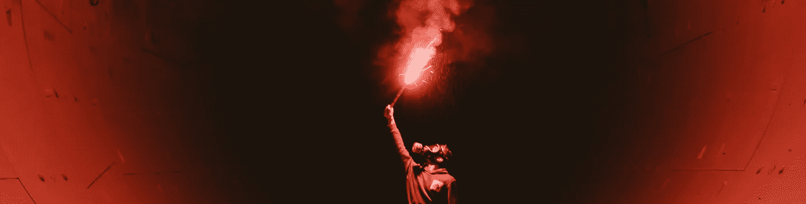
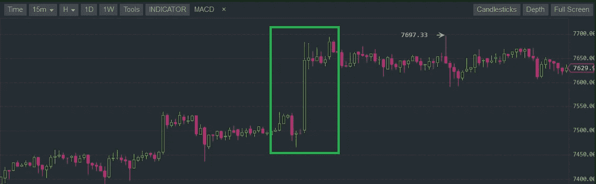
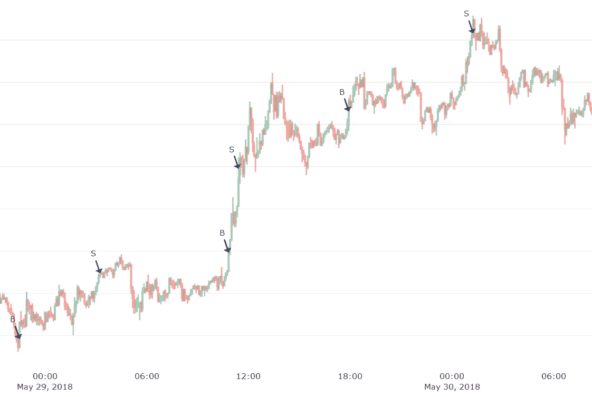
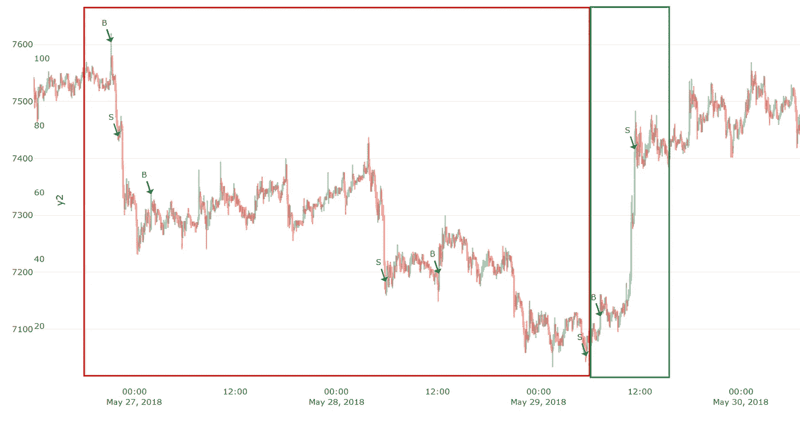

# 有利可图的加密交易策略第 10 部分:克瑞托斯 1.0

> 原文：<https://medium.com/coinmonks/profitable-crypto-trading-strategies-part-10-kratos-1-0-206784613cbb?source=collection_archive---------1----------------------->

加密货币以其波动性和不确定性而闻名。但它们很容易被拥有资源的加密鲸操纵，它们可以随心所欲地操纵市场，这一概念被称为“泵&转储”。像你我这样的普通交易者无法接触到这些内幕交易团体，但我们可以用自己的智慧开发交易算法，来检测这些泵&转储场景。

机器学习和人工智能对于复杂问题的建模、模式检测等极其有用。但是他们不能帮助我们预测泵转储(P&D)——因为这些是罕见的精心策划的事件，这使得它们高度不可预测。

> 还可以阅读:[最好的加密交易机器人](/coinmonks/crypto-trading-bot-c2ffce8acb2a)

我们可以试着探测它，而不是试图预测下一个 P&D。如果我们能够在早期检测到泵，我们就可以发起购买订单。这种泵可以在几分钟(或几小时)内大幅改变价格，通常在 1%到 5%之间，有时甚至更多。

A random “pump” scenario in the BTC/USDT market.

泵送和倾倒事件的检测可以被归类为异常检测(AD)。统计中的异常被称为数据中的异常值，围绕 AD 系统有一整套科学。如果你想了解更多关于广告系统的技术规范，它们是如何工作的，以及如何制作你自己的: [Pavel Tiunov 的](https://blog.statsbot.co/time-series-anomaly-detection-algorithms-1cef5519aef2)有几篇好文章和教程可以帮助你入门。

人们可以使用基本的数学/统计公式来为简单的问题创建广告系统，但这些方法不适用于复杂的问题。对于后一种情况，人们可以使用神经网络或类似的人工智能系统来检测高度复杂的数据集中的异常。

crypto 的异常检测不是最复杂的问题，但也绝不是最简单的问题。很长一段时间以来，我们一直试图提出利用 P&D 情景的交易算法。挑战在于尽早发现它们，因为如果为时已晚，你将无利可图。就公式而言，检测 P&D 氏症是轻而易举的事情，但挑战在于对它们进行分类并做出相应的反应。有时候小抽可以演变成看涨的上升趋势行情；或者导致长期看跌的市场。在熊市条件下也会出现泵，但这是非常危险的，我们应该尽量避免。这些额外的复杂性只是总数的一小部分，实际上还有更多可能的情况需要考虑。

# 奎托斯 1.0

当我在开发新的交易算法时，我偶然发现了一个很好的检测 P & Ds 的方法。从这个代码中，克瑞托斯交易策略诞生了，它仍然是一个早期的策略，但有很大的潜力。事实上，它在瑞士联邦理工学院/USDT 市场上的表现优于我们的许多其他策略。在下面的图表中，你可以看到一些买入和卖出的信号。

A portion of signals in ETH/USDT market

通过观察上面图表中的信号，我们了解到两件事:

1.  买入信号非常好，它们出现在泵送的早期。也许我们可以在未来的版本中做更多的改进。
2.  卖出信号是次优的，这是很重要的一点。通过改善销售信号，这种策略的投资回报率可以大大提高。在这个版本中，当保证 3%的利润率时，我们使算法销售。在实践中，特别是如果你是手动交易，你可能想跟随价格，直到它达到一个峰值。峰值检测是另一个复杂的问题，因为我们永远无法确定价格是否达到了局部最大值。在这种情况下，你要么投机，冒险等待更长时间，要么谨慎行事，在获得一定的利润后退出(比如我们的情况是 3%)。

## 回测“克瑞托斯 1.0”

在下面的模拟中，我们将针对币安交易所的三种不同的加密货币在 60 天内(2018 年 4 月 1 日至 5 月 30 日)运行该算法。

> 请记住，我们的投资回报率包含了交易所交易费，并考虑了额外的滑点。最后，我们运行回测模拟 100 次，从区间的[低，高]范围中随机选择买入和卖出价格。因此，最终的平均投资回报率是非常现实的，并作为一个下限的预期回报。

**BTC/USDT** 的平均投资回报率: **14.33%** ( 8.56)

**长期资本/USDT** 的平均投资回报率: **16.04%** ( 9.35)

**瑞士联邦理工学院/USDT** 的平均投资回报率: **75.80%** ( 15.59)

## 分析和讨论

这些都是很好的投资回报率，通过提高“卖出”头寸，我们可以再提高 30%。但有趣的是，这种策略对 ETH 的效果比 BTC 和 LTC 加起来还要好。

这个算法在 ETH 市场引起如此大的反响有很多原因，但是它的解释非常数学化，超出了本文的范围。但为了直观地说明为什么 BTC/USDT 的表现相对较差，请看下图:

A portion of buy/sell signals for BTC/USDT

从上面的图表中，我们看到算法产生了相当多的不利的“购买”信号，其中大多数是在泵的寿命结束时(因此为时已晚)。虽然其中一些买入信号相当“好”，但最终它不得不亏本卖出(以减少更多亏损)。这是一个问题，因为我们使用了一个非常基本的启发式规则:当盈利 3%或亏损 2%时卖出。因此，在 BTC 和 LTC 市场，一个泵很少超过 3%，因此我们很少有机会以 3%的利润销售。我们可以通过优化它们的超参数来改进这些算法，结果它们的 ROI 可能会翻倍。

# 结论

我们了解到这些买入信号定位非常好。这意味着你可以通过跟踪信号获得巨大的利润。但是，为了提高我们的回报，我们不应该把所有的信念都放在“卖出”信号上。我们可以通过自己手动监控价格来获得更高的利润，并增加盈利销售的机会。

如果您喜欢我们的工作和免费文章，请务必订阅并关注。祝您今天愉快，敬请期待下一天。
——伊利亚·内沃林

## **同样，阅读**

*   最好的加密交易机器人
*   最好的比特币[硬件钱包](/coinmonks/the-best-cryptocurrency-hardware-wallets-of-2020-e28b1c124069?source=friends_link&sk=324dd9ff8556ab578d71e7ad7658ad7c)
*   最好的[加密税务软件](/coinmonks/best-crypto-tax-tool-for-my-money-72d4b430816b)
*   [最佳加密交易平台](/coinmonks/the-best-crypto-trading-platforms-in-2020-the-definitive-guide-updated-c72f8b874555)
*   [unis WAP 最佳钱包](/coinmonks/best-wallets-to-use-uniswap-e91a6385d9e8)
*   最佳[加密贷款平台](/coinmonks/top-5-crypto-lending-platforms-in-2020-that-you-need-to-know-a1b675cec3fa)
*   [bits gap review](https://blog.coincodecap.com/bitsgap-review)——一个轻松赚钱的加密交易机器人
*   为专业人士设计的加密交易机器人
*   [3commas Review](https://blog.coincodecap.com/3commas-review-an-excellent-crypto-trading-bot) |一款优秀的密码交易机器人
*   [3Commas vs Cryptohopper](/coinmonks/cryptohopper-vs-3commas-vs-shrimpy-a2c16095b8fe)
*   Bitmex 上的[保证金交易的白痴指南](/coinmonks/the-idiots-guide-to-margin-trading-on-bitmex-dbbd7742c6fc?source=friends_link&sk=7bfa99d2a181142510c8442c8ddb0786)
*   加密摇摆交易的权威指南
*   [Bitmex 高级保证金交易指南](/coinmonks/bitmex-advanced-margin-trading-guide-2270c195ce25?source=friends_link&sk=1d986cca731f5084b9a2db4a4bc4a7ad)
*   [开发者最佳加密 API](/coinmonks/best-crypto-apis-for-developers-5efe3a597a9f)
*   [加密套利](/coinmonks/crypto-arbitrage-guide-how-to-make-money-as-a-beginner-62bfe5c868f6)指南:新手如何赚钱
*   顶级[比特币节点](https://blog.coincodecap.com/bitcoin-node-solutions)提供商
*   最佳[加密制图工具](/coinmonks/what-are-the-best-charting-platforms-for-cryptocurrency-trading-85aade584d80)

> [直接在您的收件箱中获得最佳软件交易](https://coincodecap.com?utm_source=coinmonks)

