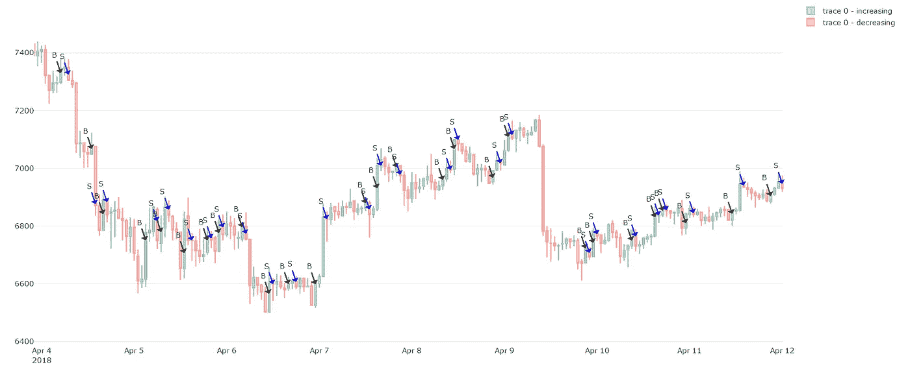

# 有利可图的加密交易策略第 2 部分:普罗米修斯

> 原文：<https://medium.com/coinmonks/profitable-crypto-trading-strategies-part-2-prometheus-1665d10b609b?source=collection_archive---------1----------------------->

普罗米修斯是一个泰坦神，他从众神那里窃取了火种，并将它赐予了人类。这种交易算法的名字是有意选择的。它类似于普罗米修斯为人类所做的。在我们的例子中，“神”是市场推动者或鲸鱼，而“火”是由有组织的交易信号代表的。

# 概述

在上一篇文章中，我分析和讨论了基于移动平均线(MA)算法的交易策略。问题是，优化起来非常复杂，自动化交易就更难了。

# 众神

加密交易因其波动性和不稳定性而闻名。这可能会吓到普通投资者，然而，不稳定也会带来巨大的变化。我喜欢 crypto 的一点是，它可以在几个小时内增长 10%以上。尽管这些事件非常罕见，但我们每天都可以利用大量较小的异常。

Bitcoin’s price went up by over 10% in an hour.

是什么导致了这些事件？我可以告诉你，它们不是随机发生的，而是一个封闭的个人/公司团体决定在精心安排的日期大量购买或出售加密货币的结果，因此，它们对价格有很大的影响。

> 另请阅读:[最佳加密交易机器人](/coinmonks/crypto-trading-bot-c2ffce8acb2a)

# 偷火

不幸的是，我们中 99%的人都无法进入这些封闭的独家交易圈。尽管无法进入，我们仍然可以从这些活动中获得巨大的利益。我们通过应用数学和统计学提出算法来检测这些异常，并根据它们进行交易。这构成了我们普罗米修斯算法的基础。普罗米修斯的精确算法仍然保密，但是我们很慷慨地与你分享它的结果。

## 普罗米修斯 1.0

Prometheus 的性能因市场条件和间隔大小而异。除此之外，它只有一个超参数，而 MA 算法至少有两个。以下是我们回溯测试的投资回报率——每个回溯测试由 100 个模拟组成，从 OC 范围中随机选择一个价格。测试模拟了不同的天数，但每一次都持续到 4 月 18 日 00:00 GMT。

**BTC-美元**每隔 **1 小时**
过去 30 天—平均投资回报率:16.43%
过去 60 天—平均投资回报率:48.05%
过去 90 天—平均投资回报率:183.67%

**ETH-USD** 每隔 **1 小时**
过去 30 天—平均投资回报率:34.21%
过去 60 天—平均投资回报率:62.22%
过去 90 天—平均投资回报率:309.67%

**LTC-USD** 每隔 **1 小时**
过去 30 天—平均投资回报率:35.70%
过去 60 天—平均投资回报率:105.75%
过去 90 天—平均投资回报率:608.31%

起初，我们不相信这些结果是有效的。很多天来，我们都持怀疑态度，并在寻找算法中的一些错误或差错。幸运的是，我们还没有发现它，所以通过仔细分析它的交易信号，我们得出结论，结果是有效的。

为了说明为什么这种策略如此有效，我们来看看它的一些交易决策。下图显示了截至 2018 年 1 月底对 LTC-USD 市场做出的部分模拟决策:

Prometheus trading decisions for LTC-USD end of January 2018.

我们清楚地看到，它做出了一些非常好的买卖决策。但是你也会注意到它们也不是最优的。这意味着一件事:这种算法可以大大改善，实现更高的投资回报率。

在下一张图中，我们可以看到其自 2018 年 3 月中旬以来对 ETH-USD 市场的部分交易决策。还是那句话，不是每一笔买卖都能带来正利润，但总体来说，这个策略非常有效。

Prometheus trading decisions for ETH-USD for mid March 2018.

在下面的图表中，您可以看到 2018 年 4 月在 BTC 兑美元市场做出的交易决定:

Prometheus trading decisions for BTC-USD for mid April 2018.

## 普罗米修斯 2.0

尽管已经取得了很好的结果，正如我提到的，我们仍在不断改进普罗米修斯的决策。这个算法的第二个版本只有一些小的变化，但它的结果已经好得多了。

**BTC-美元****1 小时间隔**
过去 30 天—平均投资回报率:30.25%(提高了 84%)
过去 60 天—平均投资回报率:88.52%(提高了 84%)
过去 90 天—平均投资回报率:406.67%(提高了 121%)

**ETH-USD** 每隔 **1 小时**
过去 30 天—平均投资回报率:61.11%(提高了 78%)
过去 60 天—平均投资回报率:19.21%(提高了 91%)
过去 90 天—平均投资回报率:693.13%(提高了 123%)

**LTC-USD** 每隔 **1 小时**
过去 30 天—平均投资回报率:48.13%(提高了 34%)
过去 60 天—平均投资回报率:159.28%(提高了 50%)
过去 90 天—平均投资回报率:1193.56%(提高了 96%)

这些结果与众所周知的交易策略/试探法相去甚远，比如基于 SMA 或 EMA 的交易策略/试探法。因此，让我们再一次在下面的图表中看看它的一些决定。

Prometheus trading decisions for LTC-USD before mid February 2018.

Prometheus trading decisions for ETH-USD around mid March 2018.

Prometheus trading decisions for BTC-USD before mid April 2018.

# 结论

这些结果真的很惊人，但是让我警告你保持怀疑。我不相信这种算法是生产就绪，因此它不会在自动驾驶仪上产生这些可怕的 ROI，这有几个原因，我们仍在调查。但好消息是，这些交易信号将在我们即将推出的应用程序中提供，因此您将能够订阅这些信号/通知，并通过它们进行交易。

***感谢您的阅读，祝您有美好的一天！***
——伊利亚·内沃林

## 另外，阅读

*   [最佳加密交易机器人](/coinmonks/crypto-trading-bot-c2ffce8acb2a)
*   最好的比特币[硬件钱包](/coinmonks/the-best-cryptocurrency-hardware-wallets-of-2020-e28b1c124069?source=friends_link&sk=324dd9ff8556ab578d71e7ad7658ad7c)
*   最好的[加密税务软件](/coinmonks/best-crypto-tax-tool-for-my-money-72d4b430816b)
*   [最佳加密交易平台](/coinmonks/the-best-crypto-trading-platforms-in-2020-the-definitive-guide-updated-c72f8b874555)
*   [unis WAP 最佳钱包](/coinmonks/best-wallets-to-use-uniswap-e91a6385d9e8)
*   最佳[加密贷款平台](/coinmonks/top-5-crypto-lending-platforms-in-2020-that-you-need-to-know-a1b675cec3fa)
*   [顶级 DeFi 项目](/coinmonks/defi-future-10-promising-projects-in-the-defi-world-ff2b697ab006)
*   [bits gap review](https://blog.coincodecap.com/bitsgap-review)——一个轻松赚钱的加密交易机器人
*   为专业人士设计的加密交易机器人
*   [3commas Review](https://blog.coincodecap.com/3commas-review-an-excellent-crypto-trading-bot) |一款优秀的密码交易机器人
*   [3Commas vs Cryptohopper](/coinmonks/cryptohopper-vs-3commas-vs-shrimpy-a2c16095b8fe)
*   Bitmex 保证金交易的白痴指南
*   加密摇摆交易的权威指南
*   [Bitmex 高级保证金交易指南](/coinmonks/bitmex-advanced-margin-trading-guide-2270c195ce25?source=friends_link&sk=1d986cca731f5084b9a2db4a4bc4a7ad)
*   开发人员的最佳加密 API
*   [加密套利](/coinmonks/crypto-arbitrage-guide-how-to-make-money-as-a-beginner-62bfe5c868f6)指南:新手如何赚钱
*   顶级[比特币节点](https://blog.coincodecap.com/bitcoin-node-solutions)提供商
*   最佳[加密制图工具](/coinmonks/what-are-the-best-charting-platforms-for-cryptocurrency-trading-85aade584d80)