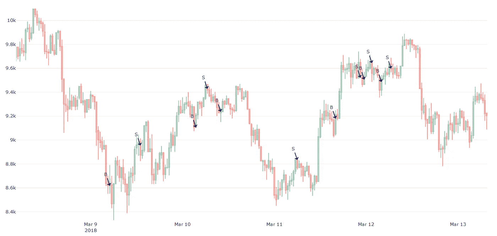
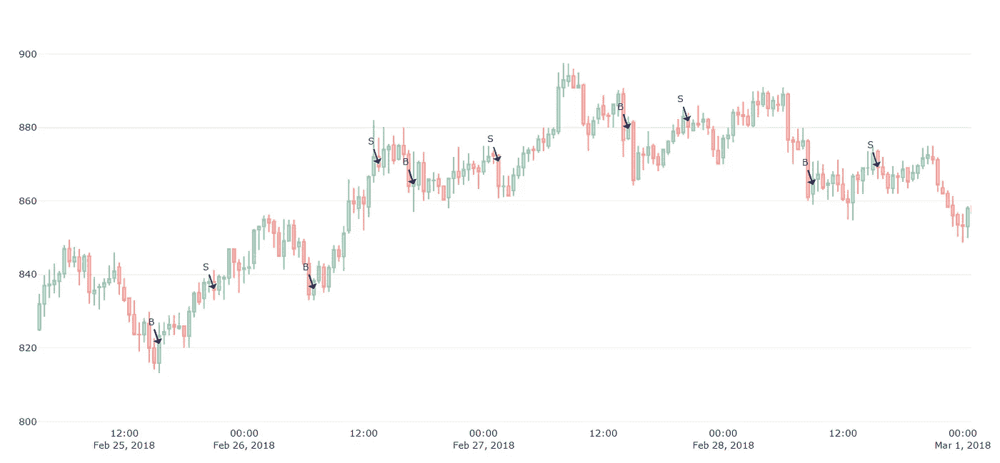
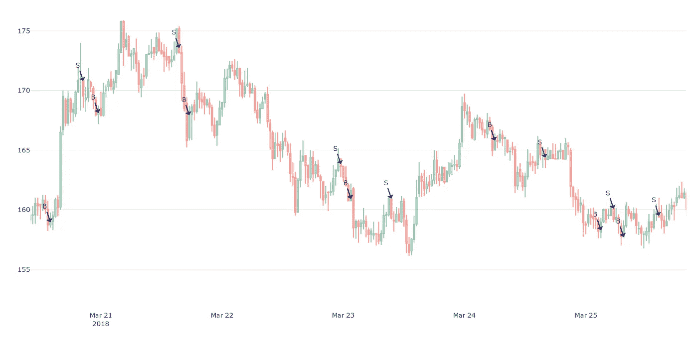
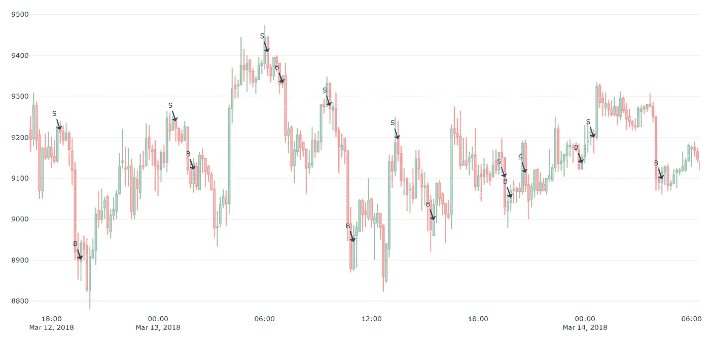
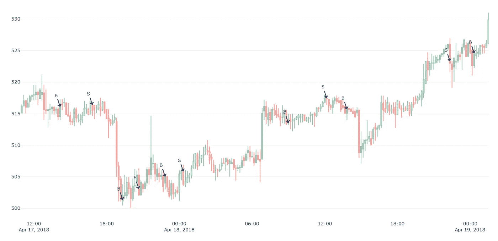
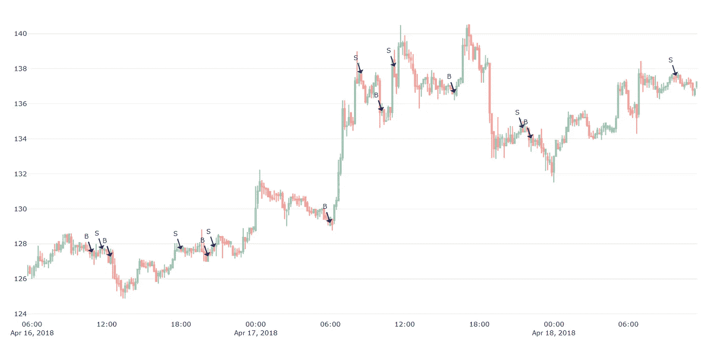

# 有利可图的加密交易策略第 3 部分:Pistis

> 原文：<https://medium.com/coinmonks/profitable-crypto-trading-strategies-part-3-pistis-97b010a00b57?source=collection_archive---------4----------------------->

希腊的信任、诚实和诚信精神被称为 Pistis。我下面将要分析和讨论的交易策略之所以以皮蒂斯命名，有一个特殊的原因:它使用统计证明，由于人类对统计模型非常信任，因此将它与信任、信念和诚实联系起来是有意义的。

# 概述

在我们之前的文章中，我们分析了普罗米修斯的交易策略。无论是莱特币、以太坊还是比特币，它的表现都异常出色。平均而言，莱特币的表现要比其他两种好得多。这可能有很多原因——因为我们不是学者(而是商人),所以我们不会浪费任何时间去研究这个问题。

# Pistis 1.0

这种新交易算法的独特之处在于，它完全由统计方程构建而成，根本没有超参数需要调整。让我首先展示 Pistis 在不同市场环境下的表现，然后我会举例说明这个算法做出的决定。

**BTC 对美元**30 分钟间隔 **过去 108 天—平均投资回报率:95.66%
**瑞士法郎对美元**30 分钟间隔 **过去 108 天—平均投资回报率:94.36%
**LTC 对美元**30 分钟间隔 **过去 108 天—平均投资回报率:69.49******

> ******试用 [HyperTrader](https://hypertrader.app/) 并使用 COINCODECAP 优惠券获得 15%的折扣。另请参阅 [HyperTrader 评论](https://blog.coincodecap.com/hypertrader-review-an-ultimate-trading-experience)。******

******我们已经可以看到 Pistis 在 BTC 和 ETH 的表现比 LTC 好得多——这与 Prometheus 相反。但我们也看到，它的表现比普罗米修斯 2.0 差得多，例如，普罗米修斯 2.0 在短短 90 天内就有超过 1000%的投资回报率。这不是问题，我们不是要和普罗米修斯本身竞争，而是我们能做得更好吗？让我们尝试不同的间隔大小:******

********BTC 对美元**每隔 **10 分钟**
过去 108 天—平均投资回报率:216.00%
**瑞士法郎对美元**每隔 **10 分钟**
过去 108 天—平均投资回报率:232.36%
**LTC 对美元**每隔 **10 分钟**
过去 108******

****当使用 10 分钟的蜡烛线间隔时，ROI/performance 几乎翻了三倍。我还尝试了其他时间间隔，如 5 米、15 米、60 米和 120 分钟，但这些 ROI 要么接近于零，要么为负值，因此不值得在此讨论。****

****让我们看看这一战略发出的信号。首先是基于 30 分钟间隔的决策。****

********

****Pistis for 30-minute intervals (BTC-USD)****

********

****Pistis for 30-minute intervals (ETH-USD)****

********

****Pistis for 30-minute intervals (LTC-USD)****

****从上面的图表中，我们看到一些买入/卖出信号根本不是最佳的，因此产生了亏损。由于这只是 Pistis 的第一个版本(1.0)，它只基于一组预定义的规则生成信号。在以后的版本中，我们可以优化和添加更多的规则来消除这些失败的决策。现在让我们来看看 10 分钟间隔的决定:****

********

****Pistis for 10-minute intervals (BTC-USD)****

********

****Pistis for 10-minute intervals (ETH-USD)****

********

****Pistis for 10-minute intervals (LTC-USD)****

****我们看到 10 分钟间隔也有一些非常糟糕的买入/卖出决策。但是它的投资回报率大约是它的三倍。其中一个原因是，间隔越短，越能最小化坏交易的影响，同时还能增加好交易的影响。****

****Pistis 交易 LTC 或 ETH 的投资回报率远高于 BTC。我想知道是否有一些其他的加密市场，Pistis 策略的表现会明显好于 LTC。但那是另一天的话题。目前我所承诺的是 Pistis 信号将包含在我们即将推出的应用程序中。****

*****感谢阅读，敬请期待！*:)
——伊利亚·涅沃林****

## ****另外，阅读****

*   ****最好的加密交易机器人****
*   ****最好的比特币[硬件钱包](/coinmonks/the-best-cryptocurrency-hardware-wallets-of-2020-e28b1c124069?source=friends_link&sk=324dd9ff8556ab578d71e7ad7658ad7c)****
*   ****最好的[加密税务软件](/coinmonks/best-crypto-tax-tool-for-my-money-72d4b430816b)****
*   ****[最佳加密交易平台](/coinmonks/the-best-crypto-trading-platforms-in-2020-the-definitive-guide-updated-c72f8b874555)****
*   ****[unis WAP 最佳钱包](/coinmonks/best-wallets-to-use-uniswap-e91a6385d9e8)****
*   ****最佳[加密贷款平台](/coinmonks/top-5-crypto-lending-platforms-in-2020-that-you-need-to-know-a1b675cec3fa)****
*   ****[顶级 DeFi 项目](/coinmonks/defi-future-10-promising-projects-in-the-defi-world-ff2b697ab006)****
*   ****[bits gap review](https://blog.coincodecap.com/bitsgap-review)——一个轻松赚钱的加密交易机器人****
*   ****为专业人士设计的加密交易机器人****
*   ****[3 商业评论](https://blog.coincodecap.com/3commas-review-an-excellent-crypto-trading-bot) |一款优秀的密码交易机器人****
*   ****[3Commas vs Cryptohopper](/coinmonks/cryptohopper-vs-3commas-vs-shrimpy-a2c16095b8fe)****
*   ****Bitmex 保证金交易的白痴指南****
*   ****[加密摇摆交易的权威指南](/coinmonks/the-definitive-guide-to-crypto-swing-trading-7e4af6496d4d?source=friends_link&sk=70448050bd9323b42f63bfc0bb1e60d1)****
*   ****[Bitmex 高级保证金交易指南](/coinmonks/bitmex-advanced-margin-trading-guide-2270c195ce25?source=friends_link&sk=1d986cca731f5084b9a2db4a4bc4a7ad)****
*   ****开发人员的最佳加密 API****
*   ****[加密套利](/coinmonks/crypto-arbitrage-guide-how-to-make-money-as-a-beginner-62bfe5c868f6)指南:新手如何赚钱****
*   ****顶级[比特币节点](https://blog.coincodecap.com/bitcoin-node-solutions)提供商****
*   ****最佳[加密制图工具](/coinmonks/what-are-the-best-charting-platforms-for-cryptocurrency-trading-85aade584d80)****

> ****[直接在您的收件箱中获得最佳软件交易](https://coincodecap.com?utm_source=coinmonks)****

********