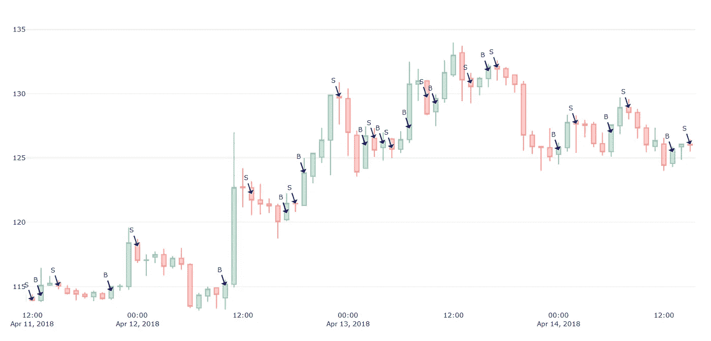
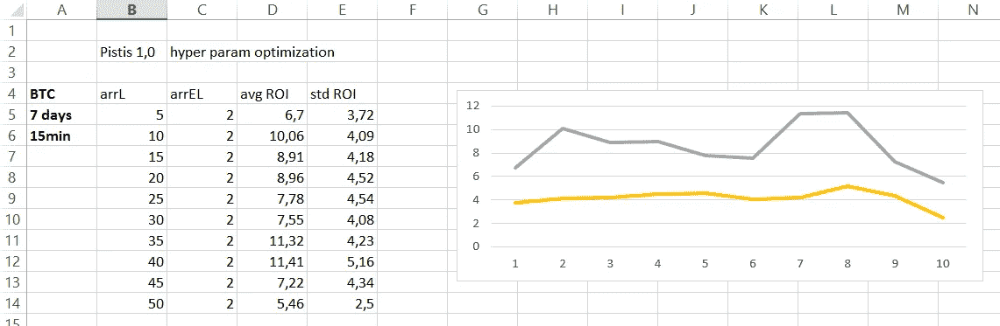
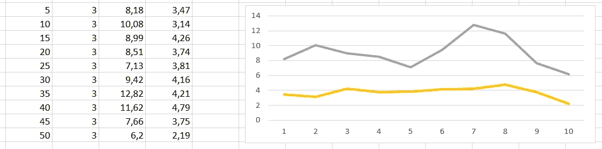
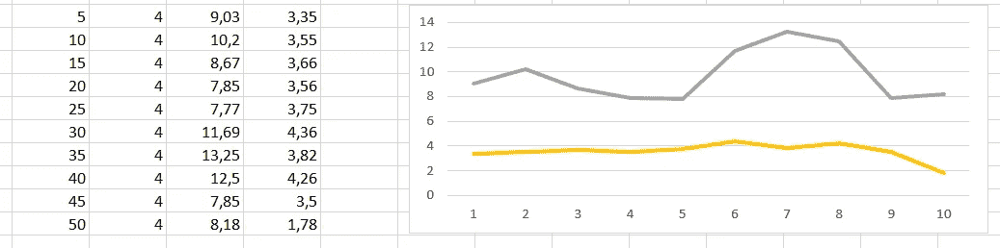
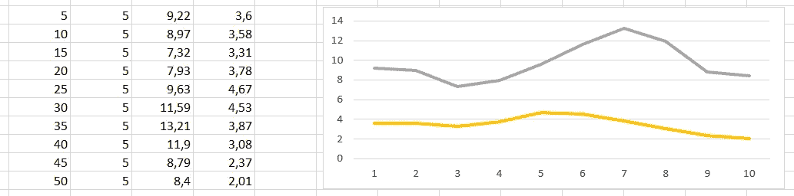
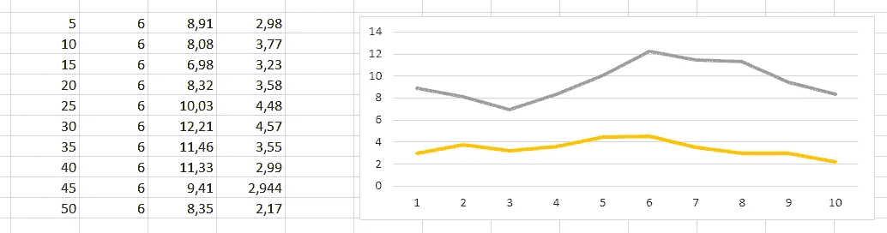

# 有利可图的加密交易策略第四部分:普罗米修斯和皮蒂斯的修正

> 原文：<https://medium.com/coinmonks/profitable-crypto-trading-strategies-part-4-revision-of-prometheus-and-pistis-52a65d630c9d?source=collection_archive---------5----------------------->

你可能还记得我们之前的交易策略，叫做普罗米修斯，它每月产生+50%的投资回报率。在这篇文章中，我将解释为什么普罗米修斯是有缺陷的，并提出一些调整。

Snippet from Prometheus 2.0 algorithm on LTC-USDT market.

上图显示了 Prometheus (2.0)如何在 LTC-USDT 市场做出买入和卖出决策。几乎每一笔交易都是成功的，即获得了丰厚的利润。

# 回溯测试是有缺陷的

然而，后验测试系统有一个很大的问题，这使得它们存在缺陷。在我们的案例中，当 Prometheus 在 30 天内产生超过 50%的 ROI 时，它是基于静态历史数据。回溯测试算法被设计和用于分析一些交易算法的性能，但是将它们部署到现实世界中(即部署到交易机器人中)不一定会使它们以相同的方式执行。

我终于明白为什么交易机器人开发者在他们的机器人不再工作，但在模拟(回溯测试)环境中表现良好时会感到震惊。当我在普罗米修斯上工作时，我已经对这种情况产生了怀疑，因为我注意到当用从[低，高]范围中随机选择的价格值进行回溯测试时，ROI 是负的；而[开盘价、收盘价]区间的价格产生了巨大的投资回报率。

> 另请阅读:最佳加密交易机器人

原因是真实的交易环境是不断变化的。许多这些自动交易系统是使用某个交易所的 WebSocket API 开发的，这些 WebSocket 大约每秒钟广播一次价格。这也意味着，我们的算法每一秒钟都会被触发，必须做出买入、卖出或持有的决定。如果算法和系统没有精心设计，它会很快耗尽你的资产。另一个挑战是簿记—在这样一个快速的环境中，人们需要确保所有需要的数据都被正确存储并易于访问，因为每一秒都很重要。最后，我的结论是，如果一个策略在[低，高]范围内进行回溯测试时产生正 ROI，那么它将在实时系统中工作良好。换句话说，让一个算法在(低、高)区间内通过回溯测试工作，可以确保它在实时交易中也能正常工作。

普罗米修斯的问题是，它的算法在静态数据上工作得非常好，但它不是为处理连续的数据流而设计的，所以它最终在一个烛台的间隔内产生了数百个不同的信号(即一小时内产生数百个信号)。不幸的是，普罗米修斯的算法已经变得毫无用处，尽管它非常简单，投资回报率也非常有希望。现在，我把普罗米修斯放在一边，直到想出如何让它在真实交易系统中工作。

# 皮蒂斯来救援了

为了准备我们即将推出的应用程序，我们一直在努力开发新的交易策略。这些将被用来产生交易信号。在我们系列的第三部分，我介绍了“Pistis”算法，尽管它的投资回报率比 Prometheus 低，但它在真实的交易环境中确实运行良好。

然而，它有两个需要优化的超参数。今天早些时候，我花了一些时间寻找一些最佳组合。下面的截图显示了用 ROI 及其相应的标准偏差(单位为%)测量的不同参数值的结果。这些 ROI 是在 BTC-UDT 7 天时间内以 15 分钟间隔计算的。

Pistis param arrEL = 2

Pistis param arrEL = 3

Pistis param arrEL = 4

Pistis param arrEL = 5

Pistis param arrEL = 6

初始算法随机选择的参数(arrL = 20 和 arrEL = 3)与我们这里的相比实际上是次优的。下一步是复制 Pistis(版本 1.1)并使用参数 arrL=35 和 arrEL=4，因为正是在这些值处形成峰值(即最高 ROI)。

除了寻找和优化超参数，我们还必须调整这些算法做出的决定。再一次，这变成了一个漫长而乏味的调整和优化小细节的过程，只是为了获得稍高的投资回报率。

下图显示了 Pistis 算法的买入和卖出决策。显而易见的是，每个信号之间有相当长的延迟，需要几个小时或几天才能决定是买还是卖。

Pistis with hyper-parameters arrL=35, arrEL=4

Pistis 目前的形式应被视为中长期交易策略。从表面上看，这种算法似乎在上升趋势的市场中工作得很好，但在长期下降趋势期间是否有利可图还需要分析。

但是我可以说 Pistis 只适用于 BTC，不适用于 ETH 或 LTC。但我很有信心，通过一些修改，我们可以克服这些限制。

感谢您的阅读，敬请期待更多内容！:)
——伊利亚·内沃林

## 另外，阅读

*   最佳加密交易机器人
*   最好的比特币[硬件钱包](/coinmonks/the-best-cryptocurrency-hardware-wallets-of-2020-e28b1c124069?source=friends_link&sk=324dd9ff8556ab578d71e7ad7658ad7c)
*   最好的[加密税务软件](/coinmonks/best-crypto-tax-tool-for-my-money-72d4b430816b)
*   [最佳加密交易平台](/coinmonks/the-best-crypto-trading-platforms-in-2020-the-definitive-guide-updated-c72f8b874555)
*   [unis WAP 最佳钱包](/coinmonks/best-wallets-to-use-uniswap-e91a6385d9e8)
*   最佳[加密贷款平台](/coinmonks/top-5-crypto-lending-platforms-in-2020-that-you-need-to-know-a1b675cec3fa)
*   [顶级 DeFi 项目](/coinmonks/defi-future-10-promising-projects-in-the-defi-world-ff2b697ab006)
*   Bitsgap 评论——一个轻松赚钱的加密交易机器人
*   [Quadency Review](https://blog.coincodecap.com/quadency-review-a-crypto-trading-automation-platform) -为专业人士打造的加密交易机器人
*   [3 商业评论](https://blog.coincodecap.com/3commas-review-an-excellent-crypto-trading-bot) |一款优秀的密码交易机器人
*   [3Commas vs Cryptohopper](/coinmonks/cryptohopper-vs-3commas-vs-shrimpy-a2c16095b8fe)
*   Bitmex 上的[保证金交易指南](/coinmonks/the-idiots-guide-to-margin-trading-on-bitmex-dbbd7742c6fc?source=friends_link&sk=7bfa99d2a181142510c8442c8ddb0786)
*   [加密摇摆交易权威指南](/coinmonks/the-definitive-guide-to-crypto-swing-trading-7e4af6496d4d?source=friends_link&sk=70448050bd9323b42f63bfc0bb1e60d1)
*   [Bitmex 高级保证金交易指南](/coinmonks/bitmex-advanced-margin-trading-guide-2270c195ce25?source=friends_link&sk=1d986cca731f5084b9a2db4a4bc4a7ad)
*   [开发人员的最佳加密 API](/coinmonks/best-crypto-apis-for-developers-5efe3a597a9f)
*   [加密套利](/coinmonks/crypto-arbitrage-guide-how-to-make-money-as-a-beginner-62bfe5c868f6)指南:新手如何赚钱
*   顶级[比特币节点](https://blog.coincodecap.com/bitcoin-node-solutions)提供商
*   最佳加密制图工具

> [直接在您的收件箱中获得最佳软件交易](https://coincodecap.com?utm_source=coinmonks)

