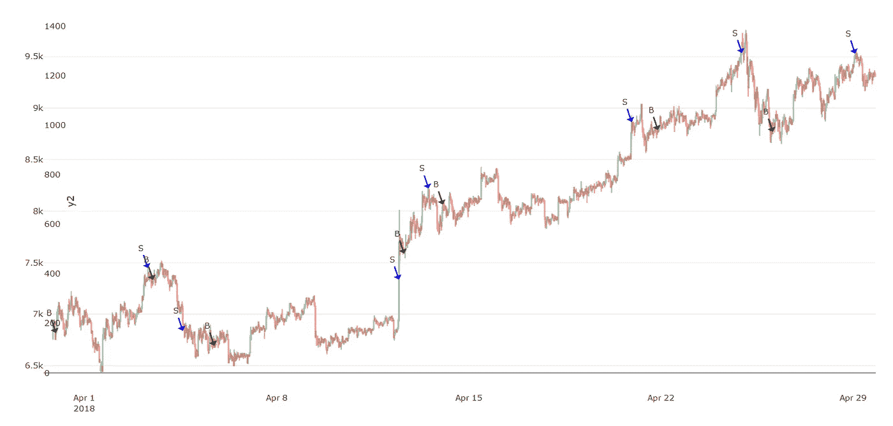
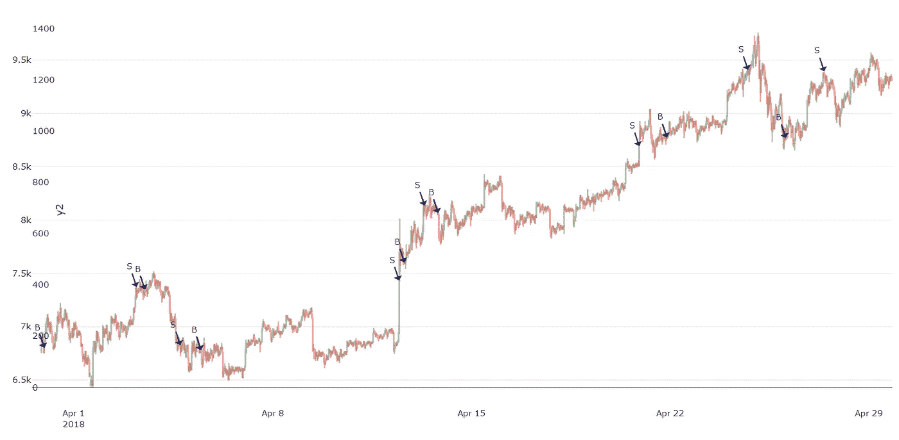
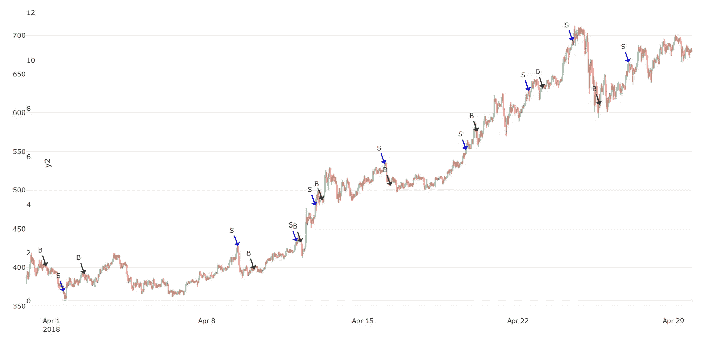
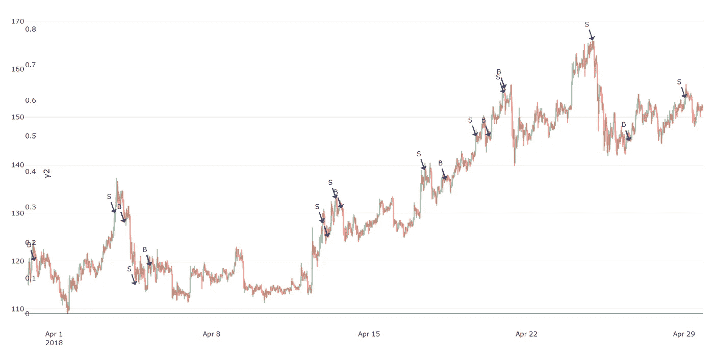

# 有利可图的加密交易策略第 5 部分:Voltra

> 原文：<https://medium.com/coinmonks/profitable-crypto-trading-strategies-part-5-voltra-633f81eed360?source=collection_archive---------1----------------------->

在今天的节目中，我将展示、分析和讨论我们最新的交易策略，我们称之为“Voltra”。这种策略收益率可以在交易相对较少的情况下，每月产生 40%至 90%的投资回报率，但这也取决于你关注的市场。

Voltra 这个名字实际上是“量”和“交易”的结合。原因很明显:Voltra 算法主要是基于交易量构建的。这意味着它使用价格和交易量产生买卖信号。这实际上是我们的第一个算法，交易量是一个关键的组成部分。

第一个不幸的部分是，该算法有四个超参数，很难优化。事实上，我不得不整夜运行(强力)优化代码，因为它需要几个小时才能完成。第二部分是，像我们以前所有的方法一样，它不是一个神奇的公式，可以赢得每一笔交易。但如果你对投资或交易略知一二，这就不足为奇了。

> 另请阅读:[最佳加密交易机器人](/coinmonks/crypto-trading-bot-c2ffce8acb2a)

现在让我们来看看沃特拉的买入和卖出决策。下图显示了 30 天内 30 分钟间隔的比特币(BTC-USDT)市场。正如你现在已经知道的:“B”表示买入,“S”表示卖出。

Voltra for BTC-USDT yielding an ROI of 52%

上图中的信号在 30 天内产生了 52%的投资回报率，但更好的是，它在整整 7 个完整的交易周期内完成了所有这些(低买高卖)。

棘手的部分是获得正确的超参数。事实上，没有办法让他们正确。通过优化参数，我们试图最大限度地提高投资回报率，但实际上，我们是在针对 30 天的数据集进行优化。例如，如果我们采用不同的 30 天数据周期，这些相同的参数可能不会最终成为最佳参数，即在这种情况下产生最高的可能 ROI。但另一方面，只要我们的参数在一定范围内，它们或多或少会围绕最大投资回报率。为了说明这一点，请看下面的图表。在这种情况下，我稍微调整了它的所有超参数，即使大多数买入和卖出信号保持不变，投资回报率却从 52%下降到 42%。

Sub-optimal — Voltra for BTC-USDT yielding an ROI of 42%

我们也知道一些算法在一些市场的表现比其他市场更好(或更差)。在我的研究中，我使用了三个市场:BTC、ETH 和 LTC。我的结果表明，Voltra 算法最适合 USDT 联邦理工学院，而不是 BTC 或 LTC。

下图显示了 Voltra 对 USDT 联邦理工学院的买入和卖出信号。它又创造了两个完整的交易周期(总共九个)，并在 30 天内产生了 82%的投资回报率，这比 BTC 好得多。

Voltra for ETH-USDT yielding an ROI of 82%

当我将 Voltra 应用于 USDT 长期交易公司时，我注意到它产生了 9 个完整的交易信号，就像对 ETH 一样。但总体投资回报率要低得多:只有 45%，比 BTC 的投资回报率好不了多少。

Voltra for LTC-USDT yielding an ROI of 45%

# 结论

我发现最令人着迷的是 Voltra(像我们所有的其他算法一样)能够产生很好的进场和出场(即买入和卖出)信号。这些可能不是最理想的，没有任何系统可以保证，但它们非常可靠。例如，有时它过于仓促，过早卖出，有时当正在进行局部“转储”时，它会产生买入。

这些缺陷使得这种策略在完全自主的交易机器人中使用风险太大，但它们在帮助我们手动交易时非常有用。举个例子，一个人能够察觉到快速抛售正在发生，如果是这样的话，他/她要么卖掉，要么什么都不做。另一方面，如果有一个稳定的时期，然后是一个快速的上涨，那么人们应该利用这一点，尽快进入市场。像 Voltra 这样的系统还不够成熟，无法将所有这些因素和异常情况考虑在内。

但是当我反思我们的进步时，它变成了巨大的动力；随着我们不断前进，我们的算法变得更加稳健和可靠——我们达到新的高度只是时间问题。

***感谢您的阅读，祝您度过美好的一天！*** ——伊利亚·涅沃林

## **同样，请阅读**

*   最好的加密交易机器人
*   最好的比特币[硬件钱包](/coinmonks/the-best-cryptocurrency-hardware-wallets-of-2020-e28b1c124069?source=friends_link&sk=324dd9ff8556ab578d71e7ad7658ad7c)
*   最好的[加密税务软件](/coinmonks/best-crypto-tax-tool-for-my-money-72d4b430816b)
*   [最佳加密交易平台](/coinmonks/the-best-crypto-trading-platforms-in-2020-the-definitive-guide-updated-c72f8b874555)
*   [unis WAP 最佳钱包](/coinmonks/best-wallets-to-use-uniswap-e91a6385d9e8)
*   最佳[密码借贷平台](/coinmonks/top-5-crypto-lending-platforms-in-2020-that-you-need-to-know-a1b675cec3fa)
*   一个轻松赚钱的加密交易机器人
*   [Quadency Review](https://blog.coincodecap.com/quadency-review-a-crypto-trading-automation-platform) -为专业人士打造的加密交易机器人
*   [3commas Review](https://blog.coincodecap.com/3commas-review-an-excellent-crypto-trading-bot) |一款优秀的密码交易机器人
*   [3Commas vs Cryptohopper](/coinmonks/cryptohopper-vs-3commas-vs-shrimpy-a2c16095b8fe)
*   Bitmex 上的[保证金交易的白痴指南](/coinmonks/the-idiots-guide-to-margin-trading-on-bitmex-dbbd7742c6fc?source=friends_link&sk=7bfa99d2a181142510c8442c8ddb0786)
*   加密摇摆交易的权威指南
*   [Bitmex 高级保证金交易指南](/coinmonks/bitmex-advanced-margin-trading-guide-2270c195ce25?source=friends_link&sk=1d986cca731f5084b9a2db4a4bc4a7ad)
*   [面向开发人员的最佳加密 API](/coinmonks/best-crypto-apis-for-developers-5efe3a597a9f)
*   [加密套利](/coinmonks/crypto-arbitrage-guide-how-to-make-money-as-a-beginner-62bfe5c868f6)指南:新手如何赚钱
*   顶级[比特币节点](https://blog.coincodecap.com/bitcoin-node-solutions)提供商
*   最佳[加密制图工具](/coinmonks/what-are-the-best-charting-platforms-for-cryptocurrency-trading-85aade584d80)