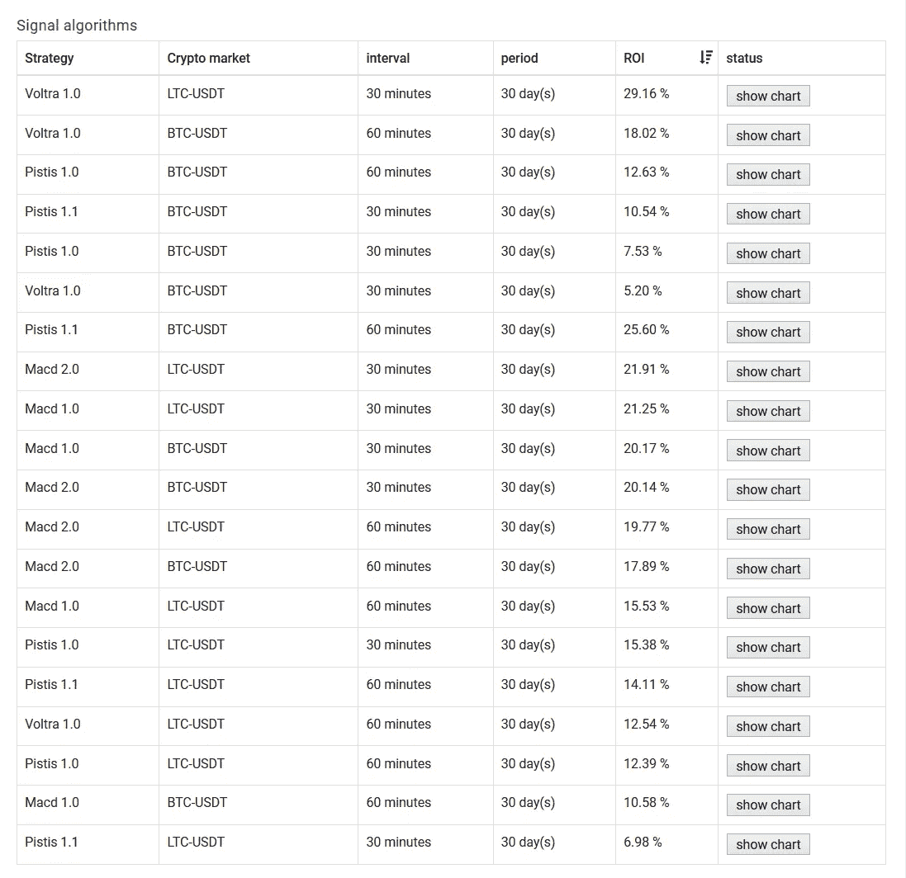
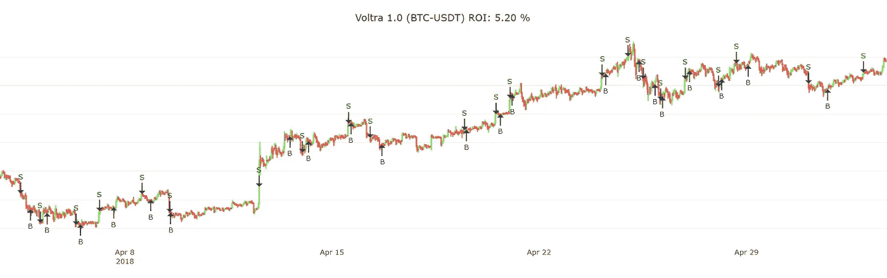
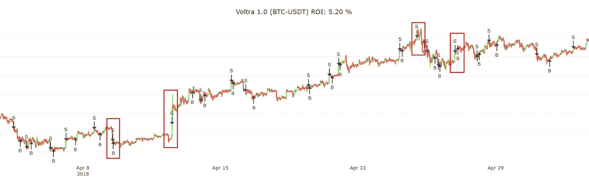
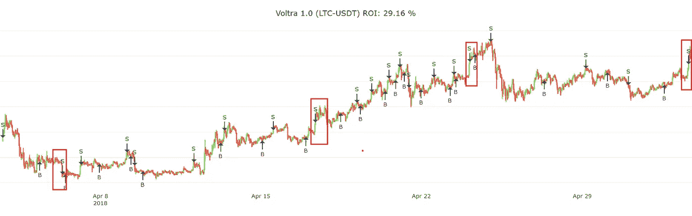

# 有利可图的加密交易策略第 6 部分:好的条目

> 原文：<https://medium.com/coinmonks/profitable-crypto-trading-strategies-part-6-good-entries-9007520908f0?source=collection_archive---------2----------------------->

我们即将推出的应用程序中最独特的功能之一是交易信号。我已经写了五篇关于不同交易策略的文章。在这篇文章中，我将讨论和比较我们现有的一些策略——更具体地说，我想调查他们的投资回报率如何优化它。

大约两周前，我把我们的交易策略插入了我们的实时模拟框架。这个框架模拟了一个真实的交易者。交易者有义务根据我们系统中每个算法产生的信号进行买卖。这样，我们可以实时计算 ROI，这比运行不精确的回溯测试模拟要精确得多。

> 回想一下，我们的算法基于各种标准生成信号，其中一个重要标准是烛台的间隔大小。

下表显示了最新的战略及其相应的投资回报率。在这个特定场景中，ROI 是使用过去 30 天的信号(=周期持续时间)计算的。你会看到有两个加密市场:比特币(BTC-USDT)和莱特币(LTC-USDT)，但也有两个不同的区间大小:30 分钟和 60 分钟。在最终版本中，我们将有更多的市场，如以太坊、Ripple、比特币现金等。

> 还可以阅读:[最好的加密交易机器人](/coinmonks/crypto-trading-bot-c2ffce8acb2a)

Crypto trading strategies with their corresponding ROIs

令人满意的是，所有的 ROI 都是正值，这意味着算法做得很好。但是它们之间有很大的不同。一些投资回报率低于 10%，而另一些则接近 30%。

为了理解为什么会这样，我们必须单独研究每个算法的买卖决策。但是我不想花费无数的时间来比较每一个可能的组合，所以我将分析具有最高和最低 ROI 的算法，看看我们可以从中学习到什么。

# 最低的

在我们的例子中，30 分钟间隔的 BTC-USDT Voltra 1.0 是产生最低 ROI(准确地说是 5.2%)的算法。通过点击“显示图表”按钮，我让它显示所有的买入和卖出决定:

Voltra 1.0 (BTC-USDT) at 30min intervals yields 5.20% ROI

通过看这张图表，我们可以了解到两件事:

1.  不是每个买入信号都是最优的。
2.  不是每个卖出信号都是最佳的。

事实上，我们永远不可能做出“完美”的交易，因为我们无法知道某个价格是否达到了其最终的局部峰值或谷值。我们将采取不同的方法来提高投资回报率，而不是试图达到完美。如果你更深入地思考这个问题，我们可以同意，优化更好的购买决策比优化更好的销售决策更难。

## 划算的买卖

通过买入决策，你可以在一个稳定的时期买入，承担价格在不久的将来会上涨的风险。或者你可以等待一个迷你泵，一旦你发现它就买入。我们的大多数算法都非常擅长做出合理的购买决策，至少比大多数新手甚至一些“专家”要好很多。

## 平庸的销售

但是 algos 并不擅长做销售决策。有时卖出发生得太早——有时人眼可以看到价格会继续上涨，但系统最终还是决定卖出。有时等待时间太长，价格就会持续下跌。为了说明这一点，请看下一张图表。和上面的一样，但是这次我把次优标为“卖出”。

# 最高的

在我进行分析时，针对 LTC-USDT 市场的 Voltra 1.0 在 30 分钟间隔内的投资回报率最高，超过 29%。下图显示了其买入和卖出决定:

Voltra 1.0 (LTC-USDT) at 30 minute intervals yielding 29% ROI

尽管这种算法的投资回报率相当不错，但它还可以进一步优化。因为再一次，一些卖出是次优的，结果，有许多区域系统过早卖出，几个间隔后进入买入交易。由于 0.1%的交易费，这种在卖出后立即买入的试探性方法成本很高，因此对最终投资回报率有很大影响。

在下面的图表中，我指出了一些卖出交易发生过早的地区。相反，系统应该在卖出前等待几个小时，或者在一种情况下(第一个标记区域)，它应该更早卖出。

# 结论

所有这些缺点根本不是问题，因为这些算法还没有针对自动交易进行优化，而是应该用作人工交易的工具。

大多数人不知道什么时候是买入的好时机，所以他们最好使用我们算法中的买入信号。另一方面，一旦他们购买了，定期监控价格并等待价格达到期望的投资回报率(例如 1%)是一件好事。卖出信号应该被用作通知或提醒，如果价格上涨，你应该立即卖出或者再等一会儿。

最后，在 ROI 表上，您可能已经注意到了“Macd 1.0”和“Macd 2.0”算法，这是我们最新的算法，我将在下一部分详细讨论。所以一定要继续关注这一个！一如既往，感谢您的阅读&祝您有美好的一天！

—伊利亚·内沃林

## 另外，阅读

*   [最好的加密交易机器人](/coinmonks/crypto-trading-bot-c2ffce8acb2a)
*   最好的比特币[硬件钱包](/coinmonks/the-best-cryptocurrency-hardware-wallets-of-2020-e28b1c124069?source=friends_link&sk=324dd9ff8556ab578d71e7ad7658ad7c)
*   最好的[加密税务软件](/coinmonks/best-crypto-tax-tool-for-my-money-72d4b430816b)
*   [最佳加密交易平台](/coinmonks/the-best-crypto-trading-platforms-in-2020-the-definitive-guide-updated-c72f8b874555)
*   [unis WAP 最佳钱包](/coinmonks/best-wallets-to-use-uniswap-e91a6385d9e8)
*   最佳[密码借贷平台](/coinmonks/top-5-crypto-lending-platforms-in-2020-that-you-need-to-know-a1b675cec3fa)
*   [顶级 DeFi 项目](/coinmonks/defi-future-10-promising-projects-in-the-defi-world-ff2b697ab006)
*   bits gap review——一个轻松赚钱的加密交易机器人
*   为专业人士设计的加密交易机器人
*   [3commas Review](https://blog.coincodecap.com/3commas-review-an-excellent-crypto-trading-bot) |一款优秀的密码交易机器人
*   [3Commas vs Cryptohopper](/coinmonks/cryptohopper-vs-3commas-vs-shrimpy-a2c16095b8fe)
*   Bitmex 上的[保证金交易的白痴指南](/coinmonks/the-idiots-guide-to-margin-trading-on-bitmex-dbbd7742c6fc?source=friends_link&sk=7bfa99d2a181142510c8442c8ddb0786)
*   [加密摇摆交易权威指南](/coinmonks/the-definitive-guide-to-crypto-swing-trading-7e4af6496d4d?source=friends_link&sk=70448050bd9323b42f63bfc0bb1e60d1)
*   [Bitmex 高级保证金交易指南](/coinmonks/bitmex-advanced-margin-trading-guide-2270c195ce25?source=friends_link&sk=1d986cca731f5084b9a2db4a4bc4a7ad)
*   开发人员的最佳加密 API
*   [加密套利](/coinmonks/crypto-arbitrage-guide-how-to-make-money-as-a-beginner-62bfe5c868f6)指南:新手如何赚钱
*   顶级[比特币节点](https://blog.coincodecap.com/bitcoin-node-solutions)提供商
*   最佳[加密制图工具](/coinmonks/what-are-the-best-charting-platforms-for-cryptocurrency-trading-85aade584d80)

> [直接在您的收件箱中获得最佳软件交易](https://coincodecap.com?utm_source=coinmonks)

