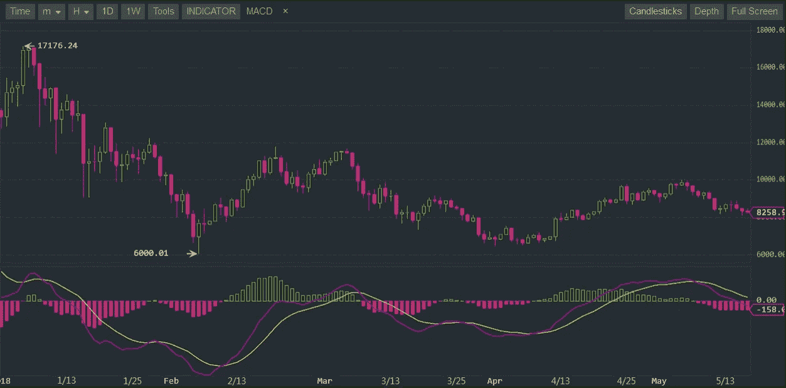
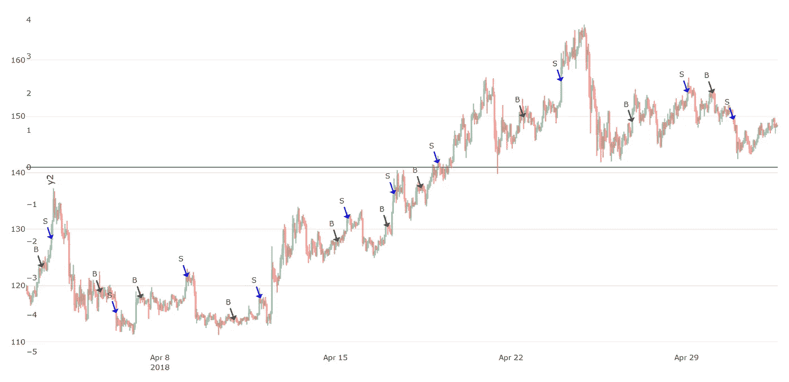
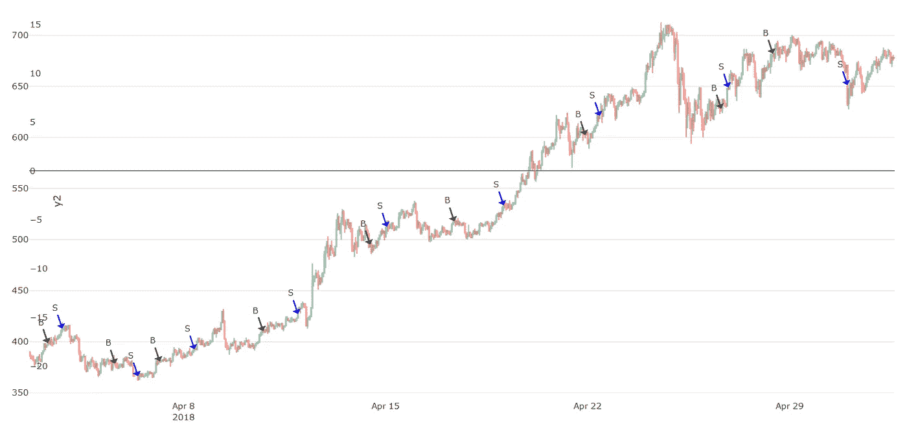
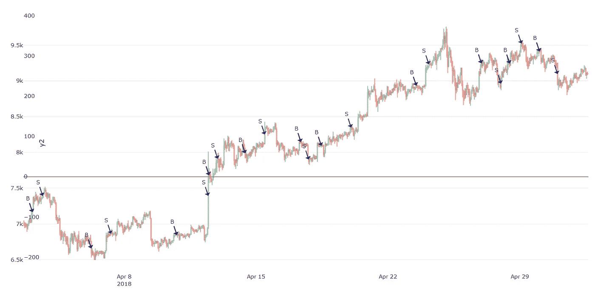
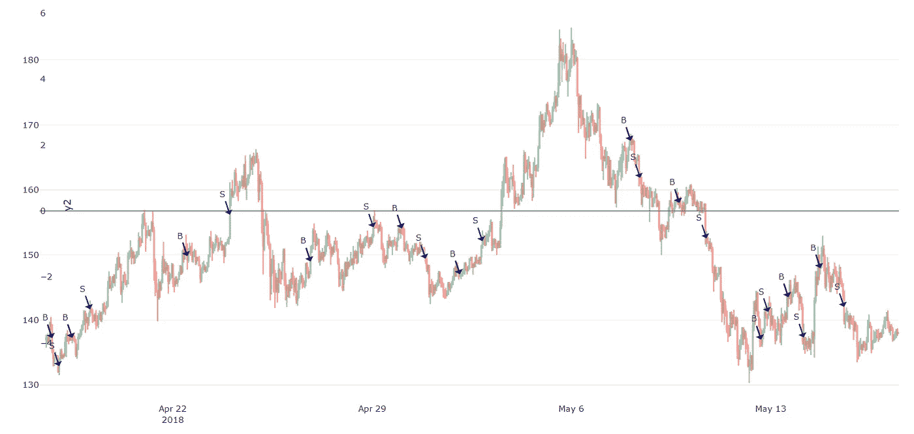
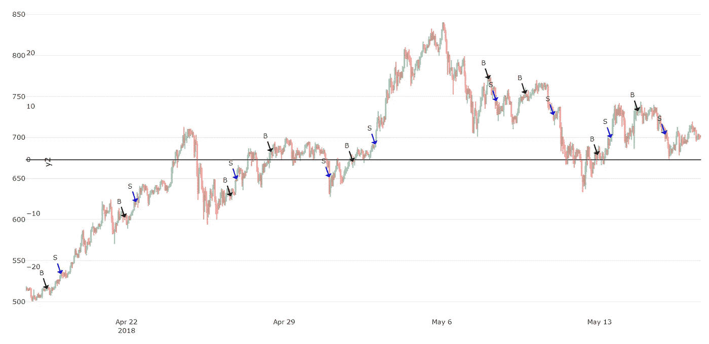
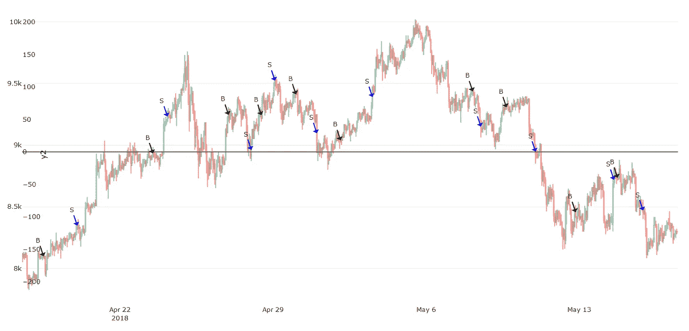
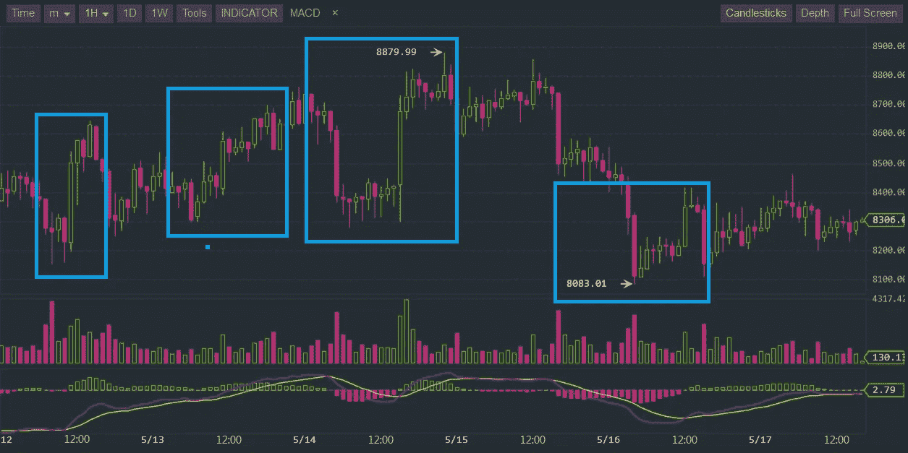
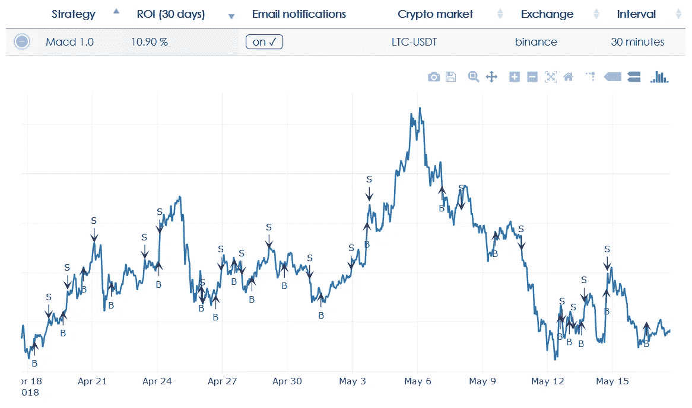
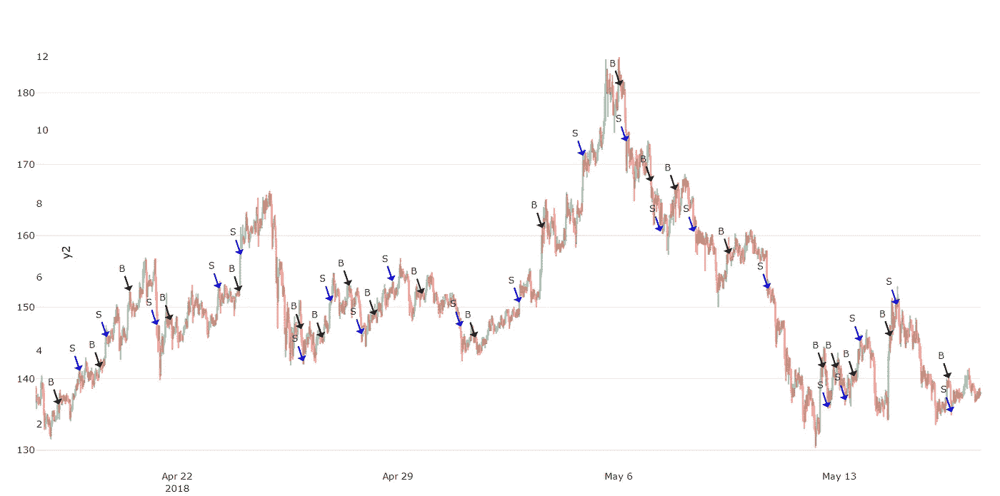

# 盈利的加密交易策略第 7 部分:Macd 1.0

> 原文：<https://medium.com/coinmonks/profitable-crypto-trading-strategies-part-7-macd-1-0-655712e37dd2?source=collection_archive---------1----------------------->

MACD 代表移动平均收敛发散，它只不过是一个基本指标的过于复杂的名字。Macd 指标只是显示了两条不同均线(简单均线或指数均线)之间的关系。在这篇文章中，我将分析和讨论我们的第一个基于 Macd 的交易策略。

# MACD 解释道

如果你不知道或不理解 Macd 指标，那么看看上面的蜡烛图。上面的图是 BTC-USDT 日线图，下面的图是 Macd 指标。该指标由三部分组成:紫色线和黄色线是两条不同的移动平均线。当我们从紫色中减去黄线时，我们得到红色/绿色条(条形图)。大于零的值用绿色条表示，负值用红色表示。这就是全部了。

> 另请阅读:[最佳加密交易机器人](/coinmonks/crypto-trading-bot-c2ffce8acb2a)

## MACD 交易策略

那你怎么用它来交易呢？Macd 是一个非常有用的指标，它有一些非常有趣的特性。一个人可以发明几种交易策略，但这里是其中之一:当有一个从红色到绿色的转变；这表示“买入”信号。但是销售它不太明显，使用绿色到红色的过渡可能会让你的成功率很低。因此，取而代之的目标是获得 1%或 2%的投资回报率，这样每当你达到一定的投资回报率时就卖出。

另一个更理论化的策略:尽量检测棒图上的最低点(红色)买入；然后在最高点(绿色)卖出。不幸的是，我们无法确定“当前”值是最低点(还是最高点),这需要大量的猜测。另一方面，机器学习和人工智能在确定某个“当前”值成为最高点或最低点的概率方面可以做得更好，但这是另一个时间的话题。

# MACD 1.0

我们的 Macd 交易策略比我上面解释的稍微复杂一些。在不深入细节的情况下，让我们看看它是如何逆市表现的。在下面的回溯测试结果中，我计算了基于 3 个不同市场的 ROI:BTC、ETH 和 LTC(在 USDT ),使用 30 天的 60 分钟间隔。

下图显示了从 4 月 2 日到 5 月 2 日我们生成的信号的 LTC-USDT 市场。这些信号的 **ROI** 正好是 **20.26%** ，大概是每天 0.66%。

Macd 1.0 on LTC-USDT (2 April to 2 May)

在下一张图中，我们看到了带有买入/卖出信号的 USDT 联邦理工学院市场——产生了 12.44%的投资回报率。

Macd 1.0 on ETH-USDT (2 April to 2 May)

最后是 BTC-USDT 图表，投资回报率为 16.64%。

Macd 1.0 on BTC-USDT (2 April to 2 May)

值得注意的是，确切的 ROI 值没有更大的图片重要。也就是说，Macd 1.0 对 LTC 的表现优于对 ETH 和 BTC 的表现。原因不是很明显，很大程度上与市场的形态和买入/卖出信号的时机(即运气)有关。

我们的 Macd 算法有 5 个不同的超参数，我们可以优化。但是这样做需要成千上万的计算，需要几个小时(或几天)才能完成。这意味着一件事:投资回报率总是可以优化的，但由于市场总是在变化，最佳的“一般”超参数并不存在——因此不值得努力，因为我们将玩一场我们无法赢得的游戏。

# 市场的形态

我已经多次提到市场的形态非常重要。我们的交易算法只不过是程序化的试探法，现在它们仍处于早期阶段(即哑机器)。

为了说明这一点，让我们在一组不同的最近数据上回测 Macd 1.0 策略。下图显示了从 4 月 17 日到 5 月 17 日的 LTC-USDT 市场和我们的买入/卖出信号。这些信号的 **ROI** 导致了负的 **-8.61%。**

Macd 1.0 on LTC-USDT (17 April to 17 May)

接下来是 USDT 联邦理工学院，收益率为负的**投资回报率为-3.23%。**

Macd 1.0 on ETH-USDT (17 April to 17 May)

最后是 BTC-USDT 法案，导致负的投资回报率为-4.38%。

Macd 1.0 on BTC-USDT (17 April to 17 May)

## 为什么这些 ROI 都是负的？

市场的状态和形态非常重要。直到 5 月 6 日，市场一直处于上升趋势，但随后价格开始大幅下跌。市场变了，但算法保持不变，它们按照指令(即程序)不断产生买入/卖出信号。

## 这是否意味着你不能在下降趋势时期赚钱？

不，但在这些时期交易风险更大，数字就是证据。我注意到，即使在下降趋势期间，也有大量的套现机会。

在下面的蜡烛图中，我指出了非常有利可图的时期，你可以在低谷时买入，在高峰时卖出。这又需要一些猜测，因为很难确切知道“水流”是否在一个山谷，所以这是一个你必须愿意承担的风险。

## 时机很重要

另外，我还提到了一些运气因素(即买入/卖出信号的时机)。例如，两个人可以跟踪相同的信号 30 天，其中一个人将获得 10%的投资回报率，而另一个人将达到盈亏平衡(0%)或更糟。今天早些时候我亲眼目睹了这一切。

在我们(新推出的)应用程序上，人们可以查看任何给定策略的买入/卖出信号。在过去的 30 天里，LTC-USDT 的 Macd 1.0(30 分钟间隔)产生了下图所示的信号，产生了 10.90% 的**投资回报率。**

App: LTC-USDT Macd 1.0 signals (OHLC plot)

如果我在我的另一个回溯测试框架(下图)中运行完全相同的模拟，我得到的平均 T10 投资回报率为-0.80%。

Backtesting: LTC-USDT Macd 1.0 signals (one of the many runs)

为什么同样的策略，同样的市场形态和状态，会产生截然不同的 ROI？为什么一个是正的(10%)一个是负的(-0.80%)。这都与时机有关。

当价格超过某个阈值并符合某个标准时，就会发生买入/卖出。因为我们的两个系统都不实时分析价格，所以有时会错过机会，结果没有买卖发生。应用程序 algo 以 10 到 20 秒的延迟跟踪价格，而回溯测试框架从[低，高]范围内随机选取一个价格。

我们的回溯测试框架运行 100 次模拟，计算它们的 ROI 并得出平均值(为-0.80%)。但它也给出了 6.43%的标准偏差。这意味着，在现实中，对于大多数人(68%)来说，在这 30 天内(即市场状态)，跟随这些信号的人最终将获得[-7.23%至 7.23%]的投资回报率。

我们应用的投资回报率几乎偏离均值两个标准差，这是一个例外——但这是一个很好的例外。总的来说，它很好地通知了我们，时机非常好。

# 结论

我们所有的交易策略都需要重新制定和改进，以应对下降趋势时期。当检测到下跌趋势时，我要么让他们停止交易，要么让系统根据市场状态调整自己的超参数。后一种方法相当具有实验性，但可能会成为一次令人兴奋的冒险。

我希望你喜欢这个分析，请继续关注下一部分。
——伊利亚·内沃林

## 另外，阅读

*   最佳加密交易机器人
*   [德里比特审查](/coinmonks/deribit-review-options-fees-apis-and-testnet-2ca16c4bbdb2) |选项、费用、API 和测试网
*   [FTX 密码交易所评论](/coinmonks/ftx-crypto-exchange-review-53664ac1198f)
*   最好的比特币[硬件钱包](/coinmonks/the-best-cryptocurrency-hardware-wallets-of-2020-e28b1c124069?source=friends_link&sk=324dd9ff8556ab578d71e7ad7658ad7c)
*   [加密复制交易平台](/coinmonks/top-10-crypto-copy-trading-platforms-for-beginners-d0c37c7d698c)
*   最好的[加密税务软件](/coinmonks/best-crypto-tax-tool-for-my-money-72d4b430816b)
*   [最佳加密交易平台](/coinmonks/the-best-crypto-trading-platforms-in-2020-the-definitive-guide-updated-c72f8b874555)
*   最佳[加密贷款平台](/coinmonks/top-5-crypto-lending-platforms-in-2020-that-you-need-to-know-a1b675cec3fa)
*   [莱杰 vs 特雷佐](/coinmonks/ledger-vs-trezor-best-hardware-wallet-to-secure-cryptocurrency-22c7a3fd391e)
*   一个轻松赚钱的加密交易机器人
*   为专业人士设计的加密交易机器人
*   [PrimeXBT 审查](/coinmonks/primexbt-review-88e0815be858) |杠杆交易、费用和交易
*   [享受九折优惠](/coinmonks/haasonline-review-d8d1a3400419)
*   Bitmex 的[保证金交易指南](/coinmonks/the-idiots-guide-to-margin-trading-on-bitmex-dbbd7742c6fc?source=friends_link&sk=7bfa99d2a181142510c8442c8ddb0786)
*   [eToro 评论](/coinmonks/etoro-review-78807ddeb33c) |交易股票、密码、交易所交易基金、差价合约和商品
*   [Bitmex 高级保证金交易指南](/coinmonks/bitmex-advanced-margin-trading-guide-2270c195ce25?source=friends_link&sk=1d986cca731f5084b9a2db4a4bc4a7ad)
*   [面向开发人员的最佳加密 API](/coinmonks/best-crypto-apis-for-developers-5efe3a597a9f)
*   [加密套利](/coinmonks/crypto-arbitrage-guide-how-to-make-money-as-a-beginner-62bfe5c868f6)指南:新手如何赚钱
*   顶级[比特币节点](https://blog.coincodecap.com/bitcoin-node-solutions)提供商
*   最佳[加密制图工具](/coinmonks/what-are-the-best-charting-platforms-for-cryptocurrency-trading-85aade584d80)
*   了解比特币的[最佳书籍有哪些？](/coinmonks/what-are-the-best-books-to-learn-bitcoin-409aeb9aff4b)