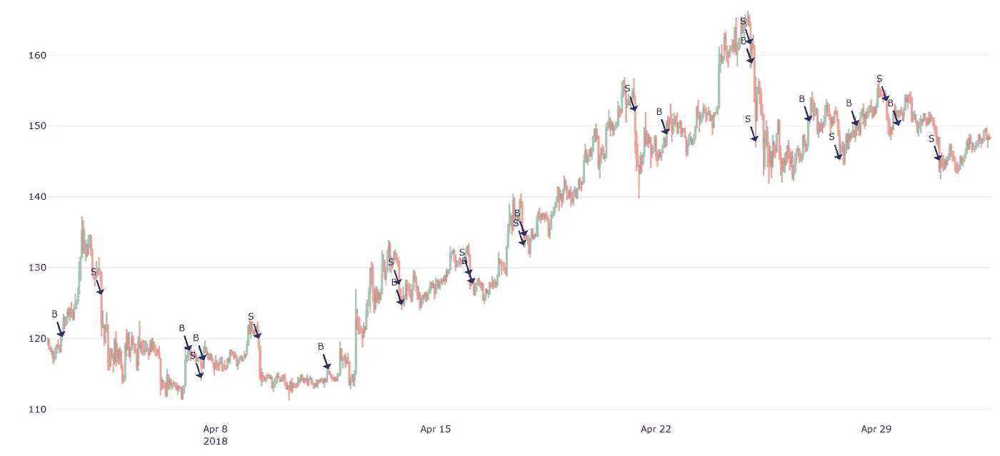
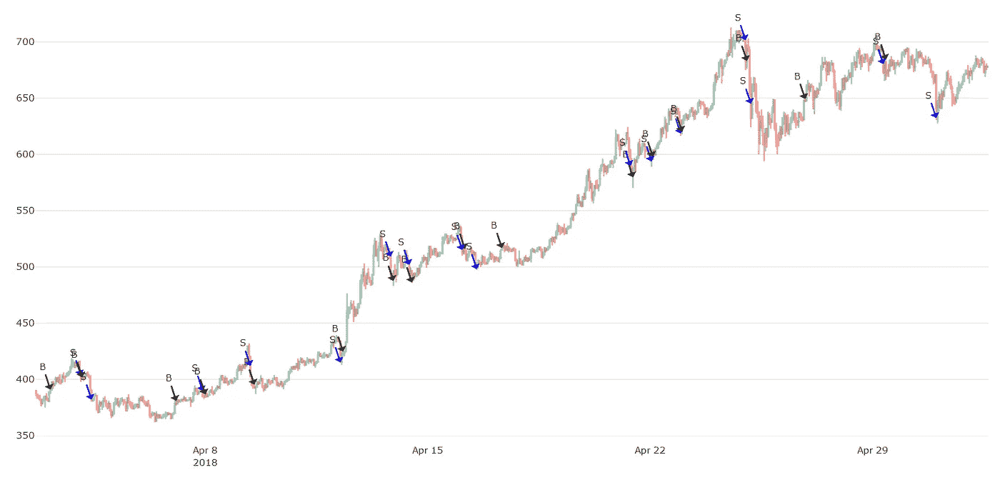
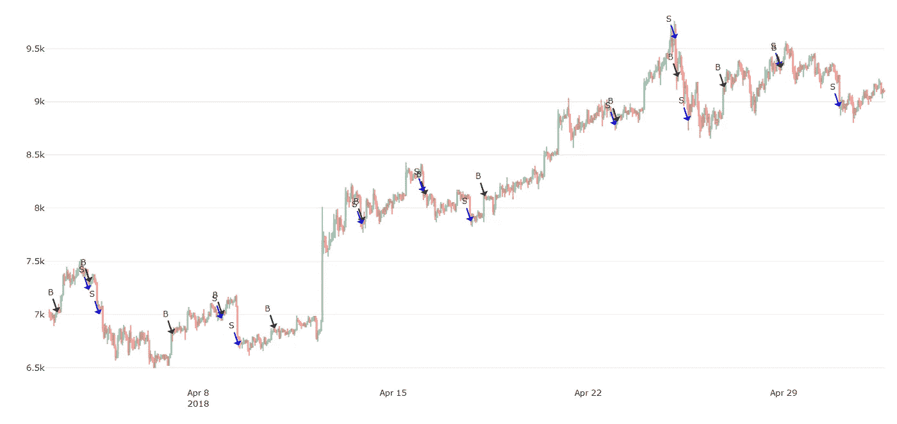
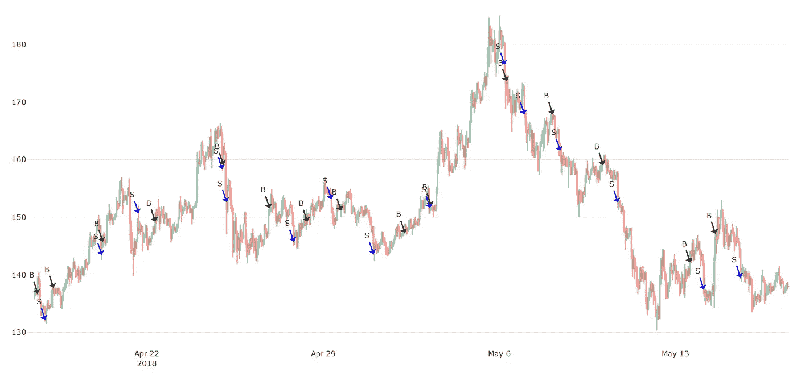
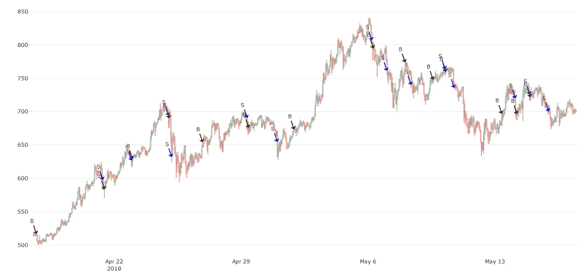
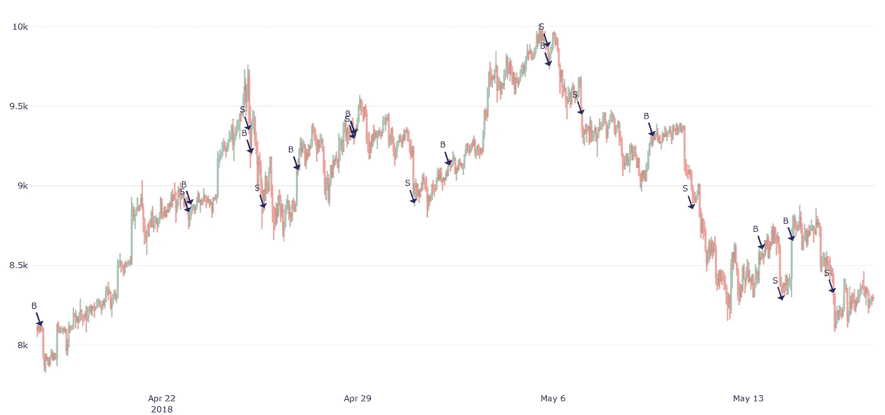

# 盈利的加密交易策略第八部分:Macd 2.0

> 原文：<https://medium.com/coinmonks/profitable-crypto-trading-strategies-part-8-macd-2-0-8529416408e5?source=collection_archive---------2----------------------->

在昨天的文章中，我解释了 MACD 指标，你如何使用它进行交易，并分析了我们的 Macd 1.0 交易策略。在今天的帖子中，我将介绍我们的 Macd 策略的第二个版本，并解释它与第一个有何不同。

# Macd 1 与 2

Macd 第一版和第二版的唯一区别是第二版有更复杂的“买入”标准。这意味着当它决定进入“买入”交易时，它被更多地计算在内。这可能会让你大吃一惊，但是仅仅几行额外的代码实际上就可以使投资回报率翻倍。

> 另请阅读:[最佳加密交易机器人](/coinmonks/crypto-trading-bot-c2ffce8acb2a)

使用每小时蜡烛线间隔，从 4 月 2 日到 5 月 2 日的 30 天期间**，我们获得以下 ROI:**

## **LTC-USDT**

**Macd 2.0 收益率 29.09% ( 7.22%)，而 Macd 1.0 只有 18.59% ( 6.11%)。**

****

**Macd 2.0 for LTC-USDT**

## **USDT 联邦理工学院**

**Macd 2.0 收益率 79.90% ( 9.93%)，而 Macd 1.0 只有 11.08% ( 4.11%)。**

****

**Macd 2.0 for ETH-USDT**

## **BTC-USDT**

**Macd 2.0 的收益率为 22.12% ( 4.57%)，而 Macd 1.0 的收益率为 22.03% ( 5.65%)。**

****

**Macd 2.0 for BTC-USDT**

**与使用完全相同的策略和市场条件的所有其他硬币相比，交易 ETH 产生的投资回报率(平均)是多么令人着迷。**

# **市场状况很重要**

**这是一个我在之前的帖子中强调了很多的概念，仅仅是因为它太重要了，我不得不再次强调。只有在有利的市场条件下(即市场形态有利于该策略)，Macd 策略才会产生这些美妙的 ROI。**

**让我们重复同样的分析，但针对更近期的市场状况，特别是从**4 月 17 日到 5 月 17 日:****

## **LTC-USDT**

**Macd 2.0 收益率为-4.17% ( 4.58%)，而 Macd 1.0 仅为-6.71% ( 5.32%)。**

****

**Macd 2.0 for LTC-USDT**

## **USDT 联邦理工学院**

**Macd 2.0 的收益率为 37.01% ( 6.27%)，而 Macd 1.0 仅为-2.05% ( 1.96%)。**

****

**Macd 2.0 for ETH-USDT**

## **BTC-USDT**

**Macd 2.0 收益率为-1.13% ( 3.37%)，而 Macd 1.0 仅为-5.58% ( 2.23%)。**

****

**Macd 2.0 for BTC-USDT**

**所有这些是否意味着 Macd 1.0 已经过时了？肯定不是，它服务于它的目的，数据证明。平均而言，Macd 1.0 策略的投资回报率偏离均值更低，这意味着其结果更可预测。虽然 Macd 2.0 有更高的投资回报率，但它也有更多不可预测的结果。**

**但是，即使把标准差考虑在内，Macd 2.0 的投资回报率(平均)仍然更好。**

# **结论**

**我们分析的第二部分的投资回报率要糟糕得多，BTC 和长期资本交易的投资回报率甚至都是负数。原因是从 5 月 6 日到 5 月 17 日有太多的亏损交易，这是因为市场状况呈下降趋势。这意味着这种策略在糟糕的市场条件下无法产生利润。**

**到目前为止，我们的算法还没有考虑到下降和上升趋势的情况。所以这是一个额外的变量，在不久的将来，我会把它包含在我们所有的算法中。基本的想法是在糟糕的情况下完全停止交易，或者将它们的影响最小化。或者，我们可以开发和使用不同的策略，专门用于在恶劣条件下创造收入，作为出现问题时的备用机制。**

**感谢您阅读，请务必关注下一集。
——伊利亚·内沃林**

## **另外，阅读**

*   **最好的加密交易机器人**
*   **最好的比特币[硬件钱包](/coinmonks/the-best-cryptocurrency-hardware-wallets-of-2020-e28b1c124069?source=friends_link&sk=324dd9ff8556ab578d71e7ad7658ad7c)**
*   **最好的[加密税务软件](/coinmonks/best-crypto-tax-tool-for-my-money-72d4b430816b)**
*   **[最佳加密交易平台](/coinmonks/the-best-crypto-trading-platforms-in-2020-the-definitive-guide-updated-c72f8b874555)**
*   **[unis WAP 最佳钱包](/coinmonks/best-wallets-to-use-uniswap-e91a6385d9e8)**
*   **最佳[加密贷款平台](/coinmonks/top-5-crypto-lending-platforms-in-2020-that-you-need-to-know-a1b675cec3fa)**
*   **[顶级 DeFi 项目](/coinmonks/defi-future-10-promising-projects-in-the-defi-world-ff2b697ab006)**
*   **[bits gap review](https://blog.coincodecap.com/bitsgap-review)——一个轻松赚钱的加密交易机器人**
*   **为专业人士设计的加密交易机器人**
*   **[3 商业评论](https://blog.coincodecap.com/3commas-review-an-excellent-crypto-trading-bot) |一款优秀的密码交易机器人**
*   **[3Commas vs Cryptohopper](/coinmonks/cryptohopper-vs-3commas-vs-shrimpy-a2c16095b8fe)**
*   **Bitmex 的[保证金交易指南](/coinmonks/the-idiots-guide-to-margin-trading-on-bitmex-dbbd7742c6fc?source=friends_link&sk=7bfa99d2a181142510c8442c8ddb0786)**
*   **加密摇摆交易的权威指南**
*   **[Bitmex 高级保证金交易指南](/coinmonks/bitmex-advanced-margin-trading-guide-2270c195ce25?source=friends_link&sk=1d986cca731f5084b9a2db4a4bc4a7ad)**
*   **面向开发者的最佳加密 API**
*   **[加密套利](/coinmonks/crypto-arbitrage-guide-how-to-make-money-as-a-beginner-62bfe5c868f6)指南:新手如何赚钱**
*   **顶级[比特币节点](https://blog.coincodecap.com/bitcoin-node-solutions)提供商**
*   **最佳[加密制图工具](/coinmonks/what-are-the-best-charting-platforms-for-cryptocurrency-trading-85aade584d80)**