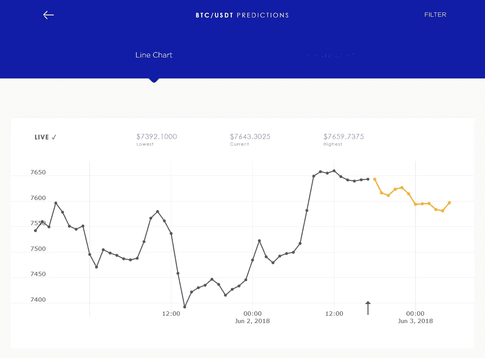
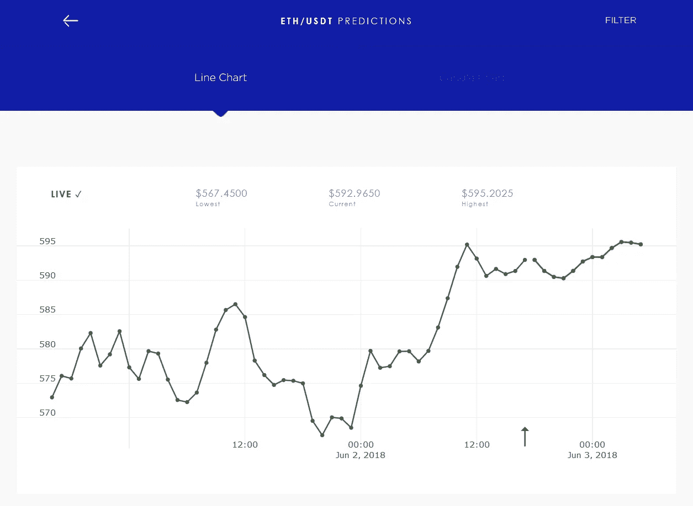
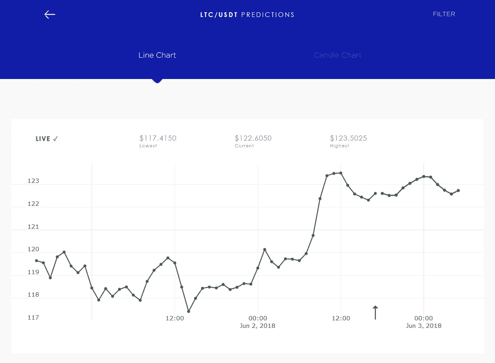
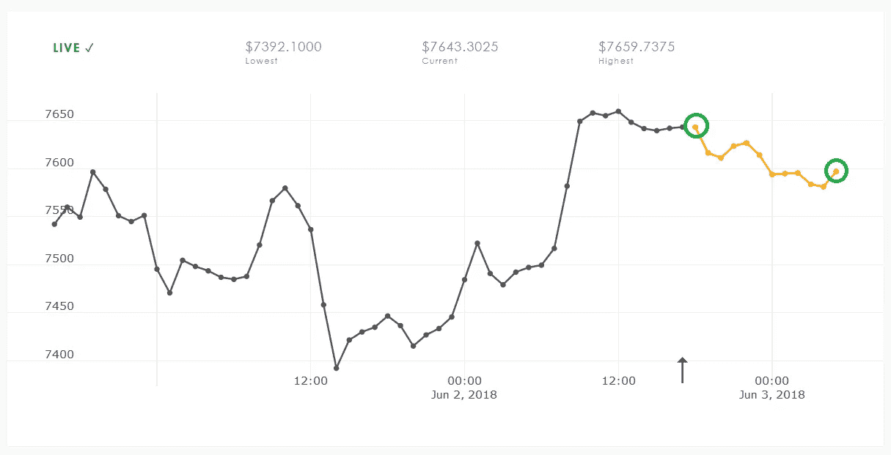
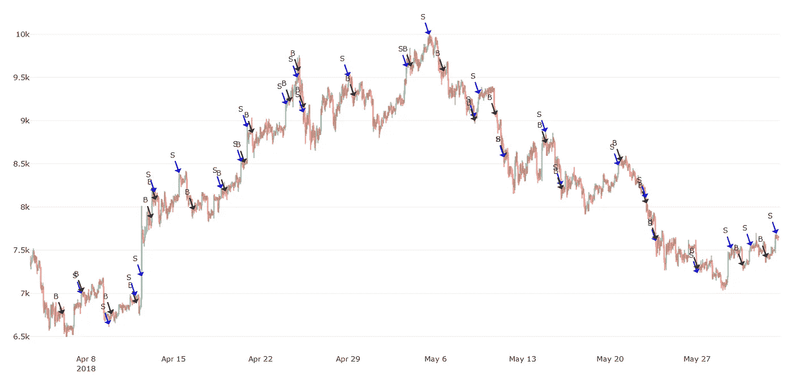
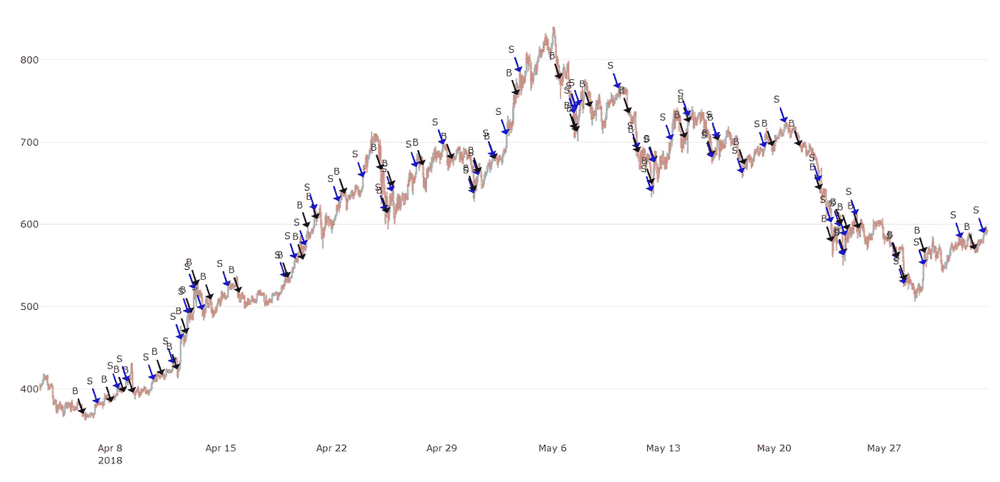
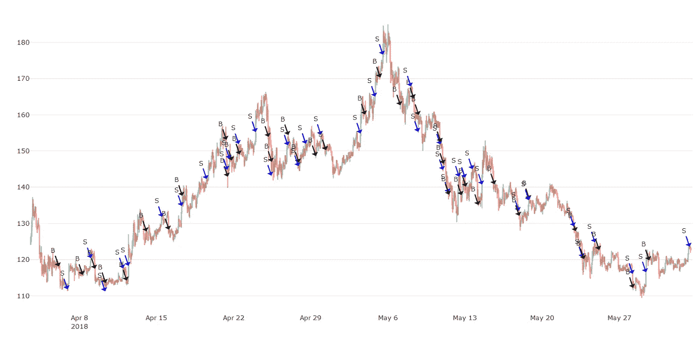

# 有利可图的加密交易策略第 9 部分:预测 1.0

> 原文：<https://medium.com/coinmonks/profitable-crypto-trading-strategies-part-9-predic-1-0-a246fef713e5?source=collection_archive---------4----------------------->

到目前为止，我们只分析了简单而强大的交易策略。其中大多数使用数学公式，并遵循预先定义的启发。最终我们优化了超参数以提高它们的 ROI。在本帖中，我们将介绍一种使用机器学习和人工智能神经网络开发的全新策略。

几个月前，我们开始应用机器学习和人工智能来生成价格预测。从那时起，我们主要是在寻找改善这些短期预测的方法。但是在我们内心深处，我们也在思考基于这些预测的交易方法。

几周前，我们利用这些预测提出了一个简单而强大的算法。我们在历史数据上成功地对算法进行了快速有效的回溯测试。在下一节中，我将首先解释这些预测是什么，然后我们将分析我们的算法。

> 另请阅读:[最佳加密交易机器人](/coinmonks/crypto-trading-bot-c2ffce8acb2a)

## 人工智能

几个月前，我们开始使用机器学习工具(Tensorflow 和 Keras)来创建人工智能系统。这些系统被称为“神经网络”，试图模仿人脑的工作方式。

Neural network example ([source](/@curiousily/tensorflow-for-hackers-part-iv-neural-network-from-scratch-1a4f504dfa8))

这些神经网络只不过是用软件实现的数学概念。通常它们的重量很轻(体积很小),计算输出速度非常快。但在“训练”或“学习”过程中，它们速度极慢。在训练过程中，我们将原始数据输入网络，让它从给定的输入中“学习”输出。这样我们可以教它接近复杂的环境。神经网络是强大的，但只是在狭窄的任务中；这些系统只做我们训练它们做的事情。它们用于自动驾驶汽车、模式识别、物体检测、语言翻译等等。

神经网络是帮助我们解决复杂问题的绝妙工具。这就是为什么我们使用它们来帮助我们做出更好的贸易决策。股票市场，特别是加密货币行业非常复杂，所以我们需要这些系统来帮助我们。

## 预言

下面你会发现我们预测的三个截图。这些预测显示特定市场(在币安交易所)的 12 小时预测。

在相当长的一段时间里，我们的预测除了给出一个概率性的预测之外，在直接意义上没有任何用处。在某一点上，我们测量他们的准确性，使用它的绝对值，并与现实进行比较。这些测试的准确率超过 99.9% —仅仅是因为绝对值的问题。

另一方面，由于预测的性质，测量准确性是一个复杂的问题。我们已经知道，这些预测表明了在不久的将来“可能”会发生什么。它无法准确预测“某事”将在何时发生。因此，简而言之，如果它表明价格上涨(或下跌)，它很可能会发生，但这可能只会在几分钟或几小时后发生。

# 预测 1.0

现在，预测每两分钟生成并更新一次。有两种不同类型预测:10 分钟和 60 分钟间隔的预测。两者都进行 12 步预测，因此分别是 120 分钟和 12 小时。

Predic 算法每隔一段时间(每小时)做出买入、卖出或持有的决定。在算法中，我们将第一个预测值与另一个预测值进行比较。第一个问题是:我们应该与哪个值进行比较？在我们的第一次尝试中，我们比较了第一次预测和最后一次预测(如下图所示)。

Comparing first against last predicted value.

以上被证明是一个糟糕的决定。事实上，我们的结果证明，我们在预测中走得越低，我们的投资回报率就变得越差。最佳的变化是比较第一个预测和第二个预测。这很有道理，实际上，这个系统在预测未来一个小时方面比更长的时间要好得多。

第二个问题是买/卖标准应该是什么？这可以通过检查第二个值是否超过某个阈值来解决。例如，如果第二个预测比第一个预测大 0.2%，那么我们可以告诉它“买入”。对于“卖出”部分，我们选择投资回报率利润率:如果我们能获得 1%的利润，我们就“卖出”，否则我们持有，除非我们的投资回报率下降到 98%左右。

现在是回测和模拟这个策略的时候了。让我们为三种不同的加密货币计算 60 天的投资回报率(2018 年 4 月 3 日至 6 月 2 日):

## BTC-USDT

投资回报率:15.19% ( 6.75)

## USDT 联邦理工学院

**投资回报率:36.36%** ( 15.45)

## LTC-USDT

**投资回报率:10.27%** ( 12.24)

# 讨论

我很惊讶这样一个简单的试探会产生合理的回报。但它可以做得更好。通过观察图表上的买入/卖出信号，我们发现有些信号是次优的。在上升趋势区域，由于“卖出”的启发，它执行了太多保守的交易。而在下降趋势期间，它交易太多，导致许多亏损交易。后者可以通过我们的看跌检测代码来解决(这是另一个话题)。

另一个次优现象可以从 BTC-USDT 交易的图表中看出。由于这种算法，买卖信号彼此紧密跟随。这意味着它在卖出后立即买入。如果符合买入标准，不卖出可以避免这种情况。但这也给战略带来了风险，因为我们让它变得更加“贪婪”。

# 结论

Predic 1.0 算法绝对值得出现在我们的信号列表中，在接下来的几周里，我们将集成它。我们还有很多可以改进和调整的地方，让这个算法产生更高的回报，这只是时间和资源的问题。

感谢您的阅读，如果您喜欢我们的帖子，请务必订阅。敬请期待下一部分！
——伊利亚·内沃林

## **同样，阅读**

*   最好的加密交易机器人
*   最好的比特币[硬件钱包](/coinmonks/the-best-cryptocurrency-hardware-wallets-of-2020-e28b1c124069?source=friends_link&sk=324dd9ff8556ab578d71e7ad7658ad7c)
*   最好的[加密税务软件](/coinmonks/best-crypto-tax-tool-for-my-money-72d4b430816b)
*   [最佳加密交易平台](/coinmonks/the-best-crypto-trading-platforms-in-2020-the-definitive-guide-updated-c72f8b874555)
*   [unis WAP 最佳钱包](/coinmonks/best-wallets-to-use-uniswap-e91a6385d9e8)
*   最佳[加密贷款平台](/coinmonks/top-5-crypto-lending-platforms-in-2020-that-you-need-to-know-a1b675cec3fa)
*   [bits gap review](https://blog.coincodecap.com/bitsgap-review)——一个轻松赚钱的加密交易机器人
*   为专业人士设计的加密交易机器人
*   [3commas Review](https://blog.coincodecap.com/3commas-review-an-excellent-crypto-trading-bot) |一款优秀的密码交易机器人
*   [3Commas vs Cryptohopper](/coinmonks/cryptohopper-vs-3commas-vs-shrimpy-a2c16095b8fe)
*   Bitmex 上的[保证金交易的白痴指南](/coinmonks/the-idiots-guide-to-margin-trading-on-bitmex-dbbd7742c6fc?source=friends_link&sk=7bfa99d2a181142510c8442c8ddb0786)
*   加密摇摆交易的权威指南
*   [Bitmex 高级保证金交易指南](/coinmonks/bitmex-advanced-margin-trading-guide-2270c195ce25?source=friends_link&sk=1d986cca731f5084b9a2db4a4bc4a7ad)
*   对开发者来说最好的加密 API
*   [加密套利](/coinmonks/crypto-arbitrage-guide-how-to-make-money-as-a-beginner-62bfe5c868f6)指南:新手如何赚钱
*   顶级[比特币节点](https://blog.coincodecap.com/bitcoin-node-solutions)提供商
*   最佳[加密制图工具](/coinmonks/what-are-the-best-charting-platforms-for-cryptocurrency-trading-85aade584d80)

> [在您的收件箱中直接获得最佳软件交易](https://coincodecap.com?utm_source=coinmonks)

