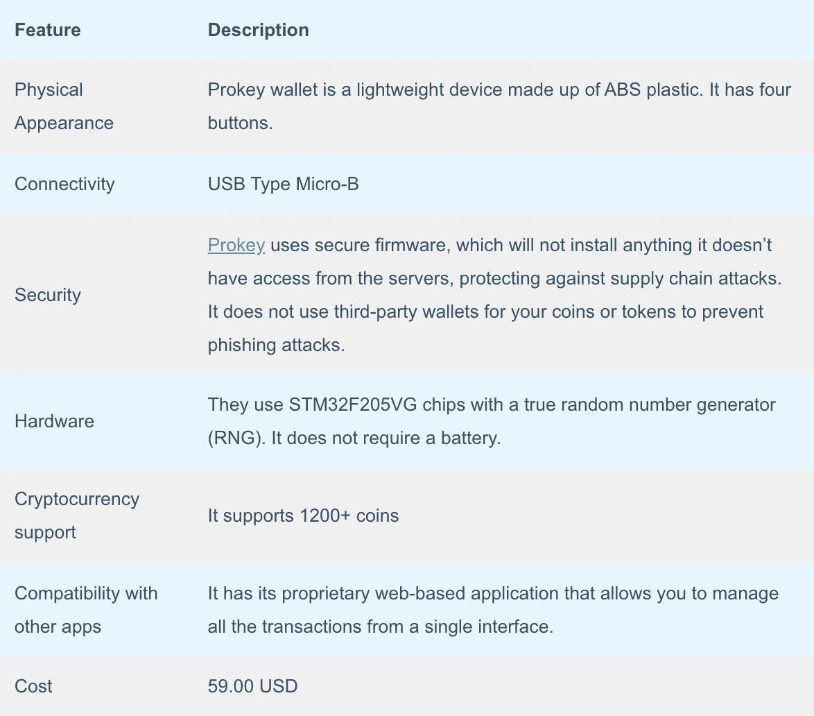
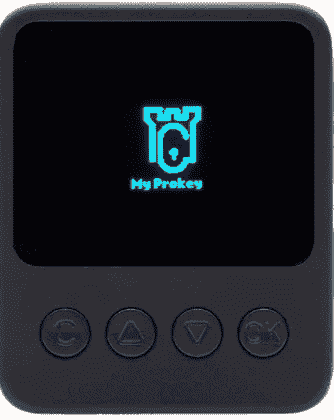
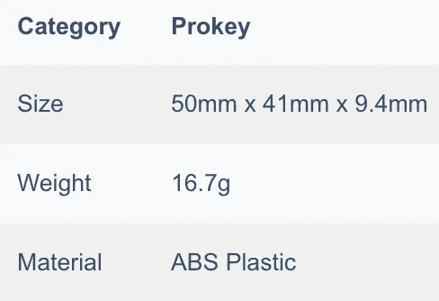
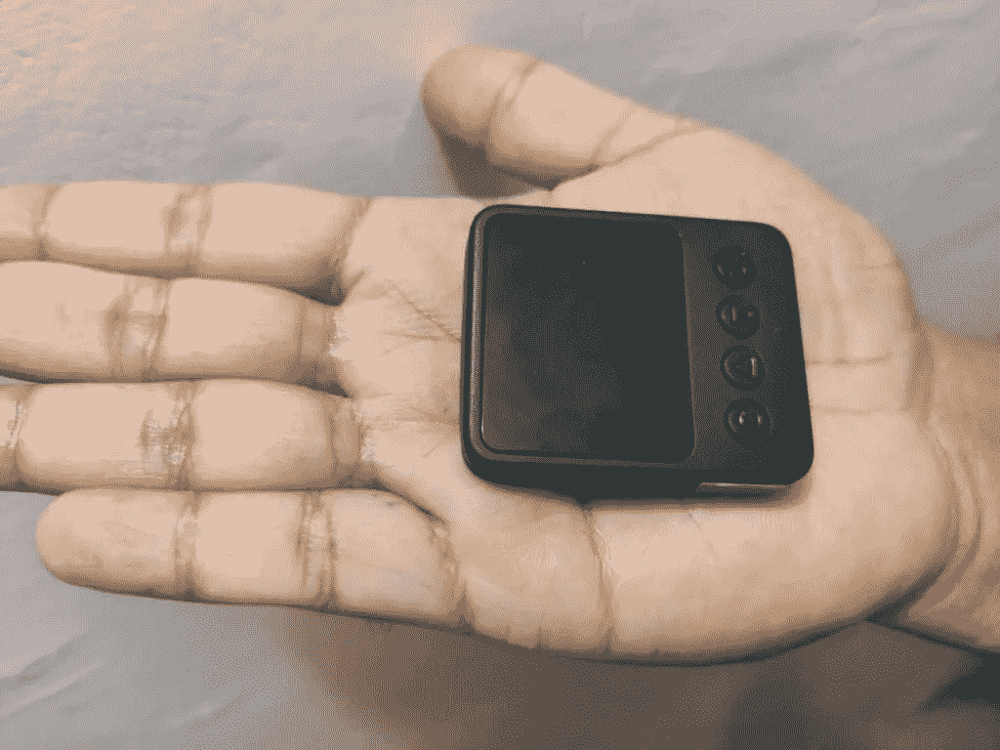
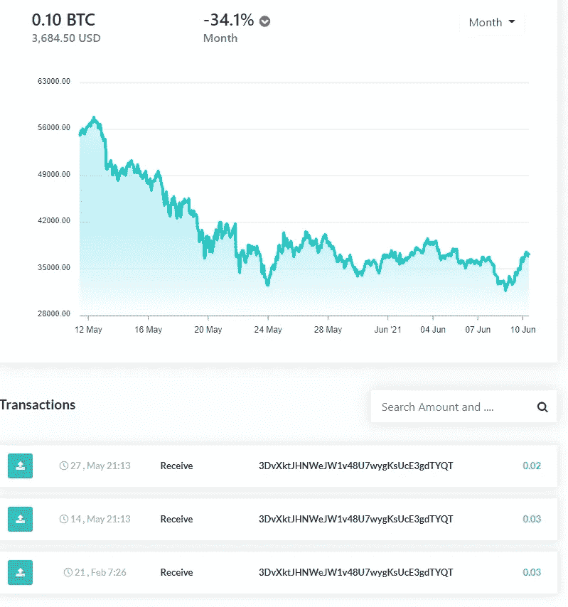
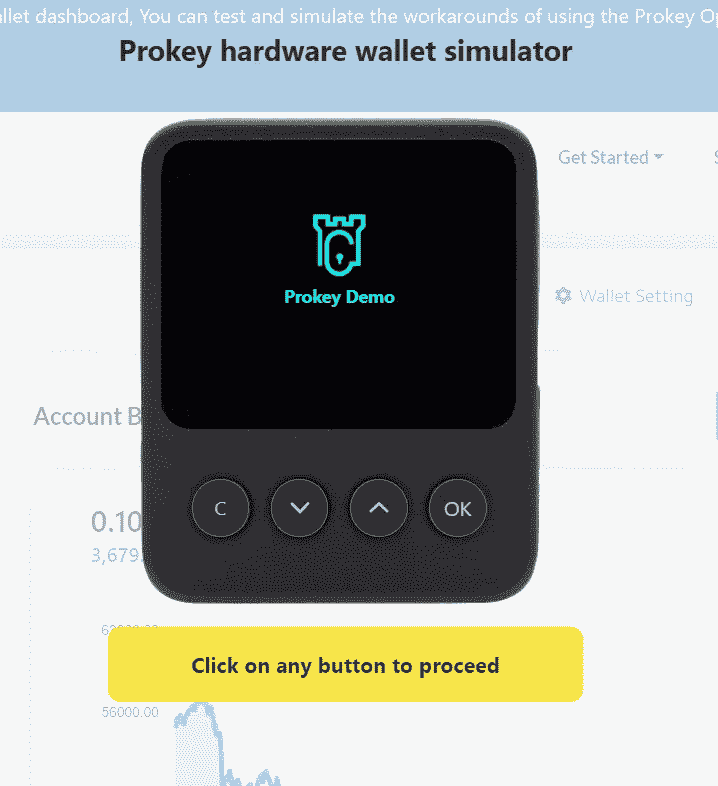
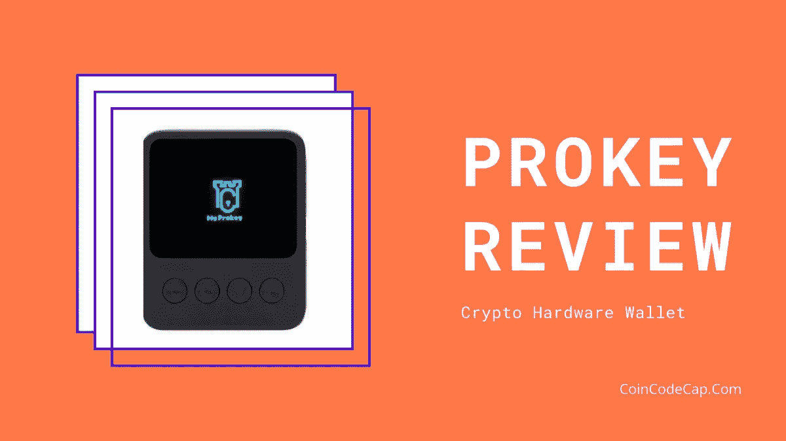

# Prokey 点评——该不该买这款硬件钱包？

> 原文：<https://medium.com/coinmonks/prokey-review-26611173c13c?source=collection_archive---------0----------------------->

本文将回顾 [**Prokey**](https://blog.coincodecap.com/go/prokey) ，一个用于接收、存储和签署加密交易的硬件钱包。它采用安全固件来防止供应链威胁，因为它只安装可以访问服务器的东西。

## 摘要

*   [Prokey](https://blog.coincodecap.com/go/prokey) 是一款易于使用且安全的硬件钱包。
*   它很轻，由 ABS 塑料制成。
*   支持超过 1200 种加密货币。
*   USB 型 Micro-B 用于将 [Prokey](https://blog.coincodecap.com/go/prokey) 连接至支持互联网的设备。
*   他们使用各种措施来保护设备免受供应链攻击、网络钓鱼攻击等。
*   它不需要电池。
*   [Prokey](https://blog.coincodecap.com/go/prokey) 应用程序基于网络，允许您从单一界面管理资产和执行交易。
*   硬件钱包模拟器允许你在购买之前测试应用程序。
*   [Prokey](https://blog.coincodecap.com/go/prokey) 最佳成本 59.00 美元。
*   他们提供广泛的客户支持。

## 什么是 Prokey 钱包？

[硬件钱包](https://blog.coincodecap.com/best-hardware-wallet-bitcoin)是用于存储加密货币的物理设备。它们没有连接到互联网，因此不会受到大范围的攻击。此外，他们安全地储存你的钱包的私人钥匙。

[Prokey](https://blog.coincodecap.com/go/prokey) 是一款硬件钱包，可以接收、存储和签署交易。成立于 2019 年，总部位于马来西亚吉隆坡。他们专注于围绕加密货币构建安全产品和解决方案，以使日常生活变得轻松。

## Prokey 钱包评论:物理外观

这款钱包的屏幕相当大，可以放在你的手掌里。

Prokey in my brother’s palm

## 如何入门 Prokey？

1.  访问 [**Prokey**](https://blog.coincodecap.com/go/prokey) 的官方网站，最好是在你的 chrome 浏览器上。
2.  使用 USB 将您的设备连接到您的笔记本电脑或计算机。
3.  点击“检查设备”它必须显示您的设备已连接。设备的默认名称将显示为“Prokey Bootloader”
4.  确保在 chromium 设置中禁用了实验 USB 后端标志。使用此链接了解如何在 chrome 设置中禁用此标志。
5.  单击安装固件，这大约需要 15 秒钟。
6.  安装固件后，您应该重新连接设备。然后，点击右上角的钱包按钮，检查固件是否已成功安装。
7.  设备名称更改为“Prokey Optimum”，表示设备可以使用了。
8.  现在，您可以创建一个钱包或从备份中恢复您的钱包。
9.  您将收到为您的钱包创建备份的提示。这不是强制性的，但我们建议您创建一个。要详细了解该过程，请查看备份部分。

## Prokey 审查:备份和恢复

要为您的 [Prokey](https://blog.coincodecap.com/go/prokey) 钱包创建备份，您需要完成以下步骤

1.  接受条款后，您可以开始创建备份。
2.  然后，您将看到一个 24 个单词的恢复种子短语。您必须将它们小心地复制到随钱包一起收到的一张恢复单上。
3.  写完之后，系统会提示你重新检查。
4.  您还可以自定义最多 16 个字符的设备名称。
5.  接下来，您必须创建一个长度在 4 到 6 之间的 PIN。每次批准交易时，您都必须输入此 pin。

## 如果我忘记了 Prokey 设备的 PIN 码，该怎么办？

您可以通过将设备重置为出厂设置来禁用 PIN。为此，您必须同时按住 C 按钮，将线缆插到 [**Prokey**](https://blog.coincodecap.com/go/prokey) optimum。接下来，你应该点击重置设备。现在，你必须重新设置你的设备。

假设你是一个经常使用的用户，建议你偶尔更换你的个人识别码。你可以通过以下步骤做到这一点

1.  进入高级设置，点击“擦除设备”
2.  然后重新连接到支持互联网的设备，并安装最新的固件。
3.  按住“C”按钮，然后点击钱包恢复。
4.  输入 24 个单词的恢复短语，您将可以再次访问您的帐户。
5.  您现在可以通过设置重置您的 pin。

## Prokey 安全吗？

[Prokey](https://blog.coincodecap.com/go/prokey) 使用安全固件，因此不需要全息印章或供应商信誉。它们通过设计得到保护，可以抵御供应链攻击。

最初，设备上没有安装固件。如果设备在您收到之前已经受损，将不会安装最新的固件更新。

如果已经安装了固件，设备和 Prokey 服务器之间将开始相互验证过程。因此，如果设备被篡改，由于服务器的认证，它将无法访问您的帐户。

## Prokey 硬件

Prokey 使用安全硬件。他们使用带真随机数发生器(RNG)的 STM32F205VG 芯片。

它不需要电池。你可以从 [Github 库](https://github.com/prokey-io)获得更多关于他们硬件的信息。

## Prokey 连接

[Prokey](https://blog.coincodecap.com/go/prokey) 使用 USB 类型的 Micro-B 连接到任何支持互联网的设备，如台式机、笔记本电脑或手机。

## Prokey 审查:支持的加密货币

Prokey 支持超过 1200 个硬币。您可以通过[点击此处](https://prokey.io/all-coins)查看可用硬币列表。

## Prokey Review:用户体验

这个网络应用程序很容易使用。可以收发 1200+币。此外，您可以在一个钱包中添加多个帐户。

它们兼容 Windows (7+)、Mac (10.8+)、Linux、Android。它在浏览器上运行，完全基于网络。你不必安装任何应用程序或桥。

您可以从 [Prokey](https://blog.coincodecap.com/go/prokey) 仪表盘查看您的账户余额和交易历史。

在购买钱包之前，可以尝试一下[演示平台](https://demo.prokey.io/)。要试用演示平台，您只需输入您的电子邮件地址。之后，你会看到一个 Prokey 硬件钱包模拟器。

不过，有些功能可能无法在演示中使用。

## Prokey 定价

[Prokey](https://blog.coincodecap.com/go/prokey) 最佳成本 **59.00 美元**。

您将收到一个 Prokey 硬件钱包、两根 USB 电缆和三张恢复表。您最多可以在 14 天内退货。此外，标准运输没有任何费用。

确保您的设备上没有安装固件。如果固件已经安装，您的设备已被篡改，您必须联系客户支持。

## Prokey 客户支持评论

[Prokey](https://blog.coincodecap.com/go/prokey) 通过实时聊天提供全天候客户支持。您还可以通过各种社交媒体渠道联系他们:

*   [推特](https://twitter.com/tryProkey)
*   [Youtube](https://www.youtube.com/channel/UCz24yLqt0DCXYYD2qLmTEkQ)
*   [Instagram](https://www.instagram.com/prokey_official/)

你也可以查看他们的 [FAQ 版块](https://support.prokey.io/help-center)。

## Prokey 审查:结论

[**Prokey**](https://blog.coincodecap.com/go/prokey) 是一款安全、人性化的硬件钱包。它允许您从一个界面存储和管理您所有的加密货币。此外，它是唯一一个提供演示平台的钱包，可以在购买前检查钱包和应用程序。这款钱包重量很轻，屏幕足够大，价格也很合理，只有 59 美元。我们认为对于初学者来说，这是一个非常好的硬件钱包。

**常见问题解答**

**Prokey 钱包安全吗？**

Prokey 使用安全固件，不会安装任何它无权访问的服务器，以防止供应链攻击。它不会为您的硬币或代币使用第三方钱包来防止网络钓鱼攻击。

**Prokey 的价格是多少？**

Prokey 硬件钱包一次性投资 59 美元。您可以使用钱包存储超过 1200+加密资产。

> 免责声明—包括附属链接

